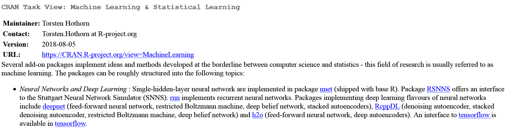
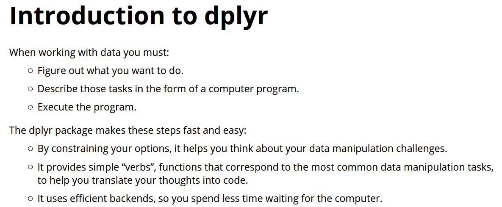
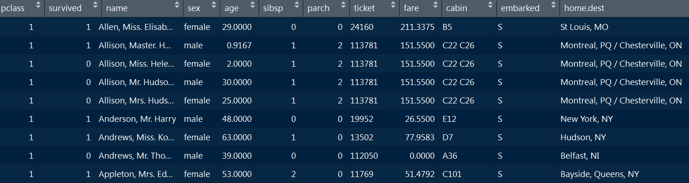
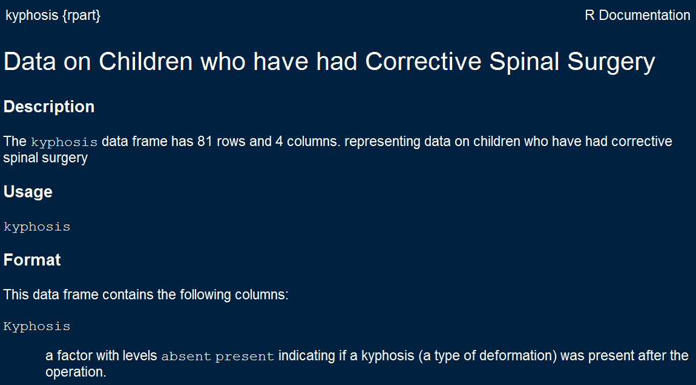
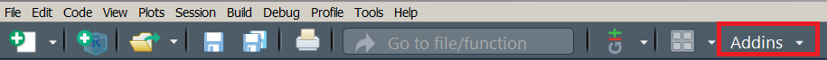
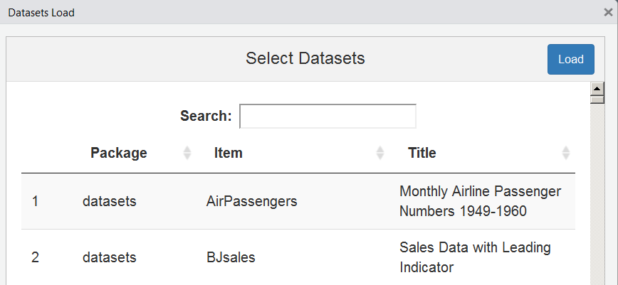
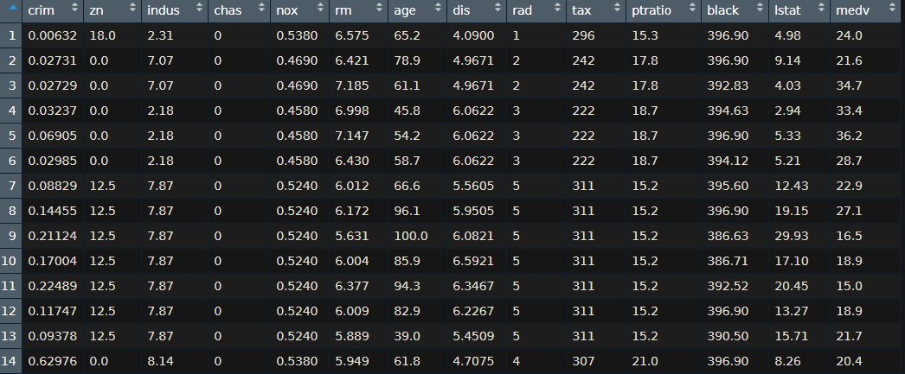
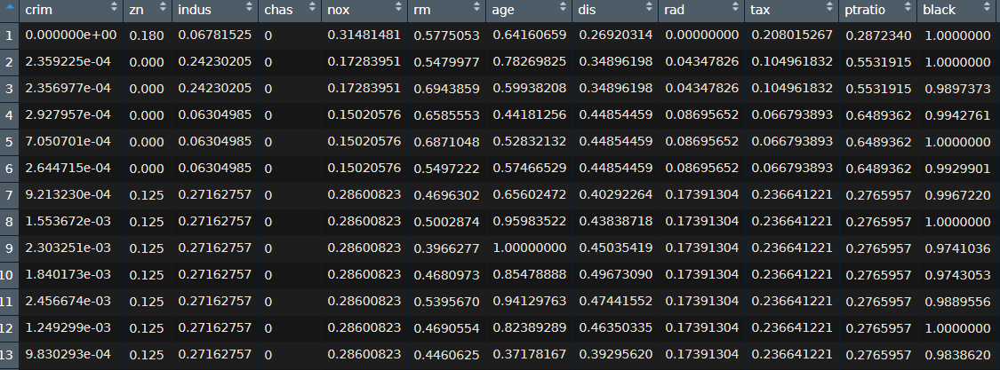

```{r setupintror, include=FALSE}
knitr::opts_chunk$set(echo = T,cache=F,message=F,warning=F,eval=T)
library(knitr)
```

## Introduction round

### Please tell us shortly...

- Where are you from? What are you studying/working?
- What is your experience level in R/other programming languages?
- What are your expectations of this course?
- Where do you think you can use Machine Learning in the future?

## Preliminaries

- This topic is huge - we concentrate on presenting the applications in R
- Usually we have big differences in knowledge and abilities of the participants - please tell, if it is too fast or slow.
- We have many [**exercises**](http://web.math.ku.dk/~helle/R-intro/exercises.pdf) because at the end you can only learn on your own
- We have many [**examples**](https://www.showmeshiny.com/) - try them!
- If there are questions - always ask
- R is more fun together - ask your neighbor


## Content of this section

- The first section is about laying the foundations in R. We will need all things covered later on.

### Topics section:

- Why R is a good choice
- Constraints of R-usage
- R is modular 
- Import and export of data

<!--
- The second section is an introduction to the field of machine learning.
- The third part is on regression and classification.
-->

## Why R is a good choice ...

- ... because it is an [**open source language**](https://stackoverflow.com/questions/1546583/what-is-the-definition-of-an-open-source-programming-language)
- ... outstanding graphs - [**graphics**](http://matthewlincoln.net/2014/12/20/adjacency-matrix-plots-with-r-and-ggplot2.html), [**graphics**](https://www.r-bloggers.com/3d-plots-with-ggplot2-and-plotly /), [**graphics**](https://procomun.wordpress.com/2011/03/18/splomr/)
- ... relates to other languages - [**R can be used in combination with other programs**](https://github.com/Japhilko/RInterfaces) - e.g. [**data linking**](https://github.com/Japhilko/RInterfaces/blob/master/slides/Datenimport.md)
- ...R can be used [**for automation**](https://cran.r-project.org/web/packages/MplusAutomation/index.html)
 - ... Vast Community - [**you can use the intelligence of other people ;-)**](https://www.r-bloggers.com/) and new statistical methodologies are implemented quite fast 
- Because R can be combined with other programs like `PostgreSQL` or `Python`

## Constraints

<!--
Why R might not be the best choice in every situation
-->

<!--
https://elitedatascience.com/r-vs-python-for-data-science
-->

### [Newer modules in Python](https://blog.dominodatalab.com/video-huge-debate-r-vs-python-data-science/)

- Machine learning is a field that changes rapidly.  
- Some new tools are first developed in Python. 
- The package `reticulate` offers the possibility to use these modules from an R environment. 
- Good news - Python is also Open Source

### Big Data 

- Especially if you work with web data, you quickly have to deal with large amounts of data. 
- Therefore one must fall back on databases and parallelization strategies, which can be used in R. 

<!--
## Content of this part

- Introduction to programming in R 

### what is relevant for this course.

- How to import data?
- What to do with missing values?
- 
-->

## R is modular

### Install packages from CRAN Server

```{r,eval=F}
install.packages("lme4")
```

### Install packages from Bioconductor Server

```{r,eval=F}
source("https://bioconductor.org/biocLite.R")
biocLite(c("GenomicFeatures", "AnnotationDbi"))
```


### Install packages from Github

```{r,eval=F}
install.packages("devtools")
library(devtools)

devtools::install_github("koalaverse/vip")
```

<!--
https://github.com/koalaverse/vip
-->


## [Task View Machine Learning](https://cran.r-project.org/web/views/MachineLearning.html)


{ width=110% }


## Install all packages of a task view

```{r,eval=F}
install.packages("ctv")
ctv::install.views("MachineLearning")
```


## Exercise: Find R-packages

Go to https://cran.r-project.org/ and search for packages that can be used:

1) to reduce overfitting
2) for regression trees
3) for gradient boosting
4) for neural networks
5) for clustering


<!--
https://www.r-bloggers.com/what-are-the-best-machine-learning-packages-in-r/
-->


## Preparation - packages

```{r}
library(dplyr)
```



## The package `magrittr`

```{r}
library(magrittr)
```


## Import `.csv` data 

### The `read.csv` command

- Use `read.csv2` for German data 

```{r,eval=F}
?read.csv
?read.csv2
```

### Using a path to import data

```{r,eval=F}
path1<-"https://raw.githubusercontent.com/"
path2<- "thomaspernet/data_csv_r/master/data/"
dname <- "titanic_csv.csv"
titanic <- read.csv(paste0(path1,path2,dname))
```

### Save the dataset

```{r,eval=F}
save(titanic,file="../data/titanic.RData")
```

```{r,echo=F}
load("../data/titanic.RData")
```


## The titanic dataset

```{r,eval=F,echo=F}
kable(head(titanic))
```


<!--
https://www.guru99.com/r-decision-trees.html
-->


## The function `scan` to import data 

- `scan` has an easy way to distinguish comments from data

```{r,eval=F}
?scan
```

### Example dataset

```{r}
cat("TITLE extra line", "# a comment","2 3 5 7", "11 13 17", 
    file = "../data/ex.data", sep = "\n")
```

### Import data and skip the first line

```{r,eval=F}
pp<-scan("../data/ex.data",skip=1,quiet=TRUE)
```

```{r}
pp <- scan("../data/ex.data",comment.char="#", skip = 1,
           quiet = TRUE)
```


## The download the data from UCI.

```{r,eval=F,echo=F}
install.packages("bindrcpp")
```

```{r}
path1 <- "http://archive.ics.uci.edu/ml/"
path2 <- "machine-learning-databases/00243/"
dname <- 'yacht_hydrodynamics.data'
```


```{r}
url<- paste0(path1,path2,dname)
Yacht_Data <- readr::read_table(file = url)
```

```{r,eval=F,echo=F}
colnam <- c('LongPos_COB', 'Prismatic_Coeff','Len_Disp_Ratio',
            'Beam_Draut_Ratio','Length_Beam_Ratio','Froude_Num',
            'Residuary_Resist')
Yacht_Data <- read_table(file = url,col_names = colnam)
```


## Built in datasets

- A sample dataset is often provided to demonstrate the functionality of a package.
- These records can be loaded using the `data` command.

```{r}
data(iris)
```

- There is also a [**RStudio Add-In**](https://github.com/bquast/datasets.load) that helps to find a built-in dataset.

```{r,eval=F}
install.packages("datasets.load")
```

## Help page for built in datasets

```{r,eval=F}
?kyphosis
```



## Excursus [RStudio Addins](https://cran.r-project.org/web/packages/addinslist/README.html)

- In the upper right corner there is a button Addins






## How to get help

-  I use [**duckduckgo:**](figure/duckduckgo.PNG)

```
R-project + "what I want to know" 
```
-  this works of course for all search engines!


## Exercise: load built-in data

### Load the the built-in dataset `swiss` 
<!--
and answer the following questions:
-->
1) How many observations and variables are available?
2) What is the scale level of the variables?

### Interactive data table 

3) Create an interactive data table


## The R-package `data.table`

### Get an overview

```{r}
data(airquality)
head(airquality)
```

## Overview with `data.table`

```{r}
library(data.table)
(airq <- data.table(airquality))
```

## Column (and row) names of `airq`

```{r}
colnames(airq)
rownames(airq)
```


## [Exercise](https://www.datacamp.com/community/tutorials/pipe-r-tutorial): random numbers

```{r,echo=F}
x <- c(0.109, 0.359, 0.63, 0.996, 0.515, 0.142, 0.017, 
       0.829, 0.907)
x <- runif(8)
```

1) Draw 8 random numbers from the uniform distribution and save them in a vector `x`
2) Compute the logarithm of `x`, return suitably lagged and iterated differences, 
3) compute the exponential function and round the result

```{r,echo=F}
round(exp(diff(log(x))), 1)
```


## [The pipe operator](https://www.datacamp.com/community/tutorials/pipe-r-tutorial)


```{r}
library(magrittr)

# Perform the same computations on `x` as above
x %>% log() %>%
    diff() %>%
    exp() %>%
    round(1)
```


## How to deal with missing values

```{r,eval=F}
?na.omit
```

```{r}
airq
```


## The command `na.omit`

```{r}
na.omit(airq)
```

## Available loops in R


## [Loops in R](https://www.datacamp.com/community/tutorials/tutorial-on-loops-in-r?utm_source=adwords_ppc&utm_campaignid=1655852085&utm_adgroupid=61045433942&utm_device=c&utm_keyword=%2Bloops%20%2Br&utm_matchtype=b&utm_network=g&utm_adpostion=1t1&utm_creative=318880582254&utm_targetid=aud-392016246653:kwd-589281898934&utm_loc_interest_ms=&utm_loc_physical_ms=9041580&gclid=Cj0KCQjwocPnBRDFARIsAJJcf97mSXl9jWq7mdoRkuxbhu_LS_WCY00hyty2VW5AbXe7hetdvXio9VAaAmpMEALw_wcB)

- This loop calculates the square of the first 10 elements of vector u1

```{r}
u1 <- rnorm(30)
# Initialize `usq`
usq <- 0
for(i in 1:10) {
  # i-th element of `u1` squared into `i`-th position of `usq`
  usq[i] <- u1[i]*u1[i]
  print(usq[i])
}
print(i)
```


## [Clean the titanic data set](https://www.guru99.com/r-decision-trees.html)

```{r}
clean_titanic <- titanic %>% 	
  mutate(pclass=factor(pclass,levels = c(1, 2, 3),
                       labels=c('Upper','Middle','Lower')),
	survived = factor(survived,levels = c(0, 1), 
	                  labels=c('No', 'Yes'))) %>%
na.omit()
```

###   `mutate(pclass = factor(...`: 

- Add label to the variable pclass. 
- 1 becomes Upper, 2 becomes MIddle and 3 becomes lower

###  `factor(survived,...`:

- Add label to the variable survived. 
- 1 Becomes No and 2 becomes Yes

- `na.omit()`: Remove the NA observations 


## Get an overview of the data

```{r}
glimpse(clean_titanic)
```

## With `gather` from wide to long format  

```{r}
library(dplyr)
library(tidyr)
# From http://stackoverflow.com/questions/1181060
stocks <- tibble(
  time = as.Date('2009-01-01') + 0:9,
  X = rnorm(10, 0, 1),
  Y = rnorm(10, 0, 2),
  Z = rnorm(10, 0, 4)
)

gather(stocks, "stock", "price", -time)
```

## The command `expand.grid`

```{r}
expand.grid(letters[1:4],5:3,LETTERS[1:2])
```

## [Example Data - Housing Values in Suburbs of Boston](https://datascienceplus.com/fitting-neural-network-in-r/)

```{r}
library(MASS)
bdat <- Boston
```

```{r,echo=F,eval=F}
kable(head(bdat))
```



## Normalize your data

### Compute maximum and minimum per column

```{r}
maxs <- apply(bdat, 2, max) 
mins <- apply(bdat, 2, min)
```

### `scale` - Scaling and Centering of Matrix-like Objects
```{r}
scaled <- as.data.frame(scale(bdat, center = mins, 
                              scale = maxs - mins))

```


## The scaled data



## The command `sample`

- We can use this command to draw a sample. 
- We need the command later to split our dataset into a test and a training dataset. 

```{r}
sample(1:10,3,replace=T)
sample(1:10,3,replace=T)
```

```{r}
ntest <- round(nrow(bdat)*.2)
ind <- sample(1:nrow(bdat),ntest)
bdat_test <- bdat[ind,]
bdat_train <- bdat[-ind,]
```


## Alternative to split dataset

- `Y` - Vector of data labels. If there are only a few labels (as is expected) than relative ratio of data in both subsets will be the same.
- `SplitRatio` - Splitting ratio

```{r}
split <- caTools::sample.split(Y = bdat$lstat,SplitRatio = .8)
Train <- bdat[split,]
Test <- bdat[!split,]
nrow(Train);nrow(Test)
```


## Set a seed

- `set.seed` is the recommended way to specify seeds.
- If we set a seed, we get the same result for random events.
- This function is mainly required for simulations. 

```{r}
set.seed(234)
sample(1:10,3,replace=T)
set.seed(234)
sample(1:10,3,replace=T)
```

## [Time measurement](https://www.r-bloggers.com/5-ways-to-measure-running-time-of-r-code/)

```{r}
start_time <- Sys.time()
ab <- runif(10000000)
end_time <- Sys.time()

end_time - start_time
```


## How many cores are available


```{r}
library(doParallel)
detectCores()
```

## Make cluster

```{r}
cl <- makeCluster(detectCores())
registerDoParallel(cl)
```

```{r}
start_time <- Sys.time()
ab <- runif(10000000)
end_time <- Sys.time()

end_time - start_time
```

```{r}
stopCluster(cl)
```


```{r,eval=F}
?parallel::makeCluster
```

<!--
## [The `swirl` package](https://swirlstats.com/)

```{r,eval=F}
install.packages("swirl")
```

```{r,eval=F}
library("swirl")
swirl()
```
-->

## Resources

- [**Course materials for the Data Science Specialization**](https://github.com/DataScienceSpecialization/courses)
- Data wrangling - [**`dplyr` vignette**](https://cran.r-project.org/web/packages/dplyr/vignettes/dplyr.html) - 
- The usage of pipes - [**`magrittr` vignette**](https://cran.r-project.org/web/packages/magrittr/vignettes/magrittr.html)
- Gareth James et al (2013) [**An Introduction to
Statistical Learning**](https://www-bcf.usc.edu/~gareth/ISL/ISLR%20First%20Printing.pdf)
<!--
Further possible topics of this section:

- regular expressions
- the reticulate package
- how to install python modules

- mutate function in dplyr package
- the rescale package

- loops
- exercise with loops

- paste und paste0
- random number generation
- the function diag

- mutate
- purrr::map_dbl

- what to do with missing values
-->

<!--
https://www.r-exercises.com/start-here-to-learn-r/
https://www.r-exercises.com/category/exercises/exercises-intermediate/

Exercises that Practice and Extend Skills with R
https://maths-people.anu.edu.au/~johnm/courses/r/exercises/pdf/r-exercises.pdf


Loops in R
https://www.datacamp.com/community/tutorials/tutorial-on-loops-in-r?utm_source=adwords_ppc&utm_campaignid=1655852085&utm_adgroupid=61045433942&utm_device=c&utm_keyword=%2Bloops%20%2Br&utm_matchtype=b&utm_network=g&utm_adpostion=1t1&utm_creative=318880582254&utm_targetid=aud-392016246653:kwd-589281898934&utm_loc_interest_ms=&utm_loc_physical_ms=9041580&gclid=Cj0KCQjwocPnBRDFARIsAJJcf97mSXl9jWq7mdoRkuxbhu_LS_WCY00hyty2VW5AbXe7hetdvXio9VAaAmpMEALw_wcB
-->

