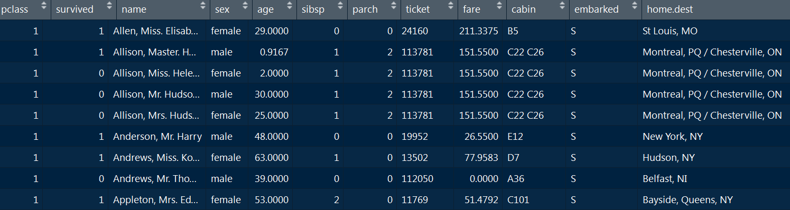
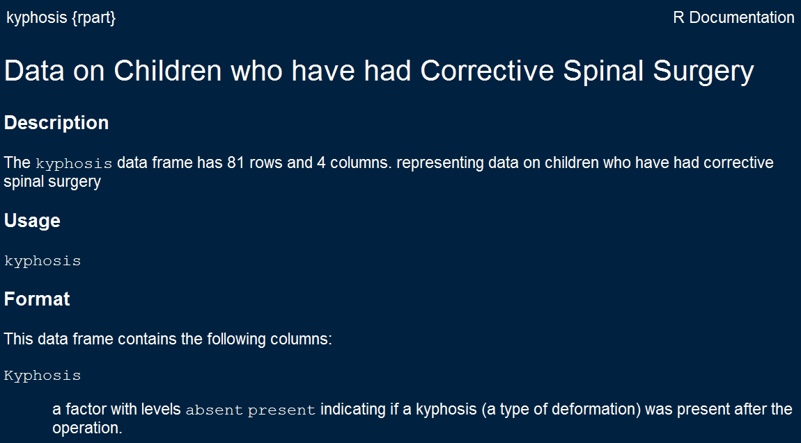
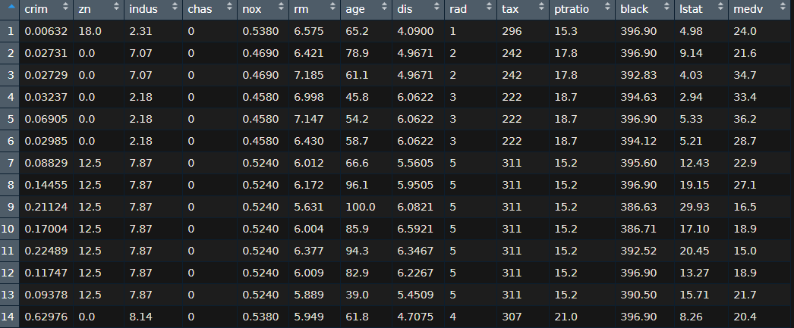

## Introduction round

### Please tell us shortly...

- Where are you from? What are you studying/working?
- What is your experience level in R/other programming languages?
- What are your expectations of this course?
- Where do you think you can use Machine Learning in the future?

## Preliminaries

- This topic is huge - we concentrate on presenting the applications in R
- Usually we have big differences in knowledge and abilities of the participants - please tell, if it is too fast or slow.
- We have many [**exercises**](http://web.math.ku.dk/~helle/R-intro/exercises.pdf) because at the end you can only learn on your own
- We have many [**examples**](https://www.showmeshiny.com/) - try them!
- If there are questions - always ask
- R is more fun together - ask your neighbor


## Content of this section

- The first section is about laying the foundations in R. We will need all things covered later on.

### Topics section:

- Why R is a good choice
- Constraints of R-usage
- R is modular 
- Import and export of data

<!--
- The second section is an introduction to the field of machine learning.
- The third part is on regression and classification.
-->

## Why R is a good choice ...

- ... because it is an [**open source language**](https://stackoverflow.com/questions/1546583/what-is-the-definition-of-an-open-source-programming-language)
- ... outstanding graphs - [**graphics**](http://matthewlincoln.net/2014/12/20/adjacency-matrix-plots-with-r-and-ggplot2.html), [**graphics**](https://www.r-bloggers.com/3d-plots-with-ggplot2-and-plotly /), [**graphics**](https://procomun.wordpress.com/2011/03/18/splomr/)
- ... relates to other languages - [**R can be used in combination with other programs**](https://github.com/Japhilko/RInterfaces) - e.g. [**data linking**](https://github.com/Japhilko/RInterfaces/blob/master/slides/Datenimport.md)
- ...R can be used [**for automation**](https://cran.r-project.org/web/packages/MplusAutomation/index.html)
 - ... Vast Community - [**you can use the intelligence of other people ;-)**](https://www.r-bloggers.com/) and new statistical methodologies are implemented quite fast 
- Because R can be combined with other programs like `PostgreSQL` or `Python`

## Constraints

<!--
Why R might not be the best choice in every situation
-->

<!--
https://elitedatascience.com/r-vs-python-for-data-science
-->

### [Newer modules in Python](https://blog.dominodatalab.com/video-huge-debate-r-vs-python-data-science/)

- Machine learning is a field that changes rapidly.  
- Some new tools are first developed in Python. 
- The package `reticulate` offers the possibility to use these modules from an R environment. 
- Good news - Python is also Open Source

### Big Data 

- Especially if you work with web data, you quickly have to deal with large amounts of data. 
- Therefore one must fall back on databases and parallelization strategies, which can be used in R. 

<!--
## Content of this part

- Introduction to programming in R 

### what is relevant for this course.

- How to import data?
- What to do with missing values?
- 
-->

## R is modular

### Install packages from CRAN Server


```r
install.packages("lme4")
```

### Install packages from Bioconductor Server


```r
source("https://bioconductor.org/biocLite.R")
biocLite(c("GenomicFeatures", "AnnotationDbi"))
```


### Install packages from Github


```r
install.packages("devtools")
library(devtools)

devtools::install_github("koalaverse/vip")
```

<!--
https://github.com/koalaverse/vip
-->


## [Task View Machine Learning](https://cran.r-project.org/web/views/MachineLearning.html)


{ width=110% }


## Install all packages of a task view


```r
install.packages("ctv")
ctv::install.views("MachineLearning")
```


## Exercise: Find R-packages

Go to https://cran.r-project.org/ and search for packages that can be used:

1) to reduce overfitting
2) for regression trees
3) for gradient boosting
4) for neural networks
5) for clustering


<!--
https://www.r-bloggers.com/what-are-the-best-machine-learning-packages-in-r/
-->


## Preparation - packages


```r
library(dplyr)
```


## The package `magrittr`


```r
library(magrittr)
```


## Import `.csv` data 

### The `read.csv` command

- Use `read.csv2` for German data 


```r
?read.csv
?read.csv2
```

### Using a path to import data


```r
path1<-"https://raw.githubusercontent.com/"
path2<- "thomaspernet/data_csv_r/master/data/"
dname <- "titanic_csv.csv"
titanic <- read.csv(paste0(path1,path2,dname))
```

### Save the dataset


```r
save(titanic,file="../data/titanic.RData")
```


## The titanic dataset



<!--
https://www.guru99.com/r-decision-trees.html
-->


## The function `scan` to import data 

- `scan` has an easy way to distinguish comments from data


```r
?scan
```

### Example dataset


```r
cat("TITLE extra line", "# a comment","2 3 5 7", "11 13 17", 
    file = "../data/ex.data", sep = "\n")
```

### Import data and skip the first line


```r
pp<-scan("../data/ex.data",skip=1,quiet=TRUE)
```


```r
pp <- scan("../data/ex.data",comment.char="#", skip = 1,
           quiet = TRUE)
```


## The download the data from UCI.


```r
path1 <- "http://archive.ics.uci.edu/ml/"
path2 <- "machine-learning-databases/00243/"
dname <- 'yacht_hydrodynamics.data'
```


```r
url<- paste0(path1,path2,dname)
Yacht_Data <- readr::read_table(file = url)
```


## Built in datasets

- A sample dataset is often provided to demonstrate the functionality of a package.
- These records can be loaded using the `data` command.


```r
data(iris)
```

- There is also a [**RStudio Add-In**](https://github.com/bquast/datasets.load) that helps to find a built-in dataset.


```r
install.packages("datasets.load")
```

## Help page for built in datasets


```r
?kyphosis
```



## Excursus [RStudio Addins](https://cran.r-project.org/web/packages/addinslist/README.html)

- In the upper right corner there is a button Addins


## How to get help

-  I use [**duckduckgo:**](figure/duckduckgo.PNG)

```
R-project + "what I want to know" 
```
-  this works of course for all search engines!


## Exercise: load built-in data

### Load the the built-in dataset `swiss` 
<!--
and answer the following questions:
-->
1) How many observations and variables are available?
2) What is the scale level of the variables?

### Interactive data table 

3) Create an interactive data table


## The R-package `data.table`

### Get an overview


```r
data(airquality)
head(airquality)
```

```
##   Ozone Solar.R Wind Temp Month Day
## 1    41     190  7.4   67     5   1
## 2    36     118  8.0   72     5   2
## 3    12     149 12.6   74     5   3
## 4    18     313 11.5   62     5   4
## 5    NA      NA 14.3   56     5   5
## 6    28      NA 14.9   66     5   6
```

## Overview with `data.table`


```r
library(data.table)
(airq <- data.table(airquality))
```

```
##      Ozone Solar.R Wind Temp Month Day
##   1:    41     190  7.4   67     5   1
##   2:    36     118  8.0   72     5   2
##   3:    12     149 12.6   74     5   3
##   4:    18     313 11.5   62     5   4
##   5:    NA      NA 14.3   56     5   5
##  ---                                  
## 149:    30     193  6.9   70     9  26
## 150:    NA     145 13.2   77     9  27
## 151:    14     191 14.3   75     9  28
## 152:    18     131  8.0   76     9  29
## 153:    20     223 11.5   68     9  30
```

## Column (and row) names of `airq`


```r
colnames(airq)
```

```
## [1] "Ozone"   "Solar.R" "Wind"    "Temp"    "Month"   "Day"
```

```r
rownames(airq)
```

```
##   [1] "1"   "2"   "3"   "4"   "5"   "6"   "7"   "8"   "9"   "10"  "11"  "12" 
##  [13] "13"  "14"  "15"  "16"  "17"  "18"  "19"  "20"  "21"  "22"  "23"  "24" 
##  [25] "25"  "26"  "27"  "28"  "29"  "30"  "31"  "32"  "33"  "34"  "35"  "36" 
##  [37] "37"  "38"  "39"  "40"  "41"  "42"  "43"  "44"  "45"  "46"  "47"  "48" 
##  [49] "49"  "50"  "51"  "52"  "53"  "54"  "55"  "56"  "57"  "58"  "59"  "60" 
##  [61] "61"  "62"  "63"  "64"  "65"  "66"  "67"  "68"  "69"  "70"  "71"  "72" 
##  [73] "73"  "74"  "75"  "76"  "77"  "78"  "79"  "80"  "81"  "82"  "83"  "84" 
##  [85] "85"  "86"  "87"  "88"  "89"  "90"  "91"  "92"  "93"  "94"  "95"  "96" 
##  [97] "97"  "98"  "99"  "100" "101" "102" "103" "104" "105" "106" "107" "108"
## [109] "109" "110" "111" "112" "113" "114" "115" "116" "117" "118" "119" "120"
## [121] "121" "122" "123" "124" "125" "126" "127" "128" "129" "130" "131" "132"
## [133] "133" "134" "135" "136" "137" "138" "139" "140" "141" "142" "143" "144"
## [145] "145" "146" "147" "148" "149" "150" "151" "152" "153"
```


## Command `mutate` - create or transform variables


```r
?dplyr::mutate
```


```r
airq %>%
  mutate(Temp / max(Temp, na.rm = TRUE)) 
```

```
##     Ozone Solar.R Wind Temp Month Day Temp/max(Temp, na.rm = TRUE)
## 1      41     190  7.4   67     5   1                    0.6907216
## 2      36     118  8.0   72     5   2                    0.7422680
## 3      12     149 12.6   74     5   3                    0.7628866
## 4      18     313 11.5   62     5   4                    0.6391753
## 5      NA      NA 14.3   56     5   5                    0.5773196
## 6      28      NA 14.9   66     5   6                    0.6804124
## 7      23     299  8.6   65     5   7                    0.6701031
## 8      19      99 13.8   59     5   8                    0.6082474
## 9       8      19 20.1   61     5   9                    0.6288660
## 10     NA     194  8.6   69     5  10                    0.7113402
## 11      7      NA  6.9   74     5  11                    0.7628866
## 12     16     256  9.7   69     5  12                    0.7113402
## 13     11     290  9.2   66     5  13                    0.6804124
## 14     14     274 10.9   68     5  14                    0.7010309
## 15     18      65 13.2   58     5  15                    0.5979381
## 16     14     334 11.5   64     5  16                    0.6597938
## 17     34     307 12.0   66     5  17                    0.6804124
## 18      6      78 18.4   57     5  18                    0.5876289
## 19     30     322 11.5   68     5  19                    0.7010309
## 20     11      44  9.7   62     5  20                    0.6391753
## 21      1       8  9.7   59     5  21                    0.6082474
## 22     11     320 16.6   73     5  22                    0.7525773
## 23      4      25  9.7   61     5  23                    0.6288660
## 24     32      92 12.0   61     5  24                    0.6288660
## 25     NA      66 16.6   57     5  25                    0.5876289
## 26     NA     266 14.9   58     5  26                    0.5979381
## 27     NA      NA  8.0   57     5  27                    0.5876289
## 28     23      13 12.0   67     5  28                    0.6907216
## 29     45     252 14.9   81     5  29                    0.8350515
## 30    115     223  5.7   79     5  30                    0.8144330
## 31     37     279  7.4   76     5  31                    0.7835052
## 32     NA     286  8.6   78     6   1                    0.8041237
## 33     NA     287  9.7   74     6   2                    0.7628866
## 34     NA     242 16.1   67     6   3                    0.6907216
## 35     NA     186  9.2   84     6   4                    0.8659794
## 36     NA     220  8.6   85     6   5                    0.8762887
## 37     NA     264 14.3   79     6   6                    0.8144330
## 38     29     127  9.7   82     6   7                    0.8453608
## 39     NA     273  6.9   87     6   8                    0.8969072
## 40     71     291 13.8   90     6   9                    0.9278351
## 41     39     323 11.5   87     6  10                    0.8969072
## 42     NA     259 10.9   93     6  11                    0.9587629
## 43     NA     250  9.2   92     6  12                    0.9484536
## 44     23     148  8.0   82     6  13                    0.8453608
## 45     NA     332 13.8   80     6  14                    0.8247423
## 46     NA     322 11.5   79     6  15                    0.8144330
## 47     21     191 14.9   77     6  16                    0.7938144
## 48     37     284 20.7   72     6  17                    0.7422680
## 49     20      37  9.2   65     6  18                    0.6701031
## 50     12     120 11.5   73     6  19                    0.7525773
## 51     13     137 10.3   76     6  20                    0.7835052
## 52     NA     150  6.3   77     6  21                    0.7938144
## 53     NA      59  1.7   76     6  22                    0.7835052
## 54     NA      91  4.6   76     6  23                    0.7835052
## 55     NA     250  6.3   76     6  24                    0.7835052
## 56     NA     135  8.0   75     6  25                    0.7731959
## 57     NA     127  8.0   78     6  26                    0.8041237
## 58     NA      47 10.3   73     6  27                    0.7525773
## 59     NA      98 11.5   80     6  28                    0.8247423
## 60     NA      31 14.9   77     6  29                    0.7938144
## 61     NA     138  8.0   83     6  30                    0.8556701
## 62    135     269  4.1   84     7   1                    0.8659794
## 63     49     248  9.2   85     7   2                    0.8762887
## 64     32     236  9.2   81     7   3                    0.8350515
## 65     NA     101 10.9   84     7   4                    0.8659794
## 66     64     175  4.6   83     7   5                    0.8556701
## 67     40     314 10.9   83     7   6                    0.8556701
## 68     77     276  5.1   88     7   7                    0.9072165
## 69     97     267  6.3   92     7   8                    0.9484536
## 70     97     272  5.7   92     7   9                    0.9484536
## 71     85     175  7.4   89     7  10                    0.9175258
## 72     NA     139  8.6   82     7  11                    0.8453608
## 73     10     264 14.3   73     7  12                    0.7525773
## 74     27     175 14.9   81     7  13                    0.8350515
## 75     NA     291 14.9   91     7  14                    0.9381443
## 76      7      48 14.3   80     7  15                    0.8247423
## 77     48     260  6.9   81     7  16                    0.8350515
## 78     35     274 10.3   82     7  17                    0.8453608
## 79     61     285  6.3   84     7  18                    0.8659794
## 80     79     187  5.1   87     7  19                    0.8969072
## 81     63     220 11.5   85     7  20                    0.8762887
## 82     16       7  6.9   74     7  21                    0.7628866
## 83     NA     258  9.7   81     7  22                    0.8350515
## 84     NA     295 11.5   82     7  23                    0.8453608
## 85     80     294  8.6   86     7  24                    0.8865979
## 86    108     223  8.0   85     7  25                    0.8762887
## 87     20      81  8.6   82     7  26                    0.8453608
## 88     52      82 12.0   86     7  27                    0.8865979
## 89     82     213  7.4   88     7  28                    0.9072165
## 90     50     275  7.4   86     7  29                    0.8865979
## 91     64     253  7.4   83     7  30                    0.8556701
## 92     59     254  9.2   81     7  31                    0.8350515
## 93     39      83  6.9   81     8   1                    0.8350515
## 94      9      24 13.8   81     8   2                    0.8350515
## 95     16      77  7.4   82     8   3                    0.8453608
## 96     78      NA  6.9   86     8   4                    0.8865979
## 97     35      NA  7.4   85     8   5                    0.8762887
## 98     66      NA  4.6   87     8   6                    0.8969072
## 99    122     255  4.0   89     8   7                    0.9175258
## 100    89     229 10.3   90     8   8                    0.9278351
## 101   110     207  8.0   90     8   9                    0.9278351
## 102    NA     222  8.6   92     8  10                    0.9484536
## 103    NA     137 11.5   86     8  11                    0.8865979
## 104    44     192 11.5   86     8  12                    0.8865979
## 105    28     273 11.5   82     8  13                    0.8453608
## 106    65     157  9.7   80     8  14                    0.8247423
## 107    NA      64 11.5   79     8  15                    0.8144330
## 108    22      71 10.3   77     8  16                    0.7938144
## 109    59      51  6.3   79     8  17                    0.8144330
## 110    23     115  7.4   76     8  18                    0.7835052
## 111    31     244 10.9   78     8  19                    0.8041237
## 112    44     190 10.3   78     8  20                    0.8041237
## 113    21     259 15.5   77     8  21                    0.7938144
## 114     9      36 14.3   72     8  22                    0.7422680
## 115    NA     255 12.6   75     8  23                    0.7731959
## 116    45     212  9.7   79     8  24                    0.8144330
## 117   168     238  3.4   81     8  25                    0.8350515
## 118    73     215  8.0   86     8  26                    0.8865979
## 119    NA     153  5.7   88     8  27                    0.9072165
## 120    76     203  9.7   97     8  28                    1.0000000
## 121   118     225  2.3   94     8  29                    0.9690722
## 122    84     237  6.3   96     8  30                    0.9896907
## 123    85     188  6.3   94     8  31                    0.9690722
## 124    96     167  6.9   91     9   1                    0.9381443
## 125    78     197  5.1   92     9   2                    0.9484536
## 126    73     183  2.8   93     9   3                    0.9587629
## 127    91     189  4.6   93     9   4                    0.9587629
## 128    47      95  7.4   87     9   5                    0.8969072
## 129    32      92 15.5   84     9   6                    0.8659794
## 130    20     252 10.9   80     9   7                    0.8247423
## 131    23     220 10.3   78     9   8                    0.8041237
## 132    21     230 10.9   75     9   9                    0.7731959
## 133    24     259  9.7   73     9  10                    0.7525773
## 134    44     236 14.9   81     9  11                    0.8350515
## 135    21     259 15.5   76     9  12                    0.7835052
## 136    28     238  6.3   77     9  13                    0.7938144
## 137     9      24 10.9   71     9  14                    0.7319588
## 138    13     112 11.5   71     9  15                    0.7319588
## 139    46     237  6.9   78     9  16                    0.8041237
## 140    18     224 13.8   67     9  17                    0.6907216
## 141    13      27 10.3   76     9  18                    0.7835052
## 142    24     238 10.3   68     9  19                    0.7010309
## 143    16     201  8.0   82     9  20                    0.8453608
## 144    13     238 12.6   64     9  21                    0.6597938
## 145    23      14  9.2   71     9  22                    0.7319588
## 146    36     139 10.3   81     9  23                    0.8350515
## 147     7      49 10.3   69     9  24                    0.7113402
## 148    14      20 16.6   63     9  25                    0.6494845
## 149    30     193  6.9   70     9  26                    0.7216495
## 150    NA     145 13.2   77     9  27                    0.7938144
## 151    14     191 14.3   75     9  28                    0.7731959
## 152    18     131  8.0   76     9  29                    0.7835052
## 153    20     223 11.5   68     9  30                    0.7010309
```


## [Exercise](https://www.datacamp.com/community/tutorials/pipe-r-tutorial): random numbers


1) Draw 8 random numbers from the uniform distribution and save them in a vector `x`
2) Compute the logarithm of `x`, return suitably lagged and iterated differences, 
3) compute the exponential function and round the result


```
## [1]  0.5  3.0  0.2  0.2 29.9  0.8  0.0
```


## [The pipe operator](https://www.datacamp.com/community/tutorials/pipe-r-tutorial)


```r
library(magrittr)

# Perform the same computations on `x` as above
x %>% log() %>%
    diff() %>%
    exp() %>%
    round(1)
```

```
## [1]  0.5  3.0  0.2  0.2 29.9  0.8  0.0
```


## How to deal with missing values


```r
?na.omit
```


```r
airq
```

```
##      Ozone Solar.R Wind Temp Month Day
##   1:    41     190  7.4   67     5   1
##   2:    36     118  8.0   72     5   2
##   3:    12     149 12.6   74     5   3
##   4:    18     313 11.5   62     5   4
##   5:    NA      NA 14.3   56     5   5
##  ---                                  
## 149:    30     193  6.9   70     9  26
## 150:    NA     145 13.2   77     9  27
## 151:    14     191 14.3   75     9  28
## 152:    18     131  8.0   76     9  29
## 153:    20     223 11.5   68     9  30
```


## The command `na.omit`


```r
na.omit(airq)
```

```
##      Ozone Solar.R Wind Temp Month Day
##   1:    41     190  7.4   67     5   1
##   2:    36     118  8.0   72     5   2
##   3:    12     149 12.6   74     5   3
##   4:    18     313 11.5   62     5   4
##   5:    23     299  8.6   65     5   7
##  ---                                  
## 107:    14      20 16.6   63     9  25
## 108:    30     193  6.9   70     9  26
## 109:    14     191 14.3   75     9  28
## 110:    18     131  8.0   76     9  29
## 111:    20     223 11.5   68     9  30
```

## Available loops in R


## [Loops in R](https://www.datacamp.com/community/tutorials/tutorial-on-loops-in-r?utm_source=adwords_ppc&utm_campaignid=1655852085&utm_adgroupid=61045433942&utm_device=c&utm_keyword=%2Bloops%20%2Br&utm_matchtype=b&utm_network=g&utm_adpostion=1t1&utm_creative=318880582254&utm_targetid=aud-392016246653:kwd-589281898934&utm_loc_interest_ms=&utm_loc_physical_ms=9041580&gclid=Cj0KCQjwocPnBRDFARIsAJJcf97mSXl9jWq7mdoRkuxbhu_LS_WCY00hyty2VW5AbXe7hetdvXio9VAaAmpMEALw_wcB)

- This loop calculates the square of the first 10 elements of vector u1


```r
u1 <- rnorm(30)
# Initialize `usq`
usq <- 0
for(i in 1:10) {
  # i-th element of `u1` squared into `i`-th position of `usq`
  usq[i] <- u1[i]*u1[i]
  print(usq[i])
}
```

```
## [1] 0.03161853
## [1] 0.7767657
## [1] 0.08629954
## [1] 3.220062
## [1] 0.4655009
## [1] 0.07906708
## [1] 0.1317907
## [1] 0.207933
## [1] 1.257818
## [1] 0.08255892
```

```r
print(i)
```

```
## [1] 10
```

## [Library `purrr` ](https://r4ds.had.co.nz/iteration.html)

### `purrr` - Functional Programming Tools

- The pattern of looping over a vector, doing something to each element and saving the results is so common that the purrr package provides a family of functions to do it for you. 

<!--
https://cran.r-project.org/web/packages/purrr/purrr.pdf
-->


```r
library(purrr)
```


-    `map()` makes a list.
-    `map_lgl()` makes a logical vector.
-    `map_int()` makes an integer vector.
-    `map_dbl()` makes a double vector.
-    `map_chr()` makes a character vector.


## Example `map_dbl`


```r
map_dbl(airq, mean)
```

```
##     Ozone   Solar.R      Wind      Temp     Month       Day 
##        NA        NA  9.957516 77.882353  6.993464 15.803922
```


```r
map_dbl(airq, mean,na.rm=T)
```

```
##      Ozone    Solar.R       Wind       Temp      Month        Day 
##  42.129310 185.931507   9.957516  77.882353   6.993464  15.803922
```


## [Clean the titanic data set](https://www.guru99.com/r-decision-trees.html)


```r
clean_titanic <- titanic %>% 	
  mutate(pclass=factor(pclass,levels = c(1, 2, 3),
                       labels=c('Upper','Middle','Lower')),
	survived = factor(survived,levels = c(0, 1), 
	                  labels=c('No', 'Yes'))) %>%
na.omit()
```

###   `mutate(pclass = factor(...`: 

- Add label to the variable pclass. 
- 1 becomes Upper, 2 becomes MIddle and 3 becomes lower

###  `factor(survived,...`:

- Add label to the variable survived. 
- 1 Becomes No and 2 becomes Yes

- `na.omit()`: Remove the NA observations 

## Get an overview of the data


```r
glimpse(clean_titanic)
```

```
## Observations: 1,045
## Variables: 13
## $ X         <int> 1, 2, 3, 4, 5, 6, 7, 8, 9, 10, 11, 12, 13, 14, 15, 17, 18, …
## $ pclass    <fct> Upper, Upper, Upper, Upper, Upper, Upper, Upper, Upper, Upp…
## $ survived  <fct> Yes, Yes, No, No, No, Yes, Yes, No, Yes, No, No, Yes, Yes, …
## $ name      <fct> "Allen, Miss. Elisabeth Walton", "Allison, Master. Hudson T…
## $ sex       <fct> female, male, female, male, female, male, female, male, fem…
## $ age       <dbl> 29.0000, 0.9167, 2.0000, 30.0000, 25.0000, 48.0000, 63.0000…
## $ sibsp     <int> 0, 1, 1, 1, 1, 0, 1, 0, 2, 0, 1, 1, 0, 0, 0, 0, 0, 0, 0, 1,…
## $ parch     <int> 0, 2, 2, 2, 2, 0, 0, 0, 0, 0, 0, 0, 0, 0, 0, 1, 1, 0, 0, 1,…
## $ ticket    <fct> 24160, 113781, 113781, 113781, 113781, 19952, 13502, 112050…
## $ fare      <dbl> 211.3375, 151.5500, 151.5500, 151.5500, 151.5500, 26.5500, …
## $ cabin     <fct> B5, C22 C26, C22 C26, C22 C26, C22 C26, E12, D7, A36, C101,…
## $ embarked  <fct> S, S, S, S, S, S, S, S, S, C, C, C, C, S, S, C, C, C, C, S,…
## $ home.dest <fct> "St Louis, MO", "Montreal, PQ / Chesterville, ON", "Montrea…
```


## [With `gather` from wide to long format](http://stackoverflow.com/questions/1181060)


```r
library(dplyr)
library(tidyr)
stocks <- tibble(
  time = as.Date('2009-01-01') + 0:9,
  X = rnorm(10, 0, 1),
  Y = rnorm(10, 0, 2),
  Z = rnorm(10, 0, 4)
)

gather(stocks, "stock", "price", -time)
```

```
## # A tibble: 30 x 3
##    time       stock   price
##    <date>     <chr>   <dbl>
##  1 2009-01-01 X     -0.334 
##  2 2009-01-02 X      0.223 
##  3 2009-01-03 X      2.06  
##  4 2009-01-04 X      2.68  
##  5 2009-01-05 X     -2.24  
##  6 2009-01-06 X      1.31  
##  7 2009-01-07 X      0.164 
##  8 2009-01-08 X      0.359 
##  9 2009-01-09 X     -0.591 
## 10 2009-01-10 X      0.0713
## # … with 20 more rows
```

## Sequences

- Later we will create hyperparameter grids.
- To do so, we will need sequences


```r
# the easiest sequence
1:4
```

```
## [1] 1 2 3 4
```

```r
# the other way
4:1
```

```
## [1] 4 3 2 1
```

```r
# the command sequence
seq(start=1,to = 10,by = 2)
```

```
## [1] 1 3 5 7 9
```

```r
# we will need the following for loops
seq_along(14:21)
```

```
## [1] 1 2 3 4 5 6 7 8
```


## The command `expand.grid`


```r
expand.grid(letters[1:4],5:3,LETTERS[1:2])
```

```
##    Var1 Var2 Var3
## 1     a    5    A
## 2     b    5    A
## 3     c    5    A
## 4     d    5    A
## 5     a    4    A
## 6     b    4    A
## 7     c    4    A
## 8     d    4    A
## 9     a    3    A
## 10    b    3    A
## 11    c    3    A
## 12    d    3    A
## 13    a    5    B
## 14    b    5    B
## 15    c    5    B
## 16    d    5    B
## 17    a    4    B
## 18    b    4    B
## 19    c    4    B
## 20    d    4    B
## 21    a    3    B
## 22    b    3    B
## 23    c    3    B
## 24    d    3    B
```

## [Example Data - Housing Values in Suburbs of Boston](https://datascienceplus.com/fitting-neural-network-in-r/)


```r
library(MASS)
bdat <- Boston
```




## Normalize your data

### Compute maximum and minimum per column


```r
maxs <- apply(bdat, 2, max) 
mins <- apply(bdat, 2, min)
```

### `scale` - Scaling and Centering of Matrix-like Objects

```r
scaled <- as.data.frame(scale(bdat, center = mins, 
                              scale = maxs - mins))
```


## The scaled data


## The command `sample`

- We can use this command to draw a sample. 
- We need the command later to split our dataset into a test and a training dataset. 


```r
sample(1:10,3,replace=T)
```

```
## [1] 3 3 3
```

```r
sample(1:10,3,replace=T)
```

```
## [1] 5 6 9
```

### Create test and training datasets


```r
ntest <- round(nrow(bdat)*.2)
ind <- sample(1:nrow(bdat),ntest)
bdat_test <- bdat[ind,]
bdat_train <- bdat[-ind,]
```


## Alternative to split a dataset

- `Y` - Vector of data labels. If there are only a few labels (as is expected) than relative ratio of data in both subsets will be the same.
- `SplitRatio` - Splitting ratio


```r
split <- caTools::sample.split(Y = bdat$lstat,SplitRatio = .8)
Train <- bdat[split,]
Test <- bdat[!split,]
nrow(Train);nrow(Test)
```

```
## [1] 404
```

```
## [1] 102
```


## Set a seed

- `set.seed` is the recommended way to specify seeds.
- If we set a seed, we get the same result for random events.
- This function is mainly required for simulations. 


```r
set.seed(234)
sample(1:10,3,replace=T)
```

```
## [1] 1 2 2
```

```r
set.seed(234)
sample(1:10,3,replace=T)
```

```
## [1] 1 2 2
```

## [Time measurement](https://www.r-bloggers.com/5-ways-to-measure-running-time-of-r-code/)


```r
start_time <- Sys.time()
ab <- runif(10000000)
end_time <- Sys.time()

end_time - start_time
```

```
## Time difference of 0.646827 secs
```


## How many cores are available


```r
library(doParallel)
detectCores()
```

```
## [1] 4
```

## Make cluster


```r
cl <- makeCluster(detectCores())
registerDoParallel(cl)
```


```r
start_time <- Sys.time()
ab <- runif(10000000)
end_time <- Sys.time()

end_time - start_time
```

```
## Time difference of 0.468081 secs
```


```r
stopCluster(cl)
```


```r
?parallel::makeCluster
```

<!--
## [The `swirl` package](https://swirlstats.com/)


```r
install.packages("swirl")
```


```r
library("swirl")
swirl()
```
-->

## Resources

- [**Course materials for the Data Science Specialization**](https://github.com/DataScienceSpecialization/courses)
- Data wrangling - [**`dplyr` vignette**](https://cran.r-project.org/web/packages/dplyr/vignettes/dplyr.html) - 
- The usage of pipes - [**`magrittr` vignette**](https://cran.r-project.org/web/packages/magrittr/vignettes/magrittr.html)
- Gareth James et al (2013) [**An Introduction to
Statistical Learning**](https://www-bcf.usc.edu/~gareth/ISL/ISLR%20First%20Printing.pdf)

<!--
Further possible topics of this section:

- regular expressions
- the reticulate package
- how to install python modules

- mutate function in dplyr package
- the rescale package

- loops
- exercise with loops

- paste und paste0
- random number generation
- the function diag

- mutate
- purrr::map_dbl

- what to do with missing values
-->

<!--
https://www.r-exercises.com/start-here-to-learn-r/
https://www.r-exercises.com/category/exercises/exercises-intermediate/

Exercises that Practice and Extend Skills with R
https://maths-people.anu.edu.au/~johnm/courses/r/exercises/pdf/r-exercises.pdf

Loops in R
https://www.datacamp.com/community/tutorials/tutorial-on-loops-in-r?utm_source=adwords_ppc&utm_campaignid=1655852085&utm_adgroupid=61045433942&utm_device=c&utm_keyword=%2Bloops%20%2Br&utm_matchtype=b&utm_network=g&utm_adpostion=1t1&utm_creative=318880582254&utm_targetid=aud-392016246653:kwd-589281898934&utm_loc_interest_ms=&utm_loc_physical_ms=9041580&gclid=Cj0KCQjwocPnBRDFARIsAJJcf97mSXl9jWq7mdoRkuxbhu_LS_WCY00hyty2VW5AbXe7hetdvXio9VAaAmpMEALw_wcB

confusion matrix
https://www.dataschool.io/simple-guide-to-confusion-matrix-terminology/

lime
https://homes.cs.washington.edu/~marcotcr/blog/lime/
https://www.oreilly.com/learning/introduction-to-local-interpretable-model-agnostic-explanations-lime
https://homes.cs.washington.edu/~marcotcr/blog/lime/

training error and test error
https://rapidminer.com/blog/validate-models-training-test-error/

Variable importance measures
https://www.ifi.uzh.ch/dam/jcr:82fc9567-e690-40fa-baff-eb7a37aa00c0/MasterThesis.pdf

support vector machines
https://de.wikipedia.org/wiki/Support_Vector_Machine

naive bias classifier
https://en.wikipedia.org/wiki/Naive_Bayes_classifier

stochastic gradient descent
https://en.wikipedia.org/wiki/Stochastic_gradient_descent

productionalization
https://en.wiktionary.org/wiki/productionalization

Machine Learning mit R und caret
https://statistik-dresden.de/archives/14967

ice curve
https://christophm.github.io/interpretable-ml-book/ice.html
-->

