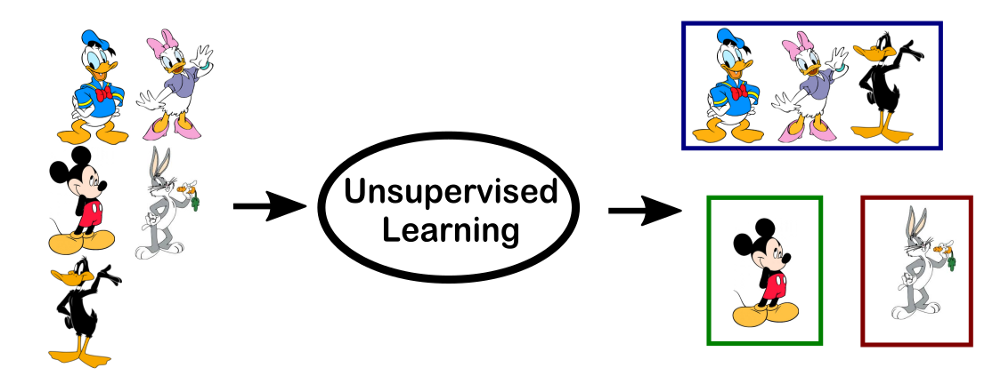
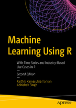

```{r setupMlintro, include=FALSE}
knitr::opts_chunk$set(echo = TRUE,cache=T)
```

## [What Is Machine Learning?](https://www.netapp.com/us/info/what-is-machine-learning-ml.aspx)

- Machine learning allows the user to feed a computer algorithm an immense amount of data and have the computer analyze and make data-driven recommendations and decisions based on only the input data. 

- If any corrections are identified, the algorithm can incorporate that information to improve its future decision making.

<!--

## Outline for today

- We start with supervised learning - we want to predict sale prices of flats/houses in Iowa using linear regression (part b1).
- In a next step we try to reduce overfitting using regularization methods (b2).
- 

-->


<!--
## [Modern Machine Learning Algorithms](https://elitedatascience.com/machine-learning-algorithms)
-->

### Categorizing machine learning algorithms...

- ... is tricky, and there are several approaches; 
- they can be grouped into generative/discriminative, parametric/non-parametric, supervised/unsupervised, and so on.


<!--
https://lgatto.github.io/IntroMachineLearningWithR/an-introduction-to-machine-learning-with-r.html
-->


## [What is supervised learning?](https://elitedatascience.com/birds-eye-view)


<!--
https://lgatto.github.io/IntroMachineLearningWithR/supervised-learning.html#random-forest
-->


Supervised learning includes tasks for "labeled" data (i.e. you have a target variable).

- In practice, it's often used as an advanced form of predictive modeling.
 -  Each observation must be labeled with a "correct answer."
 -   Only then can you build a predictive model because you must tell the algorithm what's "correct" while training it (hence, "supervising" it).
 -   Regression is the task for modeling continuous target variables.
 -   Classification is the task for modeling categorical (a.k.a. "class") target variables.


## [Supervised vs unsupervised learning](https://towardsdatascience.com/supervised-vs-unsupervised-learning-14f68e32ea8d)

### Supervised learning 

- Prior knowledge of what output values for samples should be. 

{ height=20% }

### Unsupervised learning

- Here the most common tasks are clustering, representation learning, and density estimation - we wish to learn the inherent structure of our data without using explicitly-provided labels. 

{ height=20% }

<!--
https://medium.com/@danil.s.mikhailov/ai-and-the-social-sciences-part-i-5f172492d61d
-->

<!--
[Classification vs. regression ](https://towardsdatascience.com/supervised-vs-unsupervised-learning-14f68e32ea8d)
-->


## [Machine Learning - Components](https://www.linkedin.com/pulse/20140822073217-180198720-6-components-of-a-machine-learning-algorithm)

- Feature Extraction + Domain knowledge 

<!--
(Import and Data Wrangling)
-->

- Feature Selection

- Choice of Algorithm (Regression or classification, regularization, decision trees, k-Means clustering, ...)
<!--
Naive Bayes

[Support Vector Machines](https://github.com/Japhilko/DataAnalysis/blob/master/Machine%20Learning/SupportVectorMachines.md)
-->

- Training

- Choice of Metrics/Evaluation Criteria

- Testing


## [Feature selection in machine learning,... ](https://en.wikipedia.org/wiki/Feature_selection)

- ... is the process of selecting a subset of relevant features (variables, predictors) for use in model construction.

### Four reasons for feature selection:

1.) simplification of models to make them easier to interpret by researchers/users,

2.) shorter training times,

3.) to avoid the curse of dimensionality,

4.) enhanced generalization by reducing overfitting (formally, reduction of variance)


## [The Curse of Dimensionality](https://elitedatascience.com/dimensionality-reduction-algorithms)

{ height=40% }

In machine learning, “dimensionality” simply refers to the number of features (i.e. input variables) in your dataset.

- When the number of features is very large relative to the number of observations, certain algorithms struggle to train effective models. 

- This is called the “Curse of Dimensionality,” and it’s especially relevant for clustering algorithms that rely on distance calculations.


## [What are the advantages and disadvantages of decision trees?](https://elitedatascience.com/machine-learning-interview-questions-answers#supervised-learning)

Advantages: Decision trees are easy to interpret, nonparametric (which means they are robust to outliers), and there are relatively few parameters to tune.

Disadvantages: Decision trees are prone to be overfit. 

- This can be addressed by ensemble methods like random forests or boosted trees.


<!--
- Example data are used to train a model.
- With this model the classification can be realized automatically. 


http://www.datenbanken-verstehen.de/lexikon/supervised-learning/

Daten einer Gruppierung zuzuordnen, die durch den Nutzenden vorgegeben sind, aber nicht jeder Datensatz manuell bewertet werden kann (z. B. Kreditbewilligung abhängig von Kredithöhe und Bonität). 

Die Aufgabe besteht darin, 

Ein Modell wird mit Beispieldaten aufgebaut, das die Zuordnung anschließend selbstständig übernimmt.
-->


## [Random Forest](https://www.datascience.com/resources/notebooks/random-forest-intro)

> Random forest aims to reduce the previously mentioned correlation issue by choosing only a subsample of the feature space at each split. Essentially, it aims to make the trees de-correlated and prune the trees by setting a stopping criteria for node splits, which I will cover in more detail later.


## [Random forest](https://en.wikipedia.org/wiki/Random_forest)

- Ensemble learning method - multitude of decision trees 
- Random forests correct for decision trees' habit of overfitting to their training set.


## [Ensembling](https://elitedatascience.com/overfitting-in-machine-learning)

Ensembles are machine learning methods for combining predictions from multiple separate models. 

<!--
There are a few different methods for ensembling, but the two most common are:
-->

### Bagging 

attempts to reduce the chance overfitting complex models.


- It trains a large number of "strong" learners in parallel.
-  A strong learner is a model that's relatively unconstrained.
-  Bagging then combines all the strong learners together in order to "smooth out" their predictions.

### Boosting 

attempts to improve the predictive flexibility of simple models.

- It trains a large number of "weak" learners in sequence.
- A weak learner is a constrained model (limit for max depth of tree).
-    Each one in the sequence focuses on learning from the mistakes of the one before it.
- Boosting combines all the weak learners into a single strong learner.

## Bagging and boosting

While bagging and boosting are both ensemble methods, they approach the problem from opposite directions.

Bagging uses complex base models and tries to "smooth out" their predictions, while boosting uses simple base models and tries to "boost" their aggregate complexity.


## [Gradient boosting](https://en.wikipedia.org/wiki/Gradient_boosting)

Gradient boosting is a machine learning technique for regression and classification problems, which produces a prediction model in the form of an ensemble of weak prediction models, typically decision trees. It builds the model in a stage-wise fashion like other boosting methods do, and it generalizes them by allowing optimization of an arbitrary differentiable loss function.

The idea of gradient boosting originated in the observation by Leo Breiman that boosting can be interpreted as an optimization algorithm on a suitable cost function.


Breiman, L. (1997). "Arcing The Edge". Technical Report 486. Statistics Department, University of California, Berkeley.


<!--
-->


<!--
## Explicit algorithms

Explicit regression gradient boosting algorithms were subsequently developed by Jerome H. Friedman, simultaneously with the more general functional gradient boosting perspective of Llew Mason, Jonathan Baxter, Peter Bartlett and Marcus Frean.


The latter two papers introduced the view of boosting algorithms as iterative functional gradient descent algorithms. That is, algorithms that optimize a cost function over function space by iteratively choosing a function (weak hypothesis) that points in the negative gradient direction. This functional gradient view of boosting has led to the development of boosting algorithms in many areas of machine learning and statistics beyond regression and classification.
-->

## [**Advantages of gradient boosting**](http://uc-r.github.io/gbm_regression)

- Often provides predictive accuracy that cannot be beat.
- Lots of flexibility - can optimize on different loss functions and provides several hyperparameter tuning options that make the function fit very flexible.
- No data pre-processing required - often works great with categorical and numerical values as is.
- Handles missing data - imputation not required.

## [**Disadvantages**](http://uc-r.github.io/gbm_regression) of gradient boosting


- GBMs will continue improving to minimize all errors. This can overemphasize outliers and cause overfitting. Must use cross-validation to neutralize.
- Computationally expensive - GBMs often require many trees (>1000) which can be time and memory exhaustive.
- The high flexibility results in many parameters that interact and influence heavily the behavior of the approach (number of iterations, tree depth, regularization parameters, etc.). This requires a large grid search during tuning.
- Less interpretable although this is easily addressed with various tools (variable importance, partial dependence plots, LIME, etc.).


## Two types of errors for tree methods

### Bias related errors

- Adaptive boosting
- Gradient boosting

### Variance related errors

- Bagging
- Random forest

<!--
https://www.slideshare.net/JaroslawSzymczak1/gradient-boosting-in-practice-a-deep-dive-into-xgboost

What if we, instead of reweighting examples, made some corrections to prediction errors directly?

Residual is a gradient of single observation error contribution in one of the most common evaluation measure for regression: RMSE
-->


<!--
## [Gradient Boosting for Linear Regression - why does it not work?](https://stats.stackexchange.com/questions/186966/gradient-boosting-for-linear-regression-why-does-it-not-work)


While learning about Gradient Boosting, I haven't heard about any constraints regarding the properties of a "weak classifier" that the method uses to build and ensemble model. 


- I could not imagine an application of a GB that uses linear regression, and in fact when I've performed some tests - it doesn't work. I was testing the most standard approach with a gradient of sum of squared residuals and adding the subsequent models together.

The obvious problem is that the residuals from the first model are populated in such manner that there is really no regression line to fit anymore. My another observation is that a sum of subsequent linear regression models can be represented as a single regression model as well (adding all intercepts and corresponding coefficients) so I cannot imagine how that could ever improve the model. The last observation is that a linear regression (the most typical approach) is using sum of squared residuals as a loss function - the same one that GB is using.

I also thought about lowering the learning rate or using only a subset of predictors for each iteration, but that could still be summed up to a single model representation eventually, so I guess it would bring no improvement.

What am I missing here? Is linear regression somehow inappropriate to use with Gradient Boosting? Is it because the linear regression uses the sum of squared residuals as a loss function? Are there any particular constraints on the weak predictors so they can be applied to Gradient Boosting?
-->


## Links and resources

- [Presentations on ‘Elements of Neural Networks & Deep Learning’ ](https://www.r-bloggers.com/my-presentations-on-elements-of-neural-networks-deep-learning-parts-45/)

- [Understanding the Magic of Neural Networks](https://www.r-bloggers.com/understanding-the-magic-of-neural-networks/)

<!--
- [Neural Text Modelling with R package ruimtehol](https://www.r-bloggers.com/neural-text-modelling-with-r-package-ruimtehol/)
-->

- [Feature Selection using Genetic Algorithms in R](https://www.r-bloggers.com/feature-selection-using-genetic-algorithms-in-r/)

- [Lecture slides: Real-World Data Science (Fraud Detection, Customer Churn & Predictive Maintenance)](https://www.r-bloggers.com/lecture-slides-real-world-data-science-fraud-detection-customer-churn-predictive-maintenance/)

- [Automated Dashboard for Credit Modelling with Decision trees and Random forests in R](https://www.r-bloggers.com/automated-dashboard-for-credit-modelling-with-decision-trees-and-random-forests-in-r/)

- [Looking Back at Google’s Research Efforts in 2018](https://ai.googleblog.com/2019/01/looking-back-at-googles-research.html)

- [Selecting ‘special’ photos on your phone](https://www.r-bloggers.com/selecting-special-photos-on-your-phone/)


- [Open Source AI, ML & Data Science News](https://www.r-bloggers.com/ai-machine-learning-and-data-science-roundup-january-2019/)
<!--
Datacamp Course

https://www.r-bloggers.com/my-course-on-hyperparameter-tuning-in-r-is-now-on-data-camp/

company quantide


https://medium.freecodecamp.org/every-single-machine-learning-course-on-the-internet-ranked-by-your-reviews-3c4a7b8026c0
-->

- Google`s [Machine Learning Crash Course](https://developers.google.com/machine-learning/crash-course/)

- [A prelude to machine learning](https://eight2late.wordpress.com/2017/02/23/a-prelude-to-machine-learning/)

- [`caret` webinar by Max Kuhn - on youtube](https://www.youtube.com/watch?v=7Jbb2ItbTC4)

- [Learn math for data science](https://elitedatascience.com/learn-math-for-data-science)
- [Learn statistics for data science](https://elitedatascience.com/learn-statistics-for-data-science)

- [Aachine learning projects for beginners](https://elitedatascience.com/machine-learning-projects-for-beginners)

## Links and resources (II)

- [An Introduction to machine learning](http://www-bcf.usc.edu/~gareth/ISL/)
- [ISLR book](http://www-bcf.usc.edu/~gareth/ISL/ISLR%20Seventh%20Printing.pdf)

- [**useR! Machine Learning Tutorial**](https://koalaverse.github.io/machine-learning-in-R/)

### Introduction to machine learning with R

- [Your First Machine Learning Project in R Step-By-Step](https://machinelearningmastery.com/machine-learning-in-r-step-by-step/)


- chapter about machine learning in [awesome R](https://awesome-r.com/)


- [Shiny App for machine learning](https://www.showmeshiny.com/machlearn/)


## Annex - [Prediction vs. Causation in Regression Analysis](https://statisticalhorizons.com/prediction-vs-causation-in-regression-analysis)

### [**Paul Allison**](https://statisticalhorizons.com/prediction-vs-causation-in-regression-analysis)

> There are two main uses of multiple regression: prediction and causal analysis. In a prediction study, the goal is to develop a formula for making predictions about the dependent variable, based on the observed values of the independent variables….In a causal analysis, the independent variables are regarded as causes of the dependent variable. The aim of the study is to determine whether a particular independent variable really affects the dependent variable, and to estimate the magnitude of that effect, if any

<!--
## Literature for machine learning



-->
<!--
https://lgatto.github.io/IntroMachineLearningWithR/index.html
https://www.kaggle.com/camnugent/introduction-to-machine-learning-in-r-tutorial

https://www.r-bloggers.com/in-depth-introduction-to-machine-learning-in-15-hours-of-expert-videos/

https://www.r-bloggers.com/my-presentations-on-elements-of-neural-networks-deep-learning-parts-678/
-->