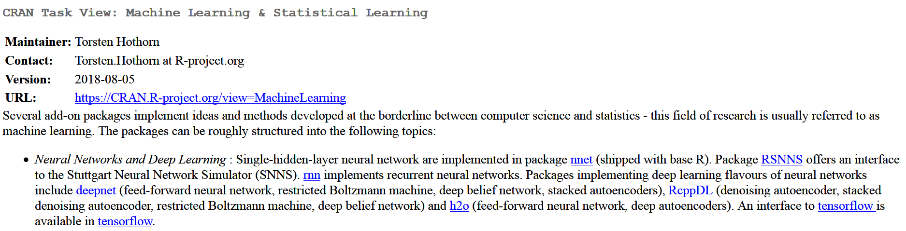

```{r setupMlintro, include=FALSE}
knitr::opts_chunk$set(echo = TRUE,cache=T)
```

## [Modern Machine Learning Algorithms](https://elitedatascience.com/machine-learning-algorithms)

Categorizing machine learning algorithms is tricky, and there are several reasonable approaches; they can be grouped into generative/discriminative, parametric/non-parametric, supervised/unsupervised, and so on.


<!--
https://lgatto.github.io/IntroMachineLearningWithR/an-introduction-to-machine-learning-with-r.html
-->

## [Machine Learning - Components](https://www.linkedin.com/pulse/20140822073217-180198720-6-components-of-a-machine-learning-algorithm)

- Feature Extraction + Domain knowledge

- Feature Selection

- Choice of Algorithm

Naive Bayes, [Support Vector Machines](https://github.com/Japhilko/DataAnalysis/blob/master/Machine%20Learning/SupportVectorMachines.md), Decision Trees, k-Means Clustering, ...

- Training

- Choice of Metrics/Evaluation Criteria

- Testing


## [Feature selection](https://en.wikipedia.org/wiki/Feature_selection)


## [Supervised vs unsupervised learning](https://towardsdatascience.com/supervised-vs-unsupervised-learning-14f68e32ea8d)

### Supervised Learning 

- we have prior knowledge of what the output values for our samples should be. 


## Task: Find R-packages

Go to https://cran.r-project.org/ and search for packages that,...

- can be used for lasso regression

<!--
https://www.r-bloggers.com/what-are-the-best-machine-learning-packages-in-r/
-->

## Task View Machine Learning





## Install all packages of a task view

```{r,eval=F}
install.packages("ctv")
ctv::install.views("MachineLearning")
```

## [Prediction vs. Causation in Regression Analysis](https://statisticalhorizons.com/prediction-vs-causation-in-regression-analysis)

## Literature for machine learning


<!--
https://lgatto.github.io/IntroMachineLearningWithR/index.html
https://www.kaggle.com/camnugent/introduction-to-machine-learning-in-r-tutorial

https://www.r-bloggers.com/in-depth-introduction-to-machine-learning-in-15-hours-of-expert-videos/

https://www.r-bloggers.com/my-presentations-on-elements-of-neural-networks-deep-learning-parts-678/
-->

## Introduction to machine learning with R

- [Your First Machine Learning Project in R Step-By-Step](https://machinelearningmastery.com/machine-learning-in-r-step-by-step/)


- chapter about machine learning in [awesome R](https://awesome-r.com/)


- [Shiny App for machine learning](https://www.showmeshiny.com/machlearn/)


## [The Curse of Dimensionality](https://elitedatascience.com/dimensionality-reduction-algorithms)


## Links

- [Presentations on ‘Elements of Neural Networks & Deep Learning’ ](https://www.r-bloggers.com/my-presentations-on-elements-of-neural-networks-deep-learning-parts-45/)

- [Understanding the Magic of Neural Networks](https://www.r-bloggers.com/understanding-the-magic-of-neural-networks/)

- [Neural Text Modelling with R package ruimtehol](https://www.r-bloggers.com/neural-text-modelling-with-r-package-ruimtehol/)

- [Feature Selection using Genetic Algorithms in R](https://www.r-bloggers.com/feature-selection-using-genetic-algorithms-in-r/)

- [Lecture slides: Real-World Data Science (Fraud Detection, Customer Churn & Predictive Maintenance)](https://www.r-bloggers.com/lecture-slides-real-world-data-science-fraud-detection-customer-churn-predictive-maintenance/)

- [Automated Dashboard for Credit Modelling with Decision trees and Random forests in R](https://www.r-bloggers.com/automated-dashboard-for-credit-modelling-with-decision-trees-and-random-forests-in-r/)

- [Looking Back at Google’s Research Efforts in 2018](https://ai.googleblog.com/2019/01/looking-back-at-googles-research.html)

- [Selecting ‘special’ photos on your phone](https://www.r-bloggers.com/selecting-special-photos-on-your-phone/)


- [Open Source AI, ML & Data Science News](https://www.r-bloggers.com/ai-machine-learning-and-data-science-roundup-january-2019/)
<!--
Datacamp Course

https://www.r-bloggers.com/my-course-on-hyperparameter-tuning-in-r-is-now-on-data-camp/

company quantide


https://medium.freecodecamp.org/every-single-machine-learning-course-on-the-internet-ranked-by-your-reviews-3c4a7b8026c0
-->

- Google`s [Machine Learning Crash Course](https://developers.google.com/machine-learning/crash-course/)

- [A prelude to machine learning](https://eight2late.wordpress.com/2017/02/23/a-prelude-to-machine-learning/)

- [caret webinar by Max Kuhn - on youtube](https://www.youtube.com/watch?v=7Jbb2ItbTC4)