```{r setup, include=FALSE}
knitr::opts_chunk$set(echo = FALSE,warning = F,message = F)
pres=T
```

## Good literature for linear regression in R

### Useful PDF document:

J H Maindonald - [**Using R for Data Analysis and Graphics
Introduction, Code and Commentary**](https://cran.r-project.org/doc/contrib/usingR.pdf)

-  Introduction to R 
-  Data analysis
-  Statistical models
-  Inference concepts
-  Regression with one predictor
-  Multiple linear regression
-  Extending the linear model
-  ...


## Variables of the `mtcars` dataset

Help for the `roller` dataset:

```{r,eval=F}
?mtcars
```
<!--
displacement - Hubraum
-->
-	 mpg -	 Miles/(US) gallon
-	 cyl -	 Number of cylinders
-	 disp	- Displacement (cu.in.)
-	 hp	- Gross horsepower
-	 drat -	 Rear axle ratio
- wt	- Weight (1000 lbs)
-	 qsec	- 1/4 mile time
-	 vs	- Engine (0 = V-shaped, 1 = straight)
-	 am	-  Transmission (0 = automatic, 1 = manual)
-	 gear	-  Number of forward gears
-	 carb -	 Number of carburetors


## Dataset `mtcars`

```{r,echo=F}
library(knitr)
kable(mtcars)
```


## Distributions of two variables of `mtcars`

```{r}
par(mfrow=c(1,2))
plot(density(mtcars$wt)); plot(density(mtcars$mpg))
```


## A simple regression model

### Dependent variable - miles per gallon (mpg)

### Independent variable - weight (wt)

```{r}
m1 <- lm(mpg ~ wt,data=mtcars)
m1
```

## Get the model summary 

```{r}
summary(m1) 
```

## The model formula

### Model without intercept

```{r}
m2 <- lm(mpg ~ - 1 + wt,data=mtcars)
summary(m2)$coefficients
```

### Adding further variables

```{r}
m3 <- lm(mpg ~ wt + cyl,data=mtcars)
summary(m3)$coefficients
```

## [Further possibilities to specify the formula](https://cran.r-project.org/web/packages/Formula/vignettes/Formula.pdf)

### Interaction effect

```{r}
# effect of cyl and interaction effect:
m3a<-lm(mpg~wt*cyl,data=mtcars) 

# only interaction effect:
m3b<-lm(mpg~wt:cyl,data=mtcars) 
```


```{r,eval=F,echo=F}
m3c<-lm(mpg~cyl|wt,data=mtcars)

m3c<-lm(mpg~cyl/wt,data=mtcars)


summary(m3b)
summary(m3c)
```


### Take the logarithm

```{r,eval=F}
m3d<-lm(mpg~log(wt),data=mtcars) 
```


<!--
https://www.r-bloggers.com/r-tutorial-series-regression-with-interaction-variables/

https://www.r-bloggers.com/interpreting-interaction-coefficient-in-r-part1-lm/
-->

## A model with interaction effect

-`disp`	-  Displacement (cu.in.)

<!--
drat - Hinterachsenübersetzung
disp - Hubraum
-->

```{r}
m3d<-lm(mpg~wt*disp,data=mtcars) 
m3dsum <- summary(m3d)
m3dsum$coefficients
```


## [Exploring interactions](https://cran.r-project.org/web/packages/jtools/vignettes/interactions.html)

```{r,eval=F}
install.packages("jtools")
```

```{r,eval=F,echo=T}
library(jtools)
interact_plot(m3d, pred = "wt", modx = "disp")
```

- With a continuous moderator (in our case `disp`) you get three lines — 1 standard deviation above and below the mean and the mean itself. 

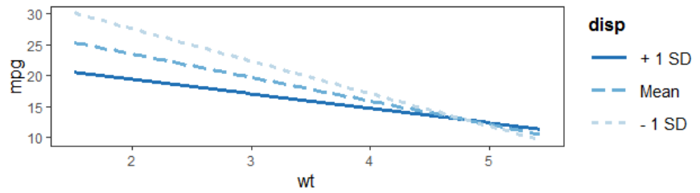

```{r,eval=F,echo=F}
library(jtools)
fitiris <- lm(Petal.Length ~ Petal.Width * Species, data = iris)
interact_plot(fitiris, pred = "Petal.Width", modx = "Species")
```


## The package `interplot`


```{r}
library(interplot)
```

```{r,eval=F,echo=F}
interplot(m = m3d, var1 = "disp", var2 = "wt", hist = TRUE) +
  aes(color = "pink") + theme(legend.position="none") +   
  geom_hline(yintercept = 0, linetype = "dashed")
```

- effect plotted on the y axis - `wt` plotted on the x-axis

```{r,eval=F}
interplot(m = m3a, var1 = "wt", var2 = "disp", hist = TRUE)  
```

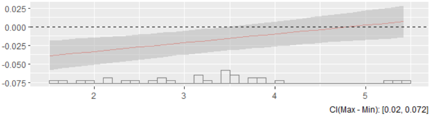

- A more detailed explanation is available in the [**`interplot` vignette**](https://cran.r-project.org/web/packages/interplot/vignettes/interplot-vignette.html)


## Example: object orientation

- `m3` is now a special regression object
- Various functions can be applied to this object

```{r,eval=F}
predict(m3) # Prediction
resid(m3) # Residuals
```

```{r,echo=F}
head(predict(m3)) # Prediction
head(resid(m3)) # Residuals
```


## Make model prediction

```{r}
pre <- predict(m1)
head(mtcars$mpg)
head(pre)
```


## Residual plot - model assumptions violated? 


- the case if a deviation pattern from line 

```{r,eval=pres}
plot(m3,1)
```

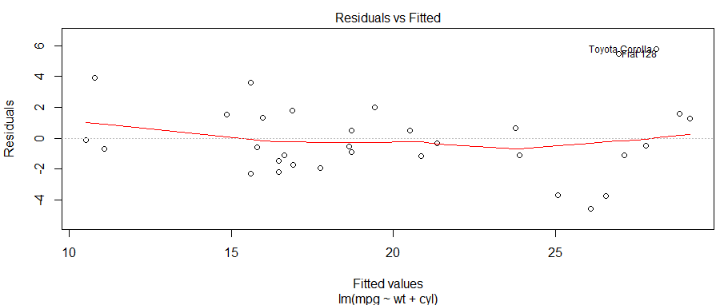

## Residual plot

```{r}
plot(m3,2)
```

- If the residuals are normally distributed, they should be on the same line.


## Regression diagnostic with base-R

```{r,eval=F}
plot(mtcars$wt,mtcars$mpg)
abline(m1)
segments(mtcars$wt, mtcars$mpg, mtcars$wt, pre, col="red")
```

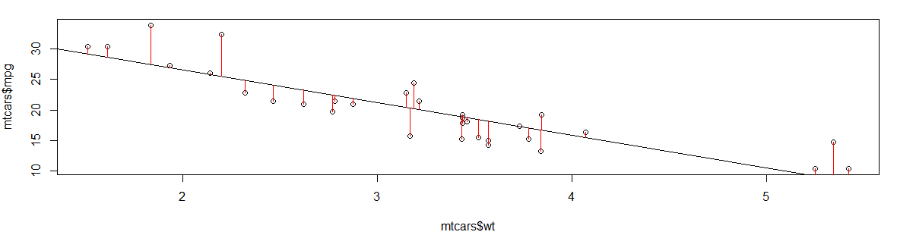

```{r,echo=F,eval=F}
# https://www.r-bloggers.com/marginal-effects-for-regression-models-in-r-rstats-dataviz/
p <- ggpredict(m5, c("wt", "cyl"))
plot(p)
```


## The `visreg`-package

```{r,eval=F}
install.packages("visreg")
```

```{r}
library(visreg)
```

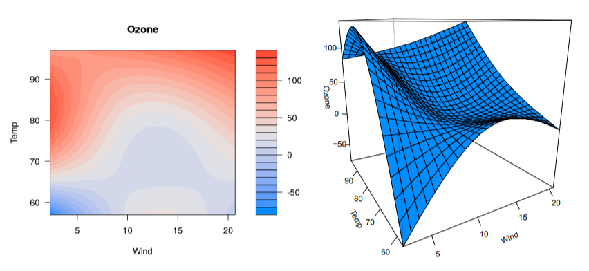

## The `visreg`-package

- The default-argument for `type` is `conditional`.
- Scatterplot of `mpg` and `wt` plus regression line and confidence bands

```{r,eval=F}
visreg(m1, "wt", type = "conditional")
```

```{r,eval=F,echo=F}
visreg(m1, "wt", type = "conditional",
      line=list(col="red"),
       fill=list(col="#473C8B"),points=list(cex=1.5,col=rgb(0,1,0,.5)))
```

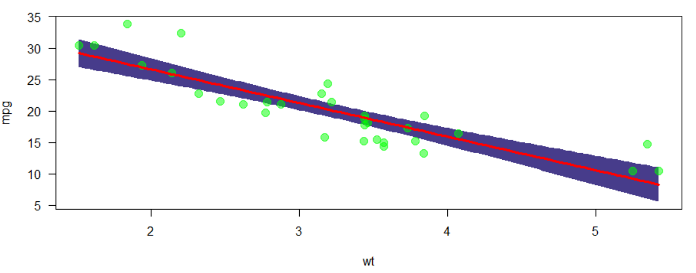

## [Visualisation with `visreg` ](http://myweb.uiowa.edu/pbreheny/publications/visreg.pdf)

- [Second argument](http://pbreheny.github.io/visreg) -  Specification covariate for visualisation
- plot shows the effect on the expected value of the response by moving the x variable away from a reference point on the x-axis (for numeric variables, the mean).

```{r,eval=F}
visreg(m1, "wt", type = "contrast")
```


```{r,echo=F,eval=F}
visreg(m1, "wt", type = "contrast",alpha=.01,
       line=list(col="red"),
       fill=list(col="#473C8B"),points=list(cex=1.5,col=rgb(.4,.4,0,.5)))
```

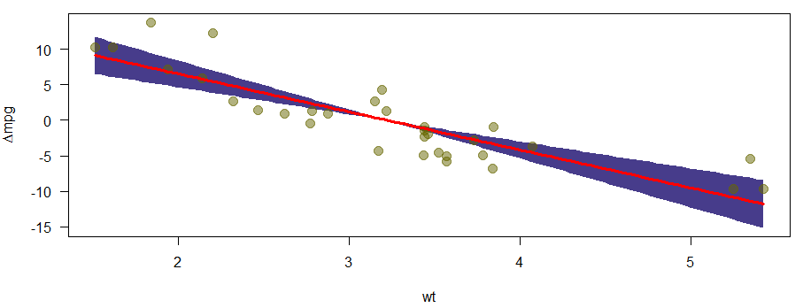

## Regression with factors

- The effects of factors can also be visualized with `visreg`:

```{r}
mtcars$cyl <- as.factor(mtcars$cyl)
m4 <- lm(mpg ~ cyl + wt, data = mtcars)
# summary(m4)
```

```{r,echo=F}
sum_m4 <- summary(m4)
sum_m4$coefficients
```


## Effects of factors


```{r,eval=F}
par(mfrow=c(1,2))
visreg(m4, "cyl", type = "contrast")
visreg(m4, "cyl", type = "conditional")
```

```{r,eval=F,echo=F}
par(mfrow=c(1,2))
visreg(m4, "cyl", type = "contrast",fill=list(col=c("#00FFFF")),points=list(cex=1.5,col=rgb(.4,.4,.4,.5)))
visreg(m4, "cyl", type = "conditional",fill=list(col=c("#00FFFF")),points=list(cex=1.5,col=rgb(.4,.4,.4,.5)))
```

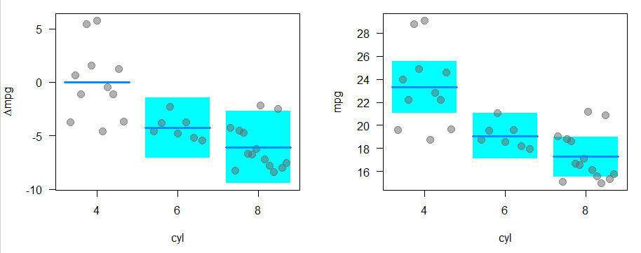

## The package `visreg` - Interactions

```{r}
m5 <- lm(mpg ~ cyl*wt, data = mtcars)
# summary(m5)
```

```{r,echo=F}
sum_m5 <- summary(m5)
sum_m5$coefficients
```


## Control of the graphic output with `layout`.

```{r,eval=pres}
visreg(m5, "wt", by = "cyl",layout=c(3,1))
```


```{r,eval=pres,echo=F}
visreg(m5, "wt", by = "cyl",layout=c(3,1),fill=list(col=c("#00FFFF")),points=list(cex=1.5,col=rgb(.4,.4,.4,.5)))
```

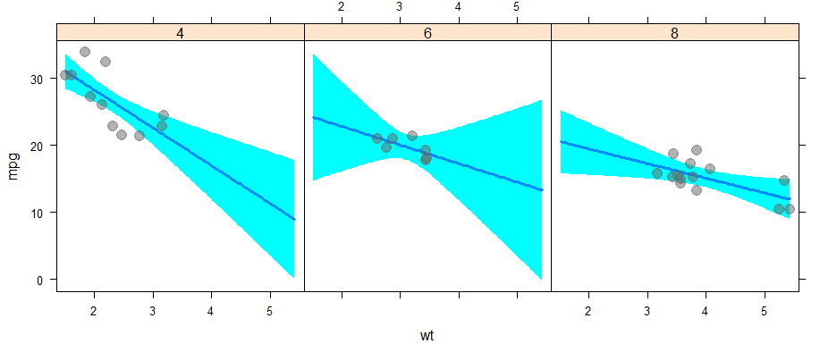

## The package `visreg` - Interactions overlay

```{r}
m6 <- lm(mpg ~ hp + wt * cyl, data = mtcars)
```


```{r,eval=pres}
visreg(m6, "wt", by="cyl", overlay=TRUE, partial=FALSE)
```

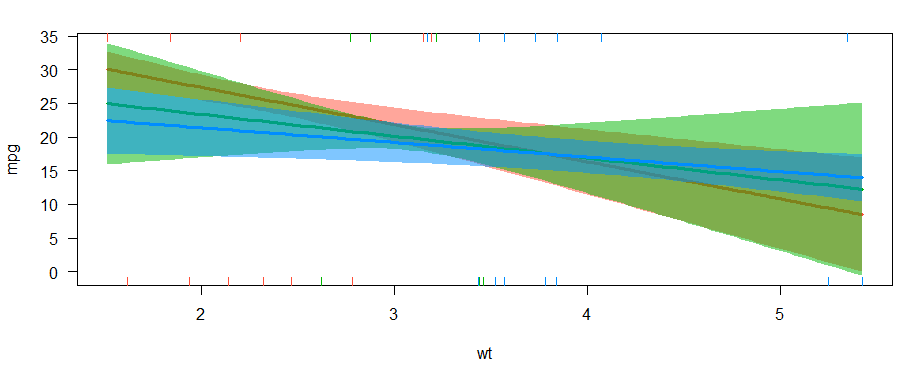

## The package `visreg` - `visreg2d`

```{r}
visreg2d(m6, "wt", "hp", plot.type = "image")
```

## The package `visreg` - `surface`

```{r}
visreg2d(m6, "wt", "hp", plot.type = "persp")
```


## B3A Exercise linear regression

It describes the route of three toy cars that descended ramps at different angles.

- angle: ramp angle
- distance: distance covered by the toy car
- car: type of car (1, 2 or 3)

(a) Read the data set `toycars` into a dataframe `data` and convert the variable `car` of the data set into a factor (`as.factor`).
(b) Create three box plots that display the distance traveled separately by the factor car.

## B3A Exercise linear regression II


(c) For the cars, estimate the parameters of the following linear model using the `lm()` function

$$ distance_i= \beta_0 + \beta_1 \cdot angle_i + \epsilon_i$$

(d) Check the adjustment of the three models by inserting the regression line into a plot of `distance` against `angle`. Does the $$ R^2 $$ each for a good model adjustment?


## Producing nice table output with Package [stargazer](https://cran.r-project.org/web/packages/stargazer/vignettes/stargazer.pdf)


```{r,eval=F,echo=F}
install.packages("stargazer")
```

```{r,eval=F}
library(stargazer)
stargazer(m3, type="html")
```

### Example HTML output:

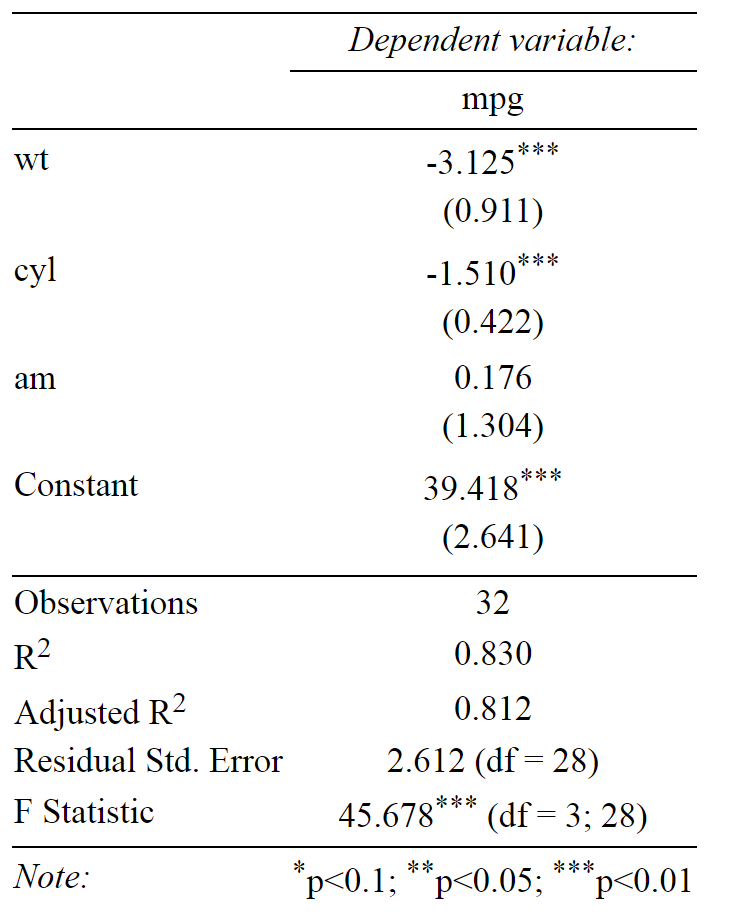

## [Overfitting](https://en.wikipedia.org/wiki/Overfitting).

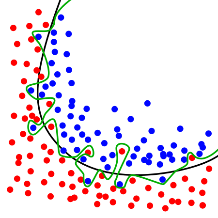

The green line represents an overfitted model and the black line represents a regularized model. While the green line best follows the training data, it is too dependent on that data and it is likely to have a higher error rate on new unseen data, compared to the black line.

<!--
https://en.wikipedia.org/wiki/Overfitting
-->


## Shiny App - Diagnostics for simple linear regression

https://gallery.shinyapps.io/slr_diag/

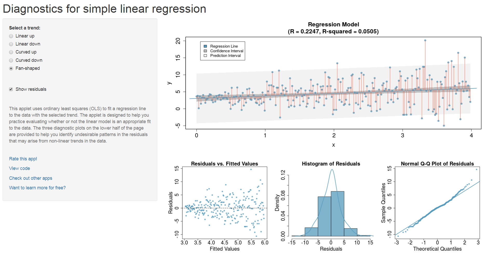

- Shiny App - [Simple Linear Regression](https://gallery.shinyapps.io/simple_regression/)

- Shiny App - [Multicollinearity in multiple regression](figure/https://gallery.shinyapps.io/collinearity/)

## Links - linear regression

-  Regression - [**r-bloggers**](http://www.r-bloggers.com/r-tutorial-series-simple-linear-regression/)

-  The complete book of [**Faraway**](http://cran.r-project.org/doc/contrib/Faraway-PRA.pdf)- very intuitive

-  Good introduction on [**Quick-R**](http://www.statmethods.net/stats/regression.html)

- [**Multiple regression**](https://www.r-bloggers.com/multiple-regression-part-1/)

- [**15 Types of Regression you should know**](https://www.r-bloggers.com/15-types-of-regression-you-should-know/)

- [**`ggeffects` - Create Tidy Data Frames of Marginal Effects for ‘ggplot’ from Model Outputs**](https://strengejacke.github.io/ggeffects/)


<!--
https://www.r-bloggers.com/elegant-regression-results-tables-and-plots-in-r-the-finalfit-package/
https://www.r-bloggers.com/regression-analysis-essentials-for-machine-learning/
https://www.r-bloggers.com/15-types-of-regression-you-should-know/
https://www.r-bloggers.com/marginal-effects-for-regression-models-in-r-rstats-dataviz/
http://pbreheny.github.io/visreg/contrast.html
-->