## Why a part on simple regression

- OLS can be seen as a simple machine learning technique
- Some other machine learning concepts are based on regression (e.g. regularization).
- We would like to remind you how simple regression works in R. 
- We also want to show the constraints
- In a next step we will learn, how to coop with these constraints

<!--
http://enhancedatascience.com/2017/06/29/machine-learning-explained-overfitting/
-->

## Variables of the `mtcars` dataset

Help for the `mtcars` dataset:


```r
?mtcars
```
<!--
displacement - Hubraum
-->
-	 mpg -	 Miles/(US) gallon
-	 cyl -	 Number of cylinders
-	 disp	- Displacement (cu.in.)
-	 hp	- Gross horsepower
-	 drat -	 Rear axle ratio
- wt	- Weight (1000 lbs)
-	 qsec	- 1/4 mile time
-	 vs	- Engine (0 = V-shaped, 1 = straight)
-	 am	-  Transmission (0 = automatic, 1 = manual)
-	 gear	-  Number of forward gears
-	 carb -	 Number of carburetors


## Dataset `mtcars`


                        mpg   cyl    disp    hp   drat      wt    qsec   vs   am   gear   carb
--------------------  -----  ----  ------  ----  -----  ------  ------  ---  ---  -----  -----
Mazda RX4              21.0     6   160.0   110   3.90   2.620   16.46    0    1      4      4
Mazda RX4 Wag          21.0     6   160.0   110   3.90   2.875   17.02    0    1      4      4
Datsun 710             22.8     4   108.0    93   3.85   2.320   18.61    1    1      4      1
Hornet 4 Drive         21.4     6   258.0   110   3.08   3.215   19.44    1    0      3      1
Hornet Sportabout      18.7     8   360.0   175   3.15   3.440   17.02    0    0      3      2
Valiant                18.1     6   225.0   105   2.76   3.460   20.22    1    0      3      1
Duster 360             14.3     8   360.0   245   3.21   3.570   15.84    0    0      3      4
Merc 240D              24.4     4   146.7    62   3.69   3.190   20.00    1    0      4      2
Merc 230               22.8     4   140.8    95   3.92   3.150   22.90    1    0      4      2
Merc 280               19.2     6   167.6   123   3.92   3.440   18.30    1    0      4      4
Merc 280C              17.8     6   167.6   123   3.92   3.440   18.90    1    0      4      4
Merc 450SE             16.4     8   275.8   180   3.07   4.070   17.40    0    0      3      3
Merc 450SL             17.3     8   275.8   180   3.07   3.730   17.60    0    0      3      3
Merc 450SLC            15.2     8   275.8   180   3.07   3.780   18.00    0    0      3      3
Cadillac Fleetwood     10.4     8   472.0   205   2.93   5.250   17.98    0    0      3      4
Lincoln Continental    10.4     8   460.0   215   3.00   5.424   17.82    0    0      3      4
Chrysler Imperial      14.7     8   440.0   230   3.23   5.345   17.42    0    0      3      4
Fiat 128               32.4     4    78.7    66   4.08   2.200   19.47    1    1      4      1
Honda Civic            30.4     4    75.7    52   4.93   1.615   18.52    1    1      4      2
Toyota Corolla         33.9     4    71.1    65   4.22   1.835   19.90    1    1      4      1
Toyota Corona          21.5     4   120.1    97   3.70   2.465   20.01    1    0      3      1
Dodge Challenger       15.5     8   318.0   150   2.76   3.520   16.87    0    0      3      2
AMC Javelin            15.2     8   304.0   150   3.15   3.435   17.30    0    0      3      2
Camaro Z28             13.3     8   350.0   245   3.73   3.840   15.41    0    0      3      4
Pontiac Firebird       19.2     8   400.0   175   3.08   3.845   17.05    0    0      3      2
Fiat X1-9              27.3     4    79.0    66   4.08   1.935   18.90    1    1      4      1
Porsche 914-2          26.0     4   120.3    91   4.43   2.140   16.70    0    1      5      2
Lotus Europa           30.4     4    95.1   113   3.77   1.513   16.90    1    1      5      2
Ford Pantera L         15.8     8   351.0   264   4.22   3.170   14.50    0    1      5      4
Ferrari Dino           19.7     6   145.0   175   3.62   2.770   15.50    0    1      5      6
Maserati Bora          15.0     8   301.0   335   3.54   3.570   14.60    0    1      5      8
Volvo 142E             21.4     4   121.0   109   4.11   2.780   18.60    1    1      4      2


## Distributions of two variables of `mtcars`


```r
par(mfrow=c(1,2))
plot(density(mtcars$wt)); plot(density(mtcars$mpg))
```

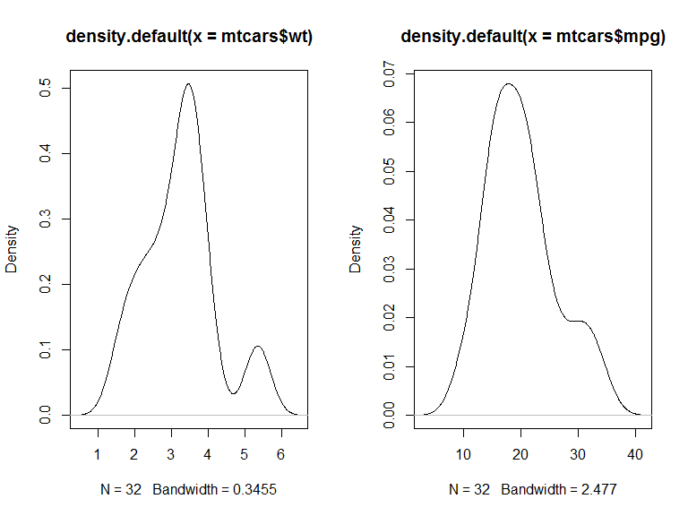<!-- -->


## A simple regression model

### Dependent variable - miles per gallon (mpg)

### Independent variable - weight (wt)


```r
m1 <- lm(mpg ~ wt,data=mtcars)
m1
```

```
## 
## Call:
## lm(formula = mpg ~ wt, data = mtcars)
## 
## Coefficients:
## (Intercept)           wt  
##      37.285       -5.344
```

## Get the model summary 


```r
summary(m1) 
```

```
## 
## Call:
## lm(formula = mpg ~ wt, data = mtcars)
## 
## Residuals:
##     Min      1Q  Median      3Q     Max 
## -4.5432 -2.3647 -0.1252  1.4096  6.8727 
## 
## Coefficients:
##             Estimate Std. Error t value Pr(>|t|)    
## (Intercept)  37.2851     1.8776  19.858  < 2e-16 ***
## wt           -5.3445     0.5591  -9.559 1.29e-10 ***
## ---
## Signif. codes:  0 '***' 0.001 '**' 0.01 '*' 0.05 '.' 0.1 ' ' 1
## 
## Residual standard error: 3.046 on 30 degrees of freedom
## Multiple R-squared:  0.7528,	Adjusted R-squared:  0.7446 
## F-statistic: 91.38 on 1 and 30 DF,  p-value: 1.294e-10
```

## The model formula

### Model without intercept


```r
m2 <- lm(mpg ~ - 1 + wt,data=mtcars)
summary(m2)$coefficients
```

```
##    Estimate Std. Error  t value    Pr(>|t|)
## wt 5.291624  0.5931801 8.920771 4.55314e-10
```

### Adding further variables


```r
m3 <- lm(mpg ~ wt + cyl,data=mtcars)
summary(m3)$coefficients
```

```
##              Estimate Std. Error   t value     Pr(>|t|)
## (Intercept) 39.686261  1.7149840 23.140893 3.043182e-20
## wt          -3.190972  0.7569065 -4.215808 2.220200e-04
## cyl         -1.507795  0.4146883 -3.635972 1.064282e-03
```

## The command `as.formula`


```r
?as.formula
```


```r
class(fo <- mpg ~ wt + cyl)
```

```
## [1] "formula"
```


```r
# The formula object can be used in the regression:
m3 <- lm(fo,data=mtcars)
```


## [Further possibilities to specify the formula](https://cran.r-project.org/web/packages/Formula/vignettes/Formula.pdf)

### Take all available predictors


```r
m3_a<-lm(mpg~.,data=mtcars) 
```

### Interaction effect


```r
# effect of cyl and interaction effect:
m3a<-lm(mpg~wt*cyl,data=mtcars) 

# only interaction effect:
m3b<-lm(mpg~wt:cyl,data=mtcars) 
```


### Take the logarithm


```r
m3d<-lm(mpg~log(wt),data=mtcars) 
```

<!--
https://www.r-bloggers.com/r-tutorial-series-regression-with-interaction-variables/

https://www.r-bloggers.com/interpreting-interaction-coefficient-in-r-part1-lm/
-->

## The command `setdiff`

- We can use the command to create a dataset with only the features, without the dependent variable


```r
names(mtcars)
```

```
##  [1] "mpg"  "cyl"  "disp" "hp"   "drat" "wt"   "qsec" "vs"   "am"   "gear"
## [11] "carb"
```

```r
features <- setdiff(names(mtcars), "mpg")
features
```

```
##  [1] "cyl"  "disp" "hp"   "drat" "wt"   "qsec" "vs"   "am"   "gear" "carb"
```


```r
featdat <- mtcars[,features]
```


## The command `model.matrix`

<!--
- Construct Design Matrices

https://genomicsclass.github.io/book/pages/expressing_design_formula.html
-->

- With `model.matrix` the qualitative variables are automatically dummy encoded 


```r
?model.matrix
```


```r
model.matrix(m3d)
```

```
##                     (Intercept)   log(wt)
## Mazda RX4                     1 0.9631743
## Mazda RX4 Wag                 1 1.0560527
## Datsun 710                    1 0.8415672
## Hornet 4 Drive                1 1.1678274
## Hornet Sportabout             1 1.2354715
## Valiant                       1 1.2412686
## Duster 360                    1 1.2725656
## Merc 240D                     1 1.1600209
## Merc 230                      1 1.1474025
## Merc 280                      1 1.2354715
## Merc 280C                     1 1.2354715
## Merc 450SE                    1 1.4036430
## Merc 450SL                    1 1.3164082
## Merc 450SLC                   1 1.3297240
## Cadillac Fleetwood            1 1.6582281
## Lincoln Continental           1 1.6908336
## Chrysler Imperial             1 1.6761615
## Fiat 128                      1 0.7884574
## Honda Civic                   1 0.4793350
## Toyota Corolla                1 0.6070445
## Toyota Corona                 1 0.9021918
## Dodge Challenger              1 1.2584610
## AMC Javelin                   1 1.2340169
## Camaro Z28                    1 1.3454724
## Pontiac Firebird              1 1.3467736
## Fiat X1-9                     1 0.6601073
## Porsche 914-2                 1 0.7608058
## Lotus Europa                  1 0.4140944
## Ford Pantera L                1 1.1537316
## Ferrari Dino                  1 1.0188473
## Maserati Bora                 1 1.2725656
## Volvo 142E                    1 1.0224509
## attr(,"assign")
## [1] 0 1
```


## Model matrix (II)

- [We can also create a model matrix directly from the formula and data arguments](http://pages.stat.wisc.edu/~st849-1/Rnotes/ModelMatrices.html)
- See `Matrix::sparse.model.matrix` for increased efficiency on large dimension data.


```r
ff <- mpg ~ log(wt):cyl
m <- model.frame(ff, mtcars)
```


```r
(mat <- model.matrix(ff, m))
```

```
##                     (Intercept) log(wt):cyl
## Mazda RX4                     1    5.779046
## Mazda RX4 Wag                 1    6.336316
## Datsun 710                    1    3.366269
## Hornet 4 Drive                1    7.006964
## Hornet Sportabout             1    9.883772
## Valiant                       1    7.447612
## Duster 360                    1   10.180525
## Merc 240D                     1    4.640084
## Merc 230                      1    4.589610
## Merc 280                      1    7.412829
## Merc 280C                     1    7.412829
## Merc 450SE                    1   11.229144
## Merc 450SL                    1   10.531266
## Merc 450SLC                   1   10.637792
## Cadillac Fleetwood            1   13.265825
## Lincoln Continental           1   13.526668
## Chrysler Imperial             1   13.409292
## Fiat 128                      1    3.153829
## Honda Civic                   1    1.917340
## Toyota Corolla                1    2.428178
## Toyota Corona                 1    3.608767
## Dodge Challenger              1   10.067688
## AMC Javelin                   1    9.872135
## Camaro Z28                    1   10.763779
## Pontiac Firebird              1   10.774189
## Fiat X1-9                     1    2.640429
## Porsche 914-2                 1    3.043223
## Lotus Europa                  1    1.656378
## Ford Pantera L                1    9.229853
## Ferrari Dino                  1    6.113084
## Maserati Bora                 1   10.180525
## Volvo 142E                    1    4.089804
## attr(,"assign")
## [1] 0 1
```


<!--
m3c <- lm(y = mtcars$mpg,x=mat[,-1])
-->

 


## A model with interaction effect

<!--
drat - Hinterachsenübersetzung
disp - Hubraum
-->


```r
# disp	-  Displacement (cu.in.)
m3d<-lm(mpg~wt*disp,data=mtcars) 
m3dsum <- summary(m3d)
m3dsum$coefficients
```

```
##                Estimate  Std. Error   t value     Pr(>|t|)
## (Intercept) 44.08199770 3.123062627 14.114990 2.955567e-14
## wt          -6.49567966 1.313382622 -4.945763 3.216705e-05
## disp        -0.05635816 0.013238696 -4.257078 2.101721e-04
## wt:disp      0.01170542 0.003255102  3.596022 1.226988e-03
```


<!--
## [Exploring interactions](https://cran.r-project.org/web/packages/jtools/vignettes/interactions.html)


```r
install.packages("jtools")
```


```r
library(jtools)
interact_plot(m3d, pred = "wt", modx = "disp")
```

- With a continuous moderator (in our case `disp`) you get three lines — 1 standard deviation above and below the mean and the mean itself. 


-->

## Residual plot - model assumptions violated? 


- We have model assumptions violated if points deviate with a pattern from the line 


```r
plot(m3,1)
```

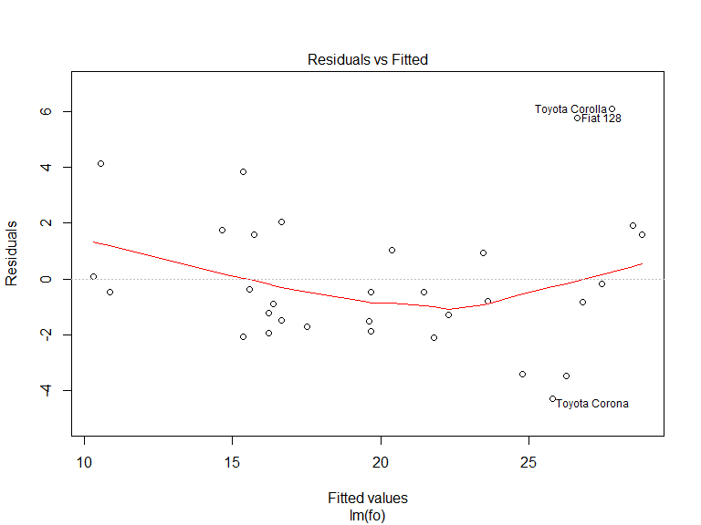<!-- -->


## Residual plot


```r
plot(m3,2)
```

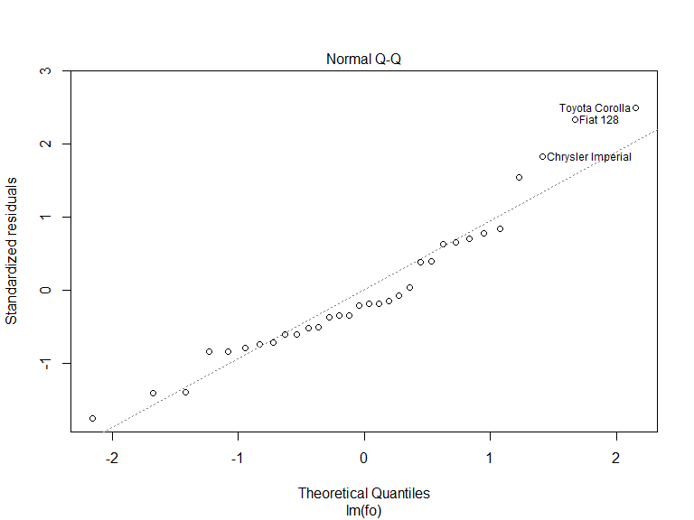<!-- -->

- If the residuals are normally distributed, they should be on the same line.


## Another example for object orientation

- `m3` is now a special regression object
- Various functions can be applied to this object


```r
predict(m3) # Prediction
resid(m3) # Residuals
```


```
##         Mazda RX4     Mazda RX4 Wag        Datsun 710    Hornet 4 Drive 
##          22.27914          21.46545          26.25203          20.38052 
## Hornet Sportabout           Valiant 
##          16.64696          19.59873
```

```
##         Mazda RX4     Mazda RX4 Wag        Datsun 710    Hornet 4 Drive 
##        -1.2791447        -0.4654468        -3.4520262         1.0194838 
## Hornet Sportabout           Valiant 
##         2.0530424        -1.4987281
```


## Make model prediction


```r
pre <- predict(m1)
head(mtcars$mpg)
```

```
## [1] 21.0 21.0 22.8 21.4 18.7 18.1
```

```r
head(pre)
```

```
##         Mazda RX4     Mazda RX4 Wag        Datsun 710    Hornet 4 Drive 
##          23.28261          21.91977          24.88595          20.10265 
## Hornet Sportabout           Valiant 
##          18.90014          18.79325
```

## Regression diagnostic with base-R

### Visualizing residuals


```r
plot(mtcars$wt,mtcars$mpg)
abline(m1)
segments(mtcars$wt, mtcars$mpg, mtcars$wt, pre, col="red")
```


## The mean squared error (mse)

- The [**MSE**](https://en.wikipedia.org/wiki/Mean_squared_error) measures the average of the squares of the errors
- [**The lower the better**](http://r-statistics.co/Linear-Regression.html)


```r
(mse5 <- mean((mtcars$mpg -  pre)^2)) # model 5
```

```
## [1] 8.697561
```

```r
(mse3 <- mean((mtcars$mpg -  predict(m3))^2)) 
```

```
## [1] 5.974124
```

<!--
https://stats.stackexchange.com/questions/107643/how-to-get-the-value-of-mean-squared-error-in-a-linear-regression-in-r
-->

### Package `Metrics` to compute mse


```r
library(Metrics)
mse(mtcars$mpg,predict(m3))
```

```
## [1] 5.974124
```


## The `visreg`-package


```r
install.packages("visreg")
```


```r
library(visreg)
```


## The `visreg`-package

- The default-argument for `type` is `conditional`.
- Scatterplot of `mpg` and `wt` plus regression line and confidence bands


```r
visreg(m1, "wt", type = "conditional")
```


<!--
## [Visualisation with `visreg` ](http://myweb.uiowa.edu/pbreheny/publications/visreg.pdf)

- [Second argument](http://pbreheny.github.io/visreg) -  Specification covariate for visualisation
- plot shows the effect on the expected value of the response by moving the x variable away from a reference point on the x-axis (for numeric variables, the mean).


```r
visreg(m1, "wt", type = "contrast")
```


-->


## Regression with factors

- The effects of factors can also be visualized with `visreg`:


```r
mtcars$cyl <- as.factor(mtcars$cyl)
m4 <- lm(mpg ~ cyl + wt, data = mtcars)
# summary(m4)
```


```
##              Estimate Std. Error   t value     Pr(>|t|)
## (Intercept) 33.990794  1.8877934 18.005569 6.257246e-17
## cyl6        -4.255582  1.3860728 -3.070244 4.717834e-03
## cyl8        -6.070860  1.6522878 -3.674214 9.991893e-04
## wt          -3.205613  0.7538957 -4.252065 2.130435e-04
```


## Effects of factors


```r
par(mfrow=c(1,2))
visreg(m4, "cyl", type = "contrast")
visreg(m4, "cyl", type = "conditional")
```


<!--
## The command `model.matrix`


```r
?model.matrix
```
-->


## The package `visreg` - Interactions


```r
m5 <- lm(mpg ~ cyl*wt, data = mtcars)
# summary(m5)
```


```
##               Estimate Std. Error    t value     Pr(>|t|)
## (Intercept)  39.571196   3.193940 12.3894599 2.058359e-12
## cyl6        -11.162351   9.355346 -1.1931522 2.435843e-01
## cyl8        -15.703167   4.839464 -3.2448150 3.223216e-03
## wt           -5.647025   1.359498 -4.1537586 3.127578e-04
## cyl6:wt       2.866919   3.117330  0.9196716 3.661987e-01
## cyl8:wt       3.454587   1.627261  2.1229458 4.344037e-02
```


## Control of the graphic output with `layout`.


```r
visreg(m5, "wt", by = "cyl",layout=c(3,1))
```

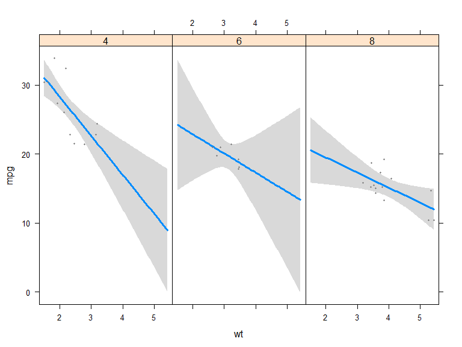<!-- -->


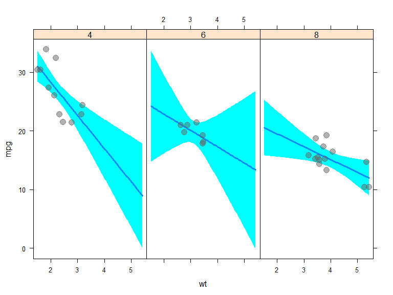<!-- -->


## The package `visreg` - Interactions overlay


```r
m6 <- lm(mpg ~ hp + wt * cyl, data = mtcars)
```


```r
visreg(m6, "wt", by="cyl", overlay=TRUE, partial=FALSE)
```

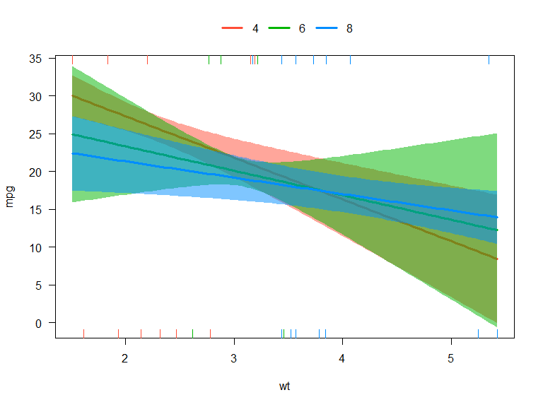<!-- -->


## The package `visreg` - `visreg2d`


```r
visreg2d(m6, "wt", "hp", plot.type = "image")
```

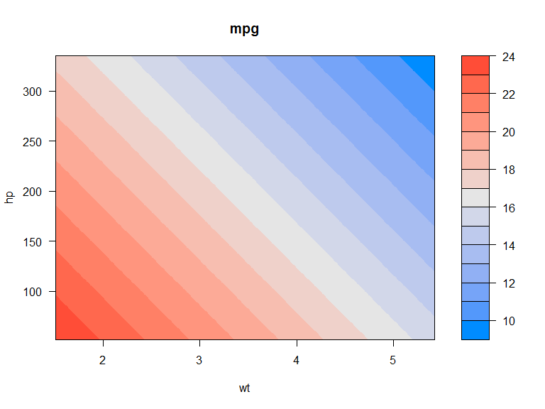<!-- -->

<!--
## The package `visreg` - `surface`


```r
visreg2d(m6, "wt", "hp", plot.type = "persp")
```

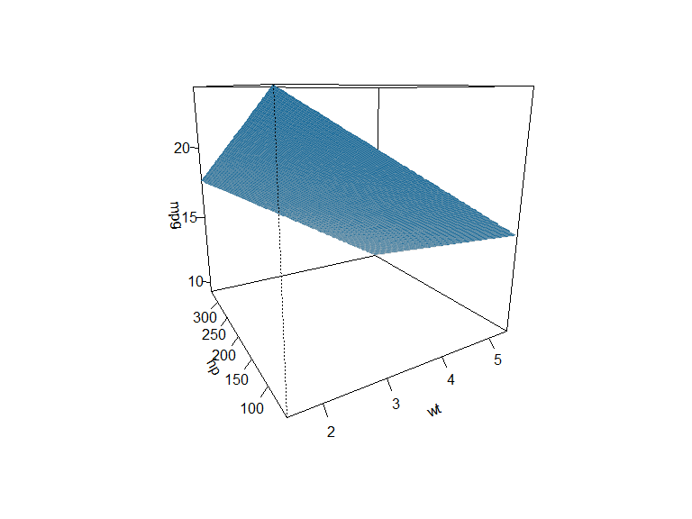<!-- -->
-->

## [The bias-variance tradeoff](https://en.wikipedia.org/wiki/Bias%E2%80%93variance_tradeoff) (I)

- The bias–variance tradeoff is the property of a set of predictive models whereby models with a lower bias in parameter estimation have a higher variance of the parameter estimates across samples, and vice versa. 

[](https://towardsdatascience.com/understanding-the-bias-variance-tradeoff-165e6942b229)

<!--
https://lbelzile.github.io/lineaRmodels/bias-and-variance-tradeoff.html
http://www.sthda.com/english/articles/38-regression-model-validation/157-cross-validation-essentials-in-r/
https://daviddalpiaz.github.io/r4sl/biasvariance-tradeoff.html
-->

## The bias-variance tradeoff (II)

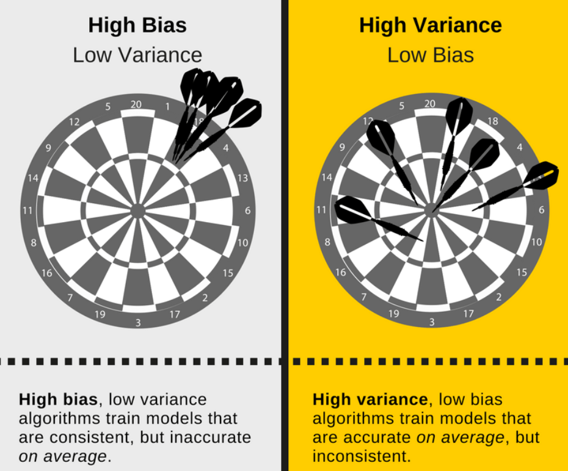

## Exercise: regression Ames housing data

1) Install the package `AmesHousing` and create a [**processed version**](https://cran.r-project.org/web/packages/AmesHousing/AmesHousing.pdf) of the Ames housing data with (at least) the variables `Sale_Price`, `Gr_Liv_Area` and `TotRms_AbvGrd`
2) Create a regression model with `Sale_Price` as dependent and `Gr_Liv_Area` and `TotRms_AbvGrd` as independent variables. Then create seperated models for the two independent variables. Compare the results. What do you think?

<!--
lm(Sale_Price ~ Gr_Liv_Area + TotRms_AbvGrd, data = ames_data)
-->

## [The Ames Iowa Housing Data](http://ww2.amstat.org/publications/jse)


```r
ames_data <- AmesHousing::make_ames()
```

### Some Variables

- `Gr_Liv_Area`: Above grade (ground) living area square feet
- `TotRms_AbvGrd`: Total rooms above grade (does not include bathrooms
- `MS_SubClass`: Identifies the type of dwelling involved in the sale.
- `MS_Zoning`: Identifies the general zoning classification of the sale.
- `Lot_Frontage`: Linear feet of street connected to property
- `Lot_Area`: Lot size in square feet
- `Street`: Type of road access to property
- `Alley`: Type of alley access to property
- `Lot_Shape`: General shape of property
- `Land_Contour`: Flatness of the propert


## Multicollinearity

- As p increases we are more likely to capture multiple features that have some multicollinearity. 
- When multicollinearity exists, we often see high variability in our coefficient terms. 
- E.g. we have a correlation of 0.801 between `Gr_Liv_Area` and `TotRms_AbvGrd` 
- Both variables are strongly correlated to the response variable (`Sale_Price`).


```r
ames_data <- AmesHousing::make_ames()
cor(ames_data[,c("Sale_Price","Gr_Liv_Area","TotRms_AbvGrd")])
```

```
##               Sale_Price Gr_Liv_Area TotRms_AbvGrd
## Sale_Price     1.0000000   0.7067799     0.4954744
## Gr_Liv_Area    0.7067799   1.0000000     0.8077721
## TotRms_AbvGrd  0.4954744   0.8077721     1.0000000
```

## A correlation plot

<!--
https://www.r-bloggers.com/variable-importance-plot-and-variable-selection/
-->


```r
library(corrplot)
corrplot(cor(ames_data[,c("Sale_Price","Gr_Liv_Area","TotRms_AbvGrd")]))
```

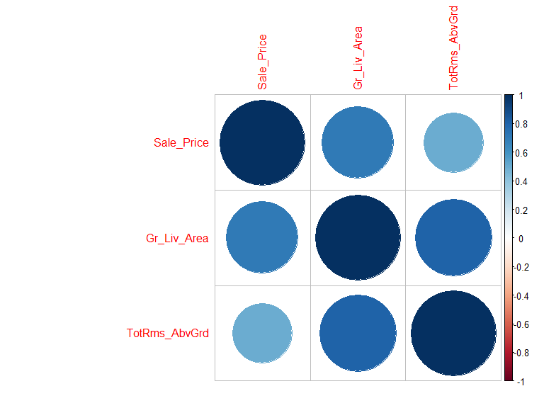<!-- -->


## Multicollinearity


```r
lm(Sale_Price ~ Gr_Liv_Area + TotRms_AbvGrd, data = ames_data)
```

```
## 
## Call:
## lm(formula = Sale_Price ~ Gr_Liv_Area + TotRms_AbvGrd, data = ames_data)
## 
## Coefficients:
##   (Intercept)    Gr_Liv_Area  TotRms_AbvGrd  
##       42767.6          139.4       -11025.9
```

- When we fit a model with both these variables we get a positive coefficient for `Gr_Liv_Area` but a negative coefficient for `TotRms_AbvGrd`, suggesting one has a positive impact to Sale_Price and the other a negative impact.

## Seperated models

- If we refit the model with each variable independently, they both show a positive impact. 
- The `Gr_Liv_Area` effect is now smaller and the `TotRms_AbvGrd` is positive with a much larger magnitude.


```r
lm(Sale_Price ~ Gr_Liv_Area, data = ames_data)$coefficients
```

```
## (Intercept) Gr_Liv_Area 
##   13289.634     111.694
```


```r
lm(Sale_Price ~ TotRms_AbvGrd, data = ames_data)$coefficients
```

```
##   (Intercept) TotRms_AbvGrd 
##      18665.40      25163.83
```

- This is a common result when collinearity exists. 
- Coefficients for correlated features become over-inflated and can fluctuate significantly. 


## Consequences

- One consequence of these large fluctuations in the coefficient terms is [**overfitting**](https://en.wikipedia.org/wiki/Overfitting), which means we have high variance in the bias-variance tradeoff space. 
- We can use tools such as [**variance inflaction factors**](https://en.wikipedia.org/wiki/Variance_inflation_factor) (Myers, 1994) to identify and remove those strongly correlated variables, but it is not always clear which variable(s) to remove. 
- Nor do we always wish to remove variables as this may be removing signal in our data.


## The problem - [Overfitting](https://elitedatascience.com/overfitting-in-machine-learning#examples)

- Our model doesn’t generalize well from our training data to unseen data.


<!--
## [The Signal and the Noise](https://en.wikipedia.org/wiki/The_Signal_and_the_Noise)

- In predictive modeling, you can think of the “signal” as the true underlying pattern that you wish to learn from the data.
- “Noise,” on the other hand, refers to the irrelevant information or randomness in a dataset.


-->


<!--
https://cran.r-project.org/web/packages/keras/vignettes/tutorial_basic_regression.html
-->


<!--
https://cran.r-project.org/web/packages/keras/vignettes/tutorial_overfit_underfit.html

https://www.r-bloggers.com/machine-learning-explained-overfitting/
-->


<!--
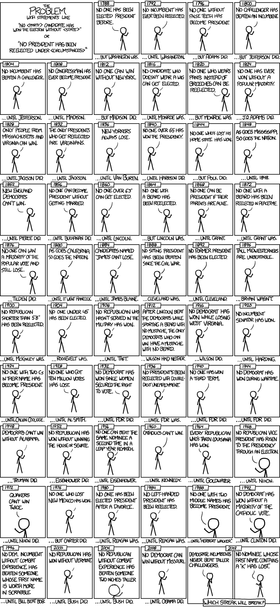
-->

<!--
## [Overfitting](https://en.wikipedia.org/wiki/Overfitting).


The green line represents an overfitted model and the black line represents a regularized model. While the green line best follows the training data, it is too dependent on that data and it is likely to have a higher error rate on new unseen data, compared to the black line.
-->

<!--
https://en.wikipedia.org/wiki/Overfitting
-->

## What can be done against overvitting

- [**Cross Validation **](http://www.sthda.com/english/articles/38-regression-model-validation/157-cross-validation-essentials-in-r/)
- Train with more data
- Remove features
- Regularization - e.g. ridge and lasso regression
- Ensembling - e.g. bagging and boosting

<!--
## [Cross-validation](https://elitedatascience.com/overfitting-in-machine-learning#examples)

- [**3 fold cross validation**](https://www.statmethods.net/stats/regression.html)


-->


## Cross validation

- Cross-validation is a powerful preventative measure against overfitting.

- Use your initial training data to generate multiple mini train-test splits. Use these splits to tune your model.


### Necessary packages


```r
library(tidyverse)
library(caret)
```

<!--
### Swiss Fertility and Socioeconomic Indicators


```r
data("swiss")
```
-->

## [Cross Validation in R](http://www.sthda.com/english/articles/38-regression-model-validation/157-cross-validation-essentials-in-r/)


### Split data into training and testing dataset


```r
training.samples <- ames_data$Sale_Price %>%
createDataPartition(p = 0.8, list = FALSE)
train.data  <- ames_data[training.samples, ]
test.data <- ames_data[-training.samples, ]
```


### Build the model and make predictions

<!--
# Make predictions and compute the R2, RMSE and MAE
-->


```r
model <- lm(Sale_Price ~ Gr_Liv_Area + TotRms_AbvGrd, 
            data = train.data)
# Make predictions and compute the R2, RMSE and MAE
(predictions <- model %>% predict(test.data))
```

```
##         1         2         3         4         5         6         7         8 
## 195972.89 113910.73 216297.69 208286.80 253239.40 124729.26 123142.35 174473.16 
##         9        10        11        12        13        14        15        16 
## 129673.13 179661.17 116825.18 207615.39 179355.98 161533.64 136951.61 164936.36 
##        17        18        19        20        21        22        23        24 
## 308445.96 169285.15 181003.94 181309.12 247166.37 117618.64 208057.91 274113.52 
##        25        26        27        28        29        30        31        32 
## 174167.98 170383.79 288884.09 162082.96 142688.94 145771.24 213169.63 153293.85 
##        33        34        35        36        37        38        39        40 
## 179935.83 169910.75 141071.50 160129.82 132038.26 177814.84  89740.69 238423.02 
##        41        42        43        44        45        46        47        48 
## 241398.52 215687.33 147800.66 113361.41 179417.03 205677.54 107425.71 206409.95 
##        49        50        51        52        53        54        55        56 
## 148075.32 178150.54 134540.72 113636.07 111164.14 219730.94 185917.29 144672.60 
##        57        58        59        60        61        62        63        64 
## 122699.84 144809.93 222904.76 267597.98 206577.80 216908.06 220524.39 164554.89 
##        65        66        67        68        69        70        71        72 
## 227665.54 154728.20 215336.38 317586.01 259770.18 217838.84 184299.86 188892.78 
##        73        74        75        76        77        78        79        80 
## 188785.98 178669.34 225910.77 191166.34 109516.18 126407.74 126407.74 126407.74 
##        81        82        83        84        85        86        87        88 
## 168506.93 161258.98 204487.33 355153.32 206577.80 196766.34 203800.68 199100.95 
##        89        90        91        92        93        94        95        96 
## 166202.85 299626.33 203007.23 157352.70 182102.58 168400.13 161884.58 198582.15 
##        97        98        99       100       101       102       103       104 
## 263920.60 222614.86 202290.06 288197.44 178669.34 211079.16 178562.53 203907.49 
##       105       106       107       108       109       110       111       112 
## 214451.36 244969.09 136402.29 155658.98 178837.19 248814.32 215855.18 117511.83 
##       113       114       115       116       117       118       119       120 
## 125446.43 256291.17 209568.53 170109.13 216740.20 163349.45 179111.85 171085.68 
##       121       122       123       124       125       126       127       128 
## 171284.05 163181.60 208363.09 109516.18 208775.08 171146.72 182682.42 115390.84 
##       129       130       131       132       133       134       135       136 
## 144779.41 169498.76 144504.75 168979.97 134723.81 154224.64 127750.52 262150.55 
##       137       138       139       140       141       142       143       144 
## 169224.11 122531.99 110309.64 153843.17 122531.99 180347.82 159778.87 249684.06 
##       145       146       147       148       149       150       151       152 
## 204258.43 130558.16  86063.31 172077.51 142368.52 225224.13 182957.08 166279.13 
##       153       154       155       156       157       158       159       160 
## 100894.93 136539.62 202213.77 127506.38 196964.72 219318.95 224369.62 202229.01 
##       161       162       163       164       165       166       167       168 
## 161228.46 199680.79 124179.94 120121.09 230656.27 195393.04 152469.87 165180.50 
##       169       170       171       172       173       174       175       176 
## 188114.57 260517.88 210804.50 164997.40  96332.52 253071.55 216602.87 186253.00 
##       177       178       179       180       181       182       183       184 
## 118473.14 118473.14 125232.82 134205.02 138080.77  97873.67 156223.54 131656.80 
##       185       186       187       188       189       190       191       192 
## 122699.84 188450.27 148899.30 208958.17 148349.98 231892.24 152988.67 194080.79 
##       193       194       195       196       197       198       199       200 
## 241459.56 132587.58 159641.54 189274.25  80570.12 113254.61 118030.63 167606.67 
##       201       202       203       204       205       206       207       208 
## 195530.37 209904.24 237003.96 202183.25 275761.48 189457.34 140690.04 112125.45 
##       209       210       211       212       213       214       215       216 
## 192676.97 236286.79 210697.69 192814.30 159504.21 267811.59 184055.72 224430.67 
##       217       218       219       220       221       222       223       224 
## 318348.94 148182.13 347417.09 177708.03 189167.44 130558.16 137561.97 113361.41 
##       225       226       227       228       229       230       231       232 
## 296513.51 185810.48 284626.87 236347.84 323628.52 266499.34 184849.18 298878.64 
##       233       234       235       236       237       238       239       240 
## 161976.15 204761.99 218983.24 203495.50 217228.48 266346.77 289708.07 282963.67 
##       241       242       243       244       245       246       247       248 
## 185261.16 175815.93 214756.54 175815.93 219807.22 215138.01 201466.08 204929.84 
##       249       250       251       252       253       254       255       256 
## 207096.60 212925.49 116108.01 176090.59 185841.01 204685.71 173954.36 350545.15 
##       257       258       259       260       261       262       263       264 
## 172397.93 172397.93 129673.13 166752.17 123142.35 121326.54 108173.41 193668.80 
##       265       266       267       268       269       270       271       272 
## 146259.51 230381.61 115833.35 175510.75 152195.21 106937.44 166477.51 165149.97 
##       273       274       275       276       277       278       279       280 
## 184818.65 131900.93 114322.72  99216.45 125751.62 130527.63 281224.15 140003.39 
##       281       282       283       284       285       286       287       288 
## 215061.72 209324.40  90671.48 173420.28 207340.73 164081.86 105945.61 197346.18 
##       289       290       291       292       293       294       295       296 
## 189518.39 179493.31 133686.22 141971.77 133686.22 127063.87 111545.60 169636.09 
##       297       298       299       300       301       302       303       304 
##  94303.10 204899.32 258915.68 258045.94 156284.58 175846.46 143436.63 191852.99 
##       305       306       307       308       309       310       311       312 
## 126819.73 206577.80 138630.09 235935.85 224979.99 129627.37 138019.73 166614.84 
##       313       314       315       316       317       318       319       320 
## 129627.37 134479.67 137912.92 109516.18 258427.41 238270.45 314595.28 160435.00 
##       321       322       323       324       325       326       327       328 
## 110508.01 234699.88 117069.32 100177.76 160572.33 200504.77 207340.73 133243.71 
##       329       330       331       332       333       334       335       336 
## 211659.00 213825.76 201084.61 209736.39 139011.56 137699.30 102924.35 208881.88 
##       337       338       339       340       341       342       343       344 
## 158619.19 203938.01 172077.51 201084.61 237827.94 225086.80 227802.87 121433.35 
##       345       346       347       348       349       350       351       352 
## 171665.52 163837.72 126545.07 201191.42 322148.42 244526.58 325001.82 274021.95 
##       353       354       355       356       357       358       359       360 
## 166752.17 169666.62 161533.64 190647.55 173862.79 219486.80 161808.30 168506.93 
##       361       362       363       364       365       366       367       368 
## 146091.66 231373.44 160984.32 200642.10 300831.78 286717.34 248646.47 194431.74 
##       369       370       371       372       373       374       375       376 
## 179767.97 210392.51 147831.18 204899.32 135746.17 203724.40 172443.73 162525.47 
##       377       378       379       380       381       382       383       384 
## 281773.47 311467.22 126758.69 178501.48 198612.67 127063.87 164280.23 172397.93 
##       385       386       387       388       389       390       391       392 
## 125965.23 126712.92  93479.12  94028.44 124729.26 222065.54 149723.28 122531.99 
##       393       394       395       396       397       398       399       400 
## 206242.10 130558.16 123493.29 136402.29 120945.07 123798.48 169498.76 176777.24 
##       401       402       403       404       405       406       407       408 
## 146976.68 112262.78 173206.67 108142.88 164280.23 281987.08 218220.31 131870.41 
##       409       410       411       412       413       414       415       416 
## 155109.66 205662.25 106220.27 128879.68 122531.99 113636.07 168537.46 241352.75 
##       417       418       419       420       421       422       423       424 
## 240299.88 312321.72 155155.42 133411.56 171802.85 305333.14 312306.44 251286.26 
##       425       426       427       428       429       430       431       432 
## 157352.70 161152.17 180866.61 215061.72 251728.77 126819.73 126819.73 213825.76 
##       433       434       435       436       437       438       439       440 
## 200642.10 120472.04 133686.22 111988.12 266423.05 205997.96 242115.69 151432.28 
##       441       442       443       444       445       446       447       448 
## 111545.60 102924.35 132557.06 145359.25 121509.63 268742.38 135654.60 164387.04 
##       449       450       451       452       453       454       455       456 
## 209568.53 218662.82 127613.19 116108.01 139179.41 173237.19 281529.33 287098.80 
##       457       458       459       460       461       462       463       464 
## 140827.37 136707.47 176365.25 100177.76 118061.15 189136.92 164905.84 252003.43 
##       465       466       467       468       469       470       471       472 
## 250019.77 223789.78 140247.53 185841.01 233524.96 317799.63 294453.57 318928.79 
##       473       474       475       476       477       478       479       480 
## 180012.11 142200.66 130222.45 109516.18 129673.13 244557.10 227940.20 225803.97 
##       481       482       483       484       485       486       487       488 
## 167026.83 167576.15 167576.15 160435.00 167026.83 185703.68 164631.18 227116.22 
##       489       490       491       492       493       494       495       496 
## 209049.74 185367.97 175098.76 286488.44 196140.74 186222.47 220829.57 188694.41 
##       497       498       499       500       501       502       503       504 
## 206272.62 157993.59 115390.84 131488.94 309620.89 278172.37 334340.24 281163.10 
##       505       506       507       508       509       510       511       512 
## 261418.14 211308.06 150333.64 144291.13 103031.16 109516.18 192509.12  93448.60 
##       513       514       515       516       517       518       519       520 
## 135547.79 150821.92 384770.79 129291.67 149448.62 100208.28 169880.23 161533.64 
##       521       522       523       524       525       526       527       528 
## 143680.77 143406.11 133686.22 137638.26 173801.75 214176.70 109516.18 177463.89 
##       529       530       531       532       533       534       535       536 
## 130939.62 196278.07 197147.81 114078.59 215397.43 164936.36 165378.87 125827.90 
##       537       538       539       540       541       542       543       544 
## 130283.50 168781.59 204899.32 224018.68 202015.40 179249.18 124866.59 223301.51 
##       545       546       547       548       549       550       551       552 
## 137363.60 155155.42 145603.39 190205.04 198887.33 170322.74 185566.35 189136.92 
##       553       554       555       556       557       558       559       560 
## 223682.98 209538.01 220936.38 159443.17 159611.02 181034.46 147251.34 194157.08 
##       561       562       563       564       565       566       567       568 
## 264027.40 138080.77 138080.77 203251.36 199863.88 204350.00 174335.83 221790.88 
##       569       570       571       572       573       574       575       576 
## 124897.11 156177.78  90045.88 110309.64 152027.36  90976.66  67935.78 108249.69 
##       577       578       579       580       581       582       583       584 
## 214130.94 215748.37 198658.44 136264.96 129673.13 194706.40 145496.58 136646.43
```


## Model with cross validation

- Loocv: [**leave one out cross validation**](https://machinelearningmastery.com/how-to-estimate-model-accuracy-in-r-using-the-caret-package/)


```r
train.control <- caret::trainControl(method = "LOOCV")
```


```r
# Train the model
model2 <- train(Sale_Price ~ Gr_Liv_Area + TotRms_AbvGrd, 
               data = train.data, method = "lm",
               trControl = train.control)
model2 %>% predict(test.data)
```


<!--
## [k-fold cross validation](https://www.analyticsvidhya.com/blog/2018/05/improve-model-performance-cross-validation-in-python-r/)
-->

<!--
## Summarize the results


```r
summary(model2)$coefficients
```


## [The bias variance tradeoff](https://elitedatascience.com/bias-variance-tradeoff)

{ height=70% }
-->

<!--
## Good literature for linear regression in R

### Useful PDF document:

J H Maindonald - [**Using R for Data Analysis and Graphics
Introduction, Code and Commentary**](https://cran.r-project.org/doc/contrib/usingR.pdf)

-  Introduction to R 
-  Data analysis
-  Statistical models
-  Inference concepts
-  Regression with one predictor
-  Multiple linear regression
-  Extending the linear model
-  ...
-->


<!--
Anwendung log Transformation
wann wird dies gemacht
-->

## Links - linear regression

-  Regression - [**r-bloggers**](http://www.r-bloggers.com/r-tutorial-series-simple-linear-regression/)

-  The complete book of [**Faraway**](http://cran.r-project.org/doc/contrib/Faraway-PRA.pdf)- very intuitive

-  Good introduction on [**Quick-R**](http://www.statmethods.net/stats/regression.html)

- [**Multiple regression**](https://www.r-bloggers.com/multiple-regression-part-1/)

- [**15 Types of Regression you should know**](https://www.r-bloggers.com/15-types-of-regression-you-should-know/)

- [**`ggeffects` - Create Tidy Data Frames of Marginal Effects for ‘ggplot’ from Model Outputs**](https://strengejacke.github.io/ggeffects/)


- [**Machine learning iteration**](https://elitedatascience.com/machine-learning-iteration)


<!--
https://www.dataquest.io/blog/statistical-learning-for-predictive-modeling-r/

https://www.r-bloggers.com/example-of-overfitting/

https://blog.minitab.com/blog/adventures-in-statistics-2/the-danger-of-overfitting-regression-models


https://statisticsbyjim.com/regression/overfitting-regression-models/

https://towardsdatascience.com/overfitting-vs-underfitting-a-complete-example-d05dd7e19765

https://www.analyticsvidhya.com/blog/2016/12/practical-guide-to-implement-machine-learning-with-caret-package-in-r-with-practice-problem/


https://statisticsbyjim.com/regression/overfitting-regression-models/
-->

## Nice table output with [`stargazer`](https://cran.r-project.org/web/packages/stargazer/vignettes/stargazer.pdf)


```r
library(stargazer)
stargazer(m3, type="html")
```

### Example HTML output:


## Shiny App - Diagnostics for linear regression

<!--
https://gallery.shinyapps.io/slr_diag/
-->

- Shiny App - [**Simple Linear Regression**](https://gallery.shinyapps.io/simple_regression/)

- Shiny App - [**Multicollinearity in multiple regression**](figure/https://gallery.shinyapps.io/collinearity/)


[](https://gallery.shinyapps.io/slr_diag/)

<!--
https://www.r-bloggers.com/elegant-regression-results-tables-and-plots-in-r-the-finalfit-package/
https://www.r-bloggers.com/regression-analysis-essentials-for-machine-learning/
https://www.r-bloggers.com/15-types-of-regression-you-should-know/
https://www.r-bloggers.com/marginal-effects-for-regression-models-in-r-rstats-dataviz/
http://pbreheny.github.io/visreg/contrast.html
-->

<!--
ToDo:

How to compute the mean squared error:
https://stats.stackexchange.com/questions/107643/how-to-get-the-value-of-mean-squared-error-in-a-linear-regression-in-r

http://r-statistics.co/Linear-Regression.html

Colinearity
https://journal.r-project.org/archive/2017/RJ-2017-048/RJ-2017-048.pdf
-->

<!--
http://r-statistics.co/Linear-Regression.html
https://machinelearningmastery.com/linear-regression-in-r/
https://journal.r-project.org/archive/2017/RJ-2017-048/RJ-2017-048.pdf
https://cran.r-project.org/web/packages/Metrics/Metrics.pdf
-->


<!--
ToDo Liste

Den Effekt von cross validation zeigen
-->
