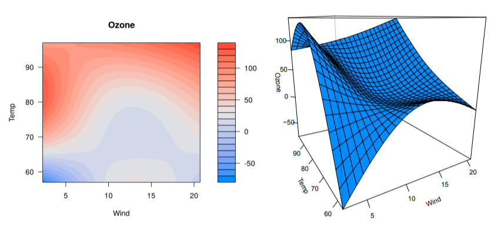
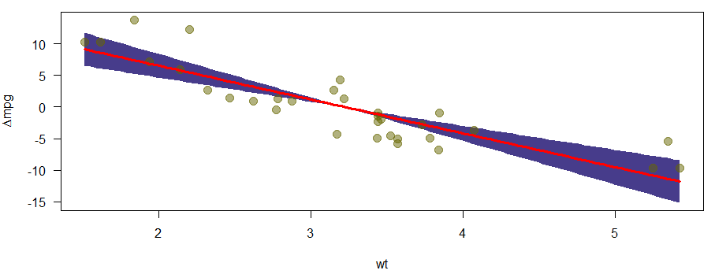

## Why a part on simple regression

- OLS can be seen as a simple machine learning technique
- Some other machine learning concepts are based on regression (e.g. regularization).
- We would like to remind you how simple regression works in R. 
- We also want to show the constraints
- In a next step we will learn, how to coop with these constraints

<!--
http://enhancedatascience.com/2017/06/29/machine-learning-explained-overfitting/
-->

## Variables of the `mtcars` dataset

Help for the `mtcars` dataset:


```r
?mtcars
```
<!--
displacement - Hubraum
-->
-	 mpg -	 Miles/(US) gallon
-	 cyl -	 Number of cylinders
-	 disp	- Displacement (cu.in.)
-	 hp	- Gross horsepower
-	 drat -	 Rear axle ratio
- wt	- Weight (1000 lbs)
-	 qsec	- 1/4 mile time
-	 vs	- Engine (0 = V-shaped, 1 = straight)
-	 am	-  Transmission (0 = automatic, 1 = manual)
-	 gear	-  Number of forward gears
-	 carb -	 Number of carburetors


## Dataset `mtcars`


                        mpg   cyl    disp    hp   drat      wt    qsec   vs   am   gear   carb
--------------------  -----  ----  ------  ----  -----  ------  ------  ---  ---  -----  -----
Mazda RX4              21.0     6   160.0   110   3.90   2.620   16.46    0    1      4      4
Mazda RX4 Wag          21.0     6   160.0   110   3.90   2.875   17.02    0    1      4      4
Datsun 710             22.8     4   108.0    93   3.85   2.320   18.61    1    1      4      1
Hornet 4 Drive         21.4     6   258.0   110   3.08   3.215   19.44    1    0      3      1
Hornet Sportabout      18.7     8   360.0   175   3.15   3.440   17.02    0    0      3      2
Valiant                18.1     6   225.0   105   2.76   3.460   20.22    1    0      3      1
Duster 360             14.3     8   360.0   245   3.21   3.570   15.84    0    0      3      4
Merc 240D              24.4     4   146.7    62   3.69   3.190   20.00    1    0      4      2
Merc 230               22.8     4   140.8    95   3.92   3.150   22.90    1    0      4      2
Merc 280               19.2     6   167.6   123   3.92   3.440   18.30    1    0      4      4
Merc 280C              17.8     6   167.6   123   3.92   3.440   18.90    1    0      4      4
Merc 450SE             16.4     8   275.8   180   3.07   4.070   17.40    0    0      3      3
Merc 450SL             17.3     8   275.8   180   3.07   3.730   17.60    0    0      3      3
Merc 450SLC            15.2     8   275.8   180   3.07   3.780   18.00    0    0      3      3
Cadillac Fleetwood     10.4     8   472.0   205   2.93   5.250   17.98    0    0      3      4
Lincoln Continental    10.4     8   460.0   215   3.00   5.424   17.82    0    0      3      4
Chrysler Imperial      14.7     8   440.0   230   3.23   5.345   17.42    0    0      3      4
Fiat 128               32.4     4    78.7    66   4.08   2.200   19.47    1    1      4      1
Honda Civic            30.4     4    75.7    52   4.93   1.615   18.52    1    1      4      2
Toyota Corolla         33.9     4    71.1    65   4.22   1.835   19.90    1    1      4      1
Toyota Corona          21.5     4   120.1    97   3.70   2.465   20.01    1    0      3      1
Dodge Challenger       15.5     8   318.0   150   2.76   3.520   16.87    0    0      3      2
AMC Javelin            15.2     8   304.0   150   3.15   3.435   17.30    0    0      3      2
Camaro Z28             13.3     8   350.0   245   3.73   3.840   15.41    0    0      3      4
Pontiac Firebird       19.2     8   400.0   175   3.08   3.845   17.05    0    0      3      2
Fiat X1-9              27.3     4    79.0    66   4.08   1.935   18.90    1    1      4      1
Porsche 914-2          26.0     4   120.3    91   4.43   2.140   16.70    0    1      5      2
Lotus Europa           30.4     4    95.1   113   3.77   1.513   16.90    1    1      5      2
Ford Pantera L         15.8     8   351.0   264   4.22   3.170   14.50    0    1      5      4
Ferrari Dino           19.7     6   145.0   175   3.62   2.770   15.50    0    1      5      6
Maserati Bora          15.0     8   301.0   335   3.54   3.570   14.60    0    1      5      8
Volvo 142E             21.4     4   121.0   109   4.11   2.780   18.60    1    1      4      2


## Distributions of two variables of `mtcars`


```r
par(mfrow=c(1,2))
plot(density(mtcars$wt)); plot(density(mtcars$mpg))
```

<!-- -->


## A simple regression model

### Dependent variable - miles per gallon (mpg)

### Independent variable - weight (wt)


```r
m1 <- lm(mpg ~ wt,data=mtcars)
m1
```

```
## 
## Call:
## lm(formula = mpg ~ wt, data = mtcars)
## 
## Coefficients:
## (Intercept)           wt  
##      37.285       -5.344
```

## Get the model summary 


```r
summary(m1) 
```

```
## 
## Call:
## lm(formula = mpg ~ wt, data = mtcars)
## 
## Residuals:
##     Min      1Q  Median      3Q     Max 
## -4.5432 -2.3647 -0.1252  1.4096  6.8727 
## 
## Coefficients:
##             Estimate Std. Error t value Pr(>|t|)    
## (Intercept)  37.2851     1.8776  19.858  < 2e-16 ***
## wt           -5.3445     0.5591  -9.559 1.29e-10 ***
## ---
## Signif. codes:  0 '***' 0.001 '**' 0.01 '*' 0.05 '.' 0.1 ' ' 1
## 
## Residual standard error: 3.046 on 30 degrees of freedom
## Multiple R-squared:  0.7528,	Adjusted R-squared:  0.7446 
## F-statistic: 91.38 on 1 and 30 DF,  p-value: 1.294e-10
```

## The model formula

### Model without intercept


```r
m2 <- lm(mpg ~ - 1 + wt,data=mtcars)
summary(m2)$coefficients
```

```
##    Estimate Std. Error  t value    Pr(>|t|)
## wt 5.291624  0.5931801 8.920771 4.55314e-10
```

### Adding further variables


```r
m3 <- lm(mpg ~ wt + cyl,data=mtcars)
summary(m3)$coefficients
```

```
##              Estimate Std. Error   t value     Pr(>|t|)
## (Intercept) 39.686261  1.7149840 23.140893 3.043182e-20
## wt          -3.190972  0.7569065 -4.215808 2.220200e-04
## cyl         -1.507795  0.4146883 -3.635972 1.064282e-03
```

## The command `as.formula`


```r
?as.formula
```


```r
class(fo <- mpg ~ wt + cyl)
```

```
## [1] "formula"
```


```r
# The formula object can be used in the regression:
m3 <- lm(fo,data=mtcars)
```


## [Further possibilities to specify the formula](https://cran.r-project.org/web/packages/Formula/vignettes/Formula.pdf)

### Take all available predictors


```r
m3_a<-lm(mpg~.,data=mtcars) 
```

### Interaction effect


```r
# effect of cyl and interaction effect:
m3a<-lm(mpg~wt*cyl,data=mtcars) 

# only interaction effect:
m3b<-lm(mpg~wt:cyl,data=mtcars) 
```


### Take the logarithm


```r
m3d<-lm(mpg~log(wt),data=mtcars) 
```

<!--
https://www.r-bloggers.com/r-tutorial-series-regression-with-interaction-variables/

https://www.r-bloggers.com/interpreting-interaction-coefficient-in-r-part1-lm/
-->

## The command `setdiff`

- We can use the command to create a dataset with only the features, without the dependent variable


```r
names(mtcars)
```

```
##  [1] "mpg"  "cyl"  "disp" "hp"   "drat" "wt"   "qsec" "vs"   "am"   "gear"
## [11] "carb"
```

```r
features <- setdiff(names(mtcars), "mpg")
features
```

```
##  [1] "cyl"  "disp" "hp"   "drat" "wt"   "qsec" "vs"   "am"   "gear" "carb"
```


```r
featdat <- mtcars[,features]
```


## The command `model.matrix`

<!--
- Construct Design Matrices

https://genomicsclass.github.io/book/pages/expressing_design_formula.html
-->

- With `model.matrix` the qualitative variables are automatically dummy encoded 


```r
?model.matrix
```


```r
model.matrix(m3d)
```

```
##                     (Intercept)   log(wt)
## Mazda RX4                     1 0.9631743
## Mazda RX4 Wag                 1 1.0560527
## Datsun 710                    1 0.8415672
## Hornet 4 Drive                1 1.1678274
## Hornet Sportabout             1 1.2354715
## Valiant                       1 1.2412686
## Duster 360                    1 1.2725656
## Merc 240D                     1 1.1600209
## Merc 230                      1 1.1474025
## Merc 280                      1 1.2354715
## Merc 280C                     1 1.2354715
## Merc 450SE                    1 1.4036430
## Merc 450SL                    1 1.3164082
## Merc 450SLC                   1 1.3297240
## Cadillac Fleetwood            1 1.6582281
## Lincoln Continental           1 1.6908336
## Chrysler Imperial             1 1.6761615
## Fiat 128                      1 0.7884574
## Honda Civic                   1 0.4793350
## Toyota Corolla                1 0.6070445
## Toyota Corona                 1 0.9021918
## Dodge Challenger              1 1.2584610
## AMC Javelin                   1 1.2340169
## Camaro Z28                    1 1.3454724
## Pontiac Firebird              1 1.3467736
## Fiat X1-9                     1 0.6601073
## Porsche 914-2                 1 0.7608058
## Lotus Europa                  1 0.4140944
## Ford Pantera L                1 1.1537316
## Ferrari Dino                  1 1.0188473
## Maserati Bora                 1 1.2725656
## Volvo 142E                    1 1.0224509
## attr(,"assign")
## [1] 0 1
```


## Model matrix (II)

- [We can also create a model matrix directly from the formula and data arguments](http://pages.stat.wisc.edu/~st849-1/Rnotes/ModelMatrices.html)
- See `Matrix::sparse.model.matrix` for increased efficiency on large dimension data.


```r
ff <- mpg ~ log(wt):cyl
m <- model.frame(ff, mtcars)
```


```r
(mat <- model.matrix(ff, m))
```

```
##                     (Intercept) log(wt):cyl
## Mazda RX4                     1    5.779046
## Mazda RX4 Wag                 1    6.336316
## Datsun 710                    1    3.366269
## Hornet 4 Drive                1    7.006964
## Hornet Sportabout             1    9.883772
## Valiant                       1    7.447612
## Duster 360                    1   10.180525
## Merc 240D                     1    4.640084
## Merc 230                      1    4.589610
## Merc 280                      1    7.412829
## Merc 280C                     1    7.412829
## Merc 450SE                    1   11.229144
## Merc 450SL                    1   10.531266
## Merc 450SLC                   1   10.637792
## Cadillac Fleetwood            1   13.265825
## Lincoln Continental           1   13.526668
## Chrysler Imperial             1   13.409292
## Fiat 128                      1    3.153829
## Honda Civic                   1    1.917340
## Toyota Corolla                1    2.428178
## Toyota Corona                 1    3.608767
## Dodge Challenger              1   10.067688
## AMC Javelin                   1    9.872135
## Camaro Z28                    1   10.763779
## Pontiac Firebird              1   10.774189
## Fiat X1-9                     1    2.640429
## Porsche 914-2                 1    3.043223
## Lotus Europa                  1    1.656378
## Ford Pantera L                1    9.229853
## Ferrari Dino                  1    6.113084
## Maserati Bora                 1   10.180525
## Volvo 142E                    1    4.089804
## attr(,"assign")
## [1] 0 1
```


<!--
m3c <- lm(y = mtcars$mpg,x=mat[,-1])
-->

 


## A model with interaction effect

<!--
drat - Hinterachsenübersetzung
disp - Hubraum
-->


```r
# disp	-  Displacement (cu.in.)
m3d<-lm(mpg~wt*disp,data=mtcars) 
m3dsum <- summary(m3d)
m3dsum$coefficients
```

```
##                Estimate  Std. Error   t value     Pr(>|t|)
## (Intercept) 44.08199770 3.123062627 14.114990 2.955567e-14
## wt          -6.49567966 1.313382622 -4.945763 3.216705e-05
## disp        -0.05635816 0.013238696 -4.257078 2.101721e-04
## wt:disp      0.01170542 0.003255102  3.596022 1.226988e-03
```


<!--
## [Exploring interactions](https://cran.r-project.org/web/packages/jtools/vignettes/interactions.html)


```r
install.packages("jtools")
```


```r
library(jtools)
interact_plot(m3d, pred = "wt", modx = "disp")
```

- With a continuous moderator (in our case `disp`) you get three lines — 1 standard deviation above and below the mean and the mean itself. 


-->

## Residual plot - model assumptions violated? 


- We have model assumptions violated if points deviate with a pattern from the line 


```r
plot(m3,1)
```

<!-- -->


## Residual plot


```r
plot(m3,2)
```

<!-- -->

- If the residuals are normally distributed, they should be on the same line.


## Another example for object orientation

- `m3` is now a special regression object
- Various functions can be applied to this object


```r
predict(m3) # Prediction
resid(m3) # Residuals
```


```
##         Mazda RX4     Mazda RX4 Wag        Datsun 710    Hornet 4 Drive 
##          22.27914          21.46545          26.25203          20.38052 
## Hornet Sportabout           Valiant 
##          16.64696          19.59873
```

```
##         Mazda RX4     Mazda RX4 Wag        Datsun 710    Hornet 4 Drive 
##        -1.2791447        -0.4654468        -3.4520262         1.0194838 
## Hornet Sportabout           Valiant 
##         2.0530424        -1.4987281
```


## Make model prediction


```r
pre <- predict(m1)
head(mtcars$mpg)
```

```
## [1] 21.0 21.0 22.8 21.4 18.7 18.1
```

```r
head(pre)
```

```
##         Mazda RX4     Mazda RX4 Wag        Datsun 710    Hornet 4 Drive 
##          23.28261          21.91977          24.88595          20.10265 
## Hornet Sportabout           Valiant 
##          18.90014          18.79325
```

## Regression diagnostic with base-R

### Visualizing residuals


```r
plot(mtcars$wt,mtcars$mpg)
abline(m1)
segments(mtcars$wt, mtcars$mpg, mtcars$wt, pre, col="red")
```


## The mean squared error (mse)

- The [**MSE**](https://en.wikipedia.org/wiki/Mean_squared_error) measures the average of the squares of the errors
- [**The lower the better**](http://r-statistics.co/Linear-Regression.html)


```r
(mse5 <- mean((mtcars$mpg -  pre)^2)) # model 5
```

```
## [1] 8.697561
```

```r
(mse3 <- mean((mtcars$mpg -  predict(m3))^2)) 
```

```
## [1] 5.974124
```

<!--
https://stats.stackexchange.com/questions/107643/how-to-get-the-value-of-mean-squared-error-in-a-linear-regression-in-r
-->

### Package `Metrics` to compute mse


```r
library(Metrics)
mse(mtcars$mpg,predict(m3))
```

```
## [1] 5.974124
```


## The `visreg`-package


```r
install.packages("visreg")
```


```r
library(visreg)
```



## The `visreg`-package

- The default-argument for `type` is `conditional`.
- Scatterplot of `mpg` and `wt` plus regression line and confidence bands


```r
visreg(m1, "wt", type = "conditional")
```


<!--
## [Visualisation with `visreg` ](http://myweb.uiowa.edu/pbreheny/publications/visreg.pdf)

- [Second argument](http://pbreheny.github.io/visreg) -  Specification covariate for visualisation
- plot shows the effect on the expected value of the response by moving the x variable away from a reference point on the x-axis (for numeric variables, the mean).


```r
visreg(m1, "wt", type = "contrast")
```



-->


## Regression with factors

- The effects of factors can also be visualized with `visreg`:


```r
mtcars$cyl <- as.factor(mtcars$cyl)
m4 <- lm(mpg ~ cyl + wt, data = mtcars)
# summary(m4)
```


```
##              Estimate Std. Error   t value     Pr(>|t|)
## (Intercept) 33.990794  1.8877934 18.005569 6.257246e-17
## cyl6        -4.255582  1.3860728 -3.070244 4.717834e-03
## cyl8        -6.070860  1.6522878 -3.674214 9.991893e-04
## wt          -3.205613  0.7538957 -4.252065 2.130435e-04
```


## Effects of factors


```r
par(mfrow=c(1,2))
visreg(m4, "cyl", type = "contrast")
visreg(m4, "cyl", type = "conditional")
```


<!--
## The command `model.matrix`


```r
?model.matrix
```
-->


## The package `visreg` - Interactions


```r
m5 <- lm(mpg ~ cyl*wt, data = mtcars)
# summary(m5)
```


```
##               Estimate Std. Error    t value     Pr(>|t|)
## (Intercept)  39.571196   3.193940 12.3894599 2.058359e-12
## cyl6        -11.162351   9.355346 -1.1931522 2.435843e-01
## cyl8        -15.703167   4.839464 -3.2448150 3.223216e-03
## wt           -5.647025   1.359498 -4.1537586 3.127578e-04
## cyl6:wt       2.866919   3.117330  0.9196716 3.661987e-01
## cyl8:wt       3.454587   1.627261  2.1229458 4.344037e-02
```


## Control of the graphic output with `layout`.


```r
visreg(m5, "wt", by = "cyl",layout=c(3,1))
```

<!-- -->


<!-- -->


## The package `visreg` - Interactions overlay


```r
m6 <- lm(mpg ~ hp + wt * cyl, data = mtcars)
```


```r
visreg(m6, "wt", by="cyl", overlay=TRUE, partial=FALSE)
```

<!-- -->


## The package `visreg` - `visreg2d`


```r
visreg2d(m6, "wt", "hp", plot.type = "image")
```

<!-- -->

<!--
## The package `visreg` - `surface`


```r
visreg2d(m6, "wt", "hp", plot.type = "persp")
```

<!-- -->
-->

## [The bias-variance tradeoff](https://en.wikipedia.org/wiki/Bias%E2%80%93variance_tradeoff) (I)

- The bias–variance tradeoff is the property of a set of predictive models whereby models with a lower bias in parameter estimation have a higher variance of the parameter estimates across samples, and vice versa. 

[](https://towardsdatascience.com/understanding-the-bias-variance-tradeoff-165e6942b229)

<!--
https://lbelzile.github.io/lineaRmodels/bias-and-variance-tradeoff.html
http://www.sthda.com/english/articles/38-regression-model-validation/157-cross-validation-essentials-in-r/
https://daviddalpiaz.github.io/r4sl/biasvariance-tradeoff.html
-->

## The bias-variance tradeoff (II)


## Exercise: regression Ames housing data

1) Install the package `AmesHousing` and create a [**processed version**](https://cran.r-project.org/web/packages/AmesHousing/AmesHousing.pdf) of the Ames housing data with (at least) the variables `Sale_Price`, `Gr_Liv_Area` and `TotRms_AbvGrd`
2) Create a regression model with `Sale_Price` as dependent and `Gr_Liv_Area` and `TotRms_AbvGrd` as independent variables. Then create seperated models for the two independent variables. Compare the results. What do you think?

<!--
lm(Sale_Price ~ Gr_Liv_Area + TotRms_AbvGrd, data = ames_data)
-->

## [The Ames Iowa Housing Data](http://ww2.amstat.org/publications/jse)


```r
ames_data <- AmesHousing::make_ames()
```

### Some Variables

- `Gr_Liv_Area`: Above grade (ground) living area square feet
- `TotRms_AbvGrd`: Total rooms above grade (does not include bathrooms
- `MS_SubClass`: Identifies the type of dwelling involved in the sale.
- `MS_Zoning`: Identifies the general zoning classification of the sale.
- `Lot_Frontage`: Linear feet of street connected to property
- `Lot_Area`: Lot size in square feet
- `Street`: Type of road access to property
- `Alley`: Type of alley access to property
- `Lot_Shape`: General shape of property
- `Land_Contour`: Flatness of the propert


## Multicollinearity

- As p increases we are more likely to capture multiple features that have some multicollinearity. 
- When multicollinearity exists, we often see high variability in our coefficient terms. 
- E.g. we have a correlation of 0.801 between `Gr_Liv_Area` and `TotRms_AbvGrd` 
- Both variables are strongly correlated to the response variable (`Sale_Price`).


```r
ames_data <- AmesHousing::make_ames()
cor(ames_data[,c("Sale_Price","Gr_Liv_Area","TotRms_AbvGrd")])
```

```
##               Sale_Price Gr_Liv_Area TotRms_AbvGrd
## Sale_Price     1.0000000   0.7067799     0.4954744
## Gr_Liv_Area    0.7067799   1.0000000     0.8077721
## TotRms_AbvGrd  0.4954744   0.8077721     1.0000000
```

## A correlation plot

<!--
https://www.r-bloggers.com/variable-importance-plot-and-variable-selection/
-->


```r
library(corrplot)
corrplot(cor(ames_data[,c("Sale_Price","Gr_Liv_Area","TotRms_AbvGrd")]))
```

<!-- -->


## Multicollinearity


```r
lm(Sale_Price ~ Gr_Liv_Area + TotRms_AbvGrd, data = ames_data)
```

```
## 
## Call:
## lm(formula = Sale_Price ~ Gr_Liv_Area + TotRms_AbvGrd, data = ames_data)
## 
## Coefficients:
##   (Intercept)    Gr_Liv_Area  TotRms_AbvGrd  
##       42767.6          139.4       -11025.9
```

- When we fit a model with both these variables we get a positive coefficient for `Gr_Liv_Area` but a negative coefficient for `TotRms_AbvGrd`, suggesting one has a positive impact to Sale_Price and the other a negative impact.

## Seperated models

- If we refit the model with each variable independently, they both show a positive impact. 
- The `Gr_Liv_Area` effect is now smaller and the `TotRms_AbvGrd` is positive with a much larger magnitude.


```r
lm(Sale_Price ~ Gr_Liv_Area, data = ames_data)$coefficients
```

```
## (Intercept) Gr_Liv_Area 
##   13289.634     111.694
```


```r
lm(Sale_Price ~ TotRms_AbvGrd, data = ames_data)$coefficients
```

```
##   (Intercept) TotRms_AbvGrd 
##      18665.40      25163.83
```

- This is a common result when collinearity exists. 
- Coefficients for correlated features become over-inflated and can fluctuate significantly. 


## Consequences

- One consequence of these large fluctuations in the coefficient terms is [**overfitting**](https://en.wikipedia.org/wiki/Overfitting), which means we have high variance in the bias-variance tradeoff space. 
- We can use tools such as [**variance inflaction factors**](https://en.wikipedia.org/wiki/Variance_inflation_factor) (Myers, 1994) to identify and remove those strongly correlated variables, but it is not always clear which variable(s) to remove. 
- Nor do we always wish to remove variables as this may be removing signal in our data.


## The problem - [Overfitting](https://elitedatascience.com/overfitting-in-machine-learning#examples)

- Our model doesn’t generalize well from our training data to unseen data.


<!--
## [The Signal and the Noise](https://en.wikipedia.org/wiki/The_Signal_and_the_Noise)

- In predictive modeling, you can think of the “signal” as the true underlying pattern that you wish to learn from the data.
- “Noise,” on the other hand, refers to the irrelevant information or randomness in a dataset.


-->


<!--
https://cran.r-project.org/web/packages/keras/vignettes/tutorial_basic_regression.html
-->


<!--
https://cran.r-project.org/web/packages/keras/vignettes/tutorial_overfit_underfit.html

https://www.r-bloggers.com/machine-learning-explained-overfitting/
-->


<!--

-->

<!--
## [Overfitting](https://en.wikipedia.org/wiki/Overfitting).


The green line represents an overfitted model and the black line represents a regularized model. While the green line best follows the training data, it is too dependent on that data and it is likely to have a higher error rate on new unseen data, compared to the black line.
-->

<!--
https://en.wikipedia.org/wiki/Overfitting
-->

## What can be done against overvitting

- [**Cross Validation **](http://www.sthda.com/english/articles/38-regression-model-validation/157-cross-validation-essentials-in-r/)
- Train with more data
- Remove features
- Regularization - e.g. ridge and lasso regression
- Ensembling - e.g. bagging and boosting

<!--
## [Cross-validation](https://elitedatascience.com/overfitting-in-machine-learning#examples)

- [**3 fold cross validation**](https://www.statmethods.net/stats/regression.html)


-->


## Cross validation

- Cross-validation is a powerful preventative measure against overfitting.

- Use your initial training data to generate multiple mini train-test splits. Use these splits to tune your model.


### Necessary packages


```r
library(tidyverse)
library(caret)
```

<!--
### Swiss Fertility and Socioeconomic Indicators


```r
data("swiss")
```
-->

## [Cross Validation in R](http://www.sthda.com/english/articles/38-regression-model-validation/157-cross-validation-essentials-in-r/)


### Split data into training and testing dataset


```r
training.samples <- ames_data$Sale_Price %>%
createDataPartition(p = 0.8, list = FALSE)
train.data  <- ames_data[training.samples, ]
test.data <- ames_data[-training.samples, ]
```


### Build the model and make predictions

<!--
# Make predictions and compute the R2, RMSE and MAE
-->


```r
model <- lm(Sale_Price ~ Gr_Liv_Area + TotRms_AbvGrd, 
            data = train.data)
# Make predictions and compute the R2, RMSE and MAE
(predictions <- model %>% predict(test.data))
```

```
##         1         2         3         4         5         6         7 
## 194959.65 167534.88 215846.67 359912.37 108825.40 150576.54 243599.53 
##         8         9        10        11        12        13        14 
## 303273.99 278790.01 135662.74 153162.68 199170.59 128888.57 113059.26 
##        15        16        17        18        19        20        21 
## 275261.79 169064.38 173908.58 152128.95 123739.20 206555.11 203145.11 
##        22        23        24        25        26        27        28 
## 181788.86 136650.64 139026.91 124090.20 174801.18 172333.25 152457.04 
##        29        30        31        32        33        34        35 
## 175579.21 138721.74 159631.68 139896.60 131970.49 194395.14 215537.87 
##        36        37        38        39        40        41        42 
## 188749.99 146647.85 115363.15 184821.31 198346.73 120703.12 115599.57 
##        43        44        45        46        47        48        49 
## 150294.28 125642.62 178001.31 110518.95 227583.26 117293.12 176612.94 
##        50        51        52        53        54        55        56 
## 108825.40 265852.01 229677.27 145637.04 124113.12 143119.64 219187.93 
##        57        58        59        60        61        62        63 
## 155420.74 181411.31 145400.61 226171.97 215728.46 204884.48 141002.71 
##        64        65        66        67        68        69        70 
## 207661.22 142013.53 183081.94 174518.93 151774.31 128301.14 108825.40 
##        71        72        73        74        75        76        77 
## 179717.77 104873.80 353115.29 220690.88 246822.57 325808.73 212741.85 
##        78        79        80        81        82        83        84 
## 203568.49 216411.19 236661.32 200723.00 160924.75 173508.11 159067.17 
##        85        86        87        88        89        90        91 
## 161512.18 150645.28 239155.80 163064.60 302003.84 317058.76 292056.09 
##        92        93        94        95        96        97        98 
## 252398.97 309037.35 181247.26 201451.56 222620.84 176731.15 159513.47 
##        99       100       101       102       103       104       105 
## 178424.69 201756.74 182986.64 145965.13 150317.20 178706.95 191408.52 
##       106       107       108       109       110       111       112 
## 108825.40 258303.45 208931.38 164147.79 206673.32 339570.58 171391.18 
##       113       114       115       116       117       118       119 
## 321010.36 204556.39 113059.26 186255.51 263265.87 122373.74 156667.98 
##       120       121       122       123       124       125       126 
## 186469.02 206532.19 174450.18 143707.07 169110.21 111625.06 132016.32 
##       127       128       129       130       131       132       133 
## 124067.29 182139.87 152056.57 120703.12 256182.89 168827.95 120985.37 
##       134       135       136       137       138       139       140 
## 103016.22 141025.63 160478.45 158384.44 244728.56 170098.11 131806.44 
##       141       142       143       144       145       146       147 
## 156996.07 168663.91 101322.67  99369.79 196489.15 134064.50 173344.07 
##       148       149       150       151       152       153       154 
## 196065.76 112612.96 157373.62 234830.28 159254.13 180682.75 198770.12 
##       155       156       157       158       159       160       161 
## 122537.79 107978.63 147517.54 224737.77 193006.77  94548.50 151610.27 
##       162       163       164       165       166       167       168 
## 149447.51 213611.53 245765.93 146811.90 165063.31 147517.54 341756.26 
##       169       170       171       172       173       174       175 
## 341756.26 203709.62 178470.52 191172.09 181247.26 156126.38 126607.60 
##       176       177       178       179       180       181       182 
## 115881.83  96005.62 225443.42 237980.94 219233.76 161229.93 235486.46 
##       183       184       185       186       187       188       189 
## 119387.13 205120.90 171086.01 167134.41 122373.74 200440.75 140201.77 
##       190       191       192       193       194       195       196 
## 182517.42 145846.91 136650.64 243061.57 223986.30 219470.19 145824.00 
##       197       198       199       200       201       202       203 
## 202698.80 212860.06 159631.68 104450.42 173626.32 187620.96 187620.96 
##       204       205       206       207       208       209       210 
## 156572.68 182422.12 228689.37 202439.46 263357.53 161935.57 225561.63 
##       211       212       213       214       215       216       217 
## 225607.46 153139.77 131806.44 108825.40 126184.22 139004.00 126184.22 
##       218       219       220       221       222       223       224 
## 148600.74 323432.46 264722.98 237180.00 201451.56 166993.28 211731.03 
##       225       226       227       228       229       230       231 
## 203991.88 201333.35 197050.03 288573.71 259455.40 241673.20 183387.11 
##       232       233       234       235       236       237       238 
## 186610.15 211940.91 207920.56 156103.47 128419.36 112494.75 115599.57 
##       239       240       241       242       243       244       245 
## 175884.38 315975.56 183200.15 163301.02 192678.68 185034.82 185080.65 
##       246       247       248       249       250       251       252 
## 162641.21 193994.66 304521.23 115599.57 166661.56 214763.48 133263.56 
##       253       254       255       256       257       258       259 
## 162358.95 164594.10 144107.54 135498.70 176025.51 140037.73 208462.16 
##       260       261       262       263       264       265       266 
## 142860.30 142696.26 136650.64 226690.66 134064.50 117129.07 131711.14 
##       267       268       269       270       271       272       273 
## 113764.90  98240.76 132416.79 126866.94 415753.45 161088.80 155725.91 
##       274       275       276       277       278       279       280 
## 281212.11 124185.50 131665.31 156126.38 117033.77 145682.87 170426.20 
##       281       282       283       284       285       286       287 
## 198793.04  73096.97 190607.58 188326.61 108096.85  94006.91 101650.76 
##       288       289       290       291       292       293       294 
## 114070.08 128865.66 147376.41 109553.96 167370.84 204133.00 164594.10 
##       295       296       297       298       299       300       301 
## 139168.04 201123.47 121645.19 140342.90 154173.50 189173.38 184916.61 
##       302       303       304       305       306       307       308 
## 119268.92 206768.62 108825.40 253409.78 197946.26 217704.26 132206.91 
##       309       310       311       312       313       314       315 
## 178024.22 197335.92 246094.01 151328.01 119856.35 131711.14 146647.85 
##       316       317       318       319       320       321       322 
## 138180.14 110354.90 135498.70 143424.81 200322.53 199944.98 396441.75 
##       323       324       325       326       327       328       329 
## 229112.76 109508.13 103157.35 154573.97 213306.36 331781.96 205120.90 
##       330       331       332       333       334       335       336 
## 183741.75 182235.16 128182.93 114871.02  93324.18 238991.76 185221.78 
##       337       338       339       340       341       342       343 
## 205826.55 156572.68 193243.19 150904.63 285705.31 140438.20 186140.93 
##       344       345       346       347       348       349       350 
## 219680.06 168099.39 207237.83 234334.51 107955.72 128182.93 166711.02 
##       351       352       353       354       355       356       357 
## 122091.49 179717.77 205967.68 249999.78 308591.05 214057.83 308613.96 
##       358       359       360       361       362       363       364 
## 240120.79 264959.41 284622.11 172379.08 161207.01 144813.18 224901.82 
##       365       366       367       368       369       370       371 
## 223349.40 232522.76 292807.56 177741.97 179317.30 189714.98 162900.55 
##       372       373       374       375       376       377       378 
## 162477.17 201333.35 172543.13 213752.66 194959.65 164452.97 314495.53 
##       379       380       381       382       383       384       385 
## 214130.22 135780.96 332182.43 205639.59 174850.65 192655.76 178542.91 
##       386       387       388       389       390       391       392 
## 176872.28 266908.66 126771.64 122537.79 143119.64 134674.84  94266.25 
##       393       394       395       396       397       398       399 
## 193758.24 168263.44 297136.72 191313.22 158502.65 206509.27 123502.77 
##       400       401       402       403       404       405       406 
##  97229.95 121244.72 176822.81 204155.92 106166.88 143943.50 123361.64 
##       407       408       409       410       411       412       413 
## 121832.15 139755.47 122373.74 294760.45 150198.98 123502.77 123666.82 
##       414       415       416       417       418       419       420 
## 153868.33 172920.68 175319.87 126043.09 155443.66 163747.32 217822.47 
##       421       422       423       424       425       426       427 
## 152479.96 168122.31 132111.61 102779.79 157819.93 204110.09 203545.58 
##       428       429       430       431       432       433       434 
## 119974.56 218386.99 309083.18 194254.01 159795.73 144553.84 179435.51 
##       435       436       437       438       439       440       441 
## 263830.38 230146.49 214717.65 116469.26 108825.40 305463.30 102051.23 
##       442       443       444       445       446       447       448 
## 108588.98 180259.36 224760.69 134369.67 143661.24 126066.00 118963.74 
##       449       450       451       452       453       454       455 
## 216224.23 170216.32 170521.49 211895.08 133664.03 123666.82 139709.64 
##       456       457       458       459       460       461       462 
## 136768.86  95277.06 118963.74 189291.59 263994.43 211895.08 252540.10 
##       463       464       465       466       467       468       469 
## 156809.11 401217.21 290736.47 288669.01 230688.09 128182.93 128182.93 
##       470       471       472       473       474       475       476 
## 126184.22 101086.25 148600.74 275353.46 270932.64 259947.53 172356.17 
##       477       478       479       480       481       482       483 
## 153914.16 158994.78 135239.36 174213.75 240120.79 287585.81 225607.46 
##       484       485       486       487       488       489       490 
## 182704.38 189314.51 222079.25 203427.36 171650.52 135098.23 150317.20 
##       491       492       493       494       495       496       497 
## 158643.78 117434.24 131405.97 216083.10 175697.42 169064.38 178989.21 
##       498       499       500       501       502       503       504 
## 152128.95 195360.12 144553.84 172733.72 149516.26 138344.19 112376.53 
##       505       506       507       508       509       510       511 
## 122396.66 211048.30 108825.40 150622.37 171250.05 122678.92 114871.02 
##       512       513       514       515       516       517       518 
## 118986.66 148364.31 129147.91 166569.90 149798.51 122255.53 180942.09 
##       519       520       521       522       523       524       525 
## 123102.30 124467.76 249011.88 158948.95 135803.87 144412.71 115599.57 
##       526       527       528       529       530       531       532 
## 194631.56 199876.23 120844.25 115057.98 232663.89 108825.40 207707.05 
##       533       534       535       536       537       538       539 
## 177295.67 199758.02 130605.03 141239.14 148104.97 142555.13 134793.06 
##       540       541       542       543       544       545       546 
## 109553.96 163064.60 148951.74 124231.33 123525.69 124818.76 120844.25 
##       547       548       549       550       551       552       553 
## 219397.80 259054.93 170075.19 296759.16 198300.90 184916.61 212318.46 
##       554       555       556       557       558       559       560 
## 169956.98 113059.26 173180.02 241955.46 178542.91 229982.44 119387.13 
##       561       562       563       564       565       566       567 
## 157419.46 201169.31 162618.30 185763.38 176731.15 202298.33 150080.77 
##       568       569       570       571       572       573       574 
## 183223.06  82811.92 166546.98 182799.68 176048.42 155844.13 180000.02 
##       575       576       577       578       579       580       581 
## 197076.58 175506.82 108283.80  67451.82 106166.88 219187.93 203404.45 
##       582       583       584 
## 215282.16 278576.50 192301.12
```


## Model with cross validation

- Loocv: [**leave one out cross validation**](https://machinelearningmastery.com/how-to-estimate-model-accuracy-in-r-using-the-caret-package/)


```r
train.control <- caret::trainControl(method = "LOOCV")
```


```r
# Train the model
model2 <- train(Sale_Price ~ Gr_Liv_Area + TotRms_AbvGrd, 
               data = train.data, method = "lm",
               trControl = train.control)
model2 %>% predict(test.data)
```


<!--
## [k-fold cross validation](https://www.analyticsvidhya.com/blog/2018/05/improve-model-performance-cross-validation-in-python-r/)
-->

<!--
## Summarize the results


```r
summary(model2)$coefficients
```


## [The bias variance tradeoff](https://elitedatascience.com/bias-variance-tradeoff)

{ height=70% }
-->

<!--
## Good literature for linear regression in R

### Useful PDF document:

J H Maindonald - [**Using R for Data Analysis and Graphics
Introduction, Code and Commentary**](https://cran.r-project.org/doc/contrib/usingR.pdf)

-  Introduction to R 
-  Data analysis
-  Statistical models
-  Inference concepts
-  Regression with one predictor
-  Multiple linear regression
-  Extending the linear model
-  ...
-->


<!--
Anwendung log Transformation
wann wird dies gemacht
-->

## Links - linear regression

-  Regression - [**r-bloggers**](http://www.r-bloggers.com/r-tutorial-series-simple-linear-regression/)

-  The complete book of [**Faraway**](http://cran.r-project.org/doc/contrib/Faraway-PRA.pdf)- very intuitive

-  Good introduction on [**Quick-R**](http://www.statmethods.net/stats/regression.html)

- [**Multiple regression**](https://www.r-bloggers.com/multiple-regression-part-1/)

- [**15 Types of Regression you should know**](https://www.r-bloggers.com/15-types-of-regression-you-should-know/)

- [**`ggeffects` - Create Tidy Data Frames of Marginal Effects for ‘ggplot’ from Model Outputs**](https://strengejacke.github.io/ggeffects/)


- [**Machine learning iteration**](https://elitedatascience.com/machine-learning-iteration)


<!--
https://www.dataquest.io/blog/statistical-learning-for-predictive-modeling-r/

https://www.r-bloggers.com/example-of-overfitting/

https://blog.minitab.com/blog/adventures-in-statistics-2/the-danger-of-overfitting-regression-models


https://statisticsbyjim.com/regression/overfitting-regression-models/

https://towardsdatascience.com/overfitting-vs-underfitting-a-complete-example-d05dd7e19765

https://www.analyticsvidhya.com/blog/2016/12/practical-guide-to-implement-machine-learning-with-caret-package-in-r-with-practice-problem/


https://statisticsbyjim.com/regression/overfitting-regression-models/
-->

## Nice table output with [`stargazer`](https://cran.r-project.org/web/packages/stargazer/vignettes/stargazer.pdf)


```r
library(stargazer)
stargazer(m3, type="html")
```

### Example HTML output:


## Shiny App - Diagnostics for linear regression

<!--
https://gallery.shinyapps.io/slr_diag/
-->

- Shiny App - [**Simple Linear Regression**](https://gallery.shinyapps.io/simple_regression/)

- Shiny App - [**Multicollinearity in multiple regression**](figure/https://gallery.shinyapps.io/collinearity/)


[](https://gallery.shinyapps.io/slr_diag/)

<!--
https://www.r-bloggers.com/elegant-regression-results-tables-and-plots-in-r-the-finalfit-package/
https://www.r-bloggers.com/regression-analysis-essentials-for-machine-learning/
https://www.r-bloggers.com/15-types-of-regression-you-should-know/
https://www.r-bloggers.com/marginal-effects-for-regression-models-in-r-rstats-dataviz/
http://pbreheny.github.io/visreg/contrast.html
-->

<!--
ToDo:

How to compute the mean squared error:
https://stats.stackexchange.com/questions/107643/how-to-get-the-value-of-mean-squared-error-in-a-linear-regression-in-r

http://r-statistics.co/Linear-Regression.html

Colinearity
https://journal.r-project.org/archive/2017/RJ-2017-048/RJ-2017-048.pdf
-->

<!--
http://r-statistics.co/Linear-Regression.html
https://machinelearningmastery.com/linear-regression-in-r/
https://journal.r-project.org/archive/2017/RJ-2017-048/RJ-2017-048.pdf
https://cran.r-project.org/web/packages/Metrics/Metrics.pdf
-->


<!--
ToDo Liste

Den Effekt von cross validation zeigen
-->
