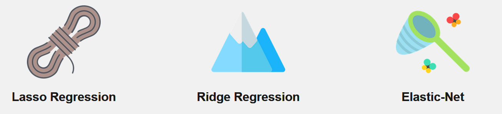

```{r setuplasso, include=FALSE}
knitr::opts_chunk$set(echo = TRUE,message = F,warning = F)
htmlvers <- F
```


## [Regularization](https://elitedatascience.com/algorithm-selection)

### elitedatascience.com definition

Regularization is a technique used to prevent overfitting by artificially penalizing model coefficients.

- It can discourage large coefficients (by dampening them).
-  It can also remove features entirely (by setting their coefficients to 0).
-  The "strength" of the penalty is tunable. (More on this tomorrow...)

### Wikipedia definition of [Regularization](https://en.wikipedia.org/wiki/Regularization_(mathematics)) 


Regularization is the process of adding information in order to solve an ill-posed problem or to prevent overfitting. 


## Strenghts and weaknesses of [regularization](https://elitedatascience.com/machine-learning-algorithms)

Regularization is a technique for penalizing large coefficients in order to avoid overfitting, and the strength of the penalty should be tuned.

### Strengths: 

Linear regression is straightforward to understand and explain, and can be regularized to avoid overfitting. In addition, linear models can be updated easily with new data

### Weaknesses: 

Linear regression performs poorly when there are non-linear relationships. They are not naturally flexible enough to capture more complex patterns, and adding the right interaction terms or polynomials can be tricky and time-consuming.


## [Regularized Regression Algos](https://elitedatascience.com/algorithm-selection)



## [Lasso regression](https://elitedatascience.com/algorithm-selection)

LASSO, stands for least absolute shrinkage and selection operator 


-  Lasso regression penalizes the absolute size of coefficients.
-   Practically, this leads to coefficients that can be exactly 0.
-   Thus, Lasso offers automatic feature selection because it can completely remove some features.
-   Remember, the "strength" of the penalty should be tuned.
-  A stronger penalty leads to more coefficients pushed to zero.


## [Ridge regression](https://elitedatascience.com/algorithm-selection)


-    Ridge regression penalizes the squared size of coefficients.
-    Practically, this leads to smaller coefficients, but it doesn't force them to 0.
-    In other words, Ridge offers feature shrinkage.
-    Again, the "strength" of the penalty should be tuned.
-    A stronger penalty leads to coefficients pushed closer to zero.


## [Elastic net](https://elitedatascience.com/algorithm-selection)


- Elastic-Net is a compromise between Lasso and Ridge.

- Elastic-Net penalizes a mix of both absolute and squared size.
  - The ratio of the two penalty types should be tuned.
  - The overall strength should also be tuned.


### Which regularization method should we choose?

- There’s no "best" type of penalty. It depends on the dataset and the problem. 
- We recommend trying different algorithms that use a range of penalty strengths as part of the tuning process


## [Lasso](https://en.wikipedia.org/wiki/Lasso_(statistics)) regression overview

- lasso is a regression analysis method that performs variable selection and regularization (reduce overfitting)
- We want to enhance prediction accuracy and interpretability of the statistical model.

<!--
https://eight2late.wordpress.com/2017/07/11/a-gentle-introduction-to-logistic-regression-and-lasso-regularisation-using-r/
-->

- We could remove less important variables, after checking that they are not important.
- We can do that manually by examining p-values of coefficients and discarding those variables whose coefficients are not significant.
- This can become tedious for classification problems with many independent variables


## History of lasso

- Originally introduced in geophysics literature in 1986
- Independently rediscovered and popularized in 1996 by Robert Tibshirani, who coined the term and provided further insights into the observed performance.


Lasso was originally formulated for least squares models and this simple case reveals a substantial amount about the behavior of the estimator, including its relationship to ridge regression and best subset selection and the connections between lasso coefficient estimates and so-called soft thresholding. It also reveals that (like standard linear regression) the coefficient estimates need not be unique if covariates are collinear.

## Lasso for other models than least squares

Though originally defined for least squares, lasso regularization is easily extended to a wide variety of statistical models including generalized linear models, generalized estimating equations, proportional hazards models, and M-estimators, in a straightforward fashion.

- Lasso’s ability to perform subset selection relies on the form of the constraint and has a variety of interpretations including in terms of geometry, Bayesian statistics, and convex analysis.

The LASSO is closely related to basis pursuit denoising.


## What is [lasso regression](http://www.statisticshowto.com/lasso-regression/)

- Lasso regression uses shrinkage
- data values are shrunk towards a central point

- [Ridge and lasso regularization work by adding a penalty term to the log likelihood function.](https://eight2late.wordpress.com/2017/07/11/a-gentle-introduction-to-logistic-regression-and-lasso-regularisation-using-r/)

- A tuning parameter, $\lambda$ controls the strength of the L1 penalty.

$$
\sum\limits_{i=1}^n \big( y_i -\beta_0 - \sum\limits_{j=1}^p \beta_jx_{ij} \big)^2 + \lambda \sum\limits_{j=1}^p |\beta_j| = RSS + \lambda\sum\limits_{j=1}^p |\beta_j|.
$$
<!--
wir haben einen penalty term, der hoch ist, wenn die Parameterschätzwerte hoch sind.

Youtube Video zu Lasso
https://www.youtube.com/watch?v=A5I1G1MfUmA
-->


## [The L1 norm explained](https://stats.stackexchange.com/questions/347257/geometrical-interpretation-of-l1-regression)


## [Ridge Regression and the Lasso](https://www.r-bloggers.com/ridge-regression-and-the-lasso/)

### Import of build in data

```{r swissdataset}
swiss <- datasets::swiss
```

### First impression of the data

```{r,eval=htmlvers}
library(DT)
DT::datatable(swiss)
```


### [Preparing the model](https://www.r-bloggers.com/ridge-regression-and-the-lasso/)

```{r}
x <- model.matrix(Fertility~., swiss)[,-1]
y <- swiss$Fertility
```

```{r}
lambda <- 10^seq(10, -2, length = 100)
head(lamda)
```


## Test and train dataset

```{r}
library(glmnet)
set.seed(489)
train = sample(1:nrow(x), nrow(x)/2)
test = (-train)
ytest = y[test]
```


## A first ols model

```{r}
#OLS
swisslm <- lm(Fertility~., data = swiss)
coef(swisslm)
```

## A ridge model

```{r}
#ridge
ridge.mod <- glmnet(x, y, alpha = 0, lambda = lambda)
predict(ridge.mod, s = 0, type = 'coefficients')[1:6,]
```


## Lasso regression with package `glmnet`

```{r,eval=F}
install.packages("glmnet")
```

```{r}
library(glmnet)
```

```{r}
x=matrix(rnorm(100*20),100,20)
g2=sample(1:2,100,replace=TRUE)
fit2=glmnet(x,g2,family="binomial")
```

```{r,eval=T}
caret::varImp(fit2,lambda=0.0007567)
```


## 

- LASSO is a feature selection method.
<!--
https://eight2late.wordpress.com/2017/07/11/a-gentle-introduction-to-logistic-regression-and-lasso-regularisation-using-r/
-->
- LASSO regression has inbuilt penalization functions to reduce overfitting.
<!--
https://www.analyticsvidhya.com/blog/2016/12/introduction-to-feature-selection-methods-with-an-example-or-how-to-select-the-right-variables/
-->


## 

- The logarithmic function is used for the link between probability and logits

- The Logit function is used to [linearize sigmoid curves](https://de.wikipedia.org/wiki/Logit).

<!--
Die Logit-Funktion wird zur Linearisierung von sigmoiden Kurven verwendet.
-->

## The package `caret`

- Classification and Regression Training

```{r,eval=F}
install.packages("caret")
```

```{r}
library("caret")
```

- [**Vignette `caret` package **](https://cran.r-project.org/web/packages/caret/vignettes/caret.html) - 

## 

```{r,eval=F}
?caret::train
```


```{r,eval=F}
logit<-train(,data = gp.train.c,
                        method = 'glm',
                        family = 'binomial',
                        trControl = ctrl0)")
```


## Further packages 

```{r,eval=F}
# https://cran.rstudio.com/web/packages/biglasso/biglasso.pdf
install.packages("biglasso")
```


## Links


[A comprehensive beginners guide for Linear, Ridge and Lasso Regression](https://www.analyticsvidhya.com/blog/2017/06/a-comprehensive-guide-for-linear-ridge-and-lasso-regression/)

<!--
Sehr ausführlich aber mit Python
-->

- Course for statistical learning - [Youtube - Videos](https://www.r-bloggers.com/in-depth-introduction-to-machine-learning-in-15-hours-of-expert-videos/)

- [pcLasso: a new method for sparse regression](https://www.r-bloggers.com/pclasso-a-new-method-for-sparse-regression/)

- [Youtube - lasso regression - clearly explained](https://www.youtube.com/watch?v=NGf0voTMlcs) 

- [Glmnet Vignette](https://web.stanford.edu/~hastie/glmnet/glmnet_alpha.html)

- [Regularization Methods in R](https://www.geo.fu-berlin.de/en/v/soga/Geodata-analysis/multiple-regression/Regularization-Methods/Regularization-Methods-in-R/index.html)

- [A gentle introduction to logistic regression and lasso regularisation using R](https://eight2late.wordpress.com/2017/07/11/a-gentle-introduction-to-logistic-regression-and-lasso-regularisation-using-r/)

- [Penalized Regression in R](https://machinelearningmastery.com/penalized-regression-in-r/)

- [Penalized Logistic Regression Essentials in R](http://www.sthda.com/english/articles/36-classification-methods-essentials/149-penalized-logistic-regression-essentials-in-r-ridge-lasso-and-elastic-net/)

- [All you need to know about Regularization](https://towardsdatascience.com/all-you-need-to-know-about-regularization-b04fc4300369)