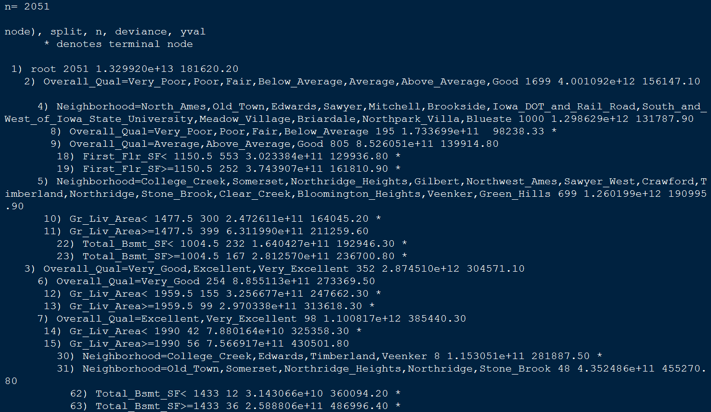

## [Tree-Based Models](https://www.statmethods.net/advstats/cart.html)

- Trees are good for interpretation because they are simple

- Tree based methods involve stratifying or segmenting the predictor space
into a number of simple regions. ([**Hastie and Tibshirani**](https://lagunita.stanford.edu/c4x/HumanitiesScience/StatLearning/asset/trees.pdf))

### But:

- These methods do not deliver the best results concerning prediction accuracy. 

<!--
https://lagunita.stanford.edu/courses/HumanitiesSciences/StatLearning/Winter2016/about

https://lagunita.stanford.edu/c4x/HumanitiesScience/StatLearning/asset/trees.pdf
-->

<!--

https://en.wikipedia.org/wiki/Decision_tree_learning

https://cran.r-project.org/web/packages/rpart/vignettes/longintro.pdf

https://www.analyticsvidhya.com/blog/2016/04/complete-tutorial-tree-based-modeling-scratch-in-python/
https://www.analyticsvidhya.com/blog/2016/02/complete-tutorial-learn-data-science-scratch/
-->

## The Idea

- There are many methodologies for constructing regression trees but one of the oldest is the [**classification and regression tree**](https://machinelearningmastery.com/classification-and-regression-trees-for-machine-learning/) (CART) approach by Breiman et al. (1984). 
- Basic [**regression trees partition a data set into smaller subgroups**](https://towardsdatascience.com/the-complete-guide-to-decision-trees-28a4e3c7be14) and then fit a simple constant for each observation in the subgroup. 
- The partitioning is achieved by successive [**binary partitions**](https://en.wikipedia.org/wiki/Binary_space_partitioning) (aka [recursive partitioning](https://en.wikipedia.org/wiki/Recursive_partitioning)) based on the different predictors. 
- The constant to predict is based on the average response values for all observations that fall in that subgroup.


## Explanation: [**decision tree**](https://en.wikipedia.org/wiki/Decision_tree)

<!--
https://elitedatascience.com/algorithm-selection
-->

Decision trees model data as a "tree" of hierarchical branches. They make branches until they reach "leaves" that represent predictions.

](figure/Decision-Tree-Example.jpg)

## Example decission trees

Due to their branching structure, decision trees can easily model nonlinear relationships.

### Example

- For single family homes (larger lots) higher prices,
- and for apartments (smaller lots), also higher prices (because here it's a proxy for urban / rural).


This reversal of correlation is difficult for linear models to capture unless you explicitly add an interaction term

<!--
(i.e. you can anticipate it ahead of time).
-->
 -  Decision trees can capture this relationship naturally.


<!--
https://www.guru99.com/r-decision-trees.html
-->

## Model foundations 

- This simple example can be generalized 
- We have a continuous response variable $Y$ and two inputs $X_1$ and $X_2$. 
- The recursive partitioning results in three regions ($R_1$,$R_2$,$R_3$) where the model predicts $Y$ with a constant $c_m$ for region $R_m$:

$$
\hat{f} (X) = \sum\limits_{m=1}^3c_mI(X_1,X_2)\in R_m
$$
<!--
An important question remains of how to grow a regression tree.
-->

## How to grow a regression tree - deciding on splits

- It is important to realize the partitioning of variables are done in a top-down approach. 
- A partition performed earlier in the tree will not change based on later partitions. 

### How are these partions made?

- The model begins with the entire data set, $S$, and searches every distinct value of every input variable to find the predictor and split value that partitions the data into two regions ($R_1$ and $R_2$) such that the overall sums of squares error are minimized:

$$
\text{minimize}\{SSE=\sum\limits_{i\in R_1}(y_i - c_1)^2 + \sum\limits_{i\in R_2} (y_i - c_2)^2 \}
$$

## The best split 

- Having found the best split, we partition the data into the two resulting regions and repeat the splitting process on each of the two regions. 
- This process is continued until some stopping criterion is reached. 
- We typically get a very deep, complex tree that may produce good predictions on the training set, but is likely to [**overfit**](https://www.researchgate.net/post/What_is_over_fitting_in_decision_tree) the data, leading to poor performance on unseen data.


## Regression Trees - preparation

- The following slides are based on the UC Business Analytics R Programming Guide on [**regression trees**](http://uc-r.github.io/regression_trees)


```r
library(rsample)     # data splitting 
library(dplyr)       # data wrangling
library(rpart)       # performing regression trees
library(rpart.plot)  # plotting regression trees
library(ipred)       # bagging
library(caret)       # bagging
```


## The Ames Housing data 

- Again we use the Ames dataset and split it in a test and training dataset


```r
set.seed(123)
ames_data <- AmesHousing::make_ames()
ames_split <- initial_split(ames_data,prop = .7)
ames_train <- training(ames_split)
ames_test  <- testing(ames_split)
```


## Pruning

<!--
[**Boston housing data set**](http://lib.stat.cmu.edu/datasets/boston)
-->

- We create three decision trees based on three different samples of the data. 
- The first few partitions are fairly similar at the top of each tree; - they tend to differ closer to the terminal nodes. 
- These deeper nodes tend to overfit to specific attributes of the sample data; 
- Slightly different samples will result in highly variable estimate/ predicted values in the terminal nodes. 
- By [**pruning**](https://dzone.com/articles/decision-trees-and-pruning-in-r) these lower level decision nodes, we can introduce a little bit of bias in our model that help to stabilize predictions and will tend to generalize better to new, unseen data.


## Three decision trees based on three samples.


## Cost complexity criterion

- There is often a balance to be achieved in the depth and complexity of the tree to optimize predictive performance on some unseen data. 
- To find this balance, we grow a very large tree as showed and then prune it back to find an optimal subtree. 
- We find this subtree by using a cost complexity parameter ($\alpha$) that penalizes our objective function for the number of terminal nodes of the tree (T).

$$
\text{minimize}\{SSE + \alpha|T|\}
$$

## The complexity value $\alpha$  

- For a given value of $\alpha$, we find the smallest pruned tree that has the lowest penalized error. 
- $\rightarrow$ A close association to the lasso $L_1$ norm penalty. 
- Smaller penalties tend to produce more complex models, which result in larger trees. 
- Larger penalties result in much smaller trees. 
- As a tree grows larger, the reduction in the SSE must be greater than the cost complexity penalty. 
- We evaluate multiple models across a spectrum of $\alpha$ and use cross-validation to identify the optimal $\alpha$ and the optimal subtree.

## Fit a regression tree using `rpart`

<!--
- We can fit a regression tree using `rpart` and then visualize it using `rpart.plot`.
-->

- The fitting process and the visual output of regression trees and classification trees are very similar. 
- Both use the formula method for expressing the model (similar to `lm`). 
- When fitting a regression tree, we need to set `method = "anova"`. 
- By default, `rpart` will make an intelligent guess based on the data type of the response column
- But it’s recommened to explictly set the method for reproducibility reasons (auto-guesser may change in future).


```r
m1 <- rpart(formula = Sale_Price ~ .,data = ames_train,
            method  = "anova")
```

## the `m1` output. 




```r
m1
```

```
## n= 2051 
## 
## node), split, n, deviance, yval
##       * denotes terminal node
## 
##  1) root 2051 1.273987e+13 180775.50  
##    2) Overall_Qual=Very_Poor,Poor,Fair,Below_Average,Average,Above_Average,Good 1703 4.032269e+12 156431.40  
##      4) Neighborhood=North_Ames,Old_Town,Edwards,Sawyer,Mitchell,Brookside,Iowa_DOT_and_Rail_Road,South_and_West_of_Iowa_State_University,Meadow_Village,Briardale,Northpark_Villa,Blueste 1015 1.360332e+12 131803.50  
##        8) First_Flr_SF< 1048.5 611 4.924281e+11 118301.50  
##         16) Overall_Qual=Very_Poor,Poor,Fair,Below_Average 152 1.053743e+11  91652.57 *
##         17) Overall_Qual=Average,Above_Average,Good 459 2.433622e+11 127126.40 *
##        9) First_Flr_SF>=1048.5 404 5.880574e+11 152223.50  
##         18) Gr_Liv_Area< 2007.5 359 2.957141e+11 145749.50 *
##         19) Gr_Liv_Area>=2007.5 45 1.572566e+11 203871.90 *
##      5) Neighborhood=College_Creek,Somerset,Northridge_Heights,Gilbert,Northwest_Ames,Sawyer_West,Crawford,Timberland,Northridge,Stone_Brook,Clear_Creek,Bloomington_Heights,Veenker,Green_Hills 688 1.148069e+12 192764.70  
##       10) Gr_Liv_Area< 1725.5 482 5.162415e+11 178531.00  
##         20) Total_Bsmt_SF< 1331 352 2.315412e+11 167759.00 *
##         21) Total_Bsmt_SF>=1331 130 1.332603e+11 207698.30 *
##       11) Gr_Liv_Area>=1725.5 206 3.056877e+11 226068.80 *
##    3) Overall_Qual=Very_Good,Excellent,Very_Excellent 348 2.759339e+12 299907.90  
##      6) Overall_Qual=Very_Good 249 9.159879e+11 268089.10  
##       12) Gr_Liv_Area< 1592.5 78 1.339905e+11 220448.90 *
##       13) Gr_Liv_Area>=1592.5 171 5.242201e+11 289819.70 *
##      7) Overall_Qual=Excellent,Very_Excellent 99 9.571896e+11 379937.20  
##       14) Gr_Liv_Area< 1947 42 7.265064e+10 325865.10 *
##       15) Gr_Liv_Area>=1947 57 6.712559e+11 419779.80  
##         30) Neighborhood=Old_Town,Edwards,Timberland 7 8.073100e+10 295300.00 *
##         31) Neighborhood=College_Creek,Somerset,Northridge_Heights,Northridge,Stone_Brook 50 4.668730e+11 437207.00  
##           62) Total_Bsmt_SF< 2168.5 40 1.923959e+11 408996.90 *
##           63) Total_Bsmt_SF>=2168.5 10 1.153154e+11 550047.30 *
```


## Steps of the splits (m1) - explained

<!--
- Once we’ve fit our model we can look at the `m1` output. 
-->


<!--
- This just explains steps of the splits. 
-->

- E.g., we start with 2051 observations at the root node (very beginning) and the first variable we split on (that optimizes a reduction in SSE) is `Overall_Qual`. 
- We see that at the first node all observations with 

```
Overall_Qual=Very_Poor,Poor,Fair,Below_Average,Average,
Above_Average,Good
```

go to the 2nd branch. 

## The 3rd branch

- The number of observations in this branch (1699), their average sales price (156147.10) and SSE (4.001092e+12) are listed. 
- In the 3rd branch we have 352 observations with

`Overall_Qual=Very_Good,Excellent,Very_Excellent` 

- their average sales prices is 304571.10 and the SEE in this region is 2.874510e+12. 
<!--
- `Overall_Qual` is the most important variable that has the largest reduction in SEE initially 
- With those homes on the upper end of the quality spectrum having almost double the average sales price.

-->

### Visualization with `rpart.plot`

<!--
We can visualize our model with `rpart.plot`. 
-->

<!--
- `rpart.plot` has many plotting options
, which we’ll leave to the reader to explore. 
-->
- In the default print it will show the percentage of data that fall to that node and the average sales price for that branch. 
- This tree contains 11 internal nodes resulting in 12 terminal nodes. 
- This tree is partitioning on 11 variables to produce its model. 
<!--
fig.width=12, fig.height=8
-->

## The package `rpart.plot`


```r
rpart.plot(m1)
```

<!-- -->


## Behind the scenes

There are 80 variables in `ames_train`. So what happened?

- `rpart` is automatically applying a range of cost complexity $\alpha$ values to prune the tree. 
- To compare the error for each $\alpha$ value, `rpart` performs a 10-fold cross validation so that the error associated with a $\alpha$ value is computed on the hold-out validation data. 

## The `plotcp`
<!--
- Diminishing returns after 12 terminal nodes  (
- cross validation error - y-axis
- lower x-axis is cost complexity ($\alpha$) value, upper x-axis is the number of terminal nodes (tree size = $|T|$). 

-->
<!--
- The dashed line which goes through the point $|T|=9$. 
-->

- Lower x-axis - cost complexity - alpha


```r
plotcp(m1)
```

<!-- -->

## The 1-SE rule - how many terminal nodes

- Breiman et al. (1984) suggested to use the smallest tree within 1 standard deviation of the minimum cross validation error (aka the 1-SE rule). 
- Thus, we could use a tree with 9 terminal nodes and expect to get similar results within a small margin of error.
- To illustrate the point of selecting a tree with 12 terminal nodes (or 9 if you go by the 1-SE rule), we can force `rpart` to generate a full tree by using cp = 0 (no penalty results in a fully grown tree). 

## Generate a full tree

- After 12 terminal nodes, we see diminishing returns in error reduction as the tree grows deeper. 
- Thus, we can signifcantly prune our tree and still achieve minimal expected error.


```r
m2 <- rpart(formula = Sale_Price ~ .,data=ames_train,
    method  = "anova",control = list(cp = 0, xval = 10))
```

- `control` - a list of options that control details of the rpart algorithm.
- `cp` - complexity parameter. Any split that does not decrease the overall lack of fit by a factor of cp is not attempted. For instance, with anova splitting, this means that the overall R-squared must increase by cp at each step (Pruning). 
- `xval`	number of cross-validations.
<!--
The main role of this parameter is to save computing time by pruning off splits that are obviously not worthwhile. Essentially,the user informs the program that any split which does not improve the fit by cp will likely be pruned off by cross-validation, and that hence the program need not pursue it.
-->

## Plot the result


```r
plotcp(m2);abline(v = 12, lty = "dashed")
```

<!-- -->


## Automated tuning by default

- `rpart` is performing some automated tuning by default, with an optimal subtree of 11 splits, 12 terminal nodes, and a cross-validated error of 0.272 (note that this error is equivalent to the predicted residual error sum of squares statistic ([**PRESS**](https://en.wikipedia.org/wiki/PRESS_statistic))  but not the MSE). 
- We can perform additional tuning to try improve model performance.

## The output `cptable`


```r
m1$cptable
```

```
##            CP nsplit rel error    xerror       xstd
## 1  0.46690132      0 1.0000000 1.0009222 0.05855161
## 2  0.11961409      1 0.5330987 0.5347929 0.03116217
## 3  0.06955813      2 0.4134846 0.4151417 0.03058554
## 4  0.02559992      3 0.3439265 0.3461258 0.02207839
## 5  0.02196620      4 0.3183265 0.3242197 0.02182111
## 6  0.02023390      5 0.2963603 0.3074877 0.02129292
## 7  0.01674138      6 0.2761264 0.2963372 0.02106996
## 8  0.01188709      7 0.2593850 0.2795199 0.01903482
## 9  0.01127889      8 0.2474980 0.2762666 0.01936472
## 10 0.01109955      9 0.2362191 0.2699895 0.01902217
## 11 0.01060346     11 0.2140200 0.2672133 0.01883219
## 12 0.01000000     12 0.2034165 0.2635207 0.01881691
```

## Tuning

In addition to the cost complexity ($\alpha$) parameter, it is also common to tune:

### `minsplit`: 

- The minimum number of data points required to attempt a split before it is forced to create a terminal node. The default is 20. Making this smaller allows for terminal nodes that may contain only a handful of observations to create the predicted value.

### `maxdepth`: 

- The maximum number of internal nodes between the root node and the terminal nodes. The default is 30, which is quite liberal and allows for fairly large trees to be built.

## Special control argument

- `rpart` uses a special control argument where we provide a list of hyperparameter values. 
- E.g., if we want a model with `minsplit = 10` and `maxdepth = 12`, we could execute the following:


```r
m3 <- rpart(formula = Sale_Price ~ .,data = ames_train,
    method  = "anova", control = list(minsplit = 10, 
                          maxdepth = 12, xval = 10)
)
```

## The output `cptable` of model 3


```r
m3$cptable
```

```
##            CP nsplit rel error    xerror       xstd
## 1  0.46690132      0 1.0000000 1.0004448 0.05850012
## 2  0.11961409      1 0.5330987 0.5343156 0.03093134
## 3  0.06955813      2 0.4134846 0.4148699 0.03035832
## 4  0.02559992      3 0.3439265 0.3455539 0.02190359
## 5  0.02196620      4 0.3183265 0.3259151 0.02168056
## 6  0.02023390      5 0.2963603 0.3062045 0.02114604
## 7  0.01674138      6 0.2761264 0.3061135 0.02176061
## 8  0.01188709      7 0.2593850 0.2917534 0.02058535
## 9  0.01127889      8 0.2474980 0.2872380 0.02441006
## 10 0.01109955      9 0.2362191 0.2850234 0.02440721
## 11 0.01060346     11 0.2140200 0.2829790 0.02334151
## 12 0.01000000     12 0.2034165 0.2735069 0.02260957
```

## Grid search

- We can avoid it to manually assess multiple models, by performing a grid search to automatically search across a range of differently tuned models to identify the optimal hyerparameter setting.
- To perform a grid search we first create our hyperparameter grid. 
<!--
- Here, we search a range of `minsplit` from 5-20 and vary `maxdepth` from 8-15 (since our original model found an optimal depth of 12). 
-->

<!--
### Creating a hyper grid
-->

```r
hyper_grid <- expand.grid(
  minsplit = seq(5, 20, 1),
  maxdepth = seq(8, 15, 1)
)
```

- The result are 128 combinations - 128 different models.


```r
head(hyper_grid)
```

```
##   minsplit maxdepth
## 1        5        8
## 2        6        8
## 3        7        8
## 4        8        8
## 5        9        8
## 6       10        8
```

```r
nrow(hyper_grid)
```

```
## [1] 128
```


## A loop to autimate modeling

<!--
- To automate the modeling we simply set up a for loop and 
-->

- We iterate through each `minsplit` and `maxdepth` combination. 
- We save each model into its own list item.


```r
models <- list()
for (i in 1:nrow(hyper_grid)) {
  # get minsplit, maxdepth values at row i
  minsplit <- hyper_grid$minsplit[i]
  maxdepth <- hyper_grid$maxdepth[i]
  # train a model and store in the list
  models[[i]] <- rpart(formula=Sale_Price~.,data=ames_train,
    method="anova",control=list(minsplit=minsplit,
                                maxdepth=maxdepth)
    )
}
```

## A function to extract the minimum error

- We create functions to extract the minimum error associated with the optimal cost complexity $\alpha$ value for each model. 


```r
# function to get optimal cp
get_cp <- function(x) {
  min    <- which.min(x$cptable[, "xerror"])
  cp <- x$cptable[min, "CP"] 
}

# function to get minimum error
get_min_error <- function(x) {
  min    <- which.min(x$cptable[, "xerror"])
  xerror <- x$cptable[min, "xerror"] 
}
```

<!--
- After a little data wrangling to extract the optimal $\alpha$ value and its respective error, adding it back to our grid, and filter for the top 5 minimal error values we see that the optimal model makes a slight improvement over our earlier model (xerror of 0.242 versus 0.272).

-->

## Apply the functions


```r
hyper_grid %>%
  mutate(
    cp    = purrr::map_dbl(models, get_cp),
    error = purrr::map_dbl(models, get_min_error)
    ) %>%
  arrange(error) %>%
  top_n(-5, wt = error)
```

```
##   minsplit maxdepth         cp     error
## 1       16       12 0.01060346 0.2628987
## 2        6       11 0.01000000 0.2645615
## 3       11       11 0.01000000 0.2650862
## 4       10       10 0.01000000 0.2655860
## 5        7       15 0.01000000 0.2656602
```

## Exercise

### Apply the final optimal model

### Predict on our test dataset


## The final optimal model

<!--
- If we were satisfied with these results 
-->
### Apply the final optimal model:


```r
optimal_tree <- rpart(formula = Sale_Price ~ .,
    data    = ames_train,method  = "anova",
    control = list(minsplit = 5, maxdepth = 13, cp = 0.0108982)
    )
```

### Predict on our test dataset:


```r
pred <- predict(optimal_tree, newdata = ames_test)
```


- The final RMSE is 39145.39 which suggests that, on average, our predicted sales prices are about 39,145 Dollar off from the actual sales price.


```r
RMSE(pred = pred, obs = ames_test$Sale_Price)
```

```
## [1] 39558.22
```


## [Exercise: `rpart` Kyphosis](https://www.r-exercises.com/2016/12/13/recursive-partitioning-and-regression-trees-exercises/)

### Consider the Kyphosis data frame

<!--
(type `help("kyphosis")` for more details)
-->

1) Which variables are in the `kyphosis` dataset
2) Build a tree to classify Kyphosis from Age, Number and Start.

### Consider the tree build above.

3) Which variables are used to explain Kyphosis presence?
4) How many observations contain the terminal nodes.

### Consider the Kyphosis data frame.

5) Build a tree using the first 60 observations of kyphosis.
6) Predict the kyphosis presence for the other 21 observations.
7) Which is the misclassification rate (prediction error)

## Exercise: `rpart` `iris`

### Consider the `iris` data frame

1) Build a tree to classify Species from the other variables.
2) Plot the trees, add nodes information.

### Consider the tree build before

3) Prune the the using median complexity parameter (cp) associated to the tree.
4) Plot in the same window, the pruned and the original tree.
5) In which terminal nodes is clasified each oobservations of `iris`?
6) Which Specie has a flower of `Petal.Length` greater than 2.45 and `Petal.Width` less than 1.75.

<!--
## What is bagging?

- Basic regression trees divide a data set into smaller groups and then fit a simple model (constant) for each subgroup. 
- But a single tree model tends to be highly unstable and a poor predictor. 
- Bootstrap aggregating (bagging) regression trees is quite powerful and effective. 
- This provides the fundamental basis of more complex tree-based models such as random forests and gradient boosting machines. 
-->

<!--
- This tutorial will get you started with regression trees and bagging.

![]8figure/iris.png
-->


## Advantages of regression trees

- They are very interpretable.
- Making predictions is fast (no complicated calculations, just looking up constants in the tree).
- It’s easy to understand what variables are important for the prediction. 
- The internal nodes (splits) are those variables that most largely reduced the SSE.
- If some data is missing, we might not be able to go all the way down the tree to a leaf, but we can still make a prediction by averaging all the leaves in the sub-tree.
- The model provides a non-linear response, so it can work when the true regression surface is not smooth. 
- If it is smooth, the piecewise-constant surface can approximate it arbitrarily closely (with enough leaves).
- There are fast, reliable algorithms to learn these trees.

## Weaknesses of regression trees

- Single regression trees have high variance, resulting in unstable predictions (an alternative subsample of training data can significantly change the terminal nodes).
- Due to the high variance single regression trees have poor predictive accuracy.

<!--

## [What are the advantages and disadvantages of decision trees?](https://elitedatascience.com/machine-learning-interview-questions-answers#supervised-learning)

Advantages: Decision trees are easy to interpret, nonparametric (which means they are robust to outliers), and there are relatively few parameters to tune.

Disadvantages: Decision trees are prone to be overfit. 

- This can be addressed by ensemble methods like random forests or boosted trees.

-->

## [Ensembling](https://elitedatascience.com/overfitting-in-machine-learning)

Ensembles are machine learning methods for combining predictions from multiple separate models. 

<!--
There are a few different methods for ensembling, but the two most common are:
-->

### Bagging 

attempts to reduce the chance of overfitting complex models.


- It trains a large number of "strong" learners in parallel.
-  A strong learner is a model that's relatively unconstrained.
-  Bagging then combines all the strong learners together in order to "smooth out" their predictions.

### Boosting 

attempts to improve the predictive flexibility of simple models.

- It trains a large number of "weak" learners in sequence.
- A weak learner is a constrained model (limit for max depth of tree).
-    Each one in the sequence focuses on learning from the mistakes of the one before it.
- Boosting combines all the weak learners into a single strong learner.

## Bagging and boosting

While bagging and boosting are both ensemble methods, they approach the problem from opposite directions.

Bagging uses complex base models and tries to "smooth out" their predictions, while boosting uses simple base models and tries to "boost" their aggregate complexity.


## [Bagging](https://www.r-bloggers.com/improve-predictive-performance-in-r-with-bagging/)

- Single tree models suffer from high variance, they are highly unstable and poor predictors.
-  [**Pruning**](https://en.wikipedia.org/wiki/Decision_tree_pruning) helps, but there are alternative methods that exploite the variability of single trees in a way that can significantly improve performance. 
- Bootstrap aggregating (bagging) is one such approach (originally proposed by Breiman, 1996).
- Bagging is a method for combining predictions from different regression or classification models.
- The results of the models are then averaged - in the simplest case model predictions are included with the same weight.
- The weights could depend on the quality of the model prediction, i.e. "good" models are more important than "bad" models.
- Bagging leads to significantly improved predictions in the case of unstable models.

<!--
https://en.wikipedia.org/wiki/Bootstrap_aggregating
https://de.wikipedia.org/wiki/Bagging
http://topepo.github.io/caret/miscellaneous-model-functions.html#bagging-1
-->

<!--
##
- Bagging combines and averages multiple models. 
- Averaging across multiple trees reduces the variability of any one tree and reduces overfitting, which improves predictive performance. 
-->

## Bagging follows three simple steps:

- 1.) Create $m$ bootstrap samples from the training data. Bootstrapped samples allow us to create many slightly different data sets but with the same distribution as the overall training set.

- 2.) For each bootstrap sample train a single, unpruned regression tree.

- 3.) Average individual predictions from each tree to create an overall average predicted value.

## The bagging process.

{ height=70% }


## About bagging

- This process can be applied to any regression or classification model; 
- It provides the greatest improvement for models that have high variance. 
- More stable parametric models such as linear regression and multi-adaptive regression splines tend to experience less improvement in predictive performance.
- On average, a bootstrap sample will contain 63 per cent of the training data. 
- This leaves about 33 per cent ($\dfrac{1}{3}$) of the data out of the bootstrapped sample. We call this the out-of-bag (OOB) sample. 
- We can use the OOB observations to estimate the model’s accuracy, creating a natural cross-validation process.

## Bagging with `ipred`

- Fitting a bagged tree model is quite simple. 
- Instead of using `rpart` we use `ipred::bagging`. 
- We use `coob = TRUE` to use the OOB sample to estimate the test error. 

## Train bagged model


```r
set.seed(123)
(bagged_m1 <- bagging(formula = Sale_Price ~ .,
  data    = ames_train,coob= TRUE))
```

```
## 
## Bagging regression trees with 25 bootstrap replications 
## 
## Call: bagging.data.frame(formula = Sale_Price ~ ., data = ames_train, 
##     coob = TRUE)
## 
## Out-of-bag estimate of root mean squared error:  36991.67
```

- We see that our initial estimate error is close to 3000 Dollar less than the test error we achieved with our single optimal tree (36543 vs. 39145)

## Things to note typically

- The more trees the better - we are averaging over more high variance single trees. 
- We see a dramatic reduction in variance (and hence our error) and eventually the reduction in error will flatline 
<!--
- signaling an appropriate number of trees to create a stable model. 
-->
- You need less than 50 trees to stabilize the error.

## Number of bootstrap samples

- By default bagging performs 25 bootstrap samples and trees but we may require more. 
<!--
- We can assess the error versus number of trees as below. 
-->


```r
# assess 10-50 bagged trees
ntree <- 10:50 
# create empty vector to store OOB RMSE values
rmse <- vector(mode = "numeric", length = length(ntree))
for (i in seq_along(ntree)) {
  # reproducibility
  set.seed(123)   
  # perform bagged model
  model <- bagging(formula = Sale_Price ~ .,
  data=ames_train,coob= TRUE,nbagg=ntree[i]
)
  # get OOB error
  rmse[i] <- model$err   
}
```


## Plot the result

- The error is stabilizing at about 25 trees - we will improve by bagging more trees.


```r
plot(ntree, rmse, type = 'l', lwd = 2)
abline(v = 25, col = "red", lty = "dashed")
```

<!-- -->


## Bagging with `caret`

- Bagging with `ipred` is simple but there are some additional benefits of bagging with `caret`.

1.) Its easier to perform cross-validation. Although we can use the OOB error, performing cross validation will provide a more robust understanding of the true expected test error.

2.) We can assess [**variable importance**](https://topepo.github.io/caret/variable-importance.html) across the bagged trees.

## [Excursus: Variable importance (vi)](https://cran.r-project.org/web/packages/datarobot/vignettes/VariableImportance.html)

- vi measures help understand the results obtained from complex machine learning models 
- There is no general consensus on the “best” way to compute - or even define - the concept of variable importance. 
- See a list of many possible approaches to compute vi in the help file of the command `varImp` 


```r
?caret::varImp
```

- vi refers to how much a given model "uses" that variable to make accurate predictions. The more a model relies on a variable to make predictions, the more important it is for the model. 

<!--
https://stats.stackexchange.com/questions/332960/what-is-variable-importance
-->

<!--


https://topepo.github.io/caret/variable-importance.html
https://www.salford-systems.com/blog/dan-steinberg/what-is-the-variable-importance-measure

https://christophm.github.io/interpretable-ml-book/pdp.html


- We see that the cross-validated RMSE is 36,477 dollar. 
-->


## A 10-fold cross-validated model.  
<!--
## CV bagged model 
-->

```r
# Specify 10-fold cross validation
ctrl <- trainControl(method = "cv",  number = 10) 

bagged_cv <- train(Sale_Price ~ .,data = ames_train,
  method = "treebag",trControl = ctrl,importance = TRUE)
```

- `treebag`- means we use a bagging tree

## Assess results


```r
bagged_cv
```

```
## Bagged CART 
## 
## 2051 samples
##   80 predictor
## 
## No pre-processing
## Resampling: Cross-Validated (10 fold) 
## Summary of sample sizes: 1846, 1845, 1846, 1845, 1847, 1847, ... 
## Resampling results:
## 
##   RMSE      Rsquared   MAE     
##   35854.02  0.8009063  23785.85
```

## Assess results with a plot (top 20 variables)

<!--
- We also assess the top 20 variables from our model. 
-->

- Here, variable importance is measured by assessing the total amount SSE is decreased by splits over a given predictor, averaged over all $m$ trees. 

<!--
- The predictors with the largest average impact to SSE are considered most important. 
- The importance value is simply the relative mean decrease in SSE compared to the most important variable (provides a 0-100 scale).
-->

```r
plot(varImp(bagged_cv), 20) 
```

<!-- -->


## Extensions

- If we compare this to the test set out of sample we see that our cross-validated error estimate was very close. 


```r
pred <- predict(bagged_cv, ames_test)
RMSE(pred, ames_test$Sale_Price)
```

```
## [1] 35357.89
```

- We have successfully reduced our error to about $35k; 
- Extensions of this bagging concept (random forests and GBMs) can significantly reduce this further.

<!--
## [Classification Tree example](https://www.guru99.com/r-decision-trees.html)

The purpose of this dataset is to predict which people are more likely to survive after the collision with the iceberg. The dataset contains 13 variables and 1309 observations. The dataset is ordered by the variable X. 


```r
path <- 'https://raw.githubusercontent.com/thomaspernet/data_csv_r/master/data/titanic_csv.csv'
titanic <-read.csv(path)
shuffle_index <- sample(1:nrow(titanic))
kable(head(titanic))
```


  X   pclass   survived  name                                              sex           age   sibsp   parch  ticket        fare  cabin     embarked   home.dest                       
---  -------  ---------  ------------------------------------------------  -------  --------  ------  ------  -------  ---------  --------  ---------  --------------------------------
  1        1          1  Allen, Miss. Elisabeth Walton                     female    29.0000       0       0  24160     211.3375  B5        S          St Louis, MO                    
  2        1          1  Allison, Master. Hudson Trevor                    male       0.9167       1       2  113781    151.5500  C22 C26   S          Montreal, PQ / Chesterville, ON 
  3        1          0  Allison, Miss. Helen Loraine                      female     2.0000       1       2  113781    151.5500  C22 C26   S          Montreal, PQ / Chesterville, ON 
  4        1          0  Allison, Mr. Hudson Joshua Creighton              male      30.0000       1       2  113781    151.5500  C22 C26   S          Montreal, PQ / Chesterville, ON 
  5        1          0  Allison, Mrs. Hudson J C (Bessie Waldo Daniels)   female    25.0000       1       2  113781    151.5500  C22 C26   S          Montreal, PQ / Chesterville, ON 
  6        1          1  Anderson, Mr. Harry                               male      48.0000       0       0  19952      26.5500  E12       S          New York, NY                    
-->


<!--
## [**Decision trees used in data mining are of two main types:**](https://en.wikipedia.org/wiki/Decision_tree_learning)

- Classification tree

- Regression tree
-->

<!--

## The data behind


```r
airq <- subset(airquality, !is.na(Ozone))
summary(airq$Temp)
```

```
##    Min. 1st Qu.  Median    Mean 3rd Qu.    Max. 
##   57.00   71.00   79.00   77.87   85.00   97.00
```


## Conditional inference tree


```r
library(party)
```


```r
?ctree
```

- performs recursively univariate split recursively


- [**Vignette**](https://cran.r-project.org/web/packages/party/vignettes/party.pdf) package `party`


### [ctree example](https://datawookie.netlify.com/blog/2013/05/package-party-conditional-inference-trees/)


```r
install.packages("party")
```

## A first model


```r
library(party)
```


```r
air.ct <- ctree(Ozone ~ ., data = airq, controls = ctree_control(maxsurrogate = 3))
```


## The plot for `ctree`


```r
plot(air.ct)
```


## Recursive partitioning algorithms are special cases of a
simple two-stage algorithm

- First partition the observations by univariate splits in a recursive way and 
- second fit a constant model in each cell of the resulting partition.


## [`ctree` - Regression](https://stats.stackexchange.com/questions/171301/interpreting-ctree-partykit-output-in-r)


```r
library(partykit)
```


```r
?ctree
```


```r
airq <- subset(airquality, !is.na(Ozone))
airct <- ctree(Ozone ~ ., data = airq)
plot(airct, type = "simple")
```

<!-- -->


## [Decision Trees](http://www.statmethods.net/advstats/cart.html)

[Regression tree vs. classification tree](http://www.statmethods.net/advstats/cart.html)


```r
library(rpart)
```

Grow a tree


```r
fit <- rpart(Kyphosis ~ Age + Number + Start,
   method="class", data=kyphosis)

printcp(fit) # display the results
```

```
## 
## Classification tree:
## rpart(formula = Kyphosis ~ Age + Number + Start, data = kyphosis, 
##     method = "class")
## 
## Variables actually used in tree construction:
## [1] Age   Start
## 
## Root node error: 17/81 = 0.20988
## 
## n= 81 
## 
##         CP nsplit rel error xerror    xstd
## 1 0.176471      0   1.00000 1.0000 0.21559
## 2 0.019608      1   0.82353 1.1176 0.22433
## 3 0.010000      4   0.76471 1.1176 0.22433
```

```r
plotcp(fit) # visualize cross-validation results
```

<!-- -->

```r
summary(fit) # detailed summary of splits
```

```
## Call:
## rpart(formula = Kyphosis ~ Age + Number + Start, data = kyphosis, 
##     method = "class")
##   n= 81 
## 
##           CP nsplit rel error   xerror      xstd
## 1 0.17647059      0 1.0000000 1.000000 0.2155872
## 2 0.01960784      1 0.8235294 1.117647 0.2243268
## 3 0.01000000      4 0.7647059 1.117647 0.2243268
## 
## Variable importance
##  Start    Age Number 
##     64     24     12 
## 
## Node number 1: 81 observations,    complexity param=0.1764706
##   predicted class=absent   expected loss=0.2098765  P(node) =1
##     class counts:    64    17
##    probabilities: 0.790 0.210 
##   left son=2 (62 obs) right son=3 (19 obs)
##   Primary splits:
##       Start  < 8.5  to the right, improve=6.762330, (0 missing)
##       Number < 5.5  to the left,  improve=2.866795, (0 missing)
##       Age    < 39.5 to the left,  improve=2.250212, (0 missing)
##   Surrogate splits:
##       Number < 6.5  to the left,  agree=0.802, adj=0.158, (0 split)
## 
## Node number 2: 62 observations,    complexity param=0.01960784
##   predicted class=absent   expected loss=0.09677419  P(node) =0.7654321
##     class counts:    56     6
##    probabilities: 0.903 0.097 
##   left son=4 (29 obs) right son=5 (33 obs)
##   Primary splits:
##       Start  < 14.5 to the right, improve=1.0205280, (0 missing)
##       Age    < 55   to the left,  improve=0.6848635, (0 missing)
##       Number < 4.5  to the left,  improve=0.2975332, (0 missing)
##   Surrogate splits:
##       Number < 3.5  to the left,  agree=0.645, adj=0.241, (0 split)
##       Age    < 16   to the left,  agree=0.597, adj=0.138, (0 split)
## 
## Node number 3: 19 observations
##   predicted class=present  expected loss=0.4210526  P(node) =0.2345679
##     class counts:     8    11
##    probabilities: 0.421 0.579 
## 
## Node number 4: 29 observations
##   predicted class=absent   expected loss=0  P(node) =0.3580247
##     class counts:    29     0
##    probabilities: 1.000 0.000 
## 
## Node number 5: 33 observations,    complexity param=0.01960784
##   predicted class=absent   expected loss=0.1818182  P(node) =0.4074074
##     class counts:    27     6
##    probabilities: 0.818 0.182 
##   left son=10 (12 obs) right son=11 (21 obs)
##   Primary splits:
##       Age    < 55   to the left,  improve=1.2467530, (0 missing)
##       Start  < 12.5 to the right, improve=0.2887701, (0 missing)
##       Number < 3.5  to the right, improve=0.1753247, (0 missing)
##   Surrogate splits:
##       Start  < 9.5  to the left,  agree=0.758, adj=0.333, (0 split)
##       Number < 5.5  to the right, agree=0.697, adj=0.167, (0 split)
## 
## Node number 10: 12 observations
##   predicted class=absent   expected loss=0  P(node) =0.1481481
##     class counts:    12     0
##    probabilities: 1.000 0.000 
## 
## Node number 11: 21 observations,    complexity param=0.01960784
##   predicted class=absent   expected loss=0.2857143  P(node) =0.2592593
##     class counts:    15     6
##    probabilities: 0.714 0.286 
##   left son=22 (14 obs) right son=23 (7 obs)
##   Primary splits:
##       Age    < 111  to the right, improve=1.71428600, (0 missing)
##       Start  < 12.5 to the right, improve=0.79365080, (0 missing)
##       Number < 3.5  to the right, improve=0.07142857, (0 missing)
## 
## Node number 22: 14 observations
##   predicted class=absent   expected loss=0.1428571  P(node) =0.1728395
##     class counts:    12     2
##    probabilities: 0.857 0.143 
## 
## Node number 23: 7 observations
##   predicted class=present  expected loss=0.4285714  P(node) =0.08641975
##     class counts:     3     4
##    probabilities: 0.429 0.571
```


```r
# plot tree
plot(fit, uniform=TRUE,
   main="Classification Tree for Kyphosis")
text(fit, use.n=TRUE, all=TRUE, cex=.8)
```

<!-- -->

[Decision Trees and Random Forest](https://cran.r-project.org/doc/contrib/Zhao_R_and_data_mining.pdf)

-->


## Resources and links

- Breimann (1984) - [**Classification and Regression Trees**](https://www.amazon.com/Classification-Regression-Wadsworth-Statistics-Probability/dp/0412048418)

- [**Vignette**](https://cran.r-project.org/web/packages/partykit/vignettes/ctree.pdf) for package `partykit` 

- [**Conditional Inference Trees**](https://rpubs.com/awanindra01/ctree)


- [**Conditional inference trees vs traditional decision trees**](https://stats.stackexchange.com/questions/12140/conditional-inference-trees-vs-traditional-decision-trees)

- [Video on tree based methods](https://www.youtube.com/watch?v=6ENTbK3yQUQ)

- [An example of practical machine learning using R](https://rstudio-pubs-static.s3.amazonaws.com/64455_df98186f15a64e0ba37177de8b4191fa.html)

<!--
https://www.researchgate.net/figure/A-simple-example-of-visualizing-gradient-boosting_fig5_326379229
-->


