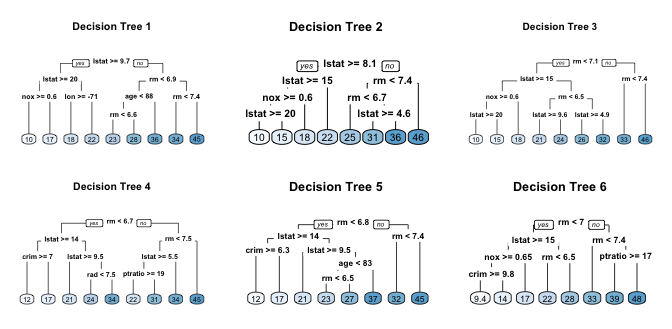
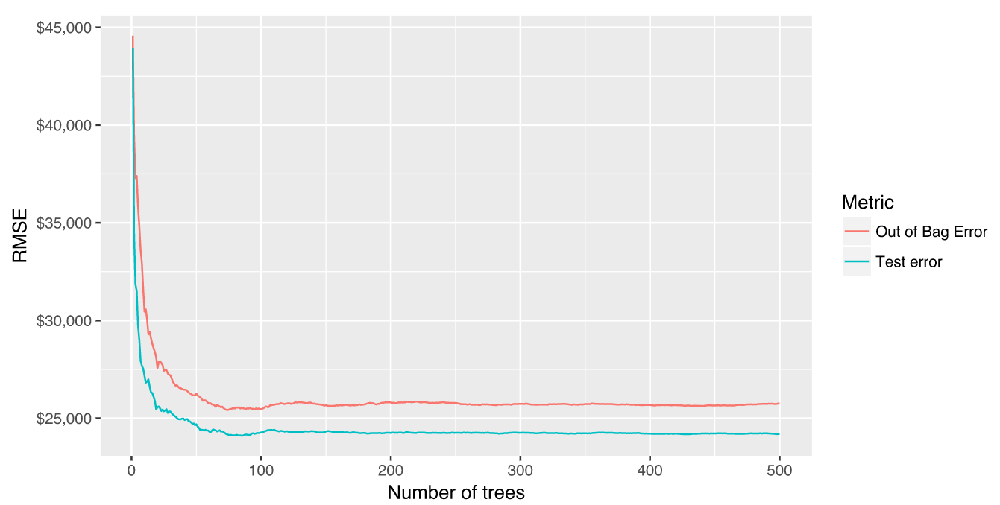

```{r setupbaggingboosting, include=FALSE}
knitr::opts_chunk$set(echo = T,message=F,warning=F,cache=T)
library(knitr)
```

## Random Forests

- Bagging can turn a single tree model with high variance and poor predictive power into a fairly accurate prediction function. 
- But bagging typically suffers from tree correlation, which reduces the overall performance of the model. 
- Random forests are a modification of bagging that builds a large collection of de-correlated trees 
- It is a very popular "out-of-the-box" learning algorithm that enjoys good predictive performance. 


## Preparation - random forests

- The following slides are based on UC Business Analytics R Programming Guide  on [random forests](http://uc-r.github.io/random_forests)

```{r}
library(rsample)      # data splitting 
library(randomForest) # basic implementation
library(ranger)       # a faster implementation of randomForest
library(caret)        # an aggregator package for performing many machine learning models
library(h2o)          # an extremely fast java-based platform
```


```{r,eval=F,echo=F}
install.packages("ranger")
```


## The Ames housing data

```{r}
set.seed(123)
ames_split <- rsample::initial_split(AmesHousing::make_ames(), prop = .7)
ames_train <- rsample::training(ames_split)
ames_test  <- rsample::testing(ames_split)
```

## Extending the bagging technique

<!--
- Random forests are built on the same fundamental principles as decision trees and bagging. 
-->
- Bagging introduces a random component in to the tree building process 
<!--
that reduces the variance of a single tree’s prediction. 
-->
- The trees in bagging are not completely independent of each other since all the original predictors are considered at every split of every tree. 
- Trees from different bootstrap samples typically have similar structure to each other (especially at the top of the tree) due to underlying relationships.


## Similar trees

- E.g., if we create six decision trees with different bootstrapped samples of the Boston housing data, the top of the trees all have a very similar structure. 
- Although there are 15 predictor variables to split on, all six trees have both `lstat` and `rm` variables driving the first few splits.



## Tree correlation

- Tree correlation prevents bagging from optimally reducing variance of the predictive values. 
- To reduce variance further, we need to minimize the amount of correlation between the trees. 
- This can be achieved by injecting more randomness into the tree-growing process. 

Random forests achieve this in two ways:

1) Bootstrap: 

- Similar to bagging, each tree is grown to a bootstrap resampled data set, which makes them different and decorrelates them.

2) Split-variable randomization: 

- Each time a split is to be performed, the search for the split variable is limited to a random subset of $m$ of the $p$ variables.
<!--
Für was steht m und p hier?
-->
- For regression trees, typical default values are $m=\dfrac{p}{3}$ but this should be considered a tuning parameter. 
- When $m=p$, the randomization is limited (only step 1) and is the same as bagging.


## Basic algorithm

The basic algorithm for a regression random forest can be generalized:

```
1.  Given training data set
2.  Select number of trees to build (ntrees)
3.  for i = 1 to ntrees do
4.  |  Generate a bootstrap sample of the original data
5.  |  Grow a regression tree to the bootstrapped data
6.  |  for each split do
7.  |  | Select m variables at random from all p variables
8.  |  | Pick the best variable/split-point among the m
9.  |  | Split the node into two child nodes
10. |  end
11. | Use typical tree model stopping criteria to determine when a tree is complete (but do not prune)
12. end
```

- Since the algorithm randomly selects a bootstrap sample to train on and predictors to use at each split, tree correlation will be lessened beyond bagged trees.

## OOB error vs. test set error

- Similar to bagging, a natural benefit of the bootstrap resampling process is that random forests have an out-of-bag (OOB) sample that provides an efficient and reasonable approximation of the test error. 
- This provides a built-in validation set without any extra work on your part, and you do not need to sacrifice any of your training data to use for validation. 
- This makes identifying the number of trees required to stablize the error rate during tuning more efficient; 
- As illustrated below some difference between the OOB error and test error are expected.

## Random forest out-of-bag error versus validation error



## Scoring models - metrics

- Many packages do not keep track of which observations were part of the OOB sample for a given tree and which were not. 
- If you are comparing multiple models to one-another, you’d want to score each on the same validation set to compare performance. 
- It is possible to compute certain metrics such as root mean squared logarithmic error (RMSLE) on the OOB sample, but it is not built in to all packages. 
- So if you are looking to compare multiple models or use a slightly less traditional loss function you will likely want to still perform cross validation.

## Advantages & Disadvantages

### Advantages - random forrests

- Typically have very good performance
- Remarkably good “out-of-the box” - very little tuning required
- Built-in validation set - don’t need to sacrifice data for extra validation
- No pre-processing required
- Robust to outliers

### Disadvantages - random forrests

- Can become slow on large data sets
- Although accurate, often cannot compete with advanced boosting algorithms
- Less interpretable

## Basic implementation

- There are over 20 random forest packages in R.
- To demonstrate the basic implementation we illustrate the use of the `randomForest` package, the oldest and most well known implementation of the Random Forest algorithm in R. 
- As your data set grows in size `randomForest` does not scale well (although you can parallelize with `foreach`). 
- To explore and compare a variety of tuning parameters we can also find more effective packages. 
- The packages `ranger` and `h2o` packages will be presented in the tuning section.

## `randomForest::randomForest`

- `randomForest` can use the formula or separate x, y matrix notation for specifying our model. 
- Below we apply the default `randomForest` model using the formulaic specification. 
- The default random forest performs 500 trees and $\dfrac{\text{features}}{3}=26$ randomly selected predictor variables at each split. 
- Averaging across all 500 trees provides an OOB MSE=659550782 (RMSE=25682).


```{r,eval=F}
set.seed(123)
# default RF model
m1 <- randomForest(formula = Sale_Price ~ .,data=ames_train)
m1
```

```{r,eval=F,echo=F}
save(m1,file="../data/ml_randomforest_m1.RData")
```

```{r,echo=F}
load("../data/ml_randomforest_m1.RData")
```


## Plotting the model

- Plotting the model will illustrate the error rate as we average across more trees and shows that our error rate stabalizes with around 100 trees but continues to decrease slowly until around 300 or so trees.

```{r}
plot(m1)
```

## The plotted error rate

- The plotted error rate above is based on the OOB sample error and can be accessed directly at `m1$mse`. 
- We can find which number of trees providing the lowest error rate, which is 344 trees providing an average home sales price error of $25,673.

```{r}
which.min(m1$mse)
sqrt(m1$mse[which.min(m1$mse)])
```

## A validation set to measure predictive accuracy

- `randomForest` also allows us to use a validation set to measure predictive accuracy if we did not want to use the OOB samples. 
- Here we split our training set further to create a training and validation set. 
- We then supply the validation data in the `xtest` and `ytest` arguments.

```{r}
set.seed(123)
valid_split <- initial_split(ames_train, .8)
# training data
ames_train_v2 <- analysis(valid_split)
# validation data
ames_valid <- assessment(valid_split)
x_test <- ames_valid[setdiff(names(ames_valid), "Sale_Price")]
y_test <- ames_valid$Sale_Price
```

## Extract OOB & validation errors

```{r}
rf_oob_comp <- randomForest(formula=Sale_Price ~ .,
  data=ames_train_v2,xtest = x_test,ytest=y_test)
```

```{r,eval=F}
# compare error rates
tibble::tibble(
  `Out of Bag Error` = oob,
  `Test error` = validation,
  ntrees = 1:rf_oob_comp$ntree
) %>%
  gather(Metric, RMSE, -ntrees) %>%
  ggplot(aes(ntrees, RMSE, color = Metric)) +
  geom_line() +
  scale_y_continuous(labels = scales::dollar) +
  xlab("Number of trees")
```

## Compare error rates

```{r,echo=F}
tibble::tibble(
  `Out of Bag Error` = oob,
  `Test error` = validation,
  ntrees = 1:rf_oob_comp$ntree
) %>%
  gather(Metric, RMSE, -ntrees) %>%
  ggplot(aes(ntrees, RMSE, color = Metric)) +
  geom_line() +
  scale_y_continuous(labels = scales::dollar) +
  xlab("Number of trees")
```

## Random forests - out-of-the-box algorithm

- Random forests are one of the best “out-of-the-box” machine learning algorithms. 
- They typically perform remarkably well with very little tuning required. - - E.g., we were able to get an RMSE of less than 30K Dollar without any tuning which is over a 6K Dollar reduction to the RMSE achieved with a fully-tuned bagging model and $4K reduction to to a fully-tuned elastic net model. 
- We can still seek improvement by tuning our random forest model.

## Tuning

- Random forests are fairly easy to tune since there are only a handful of tuning parameters. 
- Typically, the primary concern at the beginning is tuning the number of candidate variables to select from at each split. 
- There are a few additional hyperparameters that we should be aware of. 
- The argument names may differ across packages, but these hyperparameters should be present:

## Tuning parameters (I)

- `ntree`: number of trees. We want enough trees to stabalize the error but using too many trees is inefficient, esp. for large data sets.
- `mtry`: the number of variables as candidates at each split. When `mtry=p`the model equates to bagging. When `mtry=1` the split variable is completely random, so all variables get a chance but can lead to overly biased results. A common suggestion is to start with 5 values evenly spaced across the range from 2 to p.

## Tuning parameters (II)

- `sampsize`: the number of samples to train on. The default value is 63.25% of the training set since this is the expected value of unique observations in the bootstrap sample. Lower sample sizes can reduce the training time but may introduce more bias than necessary. Increasing the sample size can increase performance but at the risk of overfitting because it introduces more variance. Typically, when tuning this parameter we stay near the 60-80% range.
- `nodesize`: minimum number of samples within the terminal nodes. Controls the complexity of the trees. Smaller node size allows for deeper, more complex trees and smaller node results in shallower trees. This is another bias-variance tradeoff where deeper trees introduce more variance (risk of overfitting) and shallower trees introduce more bias (risk of not fully capturing unique patters and relatonships in the data).
- `maxnodes`: maximum number of terminal nodes. Another way to control the complexity of the trees. More nodes equates to deeper, more complex trees and less nodes result in shallower trees.


## Initial tuning with `randomForest`

- If we are interested with just starting out and tuning the `mtry` parameter we can use `randomForest::tuneRF` for a quick and easy tuning assessment.
- `tuneRf` will start at a value of mtry that you supply and increase by a certain step factor until the OOB error stops improving be a specified amount. 
- Below we start with `mtry = 5` and increases by a factor of 1.5 until the OOB error stops improving by 1 per cent. 
- Note that `tuneRF` requires a separate x y specification. 
- We see that the optimal `mtry` value in this sequence is very close to the default mtry value of $\dfrac{\text{features}}{3}=26$.


## Names of features

```{r}
features <- setdiff(names(ames_train), "Sale_Price")

set.seed(123)

m2 <- tuneRF(
  x          = ames_train[features],
  y          = ames_train$Sale_Price,
  ntreeTry   = 500,
  mtryStart  = 5,
  stepFactor = 1.5,
  improve    = 0.01,
  trace      = FALSE      # to not show real-time progress 
)
```


## Full grid search with `ranger`

- To perform a larger grid search across several hyperparameters we’ll need to create a grid and loop through each hyperparameter combination and evaluate the model. 
- Unfortunately, this is where `randomForest` becomes quite inefficient since it does not scale well. 
- Instead, we can use `ranger` which is a C++ implementation of Brieman’s random forest algorithm and, as the following illustrates, is over 6 times faster than `randomForest`.


## Assessing the speed

### `randomForest` speed

```{r}
system.time(
  ames_randomForest <- randomForest(
    formula = Sale_Price ~ ., 
    data    = ames_train, 
    ntree   = 500,
    mtry    = floor(length(features) / 3)
  )
)
```

## ranger speed

```{r}
system.time(
  ames_ranger <- ranger(
    formula   = Sale_Price ~ ., 
    data      = ames_train, 
    num.trees = 500,
    mtry      = floor(length(features) / 3)
  )
)
```


## The grid search

- To perform the grid search, first we want to construct our grid of hyperparameters. 
- We’re going to search across 96 different models with varying `mtry`, minimum node size, and sample size.

```{r}
# hyperparameter grid search
hyper_grid <- expand.grid(
  mtry       = seq(20, 30, by = 2),
  node_size  = seq(3, 9, by = 2),
  sampe_size = c(.55, .632, .70, .80),
  OOB_RMSE   = 0
)

nrow(hyper_grid) # total number of combinations
```


## Loop through each hyperparameter combination

- We apply 500 trees since our previous examples illustrated that 500 was plenty to achieve a stable error rate. 
- We set the random number generator seed. This allows us to consistently sample the same observations for each sample size and make the impact of each change clearer. 
- Our OOB RMSE ranges between 26,000-27,000. 
- Our top 10 performing models all have RMSE values right around 26,000 and the results show that models with slighly larger sample sizes (70-80 per cent) and deeper trees (3-5 observations in an terminal node) perform best. 
- We get a full range of `mtry` values showing up in our top 10 - not over influential.

##

```{r}
for(i in 1:nrow(hyper_grid)) {
  # train model
  model <- ranger(
    formula         = Sale_Price ~ ., 
    data            = ames_train, 
    num.trees       = 500,
    mtry            = hyper_grid$mtry[i],
    min.node.size   = hyper_grid$node_size[i],
    sample.fraction = hyper_grid$sampe_size[i],
    seed            = 123
  )
    # add OOB error to grid
  hyper_grid$OOB_RMSE[i] <- sqrt(model$prediction.error)
}
```


##

```{r}
hyper_grid %>% 
  dplyr::arrange(OOB_RMSE) %>%
  head(10)
```

- Random forests perform quite well with categorical variables in their original columnar form, it is worth checking to see if alternative encodings can increase performance. 
- E.g., the following one-hot encodes our categorical variables which produces 353 predictor variables versus the 80 we were using above. 

##

- We adjust our `mtry` parameter to search from 50-200 random predictor variables at each split and re-perform our grid search. 
- The results suggest that one-hot encoding does not improve performance.


```{r}
# one-hot encode our categorical variables
one_hot <- dummyVars(~ ., ames_train, fullRank = FALSE)
ames_train_hot <- predict(one_hot, ames_train) %>% 
  as.data.frame()

# make ranger compatible names
names(ames_train_hot) <- make.names(names(ames_train_hot), allow_ = FALSE)

# hyperparameter grid search --> same as above but with increased mtry values
hyper_grid_2 <- expand.grid(
  mtry       = seq(50, 200, by = 25),
  node_size  = seq(3, 9, by = 2),
  sampe_size = c(.55, .632, .70, .80),
  OOB_RMSE  = 0
)
```

## The best model

### The best random forest model:

- retains columnar categorical variables
- `mtry` = 24, 
- terminal node size of 5 observations
- sample size of 80%. 

## How to proceed

- repeat the model to get a better expectation of error rate. 
- as expected error ranges between ~25,800-26,400 

<!--
with a most likely just shy of 26,200.
-->


## 

```{r,eva=F}
OOB_RMSE <- vector(mode = "numeric", length = 100)

for(i in seq_along(OOB_RMSE)) {

  optimal_ranger <- ranger(
    formula         = Sale_Price ~ ., 
    data            = ames_train, 
    num.trees       = 500,
    mtry            = 24,
    min.node.size   = 5,
    sample.fraction = .8,
    importance      = 'impurity'
  )
  
  OOB_RMSE[i] <- sqrt(optimal_ranger$prediction.error)
}
```

##

```{r}
hist(OOB_RMSE, breaks = 20)
```

## 

- You may have noticed we set `importance = 'impurity'` in the above modeling, which allows us to assess variable importance. 
- Variable importance is measured by recording the decrease in MSE each time a variable is used as a node split in a tree. 
- The remaining error left in predictive accuracy after a node split is known as node impurity and a variable that reduces this impurity is considered more imporant than those variables that do not. 
- We accumulate the reduction in MSE for each variable across all the trees and the variable with the greatest accumulated impact is considered the more important, or impactful. 
- We see that `Overall_Qual` has the greatest impact in reducing MSE across our trees, followed by `Gr_Liv_Area`, `Garage_Cars`, etc.

##

```{r,eval=F}
optimal_ranger$variable.importance %>% 
  tidy() %>%
  dplyr::arrange(desc(x)) %>%
  dplyr::top_n(25) %>%
  ggplot(aes(reorder(names, x), x)) +
  geom_col() +
  coord_flip() +
  ggtitle("Top 25 important variables")
```

## Full grid search with H2O

- If you ran the grid search code above you probably noticed the code took a while to run. 
- Although `ranger` is computationally efficient, as the grid search space expands, the manual for loop process becomes less efficient. 
- `h2o` is a powerful and efficient java-based interface that provides parallel distributed algorithms. 
- `h2o` allows for different optimal search paths in our grid search. This allows us to be more efficient in tuning our models. Here, I demonstrate how to tune a random forest model with h2o. Lets go ahead and start up h2o:

```{r}
# start up h2o (I turn off progress bars when creating reports/tutorials)
h2o.no_progress()
h2o.init(max_mem_size = "5g")
```

##

- First, we can try a comprehensive (full cartesian) grid search, which means we will examine every combination of hyperparameter settings that we specify in hyper_grid.h2o. - Here, we search across 96 models but since we perform a full cartesian search this process is not any faster than that which we did above. 
- However, note that the best performing model has an OOB RMSE of 24504 ($\sqrt{6.0046\hat{E}8}$), which is lower than what we achieved previously. 
- This is because some of the default settings regarding minimum node size, tree depth, etc. are more “generous” than ranger and randomForest (i.e. h2o has a default minimum node size of one whereas ranger and randomForest default settings are 5).


##

```{r}
# create feature names
y <- "Sale_Price"
x <- setdiff(names(ames_train), y)

# turn training set into h2o object
train.h2o <- as.h2o(ames_train)

# hyperparameter grid
hyper_grid.h2o <- list(
  ntrees      = seq(200, 500, by = 100),
  mtries      = seq(20, 30, by = 2),
  sample_rate = c(.55, .632, .70, .80)
)

# build grid search 
grid <- h2o.grid(
  algorithm = "randomForest",
  grid_id = "rf_grid",
  x = x, 
  y = y, 
  training_frame = train.h2o,
  hyper_params = hyper_grid.h2o,
  search_criteria = list(strategy = "Cartesian")
  )

# collect the results and sort by our model performance metric of choice
grid_perf <- h2o.getGrid(
  grid_id = "rf_grid", 
  sort_by = "mse", 
  decreasing = FALSE
  )
print(grid_perf)
```

##

- Because of the combinatorial explosion, each additional hyperparameter that gets added to our grid search has a huge effect on the time to complete. 
- `h2o` provides an additional grid search path called “RandomDiscrete”, which will jump from one random combination to another and stop once a certain level of improvement has been made, certain amount of time has been exceeded, or a certain amount of models have been ran (or a combination of these have been met). 
- Although using a random discrete search path will likely not find the optimal model, it typically does a good job of finding a very good model.

- For example, the following code searches a large grid search of 2,025 hyperparameter combinations. 
- We create a random grid search that will stop if none of the last 10 models have managed to have a 0.5% improvement in MSE compared to the best model before that. 
- If we continue to find improvements then I cut the grid search off after 600 seconds (30 minutes). 
- Our grid search assessed 190 models and the best model (max_depth = 30, min_rows = 1, mtries = 25, nbins = 30, ntrees = 200, sample_rate = .8) achived an RMSE of 24686 ($\sqrt{6.094\hat{E}8}
).

##

```{r}
# hyperparameter grid
hyper_grid.h2o <- list(
  ntrees      = seq(200, 500, by = 150),
  mtries      = seq(15, 35, by = 10),
  max_depth   = seq(20, 40, by = 5),
  min_rows    = seq(1, 5, by = 2),
  nbins       = seq(10, 30, by = 5),
  sample_rate = c(.55, .632, .75)
)

# random grid search criteria
search_criteria <- list(
  strategy = "RandomDiscrete",
  stopping_metric = "mse",
  stopping_tolerance = 0.005,
  stopping_rounds = 10,
  max_runtime_secs = 30*60
  )

# build grid search 
random_grid <- h2o.grid(
  algorithm = "randomForest",
  grid_id = "rf_grid2",
  x = x, 
  y = y, 
  training_frame = train.h2o,
  hyper_params = hyper_grid.h2o,
  search_criteria = search_criteria
  )

# collect the results and sort by our model performance metric of choice
grid_perf2 <- h2o.getGrid(
  grid_id = "rf_grid2", 
  sort_by = "mse", 
  decreasing = FALSE
  )
print(grid_perf2)
```

##

- Once we’ve identifed the best model we can get that model and apply it to our hold-out test set to compute our final test error. 
- We see that we’ve been able to reduce our RMSE to near 23,000 dollar, which is a 10K dollar reduction compared to elastic nets and bagging.

##

```{r}
# Grab the model_id for the top model, chosen by validation error
best_model_id <- grid_perf2@model_ids[[1]]
best_model <- h2o.getModel(best_model_id)

# Now let’s evaluate the model performance on a test set
ames_test.h2o <- as.h2o(ames_test)
best_model_perf <- h2o.performance(model = best_model, newdata = ames_test.h2o)

# RMSE of best model
h2o.mse(best_model_perf) %>% sqrt()
```

## Predicting

- Once we’ve identified our preferred model we can use the traditional predict function to make predictions on a new data set. 
- We can use this for all our model types (`randomForest`, `ranger`, and `h2o`); although the outputs differ slightly. 
- Also, not that the new data for the `h2o` model needs to be an `h2o` object.

```{r}
# randomForest
pred_randomForest <- predict(ames_randomForest, ames_test)
head(pred_randomForest)
# ranger
pred_ranger <- predict(ames_ranger, ames_test)
head(pred_ranger$predictions)
# h2o
pred_h2o <- predict(best_model, ames_test.h2o)
head(pred_h2o)
```

## Learning more

- Random forests provide a very powerful out-of-the-box algorithm that often has great predictive accuracy. 
- Because of their more simplistic tuning nature and the fact that they require very little, if any, feature pre-processing they are often one of the first go-to algorithms when facing a predictive modeling problem. 

<!--
To learn more I would start with the following resources listed in order of complexity
-->