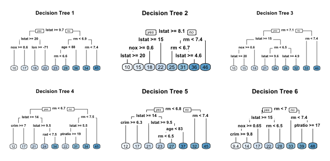
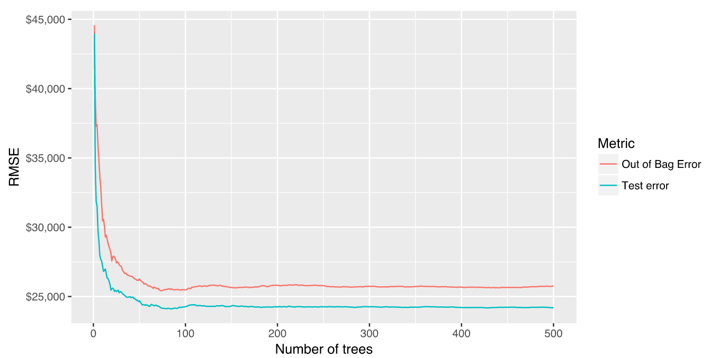
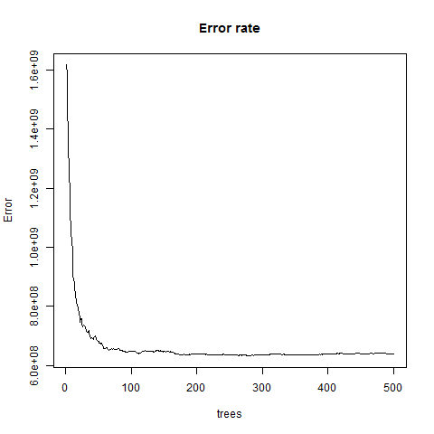
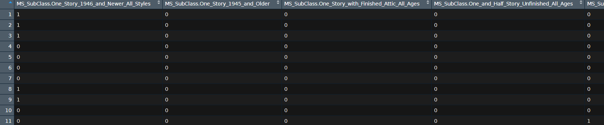
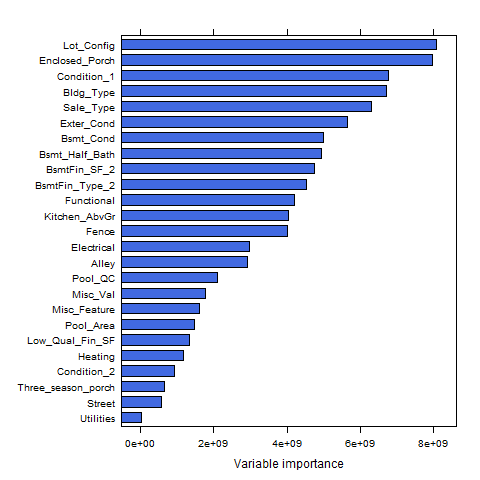
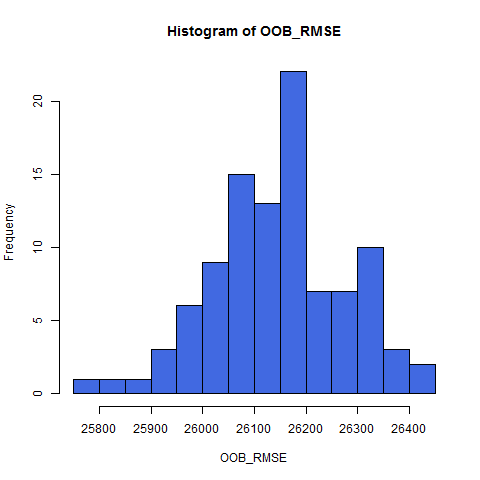

## Random Forests

- [**Bagging**](https://en.wikipedia.org/wiki/Bootstrap_aggregating) can turn a single tree model with high variance and poor predictive power into a fairly accurate prediction function. 
- But bagging suffers from [**tree correlation**](https://stats.stackexchange.com/questions/295868/why-is-tree-correlation-a-problem-when-working-with-bagging), which reduces the overall performance of the model. 
- [**Random forests**](https://en.wikipedia.org/wiki/Random_forest) are a modification of bagging that builds a large collection of de-correlated trees 
- It is a very popular [**out-of-the-box**](https://en.wikipedia.org/wiki/Out_of_the_box_(feature)) learning algorithm that enjoys good predictive performance. 

<!--
out of the box - läuft ohne weitere Anpassungen

-->


## Extending the bagging technique

<!--
- Random forests are built on the same fundamental principles as decision trees and bagging. 
-->
- Bagging introduces a random component in to the tree building process 
<!--
that reduces the variance of a single tree’s prediction. 
-->
- The trees in bagging are not completely independent of each other since all the original predictors are considered at every split of every tree. 
- Trees from different bootstrap samples have similar structure to each other (especially at the top of the tree) due to underlying relationships.


## Similar trees - tree correlation

- If we create six decision trees with different bootstrapped samples of the Boston housing data, the top of the trees all have a very similar structure. 
- Although there are 15 predictor variables to split on, all six trees have both `lstat` and `rm` variables driving the first few splits.



## Tree correlation

- Tree correlation prevents bagging from optimally reducing variance of the predictive values. 
- To reduce variance further, we need to minimize the amount of correlation between the trees. 
- This can be achieved by injecting more randomness into the tree-growing process. 

## Random forests achieve this in two ways:

1) Bootstrap: 

- Similar to bagging, each tree is grown to a bootstrap resampled data set, which makes them different and decorrelates them.

2) Split-variable randomization: 

- For every split, the search for the split variable is limited to a random subset of $m$ of the $p$ variables.
<!--
Für was steht m und p hier?
-->
- For regression trees, typical default values are $m=p/3$ (tuning parameter). 
- When $m=p$, the randomization is limited (only step 1) and is the same as bagging.


## Basic algorithm

The basic algorithm for a regression random forest can be generalized:

```
1.  Given training data set
2.  Select number of trees to build (ntrees)
3.  for i = 1 to ntrees do
4.  |  Generate a bootstrap sample of the original data
5.  |  Grow a regression tree to the bootstrapped data
6.  |  for each split do
7.  |  | Select m variables at random from all p variables
8.  |  | Pick the best variable/split-point among the m
9.  |  | Split the node into two child nodes
10. |  end
11. | Use tree model stopping criteria to determine: tree complete 
12. end
```

The algorithm randomly selects a bootstrap sample to train and predictors to use at each split.
<!--
, tree correlation will be lessened beyond bagged trees.
-->

## Characteristics

- Since bootstrap samples and features are selected randomly at each split, we create a more diverse set of trees, which tends to lessen tree correlation beyond bagged trees and often dramatically increase predictive power.
<!--
- random forests have the least variability in their prediction accuracy when tuning.
-->

### out-of-bag error 

- Similar to bagging, a natural benefit of the bootstrap resampling process is that random forests have an [**out-of-bag**](https://en.wikipedia.org/wiki/Out-of-bag_error) (OOB) sample that provides an efficient and reasonable approximation of the test error. 
- This provides a built-in validation set without any extra work, and you do not need to sacrifice any of your training data to use for validation. 
- We are more efficient identifying the number of trees required to stablize the error rate 
<!--
during tuning; 


## Out-of-bag error vs. validation error

- Some difference between the OOB error and test error are expected.


-->


## Preparation - random forests

- The following slides are based on UC Business Analytics R Programming Guide  on [**random forests**](http://uc-r.github.io/random_forests)


```r
library(rsample)      # data splitting 
library(randomForest) # basic implementation
library(ranger)       # a faster implementation of randomForest
# an aggregator package for performing many 
# machine learning models
library(caret)        
```


## The Ames housing data


```r
set.seed(123)
ames_data <- AmesHousing::ames_raw
```


```r
set.seed(123)
ames_split <- rsample::initial_split(ames_data,prop=.7)
ames_train <- rsample::training(ames_split)
ames_test  <- rsample::testing(ames_split)
```


## Basic implementation

- There are over 20 random forest packages in R.
- To demonstrate the basic implementation we use the `randomForest` package, the oldest and most well known implementation of the random forest algorithm in R. 
- As your data set grows in size `randomForest` does not scale well (although you can parallelize with `foreach`). 
- To explore and compare a variety of tuning parameters we can find more effective packages. 
- The package `ranger` will be presented in the tuning section.


## `randomForest::randomForest`

- `randomForest` can use the formula or  x-y matrix notation. 
- Below we apply the default `randomForest` model using the formal specification. 
- The default random forest performs 500 trees and $\dfrac{\text{nr. features}}{3}=26$ randomly selected predictor variables at each split. 

<!--
- Averaging across all 500 trees provides an OOB MSE=659550782 (RMSE=25682).
-->


```r
set.seed(123)
# default RF model
(m1 <- randomForest(formula = Sale_Price ~ .,data=ames_train))
```


```
## 
## Call:
##  randomForest(formula = Sale_Price ~ ., data = ames_train) 
##                Type of random forest: regression
##                      Number of trees: 500
## No. of variables tried at each split: 26
## 
##           Mean of squared residuals: 639516350
##                     % Var explained: 89.7
```

<!--
## The resulting object `m1`
-->


## Plotting the model

<!--
- Plotting the model will illustrate the error rate as we average across more trees and shows that our 
-->

- The error rate stabalizes with around 100 trees but continues to decrease slowly until around 300 trees.


```r
plot(m1,main="Error rate")
```


{height=65%}

## Random forests - out-of-the-box algorithm

<!--
- Random forests are one of the best “out-of-the-box” machine learning algorithms. 
-->
- Random forests perform remarkably well with very little tuning.
- We get an RMSE of less than 30K dollar without any tuning.
- This is more than 6K dollar RMSE-reduction compared to a fully-tuned bagging model 
- and 4K dollar reduction to to a fully-tuned elastic net model. 
- We can still seek improvement by tuning our random forest model.

### Tuning Random forests

- Random forests are fairly easy to tune since there are only a handful of tuning parameters. 
- First we tune the number of candidate variables to select from at each split. 
- A few additional hyperparameters are important. 

## Tuning parameters (I)

<!--
- The argument names may differ across packages, but these hyperparameters should be present:
-->

- The following hyperparameter are important (names may differ across packages):

### number of trees

- `ntree` - We want enough trees to stabalize the error but using too many trees is inefficient, esp. for large data sets.

### number of variables

- `mtry` - number of variables as candidates at each split. When `mtry=p` the model equates to bagging. 
- When `mtry=1` the split variable is completely random, all variables get a chance but can lead to biased results. Suggestion: start with 5 values evenly spaced across the range from 2 to p.

## Tuning parameters (II)

### Number of samples

- `sampsize` -  Default value is 63.25%  since this is the expected value of unique observations in the bootstrap sample. 
- Lower sample sizes can reduce training time but may introduce more bias. Increasing sample size can increase performance but at risk of overfitting - it introduces more variance. 
<!--
- When tuning this parameter we stay near the 60-80% range.
-->

## Tuning parameters (III)

### minimum number of samples within the terminal nodes:

- `nodesize` - Controls the complexity of the trees. 
- It is the minimum size of terminal nodes.
- Smaller node size allow for deeper, more complex trees 
- This is another bias-variance tradeoff where deeper trees introduce more variance (risk of overfitting) 
- Shallower trees introduce more bias (risk of not fully capturing unique patters and relatonships in the data).

<!--
https://stats.stackexchange.com/questions/158583/what-does-node-size-refer-to-in-the-random-forest
-->

### maximum number of terminal nodes

- `maxnodes`: A way to control the complexity of the trees. 
- More nodes equates to deeper, more complex trees. 
- Less nodes result in shallower trees.


## Initial tuning with `randomForest`

- If we just tune the `mtry` parameter we can use `randomForest::tuneRF` for a quick and easy tuning assessment.
<!--
- `tuneRf` will start at a value of `mtry` that you supply and increase by a certain step factor until the OOB error stops improving. 
-->
- We start with 5 candidate variables (`mtryStart=5`) and increase by a factor of 2 until the OOB error stops improving by 1 per cent. 
- `tuneRF` requires a separate x y specification. 
- The optimal `mtry` value in this sequence is very close to the default mtry value of $\dfrac{\text{features}}{3}=26$.


```r
features <- setdiff(names(ames_train), "Sale_Price")
```


```r
set.seed(123)
m2<-tuneRF(x= ames_train[,features],
  y= ames_train$Sale_Price,ntreeTry   = 500,
  mtryStart  = 5,stepFactor = 2,
  improve    = 0.01,trace=FALSE)
```


## Full grid search with `ranger`

- To perform a larger grid search across several hyperparameters we’ll need to create a grid, loop through each hyperparameter combination and evaluate the model. 
- Unfortunately, this is where `randomForest` becomes quite inefficient since it does not scale well. 
- Instead, we can use `ranger` which is a C++ implementation of Breiman’s random forest algorithm and is over 6 times faster than `randomForest`.


## Assessing the speed

### `randomForest` speed


```r
system.time(
  ames_randomForest <- randomForest(
    formula = Sale_Price ~ ., 
    data    = ames_train, 
    ntree   = 500,
    mtry    = floor(length(features) / 3)
  )
)
```


```r
#       User      System    elapsed 
#     145.47        0.09      152.48 
```


## `ranger` speed


```r
system.time(
  ames_ranger <- ranger(formula=Sale_Price ~ ., 
    data      = ames_train,num.trees = 500,
    mtry      = floor(length(features) / 3))
)
```

```
##    user  system elapsed 
##    9.13    0.03    3.23
```


## The grid search

- To perform the grid search, we construct our grid of hyperparameters. 


```r
# hyperparameter grid search
hyper_grid <- expand.grid(
  mtry       = seq(20, 30, by = 2),
  node_size  = seq(3, 9, by = 2),
  sampe_size = c(.55, .632, .70, .80),
  OOB_RMSE   = 0
)
```

- We search across 96 different models with varying `mtry`, minimum node size, and sample size.


```r
nrow(hyper_grid) # total number of combinations
```

```
## [1] 96
```


## Loop - hyperparameter combination (I)

- We apply 500 trees since our previous example illustrated that 500 was plenty to achieve a stable error rate. 
- We set the random number generator seed. This allows us to consistently sample the same observations for each sample size and make the impact of each change clearer. 


```r
for(i in 1:nrow(hyper_grid)) {
  model <- ranger(formula= Sale_Price ~ .,data= ames_train, 
    num.trees       = 500,mtry= hyper_grid$mtry[i],
    min.node.size   = hyper_grid$node_size[i],
    sample.fraction = hyper_grid$sampe_size[i],
    seed            = 123)
    # add OOB error to grid
  hyper_grid$OOB_RMSE[i] <- sqrt(model$prediction.error)
}
```


## The results - samll difference between RMSE

<!--
- Our OOB RMSE ranges between 25000 - 26000. 
-->


```r
hyper_grid %>% dplyr::arrange(OOB_RMSE) %>% head(10)
```


```
##    mtry node_size sampe_size OOB_RMSE
## 1    26         3        0.8 25404.60
## 2    28         3        0.8 25405.92
## 3    28         5        0.8 25459.46
## 4    26         5        0.8 25493.80
## 5    30         3        0.8 25528.26
## 6    22         3        0.7 25552.73
## 7    26         9        0.8 25554.31
## 8    28         7        0.8 25578.45
## 9    20         3        0.8 25581.23
## 10   24         3        0.8 25590.73
```


<!--
## Loop - hyperparameter combination (I)
-->
<!--
- Our top 10 performing models all have RMSE values and 
-->
- Models with slighly larger sample sizes (70-80 per cent) and deeper trees (3-5 observations in terminal node) perform best. 
- We get various `mtry` values in top 10 - not over influential.
<!--
in their original columnar form, 
-->


<!--
##

- Random forests perform well with categorical variables 
- It is worth checking to see if alternative encodings can increase performance. 
- We adjust `mtry` to search from 50-200 random predictor variables at each split and re-perform our grid search. 
- The results suggest that one-hot encoding does not improve performance.
-->

## Hyperparameter grid search - categorical variables

- We use [**one-hot encoding**](https://hackernoon.com/what-is-one-hot-encoding-why-and-when-do-you-have-to-use-it-e3c6186d008f) for our categorical variables which produces 353 predictor variables versus the 80 we were using above. 


```r
# one-hot encode our categorical variables
(one_hot <- dummyVars(~ ., ames_train, fullRank = FALSE))
```

```
## Dummy Variable Object
## 
## Formula: ~.
## 81 variables, 46 factors
## Variables and levels will be separated by '.'
## A less than full rank encoding is used
```

## Make a dataframe of dummy variable object


```r
ames_train_hot<-predict(one_hot,ames_train)%>%as.data.frame()
```




## Hot encoding and hypergrid


```r
# make ranger compatible names
names(ames_train_hot) <- make.names(names(ames_train_hot), 
                                    allow_ = FALSE)
# --> same as above but with increased mtry values
hyper_grid_2 <- expand.grid(
  mtry       = seq(50, 200, by = 25),
  node_size  = seq(3, 9, by = 2),
  sampe_size = c(.55, .632, .70, .80),
  OOB_RMSE  = 0
)
```


## The best model

### The best random forest model:

- uses columnar categorical variables
- `mtry` = 24, 
- terminal node size of 5 observations
- sample size of 80%. 

### How to proceed

- Repeat the model to get a better expectation of error rate. 

<!--
- as expected error ranges between ~25,800-26,400 

with a most likely just shy of 26,200.


-->

## Random forests with `ranger`

- The `impurity` measure is the variance of the responses for regression
- `impurity` is a measure for heterogeneity - it measures how well the classes are  
<!--
https://stats.stackexchange.com/questions/220321/what-is-node-impurity-purity-in-decision-trees-in-plain-english-why-do-we-need

https://people.cs.pitt.edu/~milos/courses/cs2750-Spring03/lectures/class19.pdf
-->


```r
OOB_RMSE <- vector(mode = "numeric", length = 100)
for(i in seq_along(OOB_RMSE)) {
  optimal_ranger <- ranger(formula= Sale_Price ~ ., 
    data            = ames_train, 
    num.trees       = 500,
    mtry            = 24,
    min.node.size   = 5,
    sample.fraction = .8,
    importance      = 'impurity')
  OOB_RMSE[i] <- sqrt(optimal_ranger$prediction.error)
}
```


## Variable importance / node impurity

- [**Node impurity**](https://stats.stackexchange.com/questions/223109/what-do-we-mean-by-node-impurity-ref-random-forest) represents how well the trees split the data. There are several impurity measures; 
- Gini index, Entropy and misclassification error are [options](https://www.cs.indiana.edu/~predrag/classes/2017fallb365/ch4.pdf) to measure the node impurity

- We set `importance = 'impurity'`, which allows us to assess variable importance. 
- [**Variable importance**](https://topepo.github.io/caret/variable-importance.html) is measured by recording the decrease in MSE each time a variable is used as a node split in a tree. 
- The remaining error left in predictive accuracy after a node split is known as node impurity.
<!--
https://medium.com/the-artificial-impostor/feature-importance-measures-for-tree-models-part-i-47f187c1a2c3
http://www.cse.msu.edu/~cse802/DecisionTrees.pdf
https://www.cs.indiana.edu/~predrag/classes/2017fallb365/ch4.pdf

http://mason.gmu.edu/~jgentle/csi772/16s/L10_CART_16s.pdf

https://stats.stackexchange.com/questions/158583/what-does-node-size-refer-to-in-the-random-forest
-->
- A variable that reduces this impurity is considered more imporant than those variables that do not. 
- We accumulate the reduction in MSE for each variable across all the trees and the variable with the greatest accumulated impact is considered the more important. 

## Plot the variable importance


```r
varimp_ranger <- optimal_ranger$variable.importance 
```


```r
lattice::barchart(sort(varimp_ranger)[1:25],col="royalblue")
```

- We see that Utilities has the greatest impact in reducing MSE across our trees, followed by `names(sort(varimp_ranger))[2]`, Low_Qual_Fin_SF, etc.


{height=60%}


## A histogram of OOB RMSE


```r
hist(OOB_RMSE, breaks = 20,col="royalblue")
```


{height=75%}


## Predicting

- With the  preferred model we can use the traditional predict function to make predictions on a new data set. 
- We can use this for all our model types (`randomForest` and `ranger`); although the outputs differ slightly. 
<!--
- not that the new data for the `h2o` model needs to be an `h2o` object.
-->

```r
# randomForest
pred_randomForest <- predict(ames_randomForest, ames_test)
head(pred_randomForest)
```

```
##        1        2        3        4        5        6 
## 113543.1 185556.4 259258.1 190943.9 179071.0 480952.3
```

```r
# ranger
pred_ranger <- predict(ames_ranger, ames_test)
head(pred_ranger$predictions)
```

```
## [1] 129258.1 186520.7 265628.2 197745.5 175517.6 392691.7
```


## Summary - random forests

- Random forests provide a very powerful out-of-the-box algorithm that often has great predictive accuracy. 
- Because of their more simplistic tuning nature and the fact that they require very little, if any, feature pre-processing they are often one of the first go-to algorithms when facing a predictive modeling problem. 

<!--
To learn more I would start with the following resources listed in order of complexity
-->

## Advantages & Disadvantages

### Advantages - random forrests

- Typically have very good performance
- Remarkably good “out-of-the box” - very little tuning required
- Built-in validation set - don’t need to sacrifice data for extra validation
- No pre-processing required
- Robust to outliers

### Disadvantages - random forrests

- Can become slow on large data sets
- Although accurate, often cannot compete with advanced boosting algorithms
- Less interpretable


## Links 

These slides are mainly based on 

- A UC Business Analytics R Programming Guide - section [**random forests**](http://uc-r.github.io/random_forests)

- and on the [**chapter on random forests**](https://bradleyboehmke.github.io/HOML/random-forest.html) in the e-book of 
Brad Boehmke and Brandon Greenwell - Hands-on Machine Learning with R


- [**Rpubs tutorial** - random forests](https://rpubs.com/nuhorchak/randomForest)

- [Random Forests in R](https://rpubs.com/anish20/RandomForests)

- [Boston Dataset-Tree Family Part-1](https://rpubs.com/Hgoswami/368562)
