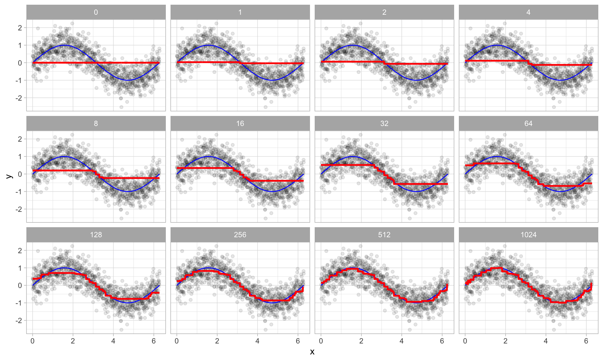

```{r setup, include=FALSE}
knitr::opts_chunk$set(echo = TRUE,message=F,warning=F,cache=T)
timeconsuming <- F
```


## Gradient Boosting Machines (GBMs)

- GBMs are extremely popular, successful across many domains and one of the leading methods for winning [**Kaggle competitions**](https://www.kaggle.com/competitions). 
- GBMs build an ensemble of flat and weak successive trees with each tree learning and improving on the previous. 
- When combined, these trees produce a powerful “committee” often hard to beat with other algorithms. 

- The following slides are based on UC Business Analytics R Programming Guide on [**GBM regression**](http://uc-r.github.io/gbm_regression)


<!--
## [Gradient boosting](https://en.wikipedia.org/wiki/Gradient_boosting)

Gradient boosting is a machine learning technique for regression and classification problems, which produces a prediction model in the form of an ensemble of weak prediction models, typically decision trees. It builds the model in a stage-wise fashion like other boosting methods do, and it generalizes them by allowing optimization of an arbitrary differentiable loss function.

The idea of gradient boosting originated in the observation by Leo Breiman that boosting can be interpreted as an optimization algorithm on a suitable cost function.


Breiman, L. (1997). "Arcing The Edge". Technical Report 486. Statistics Department, University of California, Berkeley.

## Explicit algorithms

Explicit regression gradient boosting algorithms were subsequently developed by Jerome H. Friedman, simultaneously with the more general functional gradient boosting perspective of Llew Mason, Jonathan Baxter, Peter Bartlett and Marcus Frean.


The latter two papers introduced the view of boosting algorithms as iterative functional gradient descent algorithms. That is, algorithms that optimize a cost function over function space by iteratively choosing a function (weak hypothesis) that points in the negative gradient direction. This functional gradient view of boosting has led to the development of boosting algorithms in many areas of machine learning and statistics beyond regression and classification.

## [**Advantages of gradient boosting**](http://uc-r.github.io/gbm_regression)

- Often provides predictive accuracy that cannot be beat.
- Lots of flexibility - can optimize on different loss functions and provides several hyperparameter tuning options that make the function fit very flexible.
- No data pre-processing required - often works great with categorical and numerical values as is.
- Handles missing data - imputation not required.

## [**Disadvantages**](http://uc-r.github.io/gbm_regression) of gradient boosting


- GBMs will continue improving to minimize all errors. This can overemphasize outliers and cause overfitting. Must use cross-validation to neutralize.
- Computationally expensive - GBMs often require many trees (>1000) which can be time and memory exhaustive.
- The high flexibility results in many parameters that interact and influence heavily the behavior of the approach (number of iterations, tree depth, regularization parameters, etc.). This requires a large grid search during tuning.
- Less interpretable although this is easily addressed with various tools (variable importance, partial dependence plots, LIME, etc.).

-->

## The idea of GBMs

- Many machine learning models are founded on a single predictive model (i.e. linear regression, penalized models, naive bayes, svm). 
- Other approaches (bagging, random forests) are built on the idea of building an ensemble of models where each individual model predicts the outcome and the ensemble simply averages the predicted values. 
<!--
- The family of boosting methods is based on a different, constructive strategy of ensemble formation.
-->
- The idea of boosting is to add models to the ensemble sequentially. 
- At each particular iteration, a new weak, base-learner model is trained with respect to the error of the whole ensemble learnt so far.

{ height=70% }


<!--
## Important note

- tree-based methods tend to perform well on unprocessed data (i.e. without normalizing, centering, scaling features). 
- In this tutorial I focus on how to implement GBMs with various packages. 
- Although I do not pre-process the data, realize that you can improve model performance by spending time processing variable attributes.

## Advantages & Disadvantages
-->


## Advantages of GBMs

### Predictive accuracy

-    GBMs often provide predictive accuracy that cannot be beat.

###    Flexibility 
- optimization on various loss functions possible and several hyperparameter tuning options.
<!--
 that make the function fit very flexible
-->

###  No data pre-processing required 
- often works great with categorical and numerical values as is.

###  Handles missing data 

- imputation not required.

## Disadvantages of GBMs

### GBMs oeremphasize outliers 

- This causes overfitting.
- GBMs will continue improving to minimize all errors.  Use cross-validation to neutralize.


### Computationally expensive

- GBMs often require many trees (>1000) which can be time and memory exhaustive.
-    The high flexibility results in many parameters that interact and influence heavily the behavior of the approach (number of iterations, tree depth, regularization parameters, etc.). 
- This requires a large grid search during tuning.

### Interpretability

- GBMs are less interpretable, but this is easily addressed with various tools (variable importance, partial dependence plots, `LIME`, etc.).


## Important concepts

### Base-learning models 

- Boosting is a framework that iteratively improves any weak learning model. 
- Many gradient boosting applications allow you to “plug in” various classes of weak learners at your disposal. 
- In practice, boosted algorithms often use decision trees as the base-learner. 
<!--
- Consequently, this tutorial will discuss boosting in the context of regression trees.
-->


## Training weak models

- A weak model has an error rate only slightly better than random guessing. 
- The idea behind boosting is that each sequential model builds a simple weak model to slightly improve the remaining errors. 
- Shallow trees represent weak learner - trees with only 1-6 splits. 

### Benefits of combining many weak models:

<!--
(versus strong ones)
-->

- [**Speed**](https://cran.r-project.org/web/packages/gbm/vignettes/gbm.pdf): Constructing weak models is computationally cheap.
- [**Accuracy improvement**](https://bradleyboehmke.github.io/HOML/gbm.html): Weak models allow the algorithm to learn slowly; making minor adjustments in new areas where it does not perform well. In general, statistical approaches that learn slowly tend to perform well.
- [**Avoids overfitting**](https://www.kdnuggets.com/2019/02/understanding-gradient-boosting-machines.html): Due to making only small incremental improvements with each model in the ensemble, this allows us to stop the learning process as soon as overfitting has been detected (typically by using cross-validation).


## Sequential training with respect to errors

- Boosted trees are grown sequentially; 
- Each tree is grown using information from previously grown trees. 
- The basic algorithm for boosted regression trees can be generalized to the following where $x$ represents our features and $y$ represents our response:

1.) Fit a decission tree: $F_1(x)=y$

2.) the next decission tree is fixed to the residuals of the previous: $h_1(x)=y-F_1(x)$

3.) Add this new tree to our algorithm: $F_2(x)=F_1(x)+h_1(x)$

4.) The next decission tree is fixed to the residuals of $F_2: h_2(x)=y-F_2(x)$

5.) Add the new tree to the algorithm: $F_3(x)=F_2(x) + h_1(x)$

Continue this process until some mechanism (i.e. cross validation) tells us to stop.

## Basic algorithm for boosted regression trees

- The basic algorithm for boosted regression trees can be generalized. 
- The final model is simply a stagewise additive model of $b$ individual regression trees:

$$
f(x)=B\sum\limits_{b=1}^B f^b(x)
$$

<!--
## Illustration behavior

- To illustrate the behavior, assume the following x and y observations. 
- The blue sine wave represents the true underlying function and the points represent observations that include some irriducible error (noise). 
- The boosted prediction illustrates the adjusted predictions after each additional sequential tree is added to the algorithm. 
- Initially, there are large errors which the boosted algorithm improves upon immediately but as the predictions get closer to the true underlying function you see each additional tree make small improvements in different areas across the feature space where errors remain. 
- Towards the end of the gif, the predicted values nearly converge to the true underlying function.
-->

## [Boosted regression decision stumps as 0-1024 successive trees are added.](https://bradleyboehmke.github.io/HOML/gbm.html)



## Boosted regression figure - explained 

- The figure illustrates with a simple example where a single predictor ($x$) has a true underlying sine wave relationship (blue line) with y along with some irriducible error. 
- The first tree fit in the series is a single decision stump (i.e., a tree with a single split). 
- Each following successive decision stump is fit to the previous one’s residuals. 
- Initially there are large errors, but each additional decision stump in the sequence makes a small improvement in different areas across the feature space where errors still remain.

## Gradient descent

- Many algorithms, including decision trees, focus on minimizing the residuals and, therefore, emphasize the MSE loss function. 
- In GBM approach, regression trees are fitted sequentially to minimize the errors. 
- This minimizes the loss function - mean squared error (MSE). 
- Often we wish to focus on other loss functions such as [**mean absolute error**](https://en.wikipedia.org/wiki/Mean_absolute_error) (MAE) or to be able to apply the method to a classification problem with a loss function such as [**deviance**](https://en.wikipedia.org/wiki/Deviance_(statistics)). 
- The name gradient boosting machines come from the fact that this procedure can be generalized to loss functions other than MSE.

## A gradient descent algorithm

- Gradient boosting is considered a gradient descent algorithm. 
- Which is a very generic optimization algorithm capable of finding optimal solutions to a wide range of problems. 
- The general idea of gradient descent is to tweak parameters iteratively in order to minimize a cost function. 

### Example

- Suppose you are a downhill skier racing your friend. 
- A good strategy to beat your friend is to take the path with the steepest slope. 
- This is exactly what gradient descent does - it measures the local gradient of the loss (cost) function for a given set of parameters ($\Phi$) and takes steps in the direction of the descending gradient. 
- Once the gradient is zero, we have reached the minimum.

## Gradient descent (Geron, 2017).


## Gradient descent

- Gradient descent can be performed on any loss function that is differentiable. 
- This allows GBMs to optimize different loss functions as desired 
<!--
(see ESL, p. 360 for common loss functions). 
-->
- An important parameter in gradient descent is the size of the steps which is determined by the learning rate. 
- If the learning rate is too small, then the algorithm will take many iterations to find the minimum. 
- But if the learning rate is too high, you might jump cross the minimum and end up further away than when you started.


## Shape of cost functions

- Not all cost functions are convex (bowl shaped). 
- There may be local minimas, plateaus, and other irregular terrain of the loss function that makes finding the global minimum difficult. 
- Stochastic gradient descent can help us address this problem by sampling a fraction of the training observations (typically without replacement) and growing the next tree using that subsample. 
- This makes the algorithm faster but the stochastic nature of random sampling also adds some random nature in descending the loss function gradient. 
- Although this randomness does not allow the algorithm to find the absolute global minimum, it can actually help the algorithm jump out of local minima and off plateaus and get near the global minimum.

## Stochastic gradient descent

{height=60%}


## Tuning GBM

- GBMs are highly flexible - many tuning parameters
- It is time consuming to find the optimal combination of hyperparameters

### Number of trees

- GBMs often require many trees; unlike random forests GBMs can overfit so the goal is to find the optimal number of trees that minimize the loss function of interest with cross validation.

## Tuning parameters

### Depth of trees

- The number $d$ of splits in each tree, which controls the complexity of the boosted ensemble. 
- Often $d=1$ works well, in which case each tree is a stump consisting of a single split. More commonly, $d$ is greater than 1 but it is unlikely $d>10$
 will be required.

### Learning rate

- The number d of splits in each tree, which controls the complexity of the boosted ensemble. 
- Often $d=1$ works well, in which case each tree is a stump consisting of a single split. -
- Normally, $d$ is greater than 1 but it is unlikely $d>10$ will be required.

## Tuning parameters (II)

### Subsampling

- Controls if a fraction of the available training observations is used. 
- Using less than 100% of the training observations means you are implementing [**stochastic gradient descent**](https://en.wikipedia.org/wiki/Stochastic_gradient_descent). 
- This can help to minimize overfitting and keep from getting stuck in a local minimum or plateau of the loss function gradient.

## The necessary packages 

```{r necpackagesgbm}
library(rsample)      # data splitting 
library(gbm)          # basic implementation
library(xgboost)      # a faster implementation of gbm
library(caret)        # aggregator package - machine learning
library(pdp)          # model visualization
library(ggplot2)      # model visualization
library(lime)         # model visualization
```

```{r,eval=F,echo=F}
install.packages("gbm")
install.packages("lime")
install.packages("vtreat")
install.packages("gbm")
install.packages("lime")
install.packages("vtreat")
```


## The dataset

- Again, we use the Ames housing dataset 

```{r,eval=F}
ames_data <- AmesHousing::make_ames()
```

```{r,eval=F,echo=F}
save(ames_data,file="../data/ames_data.RData")
```

```{r,echo=F}
load("../data/ames_data.RData")
```


```{r}
set.seed(123)
ames_split <- initial_split(ames_data,prop=.7)
ames_train <- training(ames_split)
ames_test  <- testing(ames_split)
```


## Package implementation

The most popular implementations of GBM in R:

### gbm

The original R implementation of GBMs

### xgboost

A fast and efficient gradient boosting framework (C++ backend).

### h2o

A powerful java-based interface that provides parallel distributed algorithms and efficient productionalization.

## The R-package `gbm`

The `gbm` R package is an implementation of extensions to Freund and Schapire’s AdaBoost algorithm and Friedman’s gradient boosting machine. This is the original R implementation of GBM. 

<!--
https://www.slideshare.net/mark_landry/gbm-package-in-r
-->

## Basic implementation

- two primary training functions: `gbm::gbm` and `gbm::gbm.fit`. 
- `gbm::gbm` uses the formula interface to specify your model 
- `gbm::gbm.fit` requires the separated x and y matrices (more efficient with many variables). 

<!--
When working with many variables it is more efficient to use the matrix rather than formula interface.
-->


- The default settings in `gbm` includes a learning rate (shrinkage) of 0.001.
- This is a very small learning rate and typically requires a large number of trees to find the minimum MSE. 
- `gbm` uses a default number of trees of 100, which is rarely sufficient. - - The default depth of each tree (interaction.depth) is 1, which means we are ensembling a bunch of stumps. Lastly, I also include cv.folds to perform a 5 fold cross validation. The model took about 90 seconds to run and the results show that our MSE loss function is minimized with 10,000 trees.

## Train GBM model

<!--
folgendes dauert auch wieder länger
-->

```{r,eval=timeconsuming}
set.seed(123)
gbm.fit <- gbm(formula = Sale_Price ~ .,
               distribution = "gaussian",
  data = ames_train,n.trees = 10000,interaction.depth = 1,
  shrinkage = 0.001,cv.folds = 5,
  n.cores = NULL, # will use all cores by default
  verbose = FALSE)  
# print results
```

```{r,echo=F,eval=F}
# das dauert recht lange
save(gbm.fit,file="../data/ml_gbm_fit.RData")
```

```{r,echo=F}
load("../data/ml_gbm_fit.RData")
```


```{r}
print(gbm.fit)
```

## Exercise

- Take some time to dig around in the `gbm.fit` object to get comfortable with its components. 


## The output object...

- ... is a list containing several modelling and results information. 
- We can access this information with regular indexing; 
- The minimum CV RMSE is 29133 (this means on average our model is about $29,133 off from the actual sales price) but the plot also illustrates that the CV error is still decreasing at 10,000 trees.

## Get MSE and compute RMSE

```{r}
sqrt(min(gbm.fit$cv.error))
# plot loss function as a result of n trees 
# added to the ensemble
gbm.perf(gbm.fit, method = "cv")
```

<!--
In this case, the small learning rate is resulting in very small incremental improvements which means many trees are required. In fact, for the default learning rate and tree depth settings it takes 39,906 trees for the CV error to minimize (~ 5 minutes of run time)!
-->

## Tuning GBMs
<!--
However, rarely do the default settings suffice. We could tune parameters one at a time to see how the results change. 
-->
- The learning rate is increased to take larger steps down the gradient descent, 
- The number of trees is reduced (since we reduced the learning rate), 
and increase the depth of each tree.

<!--
using a single split to 3 splits.
This model takes about 90 seconds to run and achieves a significantly lower RMSE than our initial model with only 1,260 trees.
-->

```{r,eval=F}
set.seed(123)
gbm.fit2 <- gbm(formula = Sale_Price ~ .,
  distribution = "gaussian",data = ames_train,
  n.trees = 5000,interaction.depth = 3,shrinkage = 0.1,
  cv.folds = 5,n.cores = NULL,verbose = FALSE)  
```

```{r,eval=F,echo=F}
save(gbm.fit2,file="../data/ml_gbm_fit2.RData")
```

```{r,echo=F}
load("../data/ml_gbm_fit2.RData")
```


```{r}
# find index for n trees with minimum CV error
min_MSE <- which.min(gbm.fit2$cv.error)
# get MSE and compute RMSE
sqrt(gbm.fit2$cv.error[min_MSE])
# plot loss function as a result of n trees added to the ensemble
gbm.perf(gbm.fit2, method = "cv")
```

## Grid search

<!--
However, a better option than manually tweaking hyperparameters one at a time is to perform a grid search which iterates over every combination of hyperparameter values and allows us to assess which combination tends to perform well. To perform a manual grid search, first we want to construct our grid of hyperparameter combinations. We’re going to search across 81 models with varying learning rates and tree depth. I also vary the minimum number of observations allowed in the trees terminal nodes (n.minobsinnode) and introduce stochastic gradient descent by allowing bag.fraction < 1.
-->

- the minimum number of observations allowed in the trees terminal nodes (`n.minobsinnode`) is varied

```{r}
hyper_grid <- expand.grid(
  shrinkage = c(.01, .1, .3),
  interaction.depth = c(1, 3, 5),
  n.minobsinnode = c(5, 10, 15),
  bag.fraction = c(.65, .8, 1), 
  optimal_trees = 0,# a place to dump results
  min_RMSE = 0                     
)

# total number of combinations
nrow(hyper_grid)
```

## 

- We loop through each hyperparameter combination (5,000 trees). 
-  To speed up the tuning process, instead of performing 5-fold CV I train on 75% of the training observations and evaluate performance on the remaining 25%. 
<!--
Important note:
-->
- When using `train.fraction` it will take the first XX% of the data so its important to randomize your rows in case their is any logic behind the ordering of the data (i.e. ordered by neighborhood).

<!--
After about 30 minutes of training time our grid search ends and we see a few important results pop out. 
-->
- Our top model has better performance than our previously fitted model above, with the RMSE nearly $3,000 lower. Second, looking at the top 10 models we see that:
- none of the top models used a learning rate of 0.3; small incremental steps down the gradient descent appears to work best,
- none of the top models used stumps (`interaction.depth = 1`); there are likely stome important interactions that the deeper trees are able to capture,
- adding a stochastic component with bag.fraction < 1 seems to help; there may be some local minimas in our loss function gradient,

<!--
- none of the top models used `n.minobsinnode = 15`; the smaller nodes may allow us to capture pockets of unique feature-price point instances,


- in a few instances we appear to use nearly all 5,000 trees; 

maybe we should increase this parameter in our next search?
-->

## Randomize data

```{r}
random_index <- sample(1:nrow(ames_train), nrow(ames_train))
random_ames_train <- ames_train[random_index, ]
```


## Grid search - loop over hyperparameter grid

```{r,eval=F}
for(i in 1:nrow(hyper_grid)) {
  set.seed(123)
  gbm.tune <- gbm(
    formula = Sale_Price ~ .,distribution = "gaussian",
    data = random_ames_train,n.trees = 5000,
    interaction.depth = hyper_grid$interaction.depth[i],
    shrinkage = hyper_grid$shrinkage[i],
    n.minobsinnode = hyper_grid$n.minobsinnode[i],
    bag.fraction = hyper_grid$bag.fraction[i],
    train.fraction = .75,n.cores = NULL,verbose = FALSE
  )
  # add min training error and trees to grid
  hyper_grid$optimal_trees[i] <- which.min(gbm.tune$valid.error)
  hyper_grid$min_RMSE[i] <- sqrt(min(gbm.tune$valid.error))
}
```


```{r,eval=F,echo=F}
save(gbm.tune,hyper_grid,file="../data/ml_gbm_tune.RData")
```

```{r,echo=F}
load("../data/ml_gbm_tune.RData")
```


```{r}
hyper_grid %>% 
  dplyr::arrange(min_RMSE) %>%
  head(10)
```


## Refine the search - adjust the grid

```{r}
# modify hyperparameter grid
hyper_grid <- expand.grid(
  shrinkage = c(.01, .05, .1),
  interaction.depth = c(3, 5, 7),
  n.minobsinnode = c(5, 7, 10),
  bag.fraction = c(.65, .8, 1), 
  optimal_trees = 0,# a place to dump results
  min_RMSE = 0# a place to dump results
)

# total number of combinations
nrow(hyper_grid)
```

## The final model

```{r}
set.seed(123)
# train GBM model
gbm.fit.final <- gbm(formula = Sale_Price ~ .,
  distribution = "gaussian",data = ames_train,
  n.trees = 483,interaction.depth = 5,
  shrinkage = 0.1,n.minobsinnode = 5,
  bag.fraction = .65,train.fraction = 1,
  n.cores = NULL, # will use all cores by default
  verbose = FALSE)  
```


## Visualizing - [Variable importance](https://topepo.github.io/caret/variable-importance.html)

- `cBars` allows you to adjust the number of variables to show

```{r}
par(mar = c(5, 8, 1, 1))
summary(gbm.fit.final,cBars = 10,
  # also can use permutation.test.gbm
  method = relative.influence,las = 2)
```

<!--
## The `vip` package

```{r,eval=F}
devtools::install_github("koalaverse/vip")
```

```{r,eval=F}
vip::vip(gbm.fit.final)
```
-->


## Partial dependence plots

- PDPs plot the change in the average predicted value as specified feature(s) vary over their marginal distribution. 
- The PDP plot below displays the average change in predicted sales price as we vary `Gr_Liv_Area` while holding all other variables constant. 
<!--
- This is done by holding all variables constant for each observation in our training data set but then apply the unique values of Gr_Liv_Area for each observation. 
-->
- We then average the sale price across all the observations. 
- This PDP illustrates how the predicted sales price increases as the square footage of the ground floor in a house increases.

## Partial dependence plot - `Gr_Liv_Area`

```{r}
gbm.fit.final %>%
  partial(pred.var = "Gr_Liv_Area", 
          n.trees = gbm.fit.final$n.trees, 
          grid.resolution = 100) %>%
  autoplot(rug = TRUE, train = ames_train) +
  scale_y_continuous(labels = scales::dollar)
```

## ICE curves ... 

- ... are an extension of PDP plots but 
<!--
, rather than plot the average marginal effect on the response variable, we plot 
-->
the change in the predicted response variable is plotted as we vary each predictor variable. 
<!--
- Below shows the regular ICE curve plot (left) and the centered ICE curves (right). 
-->
- When the curves have a wide range of intercepts and are consequently “stacked” on each other, heterogeneity in the response variable values due to marginal changes in the predictor variable of interest can be difficult to discern. 
- The centered ICE can help draw these inferences out and can highlight any strong heterogeneity in our results. 
- The results show that most observations follow a common trend as `Gr_Liv_Area` increases; 
- the centered ICE plot highlights a few observations that deviate from the common trend.

## First ICE curve

```{r}
ice1 <- gbm.fit.final %>%
  partial(
    pred.var = "Gr_Liv_Area", 
    n.trees = gbm.fit.final$n.trees, 
    grid.resolution = 100,
    ice = TRUE
    ) %>%
  autoplot(rug = TRUE, train = ames_train, alpha = .1) +
  ggtitle("Non-centered") +
  scale_y_continuous(labels = scales::dollar)
```

## Second ICE curve

```{r,eval=F}
ice2 <- gbm.fit.final %>%
  partial(
    pred.var = "Gr_Liv_Area", 
    n.trees = gbm.fit.final$n.trees, 
    grid.resolution = 100,
    ice = TRUE
    ) %>%
  autoplot(rug = TRUE, train = ames_train, alpha = .1, 
           center = TRUE) +  ggtitle("Centered") +
  scale_y_continuous(labels = scales::dollar)
```

```{r,echo=F}
ice2 <- gbm.fit.final %>%
  partial(
    pred.var = "Gr_Liv_Area", 
    n.trees = gbm.fit.final$n.trees, 
    grid.resolution = 100,
    ice = TRUE
    ) %>%
  autoplot(rug = TRUE, train = ames_train, alpha = .1, center = TRUE) +
  ggtitle("Centered") +
  scale_y_continuous(labels = scales::dollar)
```


##

```{r}
gridExtra::grid.arrange(ice1, ice2, nrow = 1)
```


## LIME

LIME is a newer procedure for understanding why a prediction resulted in a given value for a single observation. You can read more about LIME here. To use the lime package on a gbm model we need to define model type and prediction methods.

```{r}
model_type.gbm <- function(x, ...) {
  return("regression")
}

predict_model.gbm <- function(x, newdata, ...) {
  pred <- predict(x, newdata, n.trees = x$n.trees)
  return(as.data.frame(pred))
}
```

##

We can now apply to our two observations. The results show the predicted value (Case 1: 118K Dollar, Case 2: 161K Dollar), local model fit (both are relatively poor), and the most influential variables driving the predicted value for each observation.

```{r}
# get a few observations to perform local interpretation on
local_obs <- ames_test[1:2, ]

# apply LIME
explainer <- lime(ames_train, gbm.fit.final)
explanation <- explain(local_obs, explainer, n_features = 5)
plot_features(explanation)
```

## Predicting

Once you have decided on a final model you will likely want to use the model to predict on new observations. Like most models, we simply use the predict function; we also need to supply the number of trees to use (see ?predict.gbm for details). We see that our RMSE for our test set is very close to the RMSE we obtained on our best gbm model.

```{r}
# predict values for test data
pred <- predict(gbm.fit.final, n.trees = gbm.fit.final$n.trees, 
                ames_test)

# results
caret::RMSE(pred, ames_test$Sale_Price)
```

## `xgboost`

The xgboost R package provides an R API to “Extreme Gradient Boosting”, which is an efficient implementation of gradient boosting framework (apprx 10x faster than gbm). The xgboost/demo repository provides a wealth of information. You can also find a fairly comprehensive parameter tuning guide here. The xgboost package has been quite popular and successful on Kaggle for data mining competitions.

Features include:

- Provides built-in k-fold cross-validation
 -Stochastic GBM with column and row sampling (per split and per tree) for better generalization.
- Includes efficient linear model solver and tree learning algorithms.
- Parallel computation on a single machine.
- Supports various objective functions, including regression, classification and ranking.
- The package is made to be extensible, so that users are also allowed to define their own objectives easily.
- Apache 2.0 License.

## Basic implementation

- `XGBoost` only works with matrices that contain all numeric variables; consequently, we need to one hot encode our data. There are different ways to do this in R (i.e. `Matrix::sparse.model.matrix`, `caret::dummyVars`) but here we will use the `vtreat` package. 
- `vtreat` is a robust package for data prep and helps to eliminate problems caused by missing values, novel categorical levels that appear in future data sets that were not in the training data, etc. `vtreat` is not very intuitive. 


<!--
I will not explain the functionalities but you can find more information here, here, and here.

https://arxiv.org/abs/1611.09477
https://www.r-bloggers.com/a-demonstration-of-vtreat-data-preparation/
https://github.com/WinVector/vtreat
-->

## 

The following applies vtreat to one-hot encode the training and testing data sets.


```{r}
# variable names
features <- setdiff(names(ames_train), "Sale_Price")

# Create the treatment plan from the training data
treatplan <- vtreat::designTreatmentsZ(ames_train, features, verbose = FALSE)
```

```{r}
# Get the "clean" variable names from the scoreFrame
new_vars <- treatplan %>%
  magrittr::use_series(scoreFrame) %>%        
  dplyr::filter(code %in% c("clean", "lev")) %>% 
  magrittr::use_series(varName)     

# Prepare the training data
features_train <- vtreat::prepare(treatplan, ames_train, varRestriction = new_vars) %>% as.matrix()
response_train <- ames_train$Sale_Price
```

##

```{r}
# Prepare the test data
features_test <- vtreat::prepare(treatplan, ames_test, varRestriction = new_vars) %>% as.matrix()
response_test <- ames_test$Sale_Price

# dimensions of one-hot encoded data
dim(features_train)
dim(features_test)
```


##

- `xgboost` provides different training functions (i.e. xgb.train which is just a wrapper for xgboost). 
- To train an XGBoost we typically want to use `xgb.cv`, which incorporates cross-validation. The following trains a basic 5-fold cross validated XGBoost model with 1,000 trees. There are many parameters available in xgb.cv but the ones you have become more familiar with in this tutorial include the following default values:

- learning rate ($\eta$): 0.3
- tree depth (`max_depth`): 6
- minimum node size (`min_child_weight`): 1
- percent of training data to sample for each tree (subsample –> equivalent to gbm’s bag.fraction): 100%

## 

```{r,eval=timeconsuming}
set.seed(123)
xgb.fit1 <- xgb.cv(
  data = features_train,
  label = response_train,
  nrounds = 1000,
  nfold = 5,
  objective = "reg:linear",  # for regression models
  verbose = 0               # silent,
)
```

```{r,echo=F,eval=F}
save(xgb.fit1,file="../data/ml_rf_xgb.fit1.RData")
```

```{r,echo=F}
load("../data/ml_rf_xgb.fit1.RData")
```


## 

- The xgb.fit1 object contains lots of good information. 
- In particular we can assess the `xgb.fit1$evaluation_log` to identify the minimum RMSE and the optimal number of trees for both the training data and the cross-validated error. 
- We can see that the training error continues to decrease to 965 trees where the RMSE nearly reaches zero; 
- The cross validated error reaches a minimum RMSE of 27,572 with only 60 trees.

```{r}
# get number of trees that minimize error
xgb.fit1$evaluation_log %>%
  dplyr::summarise(
  ntrees.train = which(train_rmse_mean == min(train_rmse_mean))[1],
  rmse.train= min(train_rmse_mean),
  ntrees.test=which(test_rmse_mean==min(test_rmse_mean))[1],
  rmse.test   = min(test_rmse_mean)
)
```

## Plot error vs number trees

```{r}
ggplot(xgb.fit1$evaluation_log) +
  geom_line(aes(iter, train_rmse_mean), color = "red") +
  geom_line(aes(iter, test_rmse_mean), color = "blue")
```


##

- A nice feature provided by `xgb.cv` is early stopping. 
- This allows us to tell the function to stop running if the cross validated error does not improve for n continuous trees. 
- E.g., the above model could be re-run with the following where we tell it stop if we see no improvement for 10 consecutive trees. This feature will help us speed up the tuning process in the next section.

```{r}
set.seed(123)
xgb.fit2 <- xgb.cv(
  data = features_train,
  label = response_train,
  nrounds = 1000,
  nfold = 5,
  objective = "reg:linear",  # for regression models
  verbose = 0,               # silent,
  # stop if no improvement for 10 consecutive trees
  early_stopping_rounds = 10 
)
```

## 

```{r}
# plot error vs number trees
ggplot(xgb.fit2$evaluation_log) +
  geom_line(aes(iter, train_rmse_mean), color = "red") +
  geom_line(aes(iter, test_rmse_mean), color = "blue")
```


## Tuning

To tune the XGBoost model we pass parameters as a list object to the params argument. The most common parameters include:

- eta:controls the learning rate
- max_depth: tree depth
- min_child_weight: minimum number of observations required in each terminal node
- subsample: percent of training data to sample for each tree
- colsample_bytrees: percent of columns to sample from for each tree
For example, if we wanted to specify specific values for these parameters we would extend the above model with the following parameters.

##

```{r}
# create parameter list
  params <- list(
    eta = .1,
    max_depth = 5,
    min_child_weight = 2,
    subsample = .8,
    colsample_bytree = .9
  )
```

##

To perform a large search grid, we can follow the same procedure we did with gbm. We create our hyperparameter search grid along with columns to dump our results in. Here, I create a pretty large search grid consisting of 576 different hyperparameter combinations to model.

```{r}
# create hyperparameter grid
hyper_grid <- expand.grid(
  eta = c(.01, .05, .1, .3),
  max_depth = c(1, 3, 5, 7),
  min_child_weight = c(1, 3, 5, 7),
  subsample = c(.65, .8, 1), 
  colsample_bytree = c(.8, .9, 1),
  optimal_trees = 0,# a place to dump results
  min_RMSE = 0# a place to dump results
)

nrow(hyper_grid)
```

##

```{r}
set.seed(123)
# train model
xgb.fit3 <- xgb.cv(
  params = params,
  data = features_train,
  label = response_train,
  nrounds = 1000,
  nfold = 5,
  objective = "reg:linear",  # for regression models
  verbose = 0,               # silent,
  # stop if no improvement for 10 consecutive trees
  early_stopping_rounds = 10 
)
```

```{r,echo=F,eval=F}
save(xgb.fit3,file="../data/ml_rf_xgb.fit3.RData")
```

```{r,echo=F}
load("../data/ml_rf_xgb.fit3.RData")
```


## assess results

```{r}
xgb.fit3$evaluation_log %>%
  dplyr::summarise(
    ntrees.train = which(train_rmse_mean == min(train_rmse_mean))[1],
    rmse.train   = min(train_rmse_mean),
    ntrees.test  = which(test_rmse_mean == min(test_rmse_mean))[1],
    rmse.test   = min(test_rmse_mean)
  )
```


## Loop through a `XGBoost` model

- We apply the same in the loop and apply a `XGBoost` model for each hyperparameter combination and dump the results in the `hyper_grid` data frame.

### Important note: 

- If you plan to run this code be prepared to run it before going out to eat or going to bed as it the full search grid took 6 hours to run!

## Grid search 

```{r,eval=F}
for(i in 1:nrow(hyper_grid)) {
  params <- list(# create parameter list
    eta = hyper_grid$eta[i],
    max_depth = hyper_grid$max_depth[i],
    min_child_weight = hyper_grid$min_child_weight[i],
    subsample = hyper_grid$subsample[i],
    colsample_bytree = hyper_grid$colsample_bytree[i]
  )
  set.seed(123)
  xgb.tune <- xgb.cv(params = params,
    data = features_train,label = response_train,
    nrounds=5000,nfold=5,objective = "reg:linear",#for regression models
    verbose = 0,               # silent,
    early_stopping_rounds = 10 #stop if no improvement for 10 consecutive trees
  )
  # add min training error and trees to grid
  hyper_grid$optimal_trees[i] <- which.min(xgb.tune$evaluation_log$test_rmse_mean)
  hyper_grid$min_RMSE[i] <- min(xgb.tune$evaluation_log$test_rmse_mean)
}
```

```{r,eval=F,echo=F}
save(xgb.tune,hyper_grid,file="../data/ml_gbm_reg_linear.RData")
```

```{r,echo=F,eval=F}
load("../data/ml_gbm_reg_linear.RData")
```


##

```{r}
hyper_grid %>%
  dplyr::arrange(min_RMSE) %>%
  head(10)
```


##

- After assessing the results you would likely perform a few more grid searches to hone in on the parameters that appear to influence the model the most. In fact, here is a link to a great blog post that discusses a strategic approach to tuning with xgboost. 
- We’ll just assume the top model in the above search is the globally optimal model. Once you’ve found the optimal model, we can fit our final model with xgb.train.

```{r}
# parameter list
params <- list(
  eta = 0.01,
  max_depth = 5,
  min_child_weight = 5,
  subsample = 0.65,
  colsample_bytree = 1
)
```

## Train final model

```{r}
xgb.fit.final <- xgboost(
  params = params,
  data = features_train,
  label = response_train,
  nrounds = 1576,
  objective = "reg:linear",
  verbose = 0
)
```


## Visualizing

### Variable importance

`xgboost` provides built-in variable importance plotting. First, you need to create the importance matrix with xgb.importance and then feed this matrix into xgb.plot.importance. There are 3 variable importance measure:

- Gain: the relative contribution of the corresponding feature to the model calculated by taking each feature’s contribution for each tree in the model. This is synonymous with gbm’s relative.influence.
- Cover: the relative number of observations related to this feature. For example, if you have 100 observations, 4 features and 3 trees, and suppose feature1 is used to decide the leaf node for 10, 5, and 2 observations in tree1, tree2 and tree3 respectively; then the metric will count cover for this feature as 10+5+2 = 17 observations. This will be calculated for all the 4 features and the cover will be 17 expressed as a percentage for all features’ cover metrics.

## 

- Frequency: the percentage representing the relative number of times a particular feature occurs in the trees of the model. In the above example, if feature1 occurred in 2 splits, 1 split and 3 splits in each of tree1, tree2 and tree3; then the weightage for feature1 will be 2+1+3 = 6. The frequency for feature1 is calculated as its percentage weight over weights of all features.

```{r}
# create importance matrix
importance_matrix <- xgb.importance(model = xgb.fit.final)

# variable importance plot
xgb.plot.importance(importance_matrix, top_n = 10, measure = "Gain")
```

<!--
## Partial dependence plots

PDP and ICE plots work similarly to how we implemented them with gbm. The only difference is you need to incorporate the training data within the partial function.

```{r,eval=F}
pdp <- xgb.fit.final %>%
  partial(pred.var = "Gr_Liv_Area_clean", n.trees = 1576, grid.resolution = 100, train = features_train) %>%
  autoplot(rug = TRUE, train = features_train) +
  scale_y_continuous(labels = scales::dollar) +
  ggtitle("PDP")
```

```{r,eval=F}
ice <- xgb.fit.final %>%
  partial(pred.var = "Gr_Liv_Area_clean", n.trees = 1576, grid.resolution = 100, train = features_train, ice = TRUE) %>%
  autoplot(rug = TRUE, train = features_train, alpha = .1, center = TRUE) +
  scale_y_continuous(labels = scales::dollar) +
  ggtitle("ICE")
```

```{r,eval=F}
gridExtra::grid.arrange(pdp, ice, nrow = 1)
```
-->

## LIME

- LIME provides built-in functionality for xgboost objects (see ?model_type). 
- Just keep in mind that the local observations being analyzed need to be one-hot encoded in the same manner as we prepared the training and test data. Also, when you feed the training data into the lime::lime function be sure that you coerce it from a matrix to a data frame.

```{r}
# one-hot encode the local observations to be assessed.
local_obs_onehot <- vtreat::prepare(treatplan, local_obs, 
                                    varRestriction = new_vars)

# apply LIME
explainer <- lime(data.frame(features_train), xgb.fit.final)
explanation <- explain(local_obs_onehot, explainer, 
                       n_features = 5)
```

##

```{r}
plot_features(explanation)
```


## Predicting on new observations

<!--
- Lastly, we predict on new observations; 
-->
unlike GBM we do not need to provide the number of trees. Our test set RMSE is only about $600 different than that produced by our gbm model.

```{r}
# predict values for test data
pred <- predict(xgb.fit.final, features_test)

# results
caret::RMSE(pred, response_test)
## [1] 21319.3
```

## Links and Resources - Boosting

### Links

- [**Gradient Boosting Machines**](http://uc-r.github.io/gbm_regression)

- [**How to Visualize Gradient Boosting Decision Trees With XGBoost in Python**](https://machinelearningmastery.com/visualize-gradient-boosting-decision-trees-xgboost-python/)

### Resources

- Geron (2017) - [**Hands-On Machine Learning with Scikit-Learn and TensorFlow: Concepts, Tools and techniques to build intelligent systems**](http://shop.oreilly.com/product/0636920052289.do)


<!--
ToDo:

Have a look here:

https://bradleyboehmke.github.io/HOML/deep-learning.html
-->
