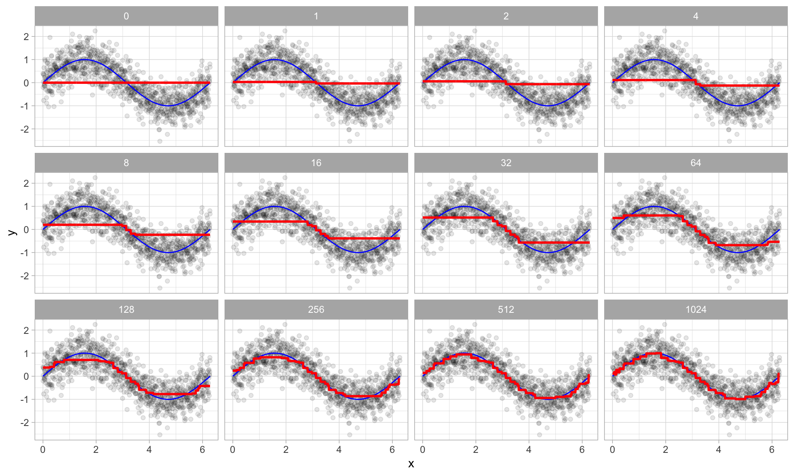

```{r setup, include=FALSE}
knitr::opts_chunk$set(echo = TRUE,message=F,warning=F,cache=T)
timeconsuming <- F
```


## Gradient Boosting Machines (GBMs)

- GBMs are extremely popular, successful across many domains and one of the leading methods for winning [**Kaggle competitions**](https://www.kaggle.com/competitions). 
- GBMs build an ensemble of flat and weak successive trees with each tree learning and improving on the previous. 
- When combined, these trees produce a powerful “committee” often hard to beat with other algorithms. 

- The following slides are based on UC Business Analytics R Programming Guide on [**GBM regression**](http://uc-r.github.io/gbm_regression)


<!--
## [Gradient boosting](https://en.wikipedia.org/wiki/Gradient_boosting)

Gradient boosting is a machine learning technique for regression and classification problems, which produces a prediction model in the form of an ensemble of weak prediction models, typically decision trees. It builds the model in a stage-wise fashion like other boosting methods do, and it generalizes them by allowing optimization of an arbitrary differentiable loss function.

The idea of gradient boosting originated in the observation by Leo Breiman that boosting can be interpreted as an optimization algorithm on a suitable cost function.


Breiman, L. (1997). "Arcing The Edge". Technical Report 486. Statistics Department, University of California, Berkeley.

## Explicit algorithms

Explicit regression gradient boosting algorithms were subsequently developed by Jerome H. Friedman, simultaneously with the more general functional gradient boosting perspective of Llew Mason, Jonathan Baxter, Peter Bartlett and Marcus Frean.


The latter two papers introduced the view of boosting algorithms as iterative functional gradient descent algorithms. That is, algorithms that optimize a cost function over function space by iteratively choosing a function (weak hypothesis) that points in the negative gradient direction. This functional gradient view of boosting has led to the development of boosting algorithms in many areas of machine learning and statistics beyond regression and classification.

## [**Advantages of gradient boosting**](http://uc-r.github.io/gbm_regression)

- Often provides predictive accuracy that cannot be beat.
- Lots of flexibility - can optimize on different loss functions and provides several hyperparameter tuning options that make the function fit very flexible.
- No data pre-processing required - often works great with categorical and numerical values as is.
- Handles missing data - imputation not required.

## [**Disadvantages**](http://uc-r.github.io/gbm_regression) of gradient boosting


- GBMs will continue improving to minimize all errors. This can overemphasize outliers and cause overfitting. Must use cross-validation to neutralize.
- Computationally expensive - GBMs often require many trees (>1000) which can be time and memory exhaustive.
- The high flexibility results in many parameters that interact and influence heavily the behavior of the approach (number of iterations, tree depth, regularization parameters, etc.). This requires a large grid search during tuning.
- Less interpretable although this is easily addressed with various tools (variable importance, partial dependence plots, LIME, etc.).

-->

## The idea of GBMs

- Many machine learning models are founded on a single predictive model (i.e. linear regression, penalized models, naive bayes, [**svm**](https://de.wikipedia.org/wiki/Support_Vector_Machine)). 
- Other approaches (bagging, random forests) are built on the idea of building an ensemble of models where each individual model predicts the outcome and the ensemble simply averages the predicted values. 
<!--
- The family of boosting methods is based on a different, constructive strategy of ensemble formation.
-->
- The idea of boosting is to add models to the ensemble sequentially. 
- At each particular iteration, a new weak, base-learner model is trained with respect to the error of the whole ensemble learnt so far.

{ height=70% }


<!--
## Important note

- tree-based methods tend to perform well on unprocessed data (i.e. without normalizing, centering, scaling features). 
- In this tutorial I focus on how to implement GBMs with various packages. 
- Although I do not pre-process the data, realize that you can improve model performance by spending time processing variable attributes.

## Advantages & Disadvantages
-->


## Advantages of GBMs

### Predictive accuracy

-    GBMs often provide predictive accuracy that cannot be beat.

###    Flexibility 

- Optimization on various loss functions possible and several hyperparameter tuning options.
<!--
 that make the function fit very flexible
-->

###  No data pre-processing required 
- Often works great with categorical and numerical values as is.

###  Handles missing data 

- Imputation not required.

## Disadvantages of GBMs

### GBMs overemphasize outliers 

- This causes overfitting.
- GBMs will continue improving to minimize all errors.  Use cross-validation to neutralize.


### Computationally expensive

- GBMs often require many trees (>1000) which can be time and memory exhaustive.
-    The high flexibility results in many parameters that interact and influence heavily the behavior of the approach (number of iterations, tree depth, regularization parameters, etc.). 
- This requires a large grid search during tuning.

### Interpretability

- GBMs are less interpretable, but this is easily addressed with various tools (variable importance, partial dependence plots, [**LIME**](https://www.oreilly.com/learning/introduction-to-local-interpretable-model-agnostic-explanations-lime), etc.).
<!--
https://towardsdatascience.com/understanding-model-predictions-with-lime-a582fdff3a3b
-->

## Important concepts

### Base-learning models 

- Boosting is a framework that iteratively improves any weak learning model. 
- Many gradient boosting applications allow you to “plug in” various classes of weak learners at your disposal. 
- In practice, boosted algorithms often use decision trees as the base-learner. 
<!--
- Consequently, this tutorial will discuss boosting in the context of regression trees.
-->


## Training weak models

- A weak model has an error rate only slightly better than random guessing. 
- The idea behind boosting is that each sequential model builds a simple weak model to slightly improve the remaining errors. 
- Shallow trees represent weak learner - trees with only 1-6 splits. 

### Benefits of combining many weak models:

<!--
(versus strong ones)
-->

- [**Speed**](https://cran.r-project.org/web/packages/gbm/vignettes/gbm.pdf): Constructing weak models is computationally cheap.
- [**Accuracy improvement**](https://bradleyboehmke.github.io/HOML/gbm.html): Weak models allow the algorithm to learn slowly; making minor adjustments in new areas where it does not perform well. In general, statistical approaches that learn slowly tend to perform well.
- [**Avoids overfitting**](https://www.kdnuggets.com/2019/02/understanding-gradient-boosting-machines.html): Making only small incremental improvements with each model in the ensemble allows us to stop the learning process as soon as overfitting has been detected (typically by using cross-validation).


## Sequential training with respect to errors

- Boosted trees are grown sequentially; 
- Each tree is grown using information from previously grown trees. 
- $x \rightarrow$ features and $y \rightarrow$ response:
- The basic algorithm for boosted regression trees can be generalized:  


1.) Fit a decission tree: $F_1(x)=y$

2.) the next decission tree is fixed to the residuals of the previous: $h_1(x)=y-F_1(x)$

3.) Add this new tree to our algorithm: $F_2(x)=F_1(x)+h_1(x)$

4.) The next decission tree is fixed to the residuals of $h_2(x)=y-F_2(x)$

5.) Add the new tree to the algorithm: $F_3(x)=F_2(x) + h_1(x)$

Continue this process until some mechanism (i.e. cross validation) tells us to stop.

<!--
## Basic algorithm for boosted regression trees

- The basic algorithm for boosted regression trees can be generalized. 
- The final model is simply a stagewise additive model of $b$ individual regression trees:

$$
f(x)=B\sum\limits_{b=1}^B f^b(x)
$$
-->

<!--
## Illustration behavior

- To illustrate the behavior, assume the following x and y observations. 
- The blue sine wave represents the true underlying function and the points represent observations that include some irriducible error (noise). 
- The boosted prediction illustrates the adjusted predictions after each additional sequential tree is added to the algorithm. 
- Initially, there are large errors which the boosted algorithm improves upon immediately but as the predictions get closer to the true underlying function you see each additional tree make small improvements in different areas across the feature space where errors remain. 
- Towards the end of the gif, the predicted values nearly converge to the true underlying function.
-->

## [Boosted regression decision stumps as 0-1024 successive trees are added.](https://bradleyboehmke.github.io/HOML/gbm.html)



## Boosted regression figure - explained 

- The figure illustrates a single predictor ($x$) that has a true underlying sine wave relationship (blue line) with y along with some irriducible error. 
- The first tree fit in the series is a single decision stump (i.e., a tree with a single split). 
- Each following successive decision stump is fit to the previous one’s residuals. 
- Initially there are large errors, but each additional decision stump in the sequence makes a small improvement in different areas across the feature space where errors still remain.

## Loss functions

- Many algorithms, including decision trees, focus on minimizing the residuals and emphasize the MSE loss function. 
- In GBM approach, regression trees are fitted sequentially to minimize the errors. 
<!--
- This minimizes the loss function - mean squared error (MSE). 
-->
- Often we wish to focus on other loss functions such as [**mean absolute error**](https://en.wikipedia.org/wiki/Mean_absolute_error) (MAE) 
- Or we want to apply the method to a classification problem with a loss function such as [**deviance**](https://en.wikipedia.org/wiki/Deviance_(statistics)). 
- With gradient boosting machines we can generalize the procedure to loss functions other than MSE.
<!--
- The name gradient boosting machines come from the fact that this procedure can be generalized to loss functions other than MSE.
-->

## A gradient descent algorithm

- Gradient boosting is considered a [**gradient descent**](https://en.wikipedia.org/wiki/Gradient_descent) algorithm. 
- Which is a very generic optimization algorithm capable of finding optimal solutions to a wide range of problems. 
- The general idea of gradient descent is to tweak parameters iteratively in order to minimize a cost function. 

### Example

- Suppose you are a downhill skier racing against your friend. 
- A good strategy to beat your friend is to take the path with the steepest slope. 


- This is exactly what gradient descent does - it measures the local gradient of the loss (cost) function for a given set of parameters ($\Phi$) and takes steps in the direction of the descending gradient. 
- Once the gradient is zero, we have reached the minimum.

## Gradient descent (Geron, 2017).


## Gradient descent

- Gradient descent can be performed on any loss function that is differentiable. 
- This allows GBMs to optimize different loss functions as desired 
<!--
(see ESL, p. 360 for common loss functions). 
-->
- An important parameter in gradient descent is the size of the steps which is determined by the learning rate. 
- If the learning rate is too small, then the algorithm will take many iterations to find the minimum. 
- But if the learning rate is too high, you might jump cross the minimum and end up further away than when you started.


<!--
## Shape of cost functions

- Not all cost functions are convex (bowl shaped). 
- There may be local minimas, plateaus, and other irregular terrain of the loss function that makes finding the global minimum difficult. 
- [**Stochastic gradient descent**](https://en.wikipedia.org/wiki/Stochastic_gradient_descent) can help us address this problem.
- Stochastic because the method uses randomly selected (or shuffled) samples to evaluate the gradients.
- By sampling a fraction of the training observations (typically without replacement) and growing the next tree using that subsample. 
- This makes the algorithm faster but the stochastic nature of random sampling also adds some random nature in descending the loss function gradient. 
- Although this randomness does not allow the algorithm to find the absolute global minimum, it can actually help the algorithm jump out of local minima and off plateaus and get near the global minimum.
-->

<!--
## Stochastic gradient descent

{height=60%}
-->

## Tuning GBM

- GBMs are highly flexible - many tuning parameters
- It is time consuming to find the optimal combination of hyperparameters

### Number of trees

- GBMs often require many trees; 
- GBMs can overfit so the goal is to find the optimal number of trees that minimize the loss function of interest with cross validation.

## Tuning parameters

### Depth of trees

- The number $d$ of splits in each tree, which controls the complexity of the boosted ensemble. 
- Often $d=1$ works well, in which case each tree is a stump consisting of a single split. More commonly, $d$ is greater than 1 but it is unlikely that $d>10$ will be required.

### Learning rate

- Controls how quickly the algorithm proceeds down the gradient descent. 
- Smaller values reduce the chance of overfitting but also increases the time to find the optimal fit. 
- This is also called shrinkage.

## Tuning parameters (II)

### Subsampling

- Controls if a fraction of the available training observations is used. 
- Using less than 100% of the training observations means you are implementing [**stochastic gradient descent**](https://en.wikipedia.org/wiki/Stochastic_gradient_descent). 
- This can help to minimize overfitting and keep from getting stuck in a local minimum or plateau of the loss function gradient.


