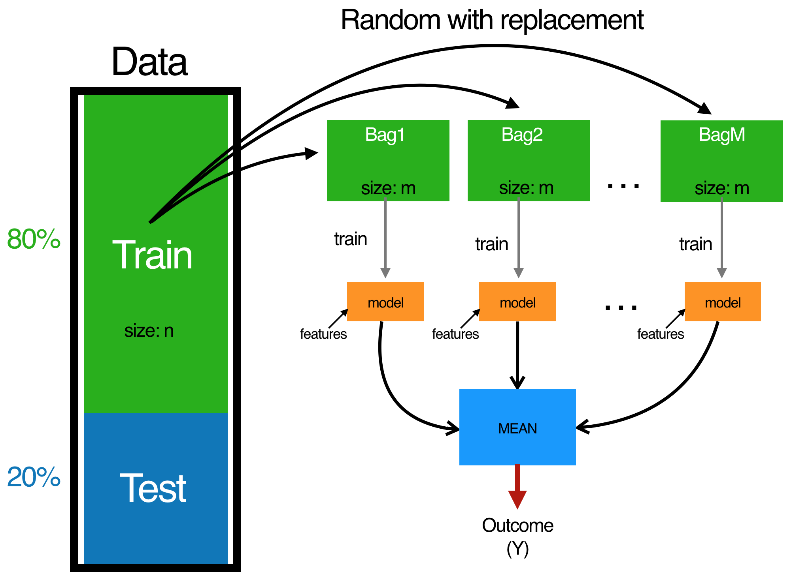

```{r setupbaggingboosting, include=FALSE}
knitr::opts_chunk$set(echo = T,message=F,warning=F)
library(knitr)
```

s
## [What is supervised learning?](https://elitedatascience.com/birds-eye-view)


<!--
https://lgatto.github.io/IntroMachineLearningWithR/supervised-learning.html#random-forest
-->


Supervised learning includes tasks for "labeled" data (i.e. you have a target variable).

- In practice, it's often used as an advanced form of predictive modeling.
 -  Each observation must be labeled with a "correct answer."
 -   Only then can you build a predictive model because you must tell the algorithm what's "correct" while training it (hence, "supervising" it).
 -   Regression is the task for modeling continuous target variables.
 -   Classification is the task for modeling categorical (a.k.a. "class") target variables.


<!--
- Example data are used to train a model.
- With this model the classification can be realized automatically. 


http://www.datenbanken-verstehen.de/lexikon/supervised-learning/

Daten einer Gruppierung zuzuordnen, die durch den Nutzenden vorgegeben sind, aber nicht jeder Datensatz manuell bewertet werden kann (z. B. Kreditbewilligung abhängig von Kredithöhe und Bonität). 

Die Aufgabe besteht darin, 

Ein Modell wird mit Beispieldaten aufgebaut, das die Zuordnung anschließend selbstständig übernimmt.
-->


## [Tree-Based Models](https://www.statmethods.net/advstats/cart.html)

- Trees are good for interpretation because they are simple

- Tree based methods involve stratifying or segmenting the predictor space
into a number of simple regions. ([Hastie and Tibshirani](https://lagunita.stanford.edu/c4x/HumanitiesScience/StatLearning/asset/trees.pdf))

- These methods do not deliver the best results concerning prediction accuracy. 

<!--
https://lagunita.stanford.edu/courses/HumanitiesSciences/StatLearning/Winter2016/about

https://lagunita.stanford.edu/c4x/HumanitiesScience/StatLearning/asset/trees.pdf
-->

<!--

https://en.wikipedia.org/wiki/Decision_tree_learning

https://cran.r-project.org/web/packages/rpart/vignettes/longintro.pdf

https://www.analyticsvidhya.com/blog/2016/04/complete-tutorial-tree-based-modeling-scratch-in-python/
https://www.analyticsvidhya.com/blog/2016/02/complete-tutorial-learn-data-science-scratch/
-->


## Explanation: [**decision tree**](https://en.wikipedia.org/wiki/Decision_tree)

<!--
https://elitedatascience.com/algorithm-selection
-->

Decision trees model data as a "tree" of hierarchical branches. They make branches until they reach "leaves" that represent predictions.

](figure/Decision-Tree-Example.jpg)

## Summary decission trees

Due to their branching structure, decision trees can easily model nonlinear relationships.

- For example, let's say for Single Family homes, larger lots command higher prices.
 -  However, let's say for Apartments, smaller lots command higher prices (i.e. it's a proxy for urban / rural).
 -   This reversal of correlation is difficult for linear models to capture unless you explicitly add an interaction term (i.e. you can anticipate it ahead of time).
 -  On the other hand, decision trees can capture this relationship naturally.


```{r}
library(rpart)
```


<!--
https://www.guru99.com/r-decision-trees.html
-->

## Regression Trees - preparation

- The following slides are based on [](http://uc-r.github.io/regression_trees)

```{r}
library(rsample)     # data splitting 
library(dplyr)       # data wrangling
library(rpart)       # performing regression trees
library(rpart.plot)  # plotting regression trees
library(ipred)       # bagging
library(caret)       # bagging
```

```{r,echo=F,eval=F}
install.packages("rpart.plot")
```

## The Ames Housing data 

```{r}
set.seed(123)
ames_split <- initial_split(AmesHousing::make_ames(), prop = .7)
ames_train <- training(ames_split)
ames_test  <- testing(ames_split)
```


## 

Basic regression trees partition a data set into smaller groups and then fit a simple model (constant) for each subgroup. Unfortunately, a single tree model tends to be highly unstable and a poor predictor. However, by bootstrap aggregating (bagging) regression trees, this technique can become quite powerful and effective. Moreover, this provides the fundamental basis of more complex tree-based models such as random forests and gradient boosting machines. This tutorial will get you started with regression trees and bagging.

<!--
![]8figure/iris.png
-->

## The Idea

There are many methodologies for constructing regression trees but one of the oldest is known as the classification and regression tree (CART) approach developed by Breiman et al. (1984). This tutorial focuses on the regression part of CART. Basic regression trees partition a data set into smaller subgroups and then fit a simple constant for each observation in the subgroup. The partitioning is achieved by successive binary partitions (aka recursive partitioning) based on the different predictors. The constant to predict is based on the average response values for all observations that fall in that subgroup.

## 

For example, consider we want to predict the miles per gallon a car will average based on cylinders (cyl) and horsepower (hp). All observations go through this tree, are assessed at a particular node, and proceed to the left if the answer is “yes” or proceed to the right if the answer is “no”. So, first, all observations that have 6 or 8 cylinders go to the left branch, all other observations proceed to the right branch. Next, the left branch is further partitioned by horsepower. Those 6 or 8 cylinder observations with horsepower equal to or greater than 192 proceed to the left branch; those with less than 192 hp proceed to the right. These branches lead to terminal nodes or leafs which contain our predicted response value. Basically, all observations (cars in this example) that do not have 6 or 8 cylinders (far right branch) average 27 mpg. All observations that have 6 or 8 cylinders and have more than 192 hp (far left branch) average 13 mpg.

## Predicting mpg based on cyl and hp.


## 

This simple example can be generalized to state we have a continuous response variable $Y$ and two inputs $X_1$ and $X_2$. The recursive partitioning results in three regions ($R_1$,$R_2$,$R_3$) where the model predicts $Y$ with a constant $c_m$ for region $R_m$:

$$
\hat{f} (X) = \sum\limits_{m=1}^3c_mI(X_1,X_2)\in R_m
$$

However, an important question remains of how to grow a regression tree.

## Deciding on splits

First, its important to realize the partitioning of variables are done in a top-down, greedy fashion. This just means that a partition performed earlier in the tree will not change based on later partitions. But how are these partions made? The model begins with the entire data set, S, and searches every distinct value of every input variable to find the predictor and split value that partitions the data into two regions ($R_1$ and $R_2$) such that the overall sums of squares error are minimized:

$$
\text{minimize}\{SSE=\sum\limits_{i\in R_1}(y_i - c_1)^2 + \sum\limits_{i\in R_2} (y_i - c_2)^2 \}
$$

## 

Having found the best split, we partition the data into the two resulting regions and repeat the splitting process on each of the two regions. This process is continued until some stopping criterion is reached. What results is, typically, a very deep, complex tree that may produce good predictions on the training set, but is likely to overfit the data, leading to poor performance on unseen data.

##

For example, using the well-known [**Boston housing data set**](http://lib.stat.cmu.edu/datasets/boston), I create three decision trees based on three different samples of the data. You can see that the first few partitions are fairly similar at the top of each tree; however, they tend to differ substantially closer to the terminal nodes. These deeper nodes tend to overfit to specific attributes of the sample data; consequently, slightly different samples will result in highly variable estimate/predicted values in the terminal nodes. By pruning these lower level decision nodes, we can introduce a little bit of bias in our model that help to stabilize predictions and will tend to generalize better to new, unseen data.


## Three decision trees based on slightly different samples.


## Cost complexity criterion

There is often a balance to be achieved in the depth and complexity of the tree to optimize predictive performance on some unseen data. To find this balance, we typically grow a very large tree as defined in the previous section and then prune it back to find an optimal subtree. We find the optimal subtree by using a cost complexity parameter ($\alpha$) that penalizes our objective function in Eq. 2 for the number of terminal nodes of the tree (T) as in Eq. 3.

$$
\text{minimize}\{SSE + \alpha|T|\}
$$
##

For a given value of $\alpha$, we find the smallest pruned tree that has the lowest penalized error. If you are familiar with regularized regression, you will realize the close association to the lasso $L_1$ norm penalty. As with these regularization methods, smaller penalties tend to produce more complex models, which result in larger trees. Whereas larger penalties result in much smaller trees. Consequently, as a tree grows larger, the reduction in the SSE must be greater than the cost complexity penalty. Typically, we evaluate multiple models across a spectrum of $\alpha$ and use cross-validation to identify the optimal 
$\alpha$ and, therefore, the optimal subtree.

## Strengths 

There are several advantages to regression trees:

- They are very interpretable.
- Making predictions is fast (no complicated calculations, just looking up constants in the tree).
- It’s easy to understand what variables are important in making the prediction. The internal nodes (splits) are those variables that most largely reduced the SSE.
- If some data is missing, we might not be able to go all the way down the tree to a leaf, but we can still make a prediction by averaging all the leaves in the sub-tree we do reach.
- The model provides a non-linear “jagged” response, so it can work when the true regression surface is not smooth. If it is smooth, though, the piecewise-constant surface can approximate it arbitrarily closely (with enough leaves).
- There are fast, reliable algorithms to learn these trees.

## weaknesses

But there are also some significant weaknesses:

- Single regression trees have high variance, resulting in unstable predictions (an alternative subsample of training data can significantly change the terminal nodes).
- Due to the high variance single regression trees have poor predictive accuracy.

## Basic Implementation

We can fit a regression tree using rpart and then visualize it using rpart.plot. The fitting process and the visual output of regression trees and classification trees are very similar. Both use the formula method for expressing the model (similar to lm). However, when fitting a regression tree, we need to set method = "anova". By default, rpart will make an intelligent guess as to what the method value should be based on the data type of your response column, but it’s recommened that you explictly set the method for reproducibility reasons (since the auto-guesser may change in the future).

```{r}
m1 <- rpart(
  formula = Sale_Price ~ .,
  data    = ames_train,
  method  = "anova"
  )
```

## 

Once we’ve fit our model we can take a peak at the m1 output. This just explains steps of the splits. For example, we start with 2051 observations at the root node (very beginning) and the first variable we split on (the first variable that optimizes a reduction in SSE) is Overall_Qual. We see that at the first node all observations with 

```
Overall_Qual=Very_Poor,Poor,Fair,Below_Average,Average,Above_Average,Good
```

## 

go to the 2nd (2)) branch. The total number of observations that follow this branch (1699), their average sales price (156147.10) and SSE (4.001092e+12) are listed. If you look for the 3rd branch (3)) you will see that 352 observations with `Overall_Qual=Very_Good,Excellent,Very_Excellent` follow this branch and their average sales prices is 304571.10 and the SEE in this region is 2.874510e+12. Basically, this is telling us the most important variable that has the largest reduction in SEE initially is Overall_Qual with those homes on the upper end of the quality spectrum having almost double the average sales price.

##

```{r}
m1
```

##

We can visualize our model with rpart.plot. rpart.plot has many plotting options, which we’ll leave to the reader to explore. However, in the default print it will show the percentage of data that fall to that node and the average sales price for that branch. One thing you may notice is that this tree contains 11 internal nodes resulting in 12 terminal nodes. Basically, this tree is partitioning on 11 variables to produce its model. 
- There are 80 variables in ames_train. So what happened?

##

```{r}
rpart.plot(m1)
```


##

Behind the scenes rpart is automatically applying a range of cost complexity ($\alpha$ values to prune the tree. To compare the error for each $\alpha$ value, rpart performs a 10-fold cross validation so that the error associated with a given $\alpha$
value is computed on the hold-out validation data. In this example we find diminishing returns after 12 terminal nodes as illustrated below (y-axis is cross validation error, lower x-axis is cost complexity ($\alpha$) value, upper x-axis is the number of terminal nodes (tree size = $|T|$). You may also notice the dashed line which goes through the point $|T|=9$. Breiman et al. (1984) suggested that in actual practice, its common to instead use the smallest tree within 1 standard deviation of the minimum cross validation error (aka the 1-SE rule). Thus, we could use a tree with 9 terminal nodes and reasonably expect to experience similar results within a small margin of error.

##

```{r}
plotcp(m1)
```

##

To illustrate the point of selecting a tree with 12 terminal nodes (or 9 if you go by the 1-SE rule), we can force rpart to generate a full tree by using cp = 0 (no penalty results in a fully grown tree). We can see that after 12 terminal nodes, we see diminishing returns in error reduction as the tree grows deeper. Thus, we can signifcantly prune our tree and still achieve minimal expected error.

##

```{r}
m2 <- rpart(
    formula = Sale_Price ~ .,
    data    = ames_train,
    method  = "anova", 
    control = list(cp = 0, xval = 10)
)

plotcp(m2)
abline(v = 12, lty = "dashed")
```

##

So, by default, rpart is performing some automated tuning, with an optimal subtree of 11 splits, 12 terminal nodes, and a cross-validated error of 0.272 (note that this error is equivalent to the PRESS statistic but not the MSE). However, we can perform additional tuning to try improve model performance.

##

```{r}
m1$cptable
```

## Tuning

In addition to the cost complexity ($\alpha$) parameter, it is also common to tune:

- `minsplit`: the minimum number of data points required to attempt a split before it is forced to create a terminal node. The default is 20. Making this smaller allows for terminal nodes that may contain only a handful of observations to create the predicted value.
- `maxdepth`: the maximum number of internal nodes between the root node and the terminal nodes. The default is 30, which is quite liberal and allows for fairly large trees to be built.

##

`rpart` uses a special control argument where we provide a list of hyperparameter values. For example, if we wanted to assess a model with minsplit = 10 and maxdepth = 12, we could execute the following:

```{r}
m3 <- rpart(
    formula = Sale_Price ~ .,
    data    = ames_train,
    method  = "anova", 
    control = list(minsplit = 10, maxdepth = 12, xval = 10)
)
```

##

```{r}
m3$cptable
```

##

Although useful, this approach requires you to manually assess multiple models. Rather, we can perform a grid search to automatically search across a range of differently tuned models to identify the optimal hyerparameter setting.

To perform a grid search we first create our hyperparameter grid. In this example, I search a range of minsplit from 5-20 and vary maxdepth from 8-15 (since our original model found an optimal depth of 12). What results is 128 different combinations, which requires 128 different models.

##

```{r}
hyper_grid <- expand.grid(
  minsplit = seq(5, 20, 1),
  maxdepth = seq(8, 15, 1)
)

head(hyper_grid)
nrow(hyper_grid)
```


##

To automate the modeling we simply set up a for loop and iterate through each minsplit and maxdepth combination. We save each model into its own list item.

##

```{r}
models <- list()

for (i in 1:nrow(hyper_grid)) {
  
  # get minsplit, maxdepth values at row i
  minsplit <- hyper_grid$minsplit[i]
  maxdepth <- hyper_grid$maxdepth[i]

  # train a model and store in the list
  models[[i]] <- rpart(
    formula = Sale_Price ~ .,
    data    = ames_train,
    method  = "anova",
    control = list(minsplit = minsplit, maxdepth = maxdepth)
    )
}
```

##

We can now create a function to extract the minimum error associated with the optimal cost complexity $\alpha$ value for each model. After a little data wrangling to extract the optimal $\alpha$ value and its respective error, adding it back to our grid, and filter for the top 5 minimal error values we see that the optimal model makes a slight improvement over our earlier model (xerror of 0.242 versus 0.272).

```{r}
# function to get optimal cp
get_cp <- function(x) {
  min    <- which.min(x$cptable[, "xerror"])
  cp <- x$cptable[min, "CP"] 
}

# function to get minimum error
get_min_error <- function(x) {
  min    <- which.min(x$cptable[, "xerror"])
  xerror <- x$cptable[min, "xerror"] 
}

hyper_grid %>%
  mutate(
    cp    = purrr::map_dbl(models, get_cp),
    error = purrr::map_dbl(models, get_min_error)
    ) %>%
  arrange(error) %>%
  top_n(-5, wt = error)
```

##

If we were satisfied with these results we could apply this final optimal model and predict on our test set. The final RMSE is 39145.39 which suggests that, on average, our predicted sales prices are about 39,145 Dollar off from the actual sales price.

```{r}
optimal_tree <- rpart(
    formula = Sale_Price ~ .,
    data    = ames_train,
    method  = "anova",
    control = list(minsplit = 11, maxdepth = 8, cp = 0.01)
    )

pred <- predict(optimal_tree, newdata = ames_test)
RMSE(pred = pred, obs = ames_test$Sale_Price)
```


## Bagging - The idea

As previously mentioned, single tree models suffer from high variance. Although pruning the tree helps reduce this variance, there are alternative methods that actually exploite the variability of single trees in a way that can significantly improve performance over and above that of single trees. Bootstrap aggregating (bagging) is one such approach (originally proposed by Breiman, 1996).

##

Bagging combines and averages multiple models. Averaging across multiple trees reduces the variability of any one tree and reduces overfitting, which improves predictive performance. Bagging follows three simple steps:

##

- Create m bootstrap samples from the training data. Bootstrapped samples allow us to create many slightly different data sets but with the same distribution as the overall training set.
- For each bootstrap sample train a single, unpruned regression tree.
- Average individual predictions from each tree to create an overall average predicted value.

## The bagging process.




##

This process can actually be applied to any regression or classification model; however, it provides the greatest improvement for models that have high variance. For example, more stable parametric models such as linear regression and multi-adaptive regression splines tend to experience less improvement in predictive performance.

One benefit of bagging is that, on average, a bootstrap sample will contain 63 per cent (23) of the training data. This leaves about 33 per cent ($\dfrac{1}{3}$) of the data out of the bootstrapped sample. We call this the out-of-bag (OOB) sample. We can use the OOB observations to estimate the model’s accuracy, creating a natural cross-validation process.

## Bagging with ipred

Fitting a bagged tree model is quite simple. Instead of using rpart we use ipred::bagging. We use coob = TRUE to use the OOB sample to estimate the test error. We see that our initial estimate error is close to $3K less than the test error we achieved with our single optimal tree (36543 vs. 39145)

```{r}
# make bootstrapping reproducible
set.seed(123)

# train bagged model
bagged_m1 <- bagging(
  formula = Sale_Price ~ .,
  data    = ames_train,
  coob    = TRUE
)

bagged_m1
```

##

One thing to note is that typically, the more trees the better. As we add more trees we are averaging over more high variance single trees. What results is that early on, we see a dramatic reduction in variance (and hence our error) and eventually the reduction in error will flatline signaling an appropriate number of trees to create a stable model. Rarely will you need more than 50 trees to stabilize the error.

##

By default bagging performs 25 bootstrap samples and trees but we may require more. We can assess the error versus number of trees as below. We see that the error is stabilizing at about 25 trees so we will likely not gain much improvement by simply bagging more trees.

```{r}
# assess 10-50 bagged trees
ntree <- 10:50

# create empty vector to store OOB RMSE values
rmse <- vector(mode = "numeric", length = length(ntree))

for (i in seq_along(ntree)) {
  # reproducibility
  set.seed(123)
  
  # perform bagged model
  model <- bagging(
  formula = Sale_Price ~ .,
  data    = ames_train,
  coob    = TRUE,
  nbagg   = ntree[i]
)
  # get OOB error
  rmse[i] <- model$err
}

plot(ntree, rmse, type = 'l', lwd = 2)
abline(v = 25, col = "red", lty = "dashed")
```

## Bagging with caret

Bagging with ipred is quite simple; however, there are some additional benefits of bagging with caret.

1.) Its easier to perform cross-validation. Although we can use the OOB error, performing cross validation will also provide a more robust understanding of the true expected test error.

2.) We can assess variable importance across the bagged trees.

## 

Here, we perform a 10-fold cross-validated model. We see that the cross-validated RMSE is 36,477 dollar. We also assess the top 20 variables from our model. Variable importance for regression trees is measured by assessing the total amount SSE is decreased by splits over a given predictor, averaged over all m trees. The predictors with the largest average impact to SSE are considered most important. The importance value is simply the relative mean decrease in SSE compared to the most important variable (provides a 0-100 scale).

## 

```{r}
# Specify 10-fold cross validation
ctrl <- trainControl(method = "cv",  number = 10) 

# CV bagged model
bagged_cv <- train(
  Sale_Price ~ .,
  data = ames_train,
  method = "treebag",
  trControl = ctrl,
  importance = TRUE
  )

# assess results
bagged_cv
plot(varImp(bagged_cv), 20)  
```

##

If we compare this to the test set out of sample we see that our cross-validated error estimate was very close. We have successfully reduced our error to about $35,000; however, in later tutorials we’ll see how extensions of this bagging concept (random forests and GBMs) can significantly reduce this further.

```{r}
pred <- predict(bagged_cv, ames_test)
RMSE(pred, ames_test$Sale_Price)
```


## [Classification Tree example](https://www.guru99.com/r-decision-trees.html)

The purpose of this dataset is to predict which people are more likely to survive after the collision with the iceberg. The dataset contains 13 variables and 1309 observations. The dataset is ordered by the variable X. 


```{r}
path <- 'https://raw.githubusercontent.com/thomaspernet/data_csv_r/master/data/titanic_csv.csv'
titanic <-read.csv(path)
shuffle_index <- sample(1:nrow(titanic))
kable(head(titanic))
```


<!--
## [**Decision trees used in data mining are of two main types:**](https://en.wikipedia.org/wiki/Decision_tree_learning)

- Classification tree

- Regression tree
-->

## [](https://elitedatascience.com/algorithm-selection)

Unfortunately, decision trees suffer from a major flaw as well. If you allow them to grow limitlessly, they can completely "memorize" the training data, just from creating more and more and more branches.

As a result, individual unconstrained decision trees are very prone to being overfit.


## Conditional inference tree

```{r}
library(party)
```

```{r,eval=F}
?ctree
```

- performs recursively univariate split recursively


- [**Vignette**](https://cran.r-project.org/web/packages/party/vignettes/party.pdf) package `party`


## [ctree example](https://datawookie.netlify.com/blog/2013/05/package-party-conditional-inference-trees/)

```{r,eval=F}
install.packages("party")
```

## The data behind

```{r}
airq <- subset(airquality, !is.na(Ozone))
summary(airq$Temp)
```

## A first model

```{r}
library(party)
```


```{r}
air.ct <- ctree(Ozone ~ ., data = airq, controls = ctree_control(maxsurrogate = 3))
```


## The plot for `ctree`

```{r}
plot(air.ct)
```


## Recursive partitioning algorithms are special cases of a
simple two-stage algorithm

- First partition the observations by univariate splits in a recursive way and 
- second fit a constant model in each cell of the resulting partition.


## [`ctree` - Regression](https://stats.stackexchange.com/questions/171301/interpreting-ctree-partykit-output-in-r)

```{r}
library(partykit)
```

```{r,eval=F}
?ctree
```

```{r}
airq <- subset(airquality, !is.na(Ozone))
airct <- ctree(Ozone ~ ., data = airq)
plot(airct, type = "simple")
```


## [Decision Trees](http://www.statmethods.net/advstats/cart.html)

[Regression tree vs. classification tree](http://www.statmethods.net/advstats/cart.html)


```{r}
library(rpart)
```

Grow a tree

```{r}
fit <- rpart(Kyphosis ~ Age + Number + Start,
   method="class", data=kyphosis)

printcp(fit) # display the results
plotcp(fit) # visualize cross-validation results
summary(fit) # detailed summary of splits
```

```{r}
# plot tree
plot(fit, uniform=TRUE,
   main="Classification Tree for Kyphosis")
text(fit, use.n=TRUE, all=TRUE, cex=.8)
```

[Decision Trees and Random Forest](https://cran.r-project.org/doc/contrib/Zhao_R_and_data_mining.pdf)


## [Ensembling](https://elitedatascience.com/overfitting-in-machine-learning)

Ensembles are machine learning methods for combining predictions from multiple separate models. 

<!--
There are a few different methods for ensembling, but the two most common are:
-->

### Bagging 

attempts to reduce the chance overfitting complex models.


- It trains a large number of "strong" learners in parallel.
-  A strong learner is a model that's relatively unconstrained.
-  Bagging then combines all the strong learners together in order to "smooth out" their predictions.

### Boosting 

attempts to improve the predictive flexibility of simple models.

-    It trains a large number of "weak" learners in sequence.
-    A weak learner is a constrained model (i.e. you could limit the max depth of each decision tree).
-    Each one in the sequence focuses on learning from the mistakes of the one before it.
-    Boosting then combines all the weak learners into a single strong learner.

### Bagging and boosting

While bagging and boosting are both ensemble methods, they approach the problem from opposite directions.

Bagging uses complex base models and tries to "smooth out" their predictions, while boosting uses simple base models and tries to "boost" their aggregate complexity.


## [Random Forest](https://www.datascience.com/resources/notebooks/random-forest-intro)

> Random forest aims to reduce the previously mentioned correlation issue by choosing only a subsample of the feature space at each split. Essentially, it aims to make the trees de-correlated and prune the trees by setting a stopping criteria for node splits, which I will cover in more detail later.

## [What are the advantages and disadvantages of decision trees?](https://elitedatascience.com/machine-learning-interview-questions-answers#supervised-learning)

Advantages: Decision trees are easy to interpret, nonparametric (which means they are robust to outliers), and there are relatively few parameters to tune.

Disadvantages: Decision trees are prone to be overfit. However, this can be addressed by ensemble methods like random forests or boosted trees.


## [Random forest](https://en.wikipedia.org/wiki/Random_forest)

- Ensemble learning method - multitude of decision trees 
- Random forests correct for decision trees' habit of overfitting to their training set.


## [Bagging](https://www.r-bloggers.com/improve-predictive-performance-in-r-with-bagging/)

- Bagging is also known as bootstrap aggregation.
- Bagging is a method for combining predictions from different regression or classification models and was developed by Leo Breiman.
- The results of the models are then averaged in the simplest case.
- The result of each model prediction is included in the prediction with the same weight.
- The weights could depend on the quality of the model prediction, i.e. "good" models are more important than "bad" models.
- Bagging leads to significantly improved predictions in the case of unstable models.

<!--
https://en.wikipedia.org/wiki/Bootstrap_aggregating
https://de.wikipedia.org/wiki/Bagging
http://topepo.github.io/caret/miscellaneous-model-functions.html#bagging-1
-->


## [Gradient boosting](https://en.wikipedia.org/wiki/Gradient_boosting)

Gradient boosting is a machine learning technique for regression and classification problems, which produces a prediction model in the form of an ensemble of weak prediction models, typically decision trees. It builds the model in a stage-wise fashion like other boosting methods do, and it generalizes them by allowing optimization of an arbitrary differentiable loss function.

The idea of gradient boosting originated in the observation by Leo Breiman that boosting can be interpreted as an optimization algorithm on a suitable cost function.


Breiman, L. (1997). "Arcing The Edge". Technical Report 486. Statistics Department, University of California, Berkeley.


<!--
-->

## Explicit algorithms

Explicit regression gradient boosting algorithms were subsequently developed by Jerome H. Friedman,[2][3] simultaneously with the more general functional gradient boosting perspective of Llew Mason, Jonathan Baxter, Peter Bartlett and Marcus Frean.[4][5] 


The latter two papers introduced the view of boosting algorithms as iterative functional gradient descent algorithms. That is, algorithms that optimize a cost function over function space by iteratively choosing a function (weak hypothesis) that points in the negative gradient direction. This functional gradient view of boosting has led to the development of boosting algorithms in many areas of machine learning and statistics beyond regression and classification.


## [**Advantages of gradient boosting**](http://uc-r.github.io/gbm_regression)

- Often provides predictive accuracy that cannot be beat.
- Lots of flexibility - can optimize on different loss functions and provides several hyperparameter tuning options that make the function fit very flexible.
- No data pre-processing required - often works great with categorical and numerical values as is.
- Handles missing data - imputation not required.

## [**Disadvantages**](http://uc-r.github.io/gbm_regression) of gradient boosting


- GBMs will continue improving to minimize all errors. This can overemphasize outliers and cause overfitting. Must use cross-validation to neutralize.
- Computationally expensive - GBMs often require many trees (>1000) which can be time and memory exhaustive.
- The high flexibility results in many parameters that interact and influence heavily the behavior of the approach (number of iterations, tree depth, regularization parameters, etc.). This requires a large grid search during tuning.
- Less interpretable although this is easily addressed with various tools (variable importance, partial dependence plots, LIME, etc.).


## Two types of errors for tree methods

### Bias related errors

- Adaptive boosting
- Gradient boosting

### Variance related errors

- Bagging
- Random forest

<!--
https://www.slideshare.net/JaroslawSzymczak1/gradient-boosting-in-practice-a-deep-dive-into-xgboost

What if we, instead of reweighting examples, made some corrections to prediction errors directly?

Residual is a gradient of single observation error contribution in one of the most common evaluation measure for regression: RMSE
-->


## [Gradient Boosting for Linear Regression - why does it not work?](https://stats.stackexchange.com/questions/186966/gradient-boosting-for-linear-regression-why-does-it-not-work)

While learning about Gradient Boosting, I haven't heard about any constraints regarding the properties of a "weak classifier" that the method uses to build and ensemble model. However, I could not imagine an application of a GB that uses linear regression, and in fact when I've performed some tests - it doesn't work. I was testing the most standard approach with a gradient of sum of squared residuals and adding the subsequent models together.

The obvious problem is that the residuals from the first model are populated in such manner that there is really no regression line to fit anymore. My another observation is that a sum of subsequent linear regression models can be represented as a single regression model as well (adding all intercepts and corresponding coefficients) so I cannot imagine how that could ever improve the model. The last observation is that a linear regression (the most typical approach) is using sum of squared residuals as a loss function - the same one that GB is using.

I also thought about lowering the learning rate or using only a subset of predictors for each iteration, but that could still be summed up to a single model representation eventually, so I guess it would bring no improvement.

What am I missing here? Is linear regression somehow inappropriate to use with Gradient Boosting? Is it because the linear regression uses the sum of squared residuals as a loss function? Are there any particular constraints on the weak predictors so they can be applied to Gradient Boosting?


## Links

- [**Vignette**](https://cran.r-project.org/web/packages/partykit/vignettes/ctree.pdf) for package `partykit` 

- [Conditional Inference Trees](https://rpubs.com/awanindra01/ctree)


- [Conditional inference trees vs traditional decision trees](https://stats.stackexchange.com/questions/12140/conditional-inference-trees-vs-traditional-decision-trees)

- [Video on tree based methods](https://www.youtube.com/watch?v=6ENTbK3yQUQ)


### Links - Boosting

- [**Gradient Boosting Machines**](http://uc-r.github.io/gbm_regression)


- [How to Visualize Gradient Boosting Decision Trees With XGBoost in Python](https://machinelearningmastery.com/visualize-gradient-boosting-decision-trees-xgboost-python/)


<!--
https://www.researchgate.net/figure/A-simple-example-of-visualizing-gradient-boosting_fig5_326379229
-->


