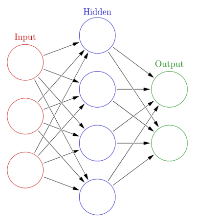
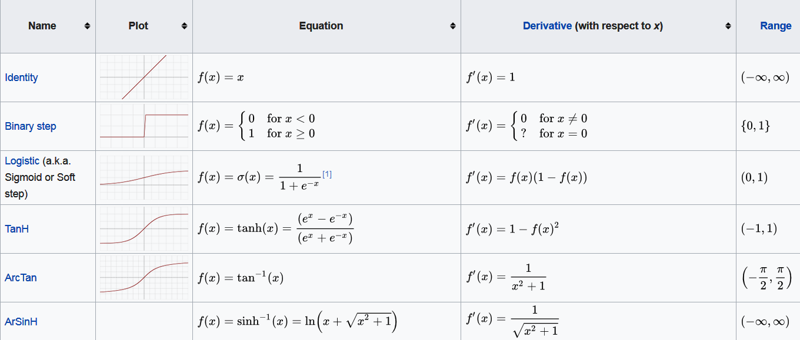

```{r setup, include=FALSE}
knitr::opts_chunk$set(echo = T,message=F,warning=F,eval=T)
```

## Examples of Multi-Neuron 





<!--
## Biologic Model

- While some researchers used ANNs to study animal brains, most researchers view neural networks as being inspired by, not models of, neurological systems.
- The following shows the basic functional unit of the brain, a biologic neuron.

### Biologic Neuron 

{height=50%}

Source: Bruce Blaus at [**Wikipedia**](https://commons.wikimedia.org/wiki/File:Blausen_0657_MultipolarNeuron.png)
-->
<!--
## ANN neurons

- ANN neurons are simple representations of their biologic counterparts. 
- In the biologic neuron figure please note the dendrite, cell body, and the axon with the synaptic terminals. 
- In biologic systems, information (in the form of neuroelectric signals) flow into the neuron through the dendrites. 
- If a sufficient number of input signals enter the neuron through the dendrites, the cell body generates a response signal and transmits it down the axon to the synaptic terminals. 
- The specific number of input signals required for a response signal is dependent on the individual neuron. 
- When the generated signal reaches the synaptic terminals neurotransmitters flow out of the synaptic terminals and interact with dendrites of adjoining neurons.


## Three major takeaways from the biologic neuron

1.) The neuron only generates a signal if a sufficient number of input signals enter the neurons dendrites (all or nothing)

2.) Neurons receive inputs from many adjacent neurons upstream, and can transmit signals to many adjacent signals downstream (cumulative inputs)

3.) Each neuron has its own threshold for activation (synaptic weight).
-->

## Artifical Neuron

<!--
- The artificial analog of the biologic neuron is shown below. 
- In the artificial model the inputs correspond to the dendrites, 

- The transfer function, net input, and activation function correspond to the cell body, and the activation corresponds to the axon and synaptic terminal.

-->

- Inputs correspond to raw data values
<!--
, or in deeper architectures, may be outputs from preceding artificial neurons. 
-->
- The transfer function sums all the inputs together (cumulative inputs). 
- If the summed input values reach a specified threshold, the activation function generates an output signal (all or nothing). 
- The output signal then moves to a raw output or other neurons. 
- This basic artificial neuron is combined with multiple other artificial neurons to create an ANN.

<!--
### Artifical Neuron–Source: [Chrislb Wikipedia](https://commons.wikimedia.org/wiki/File:ArtificialNeuronModel_english.png)
-->

{height=40%}

<!--
## The inputs to the artificial neuron

-->

<!--
## ANNs described

- ANNs have an input layer, hidden layer, and output layer. 
- The input layer reads in data values from a user provided input. 
- Within the hidden layer a majority of the "learning" takes place, and the output layer displays the results of the ANN. 
- Each of the red input nodes correspond to an input vector $x_i$. Each of the black lines with correspond to a weight, $w^{(l)}_{ij}$, and describe how artificial neurons are connections to one another within the ANN. 
- The $i$ subscript identifies the source and the $j$ subscript describes to which artificial neuron the weight connects the source to. The green output nodes are the output vectors $y_q$.
-->

<!--
## Examination of the figure

- Examination of the figure’s top-left and top-right plots show two possible ANN configurations. 
- In the top-left, we see a network with one hidden layer with $q$ artificial neurons, $p$ input vectors $x$, and generates $q$ output vectors $y$. 
- The bias term is a simple constant valued 1 to each hidden node acting akin to the grand mean in a simple linear regression. 
- Each bias term in a ANN has its own associated weight $w$. 
- In the top-right ANN we have a network with two hidden layers. 
- This network adds superscript notation to the bias terms and the weights to identify to which layer each term belongs. 
- Weights and biases with a superscript 1 act on connecting the input layer to the first layer of artificial neurons and terms with a superscript 2 connect the output of the second hidden layer to the output vectors.
- The size and structure of ANNs are only limited by the imagination of the analyst.
-->

<!--
- The bias inputs to each hidden node, denoted by the $b_q$. 
-->


## Activation Functions

- The capability of ANNs to learn any function, (given sufficient training data examples) are dependent on the appropriate selection of the [**activation function(s)**](https://en.wikipedia.org/wiki/Activation_function) present in the network. 
- They enable the ANN to learn non-linear properties present in the data. 
<!--
We represent the activation function here as $\Phi(\cdot)$. 
-->
- The input into the activation function is the weighted sum of the input features from the preceding layer. 
- Let $o_j$ be the output from the jth neuron in a given layer for a network for k input vector features.

$$
o_j = \Phi(b_j + \sum\limits_{i=1}^pw_ix_i)
$$


## Common ANN Activation functions

{height=90%}


<!--
## Activation functions

[](https://en.wikipedia.org/wiki/Activation_function)
-->

## The output ($o_j$)...

- ... can feed into the output layer of a neural network, or in deeper architectures may feed into additional hidden layers. 
- The activation function determines if the sum of the weighted inputs plus a bias term is sufficiently large to trigger the firing of the neuron. 
- No universal best choice for the activation function, researchers have provided information regarding what activation functions work well for ANN solutions to many common problems. 
- The choice of the activation function governs the required data scaling necessary for ANN analysis. 
<!--
Below we present activation functions commonly seen in may ANNs.
-->

## How ANNs Learn

<!--
- We have described the structure of ANNs, we have not touched on how these networks learn. 
- Assume that we have a data set of labeled observations. 
-->


- We have some features $(X)$ describing an output ($y$) 
<!--
fall under machine learning techniques called Supervised Learning. 
-->
- To begin training our notional single-layer one-neuron neural network we initially randomly assign weights. 
- We then run the neural network with the random weights and record the outputs generated. 
- This is called a forward pass. Output values, in our case called $y$, are a function of the input values ($X$), the random initial weights ($w$) and our choice of the threshold function ($T$).


$$
\hat{y}= f(X,w,T)
$$


## Choice of the performance function

- Once we have our ANN output values ($\hat{y}$) we can compare them to the data set output values ($y$). 
- To do this we use a performance function $P$. 
- The choice of the performance function is a choice of the analyst, we choose 
<!--
to use the One-Half Square Error Cost Function otherwise known as the 
-->
Sum of Squared Errors (SSE).

