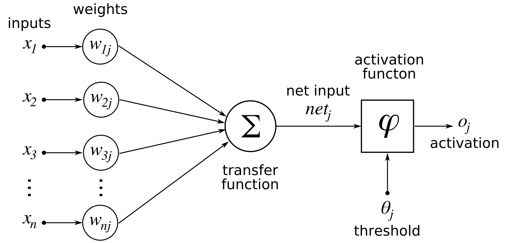
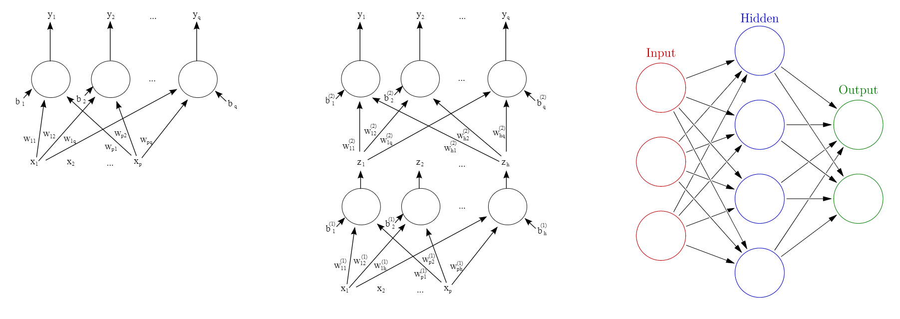
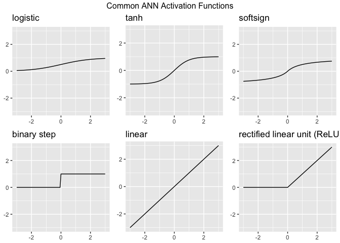
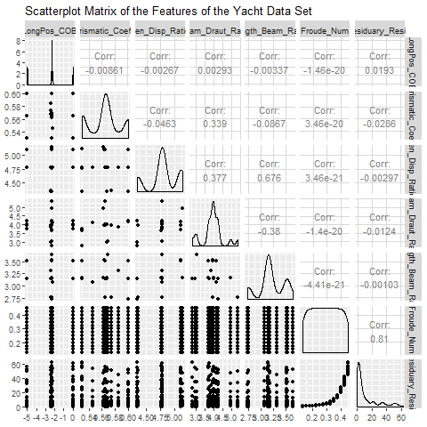
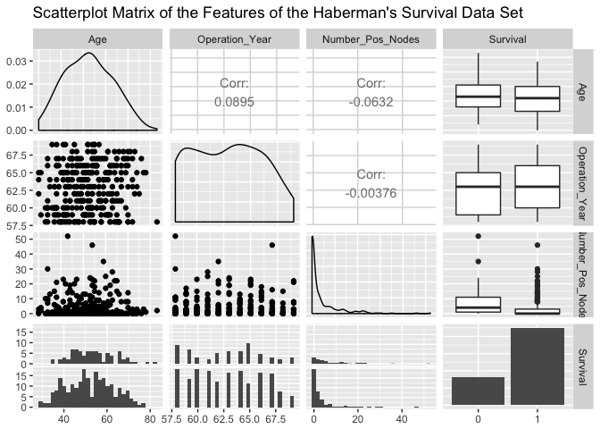

```{r setup, include=FALSE}
knitr::opts_chunk$set(echo = T,message=F,warning=F,eval=T)
```

## Artificial Neural Network Fundamentals

- Artificial neural networks (ANNs) describe a specific class of machine learning algorithms designed to acquire their own knowledge by extracting useful patterns from data. 
- ANNs are [**function approximators**](https://deepmind.com/research/publications/universal-value-function-approximators/), mapping inputs to outputs, 
- They are composed of many connected computational units, called neurons. 
- Each individual neuron possesses little intrinsic approximation capability; 
- When many neurons function cohesively together, their combined effects show remarkable learning performance. 


## Biologic Model

- ANNs are engineered computational models inspired by the brain.
- While some researchers used ANNs to study animal brains, most researchers view neural networks as being inspired by, not models of, neurological systems.
<!--
- The following shows the basic functional unit of the brain, a biologic neuron.
-->

### Biologic Neuron–Source: Bruce Blaus [**Wikipedia**](https://commons.wikimedia.org/wiki/File:Blausen_0657_MultipolarNeuron.png)

{height=50%}

## ANN neurons

- ANN neurons are simple representations of their biologic counterparts. 
- In the biologic neuron figure please note the Dendrite, Cell body, and the Axon with the Synaptic terminals. 
- In biologic systems, information (in the form of neuroelectric signals) flow into the neuron through the dendrites. 
- If a sufficient number of input signals enter the neuron through the dendrites, the cell body generates a response signal and transmits it down the axon to the synaptic terminals. 
- The specific number of input signals required for a response signal is dependent on the individual neuron. 
- When the generated signal reaches the synaptic terminals neurotransmitters flow out of the synaptic terminals and interact with dendrites of adjoining neurons.

## Three major takeaways from the biologic neuron

1.) The neuron only generates a signal if a sufficient number of input signals enter the neurons dendrites (all or nothing)

2.) Neurons receive inputs from many adjacent neurons upstream, and can transmit signals to many adjacent signals downstream (cumulative inputs)

3.) Each neuron has its own threshold for activation (synaptic weight).

## Artifical Neuron

- The artificial analog of the biologic neuron is shown below. 
- In the artificial model the inputs correspond to the dendrites, the transfer function, net input, and activation function correspond to the cell body, and the activation corresponds to the axon and synaptic terminal.

### Artifical Neuron–Source: [Chrislb Wikipedia](https://commons.wikimedia.org/wiki/File:ArtificialNeuronModel_english.png)


{height=40%}

## The inputs to the artificial neuron

- ... may correspond to raw data values, or in deeper architectures, may be outputs from preceding artificial neurons. 
- The transfer function sums all the inputs together (cumulative inputs). 
- If the summed input values reach a specified threshold, the activation function generates an output signal (all or nothing). 
- The output signal then moves to a raw output or other neurons depending on specific ANN architecture. 
- This basic artificial neuron is combined with multiple other artificial neurons to create an ANNs such as the ones shown in the following figure.

## Examples of Multi-Neuron ANNs–Source: Click images



## ANNs described

- ANNs have an Input layer, Hidden layer, and Output layer. 
- The input layer reads in data values from a user provided input. 
- Within the hidden layer is where a majority of the "learning" takes place, and the output layer displays the results of the ANN. 
- In the bottom plot of the figure, each of the red input nodes correspond to an input vector $x_i$. Each of the black lines with correspond to a weight, $w^{(l)}_{ij}$, and describe how artificial neurons are connections to one another within the ANN. 
- The $i$ subscript identifies the source and the $j$ subscript describes to which artificial neuron the weight connects the source to. The green output nodes are the output vectors $y_q$.

## Examination of the figure

- Examination of the figure’s top-left and top-right plots show two possible ANN configurations. 
- In the top-left, we see a network with one hidden layer with $q$ artificial neurons, $p$ input vectors $x$, and generates $q$ output vectors $y$. 
<!--
- The bias inputs to each hidden node, denoted by the $b_q$. 
-->
- The bias term is a simple constant valued 1 to each hidden node acting akin to the grand mean in a simple linear regression. 
- Each bias term in a ANN has its own associated weight $w$. 
- In the top-right ANN we have a network with two hidden layers. 
- This network adds superscript notation to the bias terms and the weights to identify to which layer each term belongs. 
- Weights and biases with a superscript 1 act on connecting the input layer to the first layer of artificial neurons and terms with a superscript 2 connect the output of the second hidden layer to the output vectors.
- The size and structure of ANNs are only limited by the imagination of the analyst.


## Activation Functions

- The capability of ANNs to learn approximately any function, (given sufficient training data examples) are dependent on the appropriate selection of the Activation Function(s) present in the network. 
- Activation functions enable the ANN to learn non-linear properties present in the data. We represent the activation function here as $\Phi(\cdot)$. 
- The input into the activation function is the weighted sum of the input features from the preceding layer. 
- Let $o_j$ be the output from the jth neuron in a given layer for a network for k input vector features.

$$
o_j = \Phi(b_j + \sum\limits_{i=1}^pw_ix_i)
$$


## The output ($o_j$)...

- ... can feed into the output layer of a neural network, or in deeper architectures may feed into additional hidden layers. 
- The activation function determines if the sum of the weighted inputs plus a bias term is sufficiently large to trigger the firing of the neuron. 
- There is not a universal best choice for the activation function, however, researchers have provided ample information regarding what activation functions work well for ANN solutions to many common problems. The choice of the activation function governs the required data scaling necessary for ANN analysis. Below we present activation functions commonly seen in may ANNs.


## Common ANN Activation functions



## How ANNs Learn

- We have described the structure of ANNs, we have not touched on how these networks learn. 
- Assume that we have a data set of labeled observations. 
- We have some features $(X)$ describing an output ($y$) 
<!--
fall under machine learning techniques called Supervised Learning. 
-->
- To begin training our notional single-layer one-neuron neural network we initially randomly assign weights. 
- We then run the neural network with the random weights and record the outputs generated. 
- This is called a forward pass. Output values, in our case called $y$, are a function of the input values ($X$), the random initial weights ($w$) and our choice of the threshold function ($T$).


$$
\hat{y}= f(X,w,T)
$$


## Choice of the performance function

- Once we have our ANN output values ($\hat{y}$) we can compare them to the data set output values ($y$). 
- To do this we use a performance function $P$. 
- The choice of the performance function is a choice of the analyst, we choose to use the One-Half Square Error Cost Function otherwise known as the Sum of Squared Errors (SSE).


<!--
http://uc-r.github.io/ann_fundamentals

an dieser Stelle abgebrochen
-->


## Regression Artificial Neural Network

- Regression ANNs predict an output variable as a function of the inputs. 
- Input features (independent variables) can be categorical or numeric types.
- For regression ANNs, we require a numeric dependent variable.

```{r}
library(tidyverse)
library(neuralnet)
library(GGally)
library(magrittr)
library(readr)
library(dplyr)
```

```{r,eval=F,echo=F}
install.packages("GGally")
install.packages("tidyverse")
install.packages("neuralnet")
install.packages("GGally")
install.packages("readr")
install.packages("dplyr")
install.packages("rvest")
```


## Data Preparation

- Our regression ANN will use the [**Yacht Hydrodynamics**](http://archive.ics.uci.edu/ml/datasets/Yacht+Hydrodynamics) data set from UCI’s Machine Learning Repository. 
- The yacht data was provided by Dr. Roberto Lopez email. 
- This data set contains data contains results from 308 full-scale experiments performed at the Delft Ship Hydromechanics Laboratory where they test 22 different hull forms. 
- Their experiment tested the effect of variations in the hull geometry and the ship’s [**Froude number**](https://en.wikipedia.org/wiki/Froude_number) on the craft’s residuary resistance per unit weight of displacement.


## The download the data from UCI.

```{r}
url<-'http://archive.ics.uci.edu/ml/machine-learning-databases/'
filen <- "00243/yacht_hydrodynamics.data"
colnam <- c('LongPos_COB', 'Prismatic_Coeff','Len_Disp_Ratio',
            'Beam_Draut_Ratio','Length_Beam_Ratio','Froude_Num',
            'Residuary_Resist')
Yacht_Data <- read_table(file = paste0(url,filen),
                         col_names = colnam) %>%
  na.omit()
```


## Take a look at the data set.


```{r,eval=F}
ggpairs(Yacht_Data,title="Scatterplot Matrix of the Features of 
        the Yacht Data Set")
```

```{r,echo=F,eval=F}
png("figure/ggpairs_yacht.png")
ggpairs(Yacht_Data, title = "Scatterplot Matrix of the Features of the Yacht Data Set")
dev.off()
```

{height=90%}

## An excellent summary of the variation of each feature
<!--
- We see an excellent summary of the variation of each feature in our data set. 
-->
- Draw your attention to the bottom strip of scatter-plots. 
- This shows the residuary resistance as a function of the other data set features (independent experimental values). 
- The greatest variation appears with the Froude Number feature. 
- It will be interesting to see how this pattern appears in the subsequent regression ANNs.


## Data split

Prior to regression ANN construction we first must split the Yacht data set into test and training data sets. 
- Before we split, first scale each feature to fall in the $[0,1]$ interval.

```{r}
# Scale the Data
scale01 <- function(x){
  (x - min(x)) / (max(x) - min(x))
}

Yacht_Data <- Yacht_Data %>%
  mutate_all(scale01)
# Split into test and train sets
set.seed(12345)
Yacht_Data_Train <- sample_frac(tbl = Yacht_Data, 
                                replace = FALSE, size = 0.80)
Yacht_Data_Test <- anti_join(Yacht_Data, Yacht_Data_Train)
```


## The `scale01()` function...

- ... maps each data observation onto the $[0,1]$
 interval as called in the `dplyr` `mutate_all()` function. 
 - We then provided a seed for reproducible results and randomly extracted (without replacement) 80% of the observations to build the Yacht_Data_Train data set. 
 - Using dplyr’s `anti_join()` function we extracted all the observations not within the `Yacht_Data_Train` data set as our test data set in Yacht_Data_Test.
 
 
## 1st Regression ANN

- To begin we construct a 1-hidden layer ANN with 1 neuron, the simplest of all neural networks.

```{r}
set.seed(12321)
Yacht_NN1<-neuralnet(Residuary_Resist~LongPos_COB + 
                  Prismatic_Coeff + Len_Disp_Ratio + 
                    Beam_Draut_Ratio+
                       Length_Beam_Ratio +Froude_Num, 
                     data = Yacht_Data_Train)
```


## The `Yacht_NN1`...

- ... is a list containing all parameters of regression ANN and the results of the neural network on the test data set. 
<!--
- To view a diagram of the `Yacht_NN1` use the plot() function.
-->

```{r}
plot(Yacht_NN1, rep = 'best')
```


## The weights learned

- This plot shows the weights learned by the `Yacht_NN1` neural network, and displays the number of iterations before convergence, as well as the SSE of the training data set. 
- To manually compute the SSE you can use the following:

```{r}
NN1_Train_SSE <- sum((Yacht_NN1$net.result-
                        Yacht_Data_Train[, 7])^2)/2
paste("SSE: ", round(NN1_Train_SSE, 4))
```


## SSE

- This SSE is the error associated with the training data set. 
- A superior metric for estimating the generalization capability of the ANN would be the SSE of the test data set. 
- The test data set contains observations not used to train `Yacht_NN1 ANN`.
- To calculate the test error, we first run our test observations through the Yacht_NN1 ANN. 
- This is accomplished with the neuralnet package compute() function, which takes as its first input the desired neural network object created by the neuralnet() function, and the second argument the test data set feature (independent variable(s)) values.

```{r}
Test_NN1_Output <- compute(Yacht_NN1, 
                           Yacht_Data_Test[, 1:6])$net.result
(NN1_Test_SSE<-sum((Test_NN1_Output-Yacht_Data_Test[,7])^2)/2)
```


## The `compute()` function...

- ... outputs the response variable, in our case the `Residuary_Resist`, as estimated by the neural network. 
- Once we have the ANN estimated response we can compute the test SSE.
- Comparing the test error of 0.0084 to the training error of 0.0361 we see that in our case our test error is smaller than our training error.


## Regression Hyperparameters

- We have constructed the most basic of regression ANNs without modifying any of the default hyperparameters associated with the `neuralnet()` function. 

```{r}
# 2-Hidden Layers, Layer-1 4-neurons, Layer-2, 1-neuron, 
# logistic activation function
set.seed(12321)
Yacht_NN2 <- neuralnet(Residuary_Resist ~ LongPos_COB + 
              Prismatic_Coeff + Len_Disp_Ratio + Beam_Draut_Ratio + 
                Length_Beam_Ratio + Froude_Num, 
                       data = Yacht_Data_Train, 
                       hidden = c(4, 1), 
                       act.fct = "logistic")
```

## Training and test error

```{r}
NN2_Train_SSE <- sum((Yacht_NN2$net.result - 
                        Yacht_Data_Train[, 7])^2)/2
## Test Error
Test_NN2_Output<-compute(Yacht_NN2, 
            Yacht_Data_Test[, 1:6])$net.result
NN2_Test_SSE <- sum((Test_NN2_Output - 
                       Yacht_Data_Test[, 7])^2)/2
```


- We should try and improve the network by modifying its basic structure and hyperparameter modification. 
- To begin we will add depth to the hidden layer of the network, then we will change the activation function from the logistic to the tangent hyperbolicus (tanh) to determine if these modifications can improve the test data set SSE. 
<!--
- When using the tanh activation function, we first must rescale the data from $[0,1]$ to $[−1,1]$ using the `rescale` package. 
-->


<!--
- For the purposes of this exercise we will use the same random seed for reproducible results, generally this is not a best practice.
-->

## Rescale for tanh activation function

- To use the activation function we must rescale the data.

```{r}
scale11 <- function(x) {
    (2 * ((x - min(x))/(max(x) - min(x)))) - 1
}
Yacht_Data_Train <- Yacht_Data_Train %>% mutate_all(scale11)
Yacht_Data_Test <- Yacht_Data_Test %>% mutate_all(scale11)

# 2-Hidden Layers, Layer-1 4-neurons, Layer-2, 1-neuron, 
# tanh activation function
set.seed(12321)
Yacht_NN3 <- neuralnet(Residuary_Resist ~ LongPos_COB + 
          Prismatic_Coeff+Len_Disp_Ratio+Beam_Draut_Ratio + 
            Length_Beam_Ratio + Froude_Num, 
                       data = Yacht_Data_Train, 
                       hidden = c(4, 1), 
                       act.fct = "tanh")

```

## Training and test error

```{r}
## Training Error
NN3_Train_SSE <- sum((Yacht_NN3$net.result - 
                        Yacht_Data_Train[, 7])^2)/2
## Test Error
Test_NN3_Output <- compute(Yacht_NN3, 
                           Yacht_Data_Test[, 1:6])$net.result
NN3_Test_SSE <- sum((Test_NN3_Output - 
                       Yacht_Data_Test[, 7])^2)/2
```

## 1-Hidden Layer, 1-neuron, tanh activation function

```{r}
set.seed(12321)
Yacht_NN4 <- neuralnet(Residuary_Resist ~ LongPos_COB + 
                         Prismatic_Coeff + Len_Disp_Ratio + 
                         Beam_Draut_Ratio + Length_Beam_Ratio + 
                         Froude_Num, 
                       data = Yacht_Data_Train, 
                       act.fct = "tanh")
## Training Error
NN4_Train_SSE <- sum((Yacht_NN4$net.result - 
                        Yacht_Data_Train[, 7])^2)/2

```


## Test error and preparing a bar plot

<!--
Regression_NN_Errors
-->

```{r}
## Test Error
Test_NN4_Output <- compute(Yacht_NN4, 
                           Yacht_Data_Test[, 1:6])$net.result
NN4_Test_SSE<-sum((Test_NN4_Output-Yacht_Data_Test[, 7])^2)/2

# Preparing bar plot of results
RegNNErr<-tibble(Network=rep(c("NN1","NN2","NN3","NN4"),each=2), 
                     DataSet=rep(c("Train", "Test"), time = 4), 
                     SSE = c(NN1_Train_SSE, NN1_Test_SSE, 
                             NN2_Train_SSE, NN2_Test_SSE, 
                             NN3_Train_SSE, NN3_Test_SSE, 
                             NN4_Train_SSE, NN4_Test_SSE))
```


##

```{r}
RegNNErr %>% 
  ggplot(aes(Network, SSE, fill = DataSet)) + 
  geom_col(position = "dodge") + 
  ggtitle("Regression ANN's SSE")
```


## The best regression ANN

- We see that the best regression ANN we found was `Yacht_NN2` with a training and test SSE of 0.0188 and 0.0057. 
- We make this determination by the value of the training and test SSEs only. 

## The structure of `Yacht_NN2` 

```{r}
plot(Yacht_NN2, rep = "best")
```


## Hyperparameter settings

- We have looked at one ANN for each of the hyperparameter settings.
- Generally, researchers look at more than one ANN for a given setting of hyperparameters. 
- This capability is built into the `neuralnet` package using the rep argument in the neuralnet() function. 
- Using the Yacht_NN2 hyperparameters we construct 10 different ANNs, and select the best of the 10.

```{r,eval=F}
set.seed(12321)
Yacht_NN2 <- neuralnet(Residuary_Resist ~ LongPos_COB + 
                         Prismatic_Coeff + Len_Disp_Ratio + 
                         Beam_Draut_Ratio + Length_Beam_Ratio + 
                         Froude_Num,data = Yacht_Data_Train,
                       hidden = c(4, 1), 
                       act.fct = "logistic",rep = 10)
```

```{r,eval=F,echo=F}
save(Yacht_NN2,file="../data/lm_nn_Yacht_NN2.RData")
```

```{r,echo=F}
load("../data/lm_nn_Yacht_NN2.RData")
```


##

```{r}
plot(Yacht_NN2, rep = "best")
```


## Different random set of starting weights

- By setting the same seed, prior to running the 10 repetitions of ANNs, we force the software to reproduce the exact same Yacht_NN2 ANN for the first replication. 
- The subsequent 9 generated ANNs, use a different random set of starting weights. 
- Comparing the ‘best’ of the 10 repetitions, to the Yacht_NN2, we observe a decrease in training set error indicating we have a superior set of weights.


## Wrapping Up - Regression Artificial Neural Network

<!--
- We have briefly covered regression ANNs in this tutorial. 
-->

<!--
- In the next tutorial we will cover classification ANNs. 
-->

- The `neuralnet` package we used so far is one of many tools available for ANN implementation in R. 

### Others include:

- `nnet`
- `autoencoder`
- `caret`
- `RSNNS`
- `h2o`

<!--
## Exercise

- Why do we split the Yacht data into a training and test data sets?
- Re-load the Yacht Data from the UCI Machine learning repository yacht data without scaling. Run any regression ANN. What happens? Why do you think this happens?

- After completing exercise question 1, re-scale the Yacht data. Perform a simple linear regression fitting Residuary_Resist as a function of all other features. Now run a regression neural network (see 1st Regression ANN section). Plot the regression ANN and compare the weights on the features in the ANN to the p-values for the regressors.

- Build your own regression ANN using the scaled Yacht data modifying one hyperparameter. Use ?neuralnet to see the function options. 
-->

<!--
Plot your ANN.
-->

## [Classification Artificial Neural Network](http://uc-r.github.io/ann_classification)

- Classification ANNs seek to classify an observation as belonging to some discrete class as a function of the inputs. 
- The input features (independent variables) can be categorical or numeric types. 
- We need a categorical feature as the dependent variable.


## Preparation - Classification Artificial Neural Network

- The following slides are based on UC Business Analytics R Programming Guide on [**Classification Artificial Neural Network**](http://uc-r.github.io/ann_classification)

```{r}
library(tidyverse)
library(neuralnet)
library(GGally)
```

## Data Preparation

- Our classification ANN will use [**Haberman’s Survival**](http://archive.ics.uci.edu/ml/machine-learning-databases/haberman/haberman.data) data set from UCI’s Machine Learning Repository. 
- Haberman’s data set was provided by Tjen-Sien Lim, and contains cases from a 1958 and 1970 study conducted at the University of Chicago’s Billings Hospital on the survival of 306 patients who had undergone surgery for breast cancer. 
- We will use this data set to predict a patient’s 5-year survival as a function of their age at date of operation, year of the operation, and the number of positive axillary nodes detected.

## Downlaod of the data

- We first download the data from UCI. When this data is imported, the `Survival` feature is imported as an integer, this needs to be a categorical logical value so we will modify this feature using the `mutate()` function in the `dplyr` package. 

### Meaning of `Survival` feature

- A value of 1 - patient survived for at least 5 years after the operation
- A value of 0 - the patient died within 5 years.

```{r}
url1<-'http://archive.ics.uci.edu/ml/machine-learning-'
url2<-"databases//haberman/haberman.data"
url <- paste0(url1,url2)
Hab_Data<-read_csv(file=url,col_names=c('Age', 'Operation_Year', 
                          'Number_Pos_Nodes','Survival')) 
```

## Mutate the Survival variable

```{r}
Hab_Data <- Hab_Data%>%
  na.omit() %>%
  mutate(Survival = ifelse(Survival == 2, 0, 1),
         Survival = factor(Survival))
```


## Scatterplot Matrix

```{r,eval=F}
ggpairs(Hab_Data,title="Scatterplot Matrix Haberman's 
        Survival Features")
```

{height=90%}


## Interpreting the Scatterplot

- Many patients survived at least 5 years after the operation. 
- Of the patients that survived (bottom-subplots of the Survival row in the Scatterplot Matrix), we see many of the patients have few numbers of positive axillary nodes detected. 
- Examination of the Age feature shows a few of the most elderly patients died within 5 years, and of the youngest patients we see increased 5-year survivability. 
- We forego any more detailed visual inspection in favor of learning the relationships between the features using our classification ANN.

## AIC and BIC for final model selection

<!--
As in the regression ANN,
-->

- We must scale our features to fall on a closed $[0,1]$ interval. 
- For classification ANNs using `neuralnet`, we will not use a training and test set for model evaluation, instead we will use the AIC and BIC for final model selection. 
- These metrics balance the error as a function of the total number of model parameters, in the ANN case the parameters correspond to the total number of hidden nodes.

```{r}
scale01 <- function(x){
  (x - min(x)) / (max(x) - min(x))
}
```

```{r}
Hab_Data <- Hab_Data %>%
  mutate(Age = scale01(Age), 
         Operation_Year = scale01(Operation_Year), 
         Number_Pos_Nodes = scale01(Number_Pos_Nodes), 
         Survival = as.numeric(Survival)-1)
```


## Classification ANNs in the `neuralnet` package...

- ... require that the response feature, in this case Survival, be inputted as a Boolean feature. We modify the feature then run the initial classification ANN.

```{r}
Hab_Data <- Hab_Data %>%
  mutate(Survival = as.integer(Survival) - 1, 
         Survival = ifelse(Survival == 1, TRUE, FALSE))
```

## 1st Classification ANN

- We construct a 1-hidden layer ANN with 1 neuron. 
- The `neuralnet` package defaults to random initial weight values, for reproducibility we set a seed and construct the network. 
- We have added three additional arguments for the classification ANN using the `neuralnet` package, `linear.output`, `err.fct`, and `likelihood`. 
- Setting the `linear.output` to `FALSE` and the `err.fct` to `"ce"` indicates that we are performing a classification, and forces the model to output what we may interpret as a probability of each observation belonging to Survival class 1. 

## Classification ANN with cross-entropy error metric

- For classification ANN the cross-entropy error metric is more appropriate than the SSE used in regression ANNs. 
- The likelihood argument set to TRUE indicates to `neuralnet` that we would like to see the AIC and BIC metrics.

```{r}
set.seed(123)
Hab_NN1 <- neuralnet(Survival ~ Age + Operation_Year + 
                       Number_Pos_Nodes, 
                     data = Hab_Data, 
                     linear.output = FALSE, 
                     err.fct = 'ce', 
                     likelihood = TRUE)
```

## Diagram of the `Hab_NN1`

The `Hab_NN1` is a list containing all parameters of the classification ANN as well as the results of the neural network on the test data set. 
- To view a diagram of the `Hab_NN1` use the `plot()` function.

```{r,fig.height=8,fig.width=14}
plot(Hab_NN1, rep = 'best')
```

## The cross-entropy error

- The error displayed in this plot is the cross-entropy error, which is a measure of the differences between the predicted and observed output for each of the observations in the `Hab_Data` data set. 
- To view the Hab_NN1 AIC, BIC, and error metrics run the following.

```{r}
Hab_NN1_Train_Error <- Hab_NN1$result.matrix[1,1]
paste("CE Error: ", round(Hab_NN1_Train_Error, 3)) 
Hab_NN1_AIC <- Hab_NN1$result.matrix[4,1]
paste("AIC: ", round(Hab_NN1_AIC,3))
Hab_NN2_BIC <- Hab_NN1$result.matrix[5,1]
paste("BIC: ", round(Hab_NN2_BIC, 3))
```

## Classification Hyperparameters

- Classification ANNs within the `neuralnet` package require the use of the ce error. 
- This forces us into using the default `act.fun` hyperparameter value. 
- As a result we will only change the structure of the classification ANNs using the hidden function setting.

```{r}
set.seed(123)
# 2-Hidden Layers, Layer-1 2-neurons, Layer-2, 1-neuron
Hab_NN2 <- neuralnet(Survival ~ Age + Operation_Year + 
                  Number_Pos_Nodes,data = Hab_Data, 
                     linear.output = FALSE,err.fct = 'ce', 
                     likelihood = TRUE, hidden = c(2,1))
```

## 2-Hidden Layers, Layer-1 2-neurons, Layer-2, 2-neurons

```{r}
set.seed(123)
Hab_NN3<-neuralnet(Survival~Age+Operation_Year+
                     Number_Pos_Nodes, 
  data = Hab_Data,linear.output = FALSE,err.fct = 'ce',
  likelihood = TRUE, hidden = c(2,2))
```

## 2-Hidden Layers, Layer-1 1-neuron, Layer-2, 2-neuron

```{r}
set.seed(123)
Hab_NN4 <- neuralnet(Survival ~ Age + Operation_Year + 
          Number_Pos_Nodes,data = Hab_Data,
          linear.output = FALSE,err.fct = 'ce',
          likelihood = TRUE,hidden = c(1,2))
```

## Bar plot of results

```{r}

Class_NN_ICs<-tibble('Network'=rep(c("NN1","NN2","NN3","NN4"),
    each = 3),'Metric'=rep(c('AIC', 'BIC', 'ce Error * 100'), 
    length.out = 12),'Value' = c(Hab_NN1$result.matrix[4,1], 
    Hab_NN1$result.matrix[5,1],100*Hab_NN1$result.matrix[1,1],
    Hab_NN2$result.matrix[4,1],Hab_NN2$result.matrix[5,1],
    100*Hab_NN2$result.matrix[1,1],Hab_NN3$result.matrix[4,1],
    Hab_NN3$result.matrix[5,1],100*Hab_NN3$result.matrix[1,1],
    Hab_NN4$result.matrix[4,1],Hab_NN4$result.matrix[5,1],
    100*Hab_NN4$result.matrix[1,1]))
```


## AIC, BIC, and Cross-Entropy Error

```{r,fig.height=6,fig.width=14}
Class_NN_ICs %>%ggplot(aes(Network,Value,fill=Metric)) +
  geom_col(position = 'dodge')+ggtitle("AIC, BIC, and 
  Cross-Entropy Error of the Classification ANNs", 
  "Note: ce Error displayed is 100 times its true value")
```


## Occam’s razor

- The plot indicates that as we add hidden layers and nodes within those layers, our AIC and cross-entropy error grows. 
- The BIC appears to remain relatively constant across the designs. 
- Here we have a case where Occam’s razor clearly applies, the ‘best’ classification ANN is the simplest. 

<!--
## Wrapping Up
-->
<!--
- We have briefly covered classification ANNs in this tutorial. 
- In future tutorials we will cover more advanced applications of ANNs. 
-->
<!--
- Keep in mind that the `neuralnet` package used in this tutorial is only one of many tools available for ANN implementation in R. Others include:

- `nnet`
- `autoencoder`
- `caret`
- `RSNNS`
- `h2o`
-->

<!--
## Exercise

1.) Build your own classification ANN using the Hab_Data data set.

2.) The iris data set contains 4 numeric features describing 3 plant species. Think about how we would need to modify the iris data set to prepare it for a classification ANN. Hint, the data set for classification will have 7 total features.
-->


## [Exercise neural networks (I)](https://www.r-exercises.com/2017/06/08/neural-networks-exercises-part-1/)

### Create example data

<!--
Creating the data set on which we want to do a simple regression. 
-->
0) The R-package `nnet` has the capacity to build classification ANNs. Install and take a look at the documentation of `nnet` to see how it compares with `neuralnet`.

1) Set the seed to 42, draw 200 numbers from a unified random distribution between -10 and 10 and store them in a vector named `x`. 
2) Create a vector named `y` containing the value of `sin(x)`. 

<!--
Neural network are a lot more flexible than most regression algorithms and can fit complex function with ease. The biggest challenge is to find the appropriate network function appropriate to the situation.
-->

<!--
A network function is made of three components: the network of neurons, the weight of each connection between neuron and the activation function of each neuron.

3)  For this example, we’ll use a feed-forward neural network and the logistic activation which are the defaults for the package `nnet`. We take one number as input of our neural network and we want one number as the output so the size of the input and output layer are both of one. For the hidden layer, we’ll start with three neurons. It’s good practice to randomize the initial weights, so 
-->

### Randomize initial weights

3) Create a vector of 10 random values, picked in the interval [-1,1].

<!--
## Example

## Exercise


## Cross-validation 

As you may recall from our discussion of lasso regresion...

## Exercise -- time to implement your own.
-->


## Exercise neural networks (II)

### Split the dataset

4) Neural networks have a strong tendency of overfitting data, they become really good at describing the relationship between the values in the data set, but are not effective with data that wasn’t used to train your model. As a consequence, we need to cross-validate our model. Set the seed to 42, then create a training set containing 75% of the values in your initial data set and a test set containing the rest of your data.

### Create a first model 

5) Load the `nnet` package and use the function `nnet` to create a model. Pass your weights via the `Wts` argument and set `maxit=50`. 
<!--
We fit a function which can have   multiple possible output values. 
-->
Set `linout=T` and take some time to look at the structure of your model.


## Exercise neural networks (III)

### Prediction

6) Predict the output for the test set and compute the RMSE of your predictions. Plot the function sin(x) and then plot your predictions.

### Repeat with different parameters

7) The number of neurons in the hidden layer, and the number of hidden layer used, has a great influence on the effectiveness of your model. Repeat the exercises four to six, but this time use a hidden layer with seven neurons and initiate randomly 22 weights.

## Exercise neural networks (IV)

### Normilze

8) Now let us use neural networks to solve a classification problem, so let’s load the iris data set! It is good practice to normalize your input data to uniformize the behavior of your model over different range of value and have a faster training. Normalize each factor so that they have a mean of zero and a standard deviation of 1, then create your train and test set.

### Create model with `nnet`

9) Use the `nnet()` and use a hidden layer of ten neurons to create your model. We want to fit a function which have a finite amount of value as output. To do so, set the linout argument to true. Look at the structure of your model. With classification problem, the output is usually a factor that is coded as multiple dummy variables, instead of a single numeric value. As a consequence, the output layer have as one less neuron than the number of levels of the output factor.

## Exercise neural networks (V)

### prediction and confusion table

10) Make prediction with the values of the test set.
 
11) Create the confusion table of your prediction and compute the accuracy of the model.

## [What are the advantages and disadvantages of neural networks?](https://elitedatascience.com/machine-learning-interview-questions-answers#supervised-learning)

### Advantages: 

- Neural networks (specifically deep NNs) have led to performance breakthroughs for unstructured datasets such as images, audio, and video. Their incredible flexibility allows them to learn patterns that no other ML algorithm can learn.

### Disadvantages: 

- Neural networks require a large amount of training data to converge. It's also difficult to pick the right architecture, and the internal "hidden" layers are incomprehensible.


## Additional resources and further reading

- [Neural networks with R](https://edu.kpfu.ru/pluginfile.php/419285/mod_resource/content/2/neural-networks-r.pdf)

- [How to handle inbalanced classes](https://elitedatascience.com/imbalanced-classes)

- [Free data science resources](https://elitedatascience.com/data-science-resources#foundational-skills)

<!--
## [](https://datascienceplus.com/fitting-neural-network-in-r/)

```{r}
set.seed(500)
library(MASS)
data <- Boston
```

```{r}
index <- sample(1:nrow(data),round(0.75*nrow(data)))
train <- data[index,]
test <- data[-index,]
lm.fit <- glm(medv~., data=train)
summary(lm.fit)
pr.lm <- predict(lm.fit,test)
MSE.lm <- sum((pr.lm - test$medv)^2)/nrow(test)
```


## Preparing to fit the neural network

- It is good practice to normalize your data before training a neural network.

```{r}
maxs <- apply(data, 2, max) 
mins <- apply(data, 2, min)
scaled <- as.data.frame(scale(data, center = mins, 
                              scale = maxs - mins))
train_ <- scaled[index,]
test_ <- scaled[-index,]
```

## [Parameters](https://datascienceplus.com/fitting-neural-network-in-r/)

```{r,eval=F}
install.packages("neuralnet")
```


```{r}
library(neuralnet)
n <- names(train_)
f <- as.formula(paste("medv ~", paste(n[!n %in% "medv"], 
                                      collapse = " + ")))
nn <- neuralnet(f,data=train_,hidden=c(5,3),linear.output=T)
```

## A plot

```{r}
plot(nn)
```

-->
