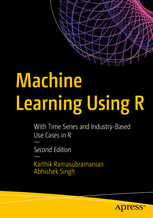

```{r setup, include=FALSE}
knitr::opts_chunk$set(echo = TRUE)
```

## [Supervised vs unsupervised learning](https://towardsdatascience.com/supervised-vs-unsupervised-learning-14f68e32ea8d)

### Supervised Learning 

- we have prior knowledge of what the output values for our samples should be. 


## Task: Find R-packages

Go to https://cran.r-project.org/ and search for packages that,...

- can be used for lasso regression

<!--
https://www.r-bloggers.com/what-are-the-best-machine-learning-packages-in-r/
-->

## Task View Machine Learning


## Install all packages of a task view

```{r,eval=F}
install.packages("ctv")
ctv::install.views("MachineLearning")
```

## [Prediction vs. Causation in Regression Analysis](https://statisticalhorizons.com/prediction-vs-causation-in-regression-analysis)

## Literature for machine learning




<!--
https://lgatto.github.io/IntroMachineLearningWithR/index.html
https://www.kaggle.com/camnugent/introduction-to-machine-learning-in-r-tutorial

https://www.r-bloggers.com/in-depth-introduction-to-machine-learning-in-15-hours-of-expert-videos/

https://www.r-bloggers.com/my-presentations-on-elements-of-neural-networks-deep-learning-parts-678/
-->

## Introduction to machine learning with R

- [Your First Machine Learning Project in R Step-By-Step](https://machinelearningmastery.com/machine-learning-in-r-step-by-step/)


- chapter about machine learning in [awesome R](https://awesome-r.com/)


- [Shiny App for machine learning](https://www.showmeshiny.com/machlearn/)


## Links

- Google`s [Machine Learning Crash Course](https://developers.google.com/machine-learning/crash-course/)
