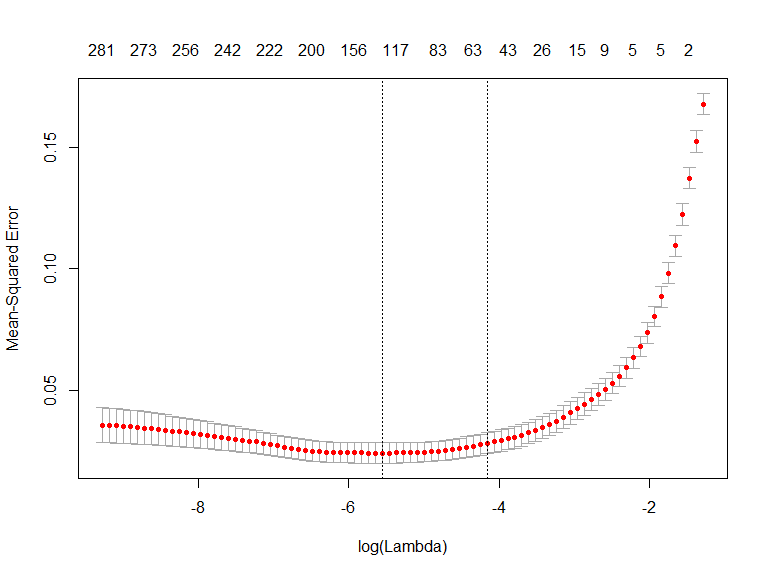

## [Regularization](https://elitedatascience.com/algorithm-selection)

### elitedatascience.com definition

Regularization is a technique used to prevent overfitting by artificially penalizing model coefficients.

- It can discourage large coefficients (by dampening them).
-  It can also remove features entirely (by setting their coefficients to 0).
-  The "strength" of the penalty is tunable. 

### Wikipedia definition of [Regularization](https://en.wikipedia.org/wiki/Regularization_(mathematics)) 
Regularization is the process of adding information in order to solve an ill-posed problem or to prevent overfitting. 


<!--
Rmarkdown tipps and tricks
no figure caption
https://stackoverflow.com/questions/38514954/removing-figure-text-in-rmarkdown
syntax highlighting
https://eranraviv.com/syntax-highlighting-style-in-rmarkdown/
https://latex-kurs.blogspot.com/2012/09/latex-plusminus.html
-->


## Strenghts and weaknesses of [regularization](https://elitedatascience.com/machine-learning-algorithms)

<!--
Regularization is a technique for penalizing large coefficients in order to avoid overfitting, and the strength of the penalty should be tuned.
-->

### Strengths: 

Linear regression is straightforward to understand and explain, and can be regularized to avoid overfitting. In addition, linear models can be updated easily with new data

### Weaknesses: 

Linear regression in general performs poorly when there are non-linear relationships. They are not naturally flexible enough to capture more complex patterns, and adding the right interaction terms or polynomials can be tricky and time-consuming.


## [Three regularized regression algorithms](https://elitedatascience.com/algorithm-selection)

{ height=40% }

### Lasso regression

- Absolute size of coefficients is penalized. 
- Coefficients can be exactly 0.

### Ridge regression

- Squared size of coefficients is penalized.
- Smaller coefficients, but it doesn't force them to 0.

### Elastic-net

- A mix of both absolute and squared size is penalzied.
<!--
- The ratio of the two penalty types should be tuned.
-->


## Preparations

- Most of the following slides are based on the [**UC Business Analytics R Programming Guide**](http://uc-r.github.io/regularized_regression)


### Necessary packages


```r
library(rsample)  # data splitting 
library(glmnet)   # implementing regularized regression approaches
library(dplyr)    # basic data manipulation procedures
library(ggplot2)  # plotting
library(knitr)    # for tables
```

<!--
http://jse.amstat.org/v19n3/decock/DataDocumentation.txt
http://jse.amstat.org/v19n3/decock.pdf
-->

## The example dataset


```r
library(AmesHousing) 
ames_data <- AmesHousing::make_ames()
```


MS_SubClass                           MS_Zoning                   Lot_Frontage   Lot_Area
------------------------------------  -------------------------  -------------  ---------
One_Story_1946_and_Newer_All_Styles   Residential_Low_Density              141      31770
One_Story_1946_and_Newer_All_Styles   Residential_High_Density              80      11622
One_Story_1946_and_Newer_All_Styles   Residential_Low_Density               81      14267
One_Story_1946_and_Newer_All_Styles   Residential_Low_Density               93      11160
Two_Story_1946_and_Newer              Residential_Low_Density               74      13830
Two_Story_1946_and_Newer              Residential_Low_Density               78       9978


## Create training (70%) and test (30%) sets 

- `set.seed` is used for reproducibility
- `initial_split` is used to split data in training and test data


```r
set.seed(123)
ames_split <- rsample::initial_split(ames_data, prop = .7, 
                            strata = "Sale_Price")
ames_train <- rsample::training(ames_split)
ames_test  <- rsample::testing(ames_split)
```


## Multicollinearity

- As p increases we are more likely to capture multiple features that have some multicollinearity. 
- When multicollinearity exists, we often see high variability in our coefficient terms. 
- E.g. we have a correlation of 0.801 between `Gr_Liv_Area` and `TotRms_AbvGrd` 
- Both variables are strongly correlated to the response variable (`Sale_Price`).


```r
cor(ames_data[,c("Sale_Price","Gr_Liv_Area","TotRms_AbvGrd")])
```

```
##               Sale_Price Gr_Liv_Area TotRms_AbvGrd
## Sale_Price     1.0000000   0.7067799     0.4954744
## Gr_Liv_Area    0.7067799   1.0000000     0.8077721
## TotRms_AbvGrd  0.4954744   0.8077721     1.0000000
```


## Multicollinearity


```r
lm(Sale_Price ~ Gr_Liv_Area + TotRms_AbvGrd, data = ames_train)
```

```
## 
## Call:
## lm(formula = Sale_Price ~ Gr_Liv_Area + TotRms_AbvGrd, data = ames_train)
## 
## Coefficients:
##   (Intercept)    Gr_Liv_Area  TotRms_AbvGrd  
##       49953.6          137.3       -11788.2
```

- When we fit a model with both these variables we get a positive coefficient for `Gr_Liv_Area` but a negative coefficient for `TotRms_AbvGrd`, suggesting one has a positive impact to Sale_Price and the other a negative impact.

## Seperated models

- If we refit the model with each variable independently, they both show a positive impact. 
- The `Gr_Liv_Area` effect is now smaller and the `TotRms_AbvGrd` is positive with a much larger magnitude.


```r
lm(Sale_Price ~ Gr_Liv_Area, data = ames_train)$coefficients
```

```
## (Intercept) Gr_Liv_Area 
##  17797.0728    108.0344
```


```r
lm(Sale_Price ~ TotRms_AbvGrd, data = ames_train)$coefficients
```

```
##   (Intercept) TotRms_AbvGrd 
##      26820.38      23730.61
```

- This is a common result when collinearity exists. 
- Coefficients for correlated features become over-inflated and can fluctuate significantly. 


## Consequences

- One consequence of these large fluctuations in the coefficient terms is overfitting, which means we have high variance in the bias-variance tradeoff space. 
- Although an analyst can use tools such as variance inflaction factors (Myers, 1994) to identify and remove those strongly correlated variables, it is not always clear which variable(s) to remove. 
- Nor do we always wish to remove variables as this may be removing signal in our data.

## Insufficient Solution

- When the number of features exceed the number of observations ($p>n$), the OLS solution matrix is not invertible. 
- This causes significant issues because it means: 

(1) The least-squares estimates are not unique. There are an infinite set of solutions available and most of these solutions overfit the data. 

(2) In many instances the result will be computationally infeasible.

- Consequently, to resolve this issue an analyst can remove variables until $p<n$ and then fit an OLS regression model. 
- Although an analyst can use pre-processing tools to guide this manual approach (Kuhn and Johnson, 2013, pp. 43-47), it can be cumbersome and prone to errors.


## Interpretability

- With a large number of features, we often would like to identify a smaller subset of these features that exhibit the strongest effects. 
- In essence, we sometimes prefer techniques that provide feature selection. One approach to this is called hard threshholding feature selection, which can be performed with linear model selection approaches. 
- Model selection approaches can be computationally inefficient, do not scale well, and they simply assume a feature as in or out. 
- We may wish to use a soft threshholding approach that slowly pushes a feature’s effect towards zero. As will be demonstrated, this can provide additional understanding regarding predictive signals.


## Regularized Regression

- When we experience these concerns, one alternative to OLS regression is to use regularized regression (also commonly referred to as penalized models or shrinkage methods) to control the parameter estimates. 

- Regularized regression puts contraints on the magnitude of the coefficients and will progressively shrink them towards zero. This constraint helps to reduce the magnitude and fluctuations of the coefficients and will reduce the variance of our model.


## The objective function of regularized regression methods...

- is very similar to OLS regression; 
- And a penalty parameter (P) is added.

$$
\text{minimize}\{SSE+P\}
$$
 
- There are two main penalty parameters, which have a similar effect. 
- They constrain the size of the coefficients such that the only way the coefficients can increase is if we experience a comparable decrease in the sum of squared errors (SSE). 

## Ridge Regression

- Ridge regression (Hoerl, 1970) controls the coefficients by adding
$\lambda\sum_{j=1}^p\beta_j^2$ to the objective function. 

- This penalty parameter is referred to as "$L_2$" as it signifies a second-order penalty being used on the coefficients.

$$
\text{minimize}\{\text{SSE}+\lambda\sum_{j=1}^p\beta_j^2 \}
$$

- This penalty parameter can take on a wide range of values, which is controlled by the tuning parameter $\lambda$. 

- When $\lambda=0$, there is no effect and our objective function equals the normal OLS regression objective function of simply minimizing SSE. 

- As $\lambda \rightarrow \infty$, the penalty becomes large and forces our coefficients to zero. 


## Exemplar coefficients

This is illustrated in the following figure where exemplar coefficients have been regularized with $\lambda$ ranging from 0 to over 8,000 (log(8103)=9).


<!--
Für was stehen die unterschiedlichen Linien

Jede Linie müsste für einen Koeffizienten im Regressionsmodell stehen.

Siehe hier: https://beta.vu.nl/nl/Images/werkstuk-fonti_tcm235-836234.pdf
-->


## How to choose the right $\lambda$ 

- Although these coefficients were scaled and centered prior to the analysis, you will notice that some are extremely large when $\lambda\rightarrow 0$. 

- Furthermore, you’ll notice the large negative parameter that fluctuates until $log(\lambda)\approx 2$ where it then continuously skrinks to zero. 

- This is indicitive of multicollinearity and likely illustrates that constraining our coefficients with $log(\lambda)>2$ may reduce the variance, and therefore the error, in our model.

- But how do we find the amount of shrinkage (or $\lambda$) that minimizes our error? 

## Implementation in `glmnet`

- `glmnet` does not use the formula method (y ~ x) so prior to modeling we need to create our feature and target set.
- The `model.matrix` function is used on our feature set, which will automatically dummy encode qualitative variables 
- We also log transform our response variable due to its skeweness.


<!--
infinity symbol in LateX
https://praxistipps.chip.de/latex-unendlich-zeichen-eingeben-so-gehts_92332
-->

## Training and testing feature model matrices and response vectors.

- We use `model.matrix(...)[, -1]` to discard the intercept


```r
ames_train_x <- model.matrix(Sale_Price ~ ., ames_train)[, -1]
ames_train_y <- log(ames_train$Sale_Price)

ames_test_x <- model.matrix(Sale_Price ~ ., ames_test)[, -1]
ames_test_y <- log(ames_test$Sale_Price)

# What is the dimension of of your feature matrix?
dim(ames_train_x)
```

```
## [1] 2054  307
```


## Behind the scenes 

- The alpha parameter tells `glmnet` to perform a ridge ($\alpha = 0$), lasso ($\alpha = 1$), or elastic net $(0\leq \alpha \leq 1)$ model. 
- Behind the scenes, `glmnet` is doing two things that you should be aware of:

(1.) It is essential that predictor variables are standardized when performing regularized regression. `glmnet` performs this for you. If you standardize your predictors prior to `glmnet` you can turn this argument off with `standardize=FALSE`.

(2.) `glmnet` will perform ridge models across a wide range of $\lambda$ parameters, which are illustrated in the figure on the next slide.


```r
ames_ridge <- glmnet(x = ames_train_x,y = ames_train_y,
  alpha = 0)
```


## A wide range of $\lambda$ parameters


```r
plot(ames_ridge, xvar = "lambda")
```

<!-- -->


## $\lambda$ values in `glmnet`

- We can see the exact $\lambda$ values applied with `ames_ridge$lambda`. 
- Although you can specify your own $\lambda$ values, by default `glmnet` applies 100 $\lambda$ values that are data derived. 
- Normally you will have little need to adjust the default $\lambda$ values.


```r
head(ames_ridge$lambda)
```

```
## [1] 279.1035 254.3087 231.7166 211.1316 192.3752 175.2851
```

## Coefficients in `glmnet`

- We can access the coefficients for a model using `coef`.


```r
# coefficients for the largest and smallest lambda parameters
coef(ames_ridge)[c("Gr_Liv_Area", "TotRms_AbvGrd"), 100]
```

```
##   Gr_Liv_Area TotRms_AbvGrd 
##  0.0001004011  0.0096383231
```


- `glmnet` stores all the coefficients for each model in order of largest to smallest $\lambda$. 
- In the following, the coefficients for the `Gr_Liv_Area` and `TotRms_AbvGrd` features for the largest $\lambda$ (279.1035) and smallest $\lambda$ (0.02791035) are visible. 
- You can see how the largest $\lambda$ value has pushed these coefficients to nearly 0.


## Coefficients of the `ames_ridge` model 


```r
coef(ames_ridge)[c("Gr_Liv_Area", "TotRms_AbvGrd"), 1] 
```

```
##   Gr_Liv_Area TotRms_AbvGrd 
##  5.551202e-40  1.236184e-37
```

- But how much improvement we are experiencing in our model.

## Tuning

- Recall that $\lambda$ is a tuning parameter that helps to control our model from over-fitting to the training data. 
- To identify the optimal $\lambda$ value we need to perform cross-validation (CV). 
- `cv.glmnet` provides a built-in option to perform k-fold CV, and by default, performs 10-fold CV.
 

```r
ames_ridge <- cv.glmnet(x = ames_train_x,y = ames_train_y,
  alpha = 0)
```

## Results of cv ridge regression


```r
plot(ames_ridge)
```

<!-- -->

- The plot illustrates the 10-fold CV mean squared error (MSE) across the $\lambda$ values. 
- We see no substantial improvement; 

## The plot explained

- As we constrain our coefficients with $log(\lambda)\leq 0$ penalty, the MSE rises considerably. 
- The numbers at the top of the plot (299) just refer to the number of variables in the model. 
- Ridge regression does not force any variables to exactly zero so all features will remain in the model.
- The first and second vertical dashed lines represent the $\lambda$  value with the minimum MSE and the largest $\lambda$ value within one standard error of the minimum MSE.


```r
min(ames_ridge$cvm)       # minimum MSE
```

```
## [1] 0.02147691
```

```r
ames_ridge$lambda.min     # lambda for this min MSE
```

```
## [1] 0.1236602
```

```r
# 1 st.error of min MSE
ames_ridge$cvm[ames_ridge$lambda == ames_ridge$lambda.1se]  
```

```
## [1] 0.02488411
```

```r
ames_ridge$lambda.1se  # lambda for this MSE
```

```
## [1] 0.6599372
```


## The plot explained (II)

- The advantage of identifying the $\lambda$ with an MSE within one standard error becomes more obvious with the lasso and elastic net models. 
- For now we can assess this visually. Here we plot the coefficients across the $\lambda$ values and the dashed red line represents the largest $\lambda$ that falls within one standard error of the minimum MSE. 
- This shows you how much we can constrain the coefficients while still maximizing predictive accuracy.


```r
ames_ridge_min <- glmnet(x = ames_train_x,y = ames_train_y,
  alpha = 0)
```

## Coefficients across the $\lambda$ values


```r
plot(ames_ridge_min, xvar = "lambda")
abline(v = log(ames_ridge$lambda.1se), col = "red", 
       lty = "dashed")
```

<!-- -->


## Advantages and Disadvantages

- In essence, the ridge regression model has pushed many of the correlated features towards each other rather than allowing for one to be wildly positive and the other wildly negative. 
- Furthermore, many of the non-important features have been pushed closer to zero. This means we have reduced the noise in our data, which provides us more clarity in identifying the true signals in our model.


```r
coef(ames_ridge, s = "lambda.1se") %>%
  filter(row != "(Intercept)") %>%
  top_n(25, wt = abs(value)) %>%
  ggplot(aes(value, reorder(row, value))) +
  geom_point() +
  ggtitle("Top 25 influential variables") +
  xlab("Coefficient") +
  ylab(NULL)
```


## Top 25 influential variables


## Ridge and lasso

- A ridge model will retain all variables. Therefore, a ridge model is good if you believe there is a need to retain all features in your model yet reduce the noise that less influential variables may create and minimize multicollinearity. 
- A ridge model does not perform feature selection. If greater interpretation is necessary where you need to reduce the signal in your data to a smaller subset then a lasso model may be preferable.


<!--
- LASSO is a feature selection method.

https://eight2late.wordpress.com/2017/07/11/a-gentle-introduction-to-logistic-regression-and-lasso-regularisation-using-r/

- LASSO regression has inbuilt penalization functions to reduce overfitting.

https://www.analyticsvidhya.com/blog/2016/12/introduction-to-feature-selection-methods-with-an-example-or-how-to-select-the-right-variables/
-->


## Lasso Regression

- The least absolute shrinkage and selection operator (lasso) model (Tibshirani, 1996) is an alternative to ridge regression that has a small modification to the penalty in the objective function.
- Rather than the $L_2$ penalty we use the following $L_1$ penalty $\lambda\sum_{j=1}^p |\beta_j|$ in the objective function.

$$
\text{minimize} \{\text{SSE}+\lambda\sum_{j=1}^p |\beta_j|\}
$$


## Lasso penalty pushes coefficients to zero

{ heigth=60% }

Lasso model improves the model with regularization and it conducts automated feature selection.

## The reduction of coefficients

- 15 variables for $\text{log}(\lambda)=-5$
- 12 variables for $\text{log}(\lambda)=-1$
- 3 variables for $\text{log}(\lambda)=1$

Consequently, when a data set has many features lasso can be used to identify and extract those features with the largest (and most consistent) signal.


## Implementation Lasso regression to ames data

Implementing lasso follows the same logic as implementing the ridge model, we just need to switch $\alpha = 1$ within `glmnet`.


```r
ames_lasso <- glmnet(x = ames_train_x,y = ames_train_y,
  alpha = 1)
```

## A quick drop in nr. of features

- Very large coefficients for ols (highly correlated)
- As model is constraines - these noisy features are pushed to 0.
- CV is necessary to determine right value for $\lambda$


```r
plot(ames_lasso, xvar = "lambda")
```

<!-- -->

## Tuning

- `cv.glmnet` with `alpha=1` is used to perform cv.


```r
ames_lasso <- cv.glmnet(x = ames_train_x,y = ames_train_y,
                        alpha = 1)
```

## MSE for cross validation

- MSE can be minimized with $-6\leq log (\lambda) \leq -4$
- Also the number of features can be reduced ($156 \leq p \leq 58$)


```r
plot(ames_lasso)
```

<!-- -->

## Minimum and one standard error MSE and $\lambda$ values.


```r
min(ames_lasso$cvm) # minimum MSE
```

```
## [1] 0.02411134
```

```r
ames_lasso$lambda.min # lambda for this min MSE
```

```
## [1] 0.003865266
```

```r
# 1 st.error of min MSE
ames_lasso$cvm[ames_lasso$lambda == ames_lasso$lambda.1se]  
```

```
## [1] 0.02819356
```

```r
ames_lasso$lambda.1se  # lambda for this MSE
```

```
## [1] 0.01560415
```


## The advantage of identifying the $\lambda$...

- ... with an MSE within one standard error becomes more obvious. 
- If we use the $\lambda$ that drives the minimum MSE we can reduce our feature set from 307 down to less than 160. 
- There will be some variability with this MSE and we can reasonably assume that we can achieve a similar MSE with a slightly more constrained model that uses only 63 features. 
- If describing and interpreting the predictors is an important outcome of your analysis, this may significantly aid your endeavor.


## Model with minimum MSE


```r
ames_lasso_min <- glmnet(x = ames_train_x,y = ames_train_y,
  alpha = 1)

plot(ames_lasso_min, xvar = "lambda")
abline(v = log(ames_lasso$lambda.min), col = "red", 
       lty = "dashed")
abline(v = log(ames_lasso$lambda.1se), col = "red", 
       lty = "dashed")
```

<!-- -->

## Advantages and Disadvantages

- Similar to ridge, the lasso pushes many of the collinear features towards each other rather than allowing for one to be wildly positive and the other wildly negative. 
- Unlike ridge, the lasso will actually push coefficients to zero and perform feature selection. 
- This simplifies and automates the process of identifying those feature most influential to predictive accuracy.

##


```r
datcoef <- coef(ames_lasso, s = "lambda.1se")
dfcoef <- data.frame(value=as.vector(datcoef[,1]))
  ggplot(aes(value, reorder(row, value), color = value > 0,data=dfcoef)) +
  geom_point(show.legend = FALSE) +
  ggtitle("Influential variables") +
  xlab("Coefficient") +
  ylab(NULL)
```

- Often when we remove features we sacrifice accuracy. 
- To gain the refined clarity and simplicity that lasso provides, we sometimes reduce the level of accuracy. 
- Typically we do not see large differences in the minimum errors between the two.
- So practically, this may not be significant but if you are purely competing on minimizing error (i.e. Kaggle competitions) this may make all the difference!

##


```r
# minimum Ridge MSE
min(ames_ridge$cvm)
```

```
## [1] 0.02147691
```

```r
# minimum Lasso MSE
min(ames_lasso$cvm)
```

```
## [1] 0.02411134
```

## Elastic Nets

A generalization of the ridge and lasso models is the elastic net (Zou and Hastie, 2005), which combines the two penalties.

$$
minimize \{SSE+\lambda \sum^p_{j=1} \beta^2_j+\lambda_2\sum_{j=1}^p |\beta_j|\}
$$

## Summary overview 

- Although lasso models perform feature selection, a result of their penalty parameter is that typically when two strongly correlated features are pushed towards zero, one may be pushed fully to zero while the other remains in the model. 
- The process of one being in and one being out is not very systematic. 
- In contrast, the ridge regression penalty is a little more effective in systematically reducing correlated features together. 
- Consequently, the advantage of the elastic net model is that it enables effective regularization via the ridge penalty with the feature selection characteristics of the lasso penalty.

## Implementation

- `alpha=.5` performs an equal combination of penalties


```r
lasso    <- glmnet(ames_train_x, ames_train_y, alpha = 1.0) 
elastic1 <- glmnet(ames_train_x, ames_train_y, alpha = 0.25) 
elastic2 <- glmnet(ames_train_x, ames_train_y, alpha = 0.75) 
ridge    <- glmnet(ames_train_x, ames_train_y, alpha = 0.0)
```

## The four model results plottet


## Tuning

In ridge and lasso models $\lambda$
 is our primary tuning parameter. However, with elastic nets, we want to tune the $\lambda$ and the alpha parameters. To set up our tuning, we create a common fold_id, which just allows us to apply the same CV folds to each model. We then create a tuning grid that searches across a range of alphas from 0-1, and empty columns where we’ll dump our model results into.

##


```r
# maintain the same folds across all models
fold_id <- sample(1:10, size = length(ames_train_y), 
                  replace=TRUE)

# search across a range of alphas
tuning_grid <- tibble::tibble(
  alpha      = seq(0, 1, by = .1),
  mse_min    = NA,
  mse_1se    = NA,
  lambda_min = NA,
  lambda_1se = NA
)
```

##

Now we can iterate over each alpha value, apply a CV elastic net, and extract the minimum and one standard error MSE values and their respective $\lambda$ values.


```r
for(i in seq_along(tuning_grid$alpha)) {
  
  # fit CV model for each alpha value
  fit <- cv.glmnet(ames_train_x, ames_train_y, 
                   alpha = tuning_grid$alpha[i], 
                   foldid = fold_id)
  
  # extract MSE and lambda values
  tuning_grid$mse_min[i]    <- fit$cvm[fit$lambda == fit$lambda.min]
  tuning_grid$mse_1se[i]    <- fit$cvm[fit$lambda == fit$lambda.1se]
  tuning_grid$lambda_min[i] <- fit$lambda.min
  tuning_grid$lambda_1se[i] <- fit$lambda.1se
}
```

##


```r
tuning_grid
```

```
## # A tibble: 11 x 5
##    alpha mse_min mse_1se lambda_min lambda_1se
##    <dbl>   <dbl>   <dbl>      <dbl>      <dbl>
##  1   0    0.0230  0.0267    0.179       0.795 
##  2   0.1  0.0237  0.0285    0.0387      0.156 
##  3   0.2  0.0241  0.0289    0.0193      0.0856
##  4   0.3  0.0243  0.0295    0.0129      0.0627
##  5   0.4  0.0245  0.0295    0.00966     0.0470
##  6   0.5  0.0246  0.0295    0.00773     0.0376
##  7   0.6  0.0247  0.0301    0.00644     0.0344
##  8   0.7  0.0247  0.0302    0.00552     0.0295
##  9   0.8  0.0247  0.0302    0.00483     0.0258
## 10   0.9  0.0247  0.0302    0.00429     0.0229
## 11   1    0.0248  0.0304    0.00387     0.0206
```


##

If we plot the MSE $\pm$  one standard error for the optimal $\lambda$ value for each alpha setting, we see that they all fall within the same level of accuracy. Consequently, we could select a full lasso model with $\lambda=0.02062776$, gain the benefits of its feature selection capability and reasonably assume no loss in accuracy.


```r
tuning_grid %>%
  mutate(se = mse_1se - mse_min) %>%
  ggplot(aes(alpha, mse_min)) +
  geom_line(size = 2) +
  geom_ribbon(aes(ymax = mse_min + se, ymin = mse_min - se), 
              alpha = .25) +
  ggtitle("MSE +/- one standard error")
```


## MSE +/- one standard error

<!-- -->


## Advantages and Disadvantages

As previously stated, the advantage of the elastic net model is that it enables effective regularization via the ridge penalty with the feature selection characteristics of the lasso penalty. Effectively, elastic nets allow us to control multicollinearity concerns, perform regression when $p>n$, and reduce excessive noise in our data so that we can isolate the most influential variables while balancing prediction accuracy.

However, elastic nets, and regularization models in general, still assume linear relationships between the features and the target variable. And although we can incorporate non-additive models with interactions, doing this when the number of features is large is extremely tedious and difficult. When non-linear relationships exist, its beneficial to start exploring non-linear regression approaches.

## Predicting

Once you have identified your preferred model, you can simply use predict to predict the same model on a new data set. The only caveat is you need to supply predict an s parameter with the preferred models $\lambda$  value. For example, here we create a lasso model, which provides me a minimum MSE of 0.022. I use the minimum $\lambda$ value to predict on the unseen test set and obtain a slightly lower MSE of 0.015.


```r
# some best model
cv_lasso   <- cv.glmnet(ames_train_x, ames_train_y, alpha = 1.0)
min(cv_lasso$cvm)
```

```
## [1] 0.02276229
```

```r
# predict
pred <- predict(cv_lasso, s = cv_lasso$lambda.min, ames_test_x)
mean((ames_test_y - pred)^2)
```

```
## [1] 0.01482233
```

## The package `caret` - Classification and Regression Training


```r
library(caret)
train_control <- trainControl(method = "cv", number = 10)
caret_mod <- train(x = ames_train_x,y = ames_train_y,
                   method = "glmnet",
                   preProc = c("center", "scale", "zv", "nzv"),
                   trControl = train_control,
                   tuneLength = 10)
```

- [**Vignette `caret` package **](https://cran.r-project.org/web/packages/caret/vignettes/caret.html)


## Output for `caret` model 


```r
caret_mod
```

```
## glmnet 
## 
## 2054 samples
##  307 predictor
## 
## Pre-processing: centered (116), scaled (116), remove (191) 
## Resampling: Cross-Validated (10 fold) 
## Summary of sample sizes: 1848, 1849, 1849, 1848, 1850, 1849, ... 
## Resampling results across tuning parameters:
## 
##   alpha  lambda        RMSE       Rsquared   MAE      
##   0.1    0.0001289530  0.1664866  0.8400298  0.1063403
##   0.1    0.0002978982  0.1664766  0.8400476  0.1063330
##   0.1    0.0006881835  0.1662662  0.8403949  0.1061256
##   0.1    0.0015897932  0.1659395  0.8408804  0.1058245
##   0.1    0.0036726286  0.1654464  0.8415077  0.1053447
##   0.1    0.0084842486  0.1648434  0.8421459  0.1048124
##   0.1    0.0195997152  0.1647791  0.8419495  0.1048721
##   0.1    0.0452778853  0.1669705  0.8382595  0.1066460
##   0.1    0.1045977903  0.1729539  0.8303204  0.1108272
##   0.1    0.2416344679  0.1878788  0.8164867  0.1221649
##   0.2    0.0001289530  0.1665591  0.8399011  0.1063765
##   0.2    0.0002978982  0.1664381  0.8401135  0.1062695
##   0.2    0.0006881835  0.1661633  0.8405549  0.1059868
##   0.2    0.0015897932  0.1657588  0.8411091  0.1055838
##   0.2    0.0036726286  0.1653218  0.8415333  0.1051104
##   0.2    0.0084842486  0.1648215  0.8420818  0.1046553
##   0.2    0.0195997152  0.1666587  0.8388026  0.1061431
##   0.2    0.0452778853  0.1707042  0.8328757  0.1089282
##   0.2    0.1045977903  0.1821489  0.8187373  0.1176380
##   0.2    0.2416344679  0.2091954  0.7990856  0.1393818
##   0.3    0.0001289530  0.1665484  0.8399260  0.1063704
##   0.3    0.0002978982  0.1663784  0.8402128  0.1061899
##   0.3    0.0006881835  0.1661070  0.8406243  0.1058829
##   0.3    0.0015897932  0.1656764  0.8411536  0.1054217
##   0.3    0.0036726286  0.1651358  0.8417307  0.1049183
##   0.3    0.0084842486  0.1653723  0.8411430  0.1050099
##   0.3    0.0195997152  0.1679700  0.8368563  0.1069692
##   0.3    0.0452778853  0.1755597  0.8252335  0.1122168
##   0.3    0.1045977903  0.1904787  0.8103609  0.1239079
##   0.3    0.2416344679  0.2302352  0.7840755  0.1569147
##   0.4    0.0001289530  0.1665065  0.8400056  0.1063544
##   0.4    0.0002978982  0.1663331  0.8402840  0.1061269
##   0.4    0.0006881835  0.1660470  0.8406844  0.1057938
##   0.4    0.0015897932  0.1656703  0.8410583  0.1053616
##   0.4    0.0036726286  0.1650394  0.8418358  0.1047845
##   0.4    0.0084842486  0.1662166  0.8396981  0.1056030
##   0.4    0.0195997152  0.1694620  0.8346366  0.1077863
##   0.4    0.0452778853  0.1789310  0.8210041  0.1147453
##   0.4    0.1045977903  0.1989699  0.8021177  0.1305034
##   0.4    0.2416344679  0.2498300  0.7749964  0.1739895
##   0.5    0.0001289530  0.1665251  0.8399674  0.1063272
##   0.5    0.0002978982  0.1663094  0.8403164  0.1060869
##   0.5    0.0006881835  0.1659512  0.8408118  0.1057081
##   0.5    0.0015897932  0.1655920  0.8411112  0.1053016
##   0.5    0.0036726286  0.1650276  0.8418406  0.1047203
##   0.5    0.0084842486  0.1669364  0.8385065  0.1062020
##   0.5    0.0195997152  0.1712329  0.8318191  0.1088621
##   0.5    0.0452778853  0.1820460  0.8174638  0.1170709
##   0.5    0.1045977903  0.2074241  0.7942057  0.1375506
##   0.5    0.2416344679  0.2701013  0.7651725  0.1926694
##   0.6    0.0001289530  0.1665022  0.8400060  0.1063019
##   0.6    0.0002978982  0.1662639  0.8403902  0.1060353
##   0.6    0.0006881835  0.1659009  0.8408580  0.1056249
##   0.6    0.0015897932  0.1654434  0.8413002  0.1051726
##   0.6    0.0036726286  0.1651883  0.8415612  0.1047942
##   0.6    0.0084842486  0.1673004  0.8379926  0.1064381
##   0.6    0.0195997152  0.1731836  0.8285921  0.1102105
##   0.6    0.0452778853  0.1854054  0.8135735  0.1195101
##   0.6    0.1045977903  0.2154695  0.7870905  0.1441223
##   0.6    0.2416344679  0.2904425  0.7565114  0.2113063
##   0.7    0.0001289530  0.1664774  0.8400472  0.1062793
##   0.7    0.0002978982  0.1662343  0.8404296  0.1059937
##   0.7    0.0006881835  0.1658511  0.8409017  0.1055492
##   0.7    0.0015897932  0.1653171  0.8414810  0.1050438
##   0.7    0.0036726286  0.1654292  0.8411453  0.1049118
##   0.7    0.0084842486  0.1677123  0.8374199  0.1066141
##   0.7    0.0195997152  0.1752421  0.8251856  0.1117240
##   0.7    0.0452778853  0.1890431  0.8091468  0.1221821
##   0.7    0.1045977903  0.2232560  0.7807010  0.1504301
##   0.7    0.2416344679  0.3116026  0.7433510  0.2301070
##   0.8    0.0001289530  0.1664604  0.8400748  0.1062577
##   0.8    0.0002978982  0.1662150  0.8404478  0.1059596
##   0.8    0.0006881835  0.1658293  0.8408901  0.1054960
##   0.8    0.0015897932  0.1652292  0.8416134  0.1049431
##   0.8    0.0036726286  0.1657318  0.8406316  0.1051041
##   0.8    0.0084842486  0.1682919  0.8365325  0.1068928
##   0.8    0.0195997152  0.1768488  0.8228040  0.1129889
##   0.8    0.0452778853  0.1926852  0.8045432  0.1249311
##   0.8    0.1045977903  0.2308092  0.7752165  0.1568161
##   0.8    0.2416344679  0.3341915  0.7100314  0.2497551
##   0.9    0.0001289530  0.1664339  0.8401196  0.1062287
##   0.9    0.0002978982  0.1661987  0.8404598  0.1059166
##   0.9    0.0006881835  0.1658215  0.8408530  0.1054590
##   0.9    0.0015897932  0.1651400  0.8417439  0.1048536
##   0.9    0.0036726286  0.1660693  0.8400605  0.1053749
##   0.9    0.0084842486  0.1690284  0.8353463  0.1073076
##   0.9    0.0195997152  0.1781585  0.8210692  0.1140220
##   0.9    0.0452778853  0.1963207  0.7999649  0.1278744
##   0.9    0.1045977903  0.2384731  0.7698806  0.1636396
##   0.9    0.2416344679  0.3563314  0.6643320  0.2691265
##   1.0    0.0001289530  0.1664021  0.8401715  0.1061981
##   1.0    0.0002978982  0.1661362  0.8405506  0.1058574
##   1.0    0.0006881835  0.1657596  0.8409121  0.1054111
##   1.0    0.0015897932  0.1650751  0.8418319  0.1047814
##   1.0    0.0036726286  0.1663932  0.8395074  0.1056728
##   1.0    0.0084842486  0.1698205  0.8340396  0.1077845
##   1.0    0.0195997152  0.1794887  0.8193334  0.1150336
##   1.0    0.0452778853  0.1999752  0.7952992  0.1308831
##   1.0    0.1045977903  0.2463384  0.7639971  0.1707205
##   1.0    0.2416344679  0.3776853  0.6118306  0.2879720
## 
## RMSE was used to select the optimal model using the smallest value.
## The final values used for the model were alpha = 0.1 and lambda
##  = 0.01959972.
```


## `h2o` package


```r
library(h2o)
h2o.init()

# convert data to h2o object
ames_h2o <- ames_train %>%
  mutate(Sale_Price_log = log(Sale_Price)) %>%
  as.h2o()

# set the response column to Sale_Price_log
response <- "Sale_Price_log"

# set the predictor names
predictors <- setdiff(colnames(ames_train), "Sale_Price")


# try using the `alpha` parameter:
# train your model, where you specify alpha
ames_glm <- h2o.glm(
  x = predictors, 
  y = response, 
  training_frame = ames_h2o,
  nfolds = 10,
  keep_cross_validation_predictions = TRUE,
  alpha = .25
  )

# print the mse for the validation data
print(h2o.mse(ames_glm, xval = TRUE))

# grid over `alpha`
# select the values for `alpha` to grid over
hyper_params <- list(
  alpha = seq(0, 1, by = .1),
  lambda = seq(0.0001, 10, length.out = 10)
  )

# this example uses cartesian grid search because the search space is small
# and we want to see the performance of all models. For a larger search space use
# random grid search instead: {'strategy': "RandomDiscrete"}

# build grid search with previously selected hyperparameters
grid <- h2o.grid(
  x = predictors, 
  y = response, 
  training_frame = ames_h2o, 
  nfolds = 10,
  keep_cross_validation_predictions = TRUE,
  algorithm = "glm",
  grid_id = "ames_grid", 
  hyper_params = hyper_params,
  search_criteria = list(strategy = "Cartesian")
  )

# Sort the grid models by mse
sorted_grid <- h2o.getGrid("ames_grid", sort_by = "mse", decreasing = FALSE)
sorted_grid

# grab top model id
best_h2o_model <- sorted_grid@model_ids[[1]]
best_model <- h2o.getModel(best_h2o_model)
```

<!--
https://www.amazon.com/Applied-Predictive-Modeling-Max-Kuhn/dp/1461468485/ref=sr_1_1?ie=UTF8&qid=1522246635&sr=8-1&keywords=applied+predictive+modelling


-->

## [Lasso regression](https://elitedatascience.com/algorithm-selection)

### LASSO, stands for least absolute shrinkage and selection operator 

-  Lasso regression penalizes the absolute size of coefficients.
-   Practically, this leads to coefficients that can be exactly 0.
-   Thus, Lasso offers automatic feature selection because it can completely remove some features.
-   The "strength" of the penalty should be tuned.
-  A stronger penalty leads to more coefficients pushed to zero.


## [Lasso](https://en.wikipedia.org/wiki/Lasso_(statistics)) regression overview

- Lasso is a regression analysis method that performs variable selection and regularization (reduce overfitting)
- We want to enhance prediction accuracy and interpretability of the statistical model.

<!--
https://eight2late.wordpress.com/2017/07/11/a-gentle-introduction-to-logistic-regression-and-lasso-regularisation-using-r/
-->

- We could remove less important variables, after checking that they are not important.
- We can do that manually by examining p-values of coefficients and discarding those variables whose coefficients are not significant.
- This can become tedious for classification problems with many independent variables


## History of Lasso

- Originally introduced in geophysics literature in 1986
- Independently rediscovered and popularized in 1996 by Robert Tibshirani, who coined the term and provided further insights into the observed performance.


Lasso was originally formulated for least squares models and this simple case reveals a substantial amount about the behavior of the estimator, including its relationship to ridge regression and best subset selection and the connections between lasso coefficient estimates and so-called soft thresholding. It also reveals that (like standard linear regression) the coefficient estimates need not be unique if covariates are collinear.

## What is [lasso regression](http://www.statisticshowto.com/lasso-regression/)

- Lasso regression uses shrinkage
- data values are shrunk towards a central point

- [Ridge and lasso regularization work by adding a penalty term to the log likelihood function.](https://eight2late.wordpress.com/2017/07/11/a-gentle-introduction-to-logistic-regression-and-lasso-regularisation-using-r/)

- A tuning parameter, $\lambda$ controls the strength of the L1 penalty.

$$
\sum\limits_{i=1}^n \big( y_i -\beta_0 - \sum\limits_{j=1}^p \beta_jx_{ij} \big)^2 + \lambda \sum\limits_{j=1}^p |\beta_j| = RSS + \lambda\sum\limits_{j=1}^p |\beta_j|.
$$
<!--
wir haben einen penalty term, der hoch ist, wenn die Parameterschätzwerte hoch sind.

Youtube Video zu Lasso
https://www.youtube.com/watch?v=A5I1G1MfUmA
-->


## [The L1 norm explained](https://stats.stackexchange.com/questions/347257/geometrical-interpretation-of-l1-regression)


## [Ridge regression](https://elitedatascience.com/algorithm-selection)


-    Ridge regression penalizes the squared size of coefficients.
-    Practically, this leads to smaller coefficients, but it doesn't force them to 0.
-    In other words, Ridge offers feature shrinkage.
-    Again, the "strength" of the penalty should be tuned.
-    A stronger penalty leads to coefficients pushed closer to zero.


## [Elastic net](https://elitedatascience.com/algorithm-selection)

- Elastic-Net is a compromise between Lasso and Ridge.

- Elastic-Net penalizes a mix of both absolute and squared size.
  - The ratio of the two penalty types should be tuned.
  - The overall strength should also be tuned.


### Which regularization method should we choose?

- There’s no "best" type of penalty. It depends on the dataset and the problem. 
- We recommend trying different algorithms that use a range of penalty strengths as part of the tuning process


## Lasso regression with package `glmnet`


```r
install.packages("glmnet")
```


```r
library(glmnet)
```


```r
x=matrix(rnorm(100*20),100,20)
g2=sample(1:2,100,replace=TRUE)
fit2=glmnet(x,g2,family="binomial")
```


```r
caret::varImp(fit2,lambda=0.0007567)
```

```
##         Overall
## V1  0.000000000
## V2  0.118307690
## V3  0.063448928
## V4  0.315434488
## V5  0.223791295
## V6  0.330624810
## V7  0.458660761
## V8  0.111058552
## V9  0.210301627
## V10 0.442914219
## V11 0.129616891
## V12 0.147857414
## V13 0.049123249
## V14 0.258091559
## V15 0.133405981
## V16 0.094455765
## V17 0.175345389
## V18 0.058258865
## V19 0.005189435
## V20 0.167366470
```


## 

- The logarithmic function is used for the link between probability and logits

- The Logit function is used to [linearize sigmoid curves](https://de.wikipedia.org/wiki/Logit).

<!--
Die Logit-Funktion wird zur Linearisierung von sigmoiden Kurven verwendet.
-->


## Further packages 


```r
# https://cran.rstudio.com/web/packages/biglasso/biglasso.pdf
install.packages("biglasso")
```

## Lasso for other models than least squares

- Though originally defined for least squares, lasso regularization is easily extended to a wide variety of statistical models including generalized linear models, generalized estimating equations, proportional hazards models, and M-estimators, in a straightforward fashion.

- Lasso’s ability to perform subset selection relies on the form of the constraint and has a variety of interpretations including in terms of geometry, Bayesian statistics, and convex analysis.

- The LASSO is closely related to basis pursuit denoising.


## Links


[A comprehensive beginners guide for Linear, Ridge and Lasso Regression](https://www.analyticsvidhya.com/blog/2017/06/a-comprehensive-guide-for-linear-ridge-and-lasso-regression/)

<!--
Sehr ausführlich aber mit Python
-->

- Course for statistical learning - [Youtube - Videos](https://www.r-bloggers.com/in-depth-introduction-to-machine-learning-in-15-hours-of-expert-videos/)

- [pcLasso: a new method for sparse regression](https://www.r-bloggers.com/pclasso-a-new-method-for-sparse-regression/)

- [Youtube - lasso regression - clearly explained](https://www.youtube.com/watch?v=NGf0voTMlcs) 

- [Glmnet Vignette](https://web.stanford.edu/~hastie/glmnet/glmnet_alpha.html)

- [Regularization Methods in R](https://www.geo.fu-berlin.de/en/v/soga/Geodata-analysis/multiple-regression/Regularization-Methods/Regularization-Methods-in-R/index.html)

- [A gentle introduction to logistic regression and lasso regularisation using R](https://eight2late.wordpress.com/2017/07/11/a-gentle-introduction-to-logistic-regression-and-lasso-regularisation-using-r/)

- [Penalized Regression in R](https://machinelearningmastery.com/penalized-regression-in-r/)

- [Penalized Logistic Regression Essentials in R](http://www.sthda.com/english/articles/36-classification-methods-essentials/149-penalized-logistic-regression-essentials-in-r-ridge-lasso-and-elastic-net/)

- [All you need to know about Regularization](https://towardsdatascience.com/all-you-need-to-know-about-regularization-b04fc4300369)

<!--
Evtl könnte ich hier noch eine Aufgabe draus machen:
https://www.r-bloggers.com/ridge-regression-and-the-lasso/
-->

<!--
http://www.sthda.com/english/articles/36-classification-methods-essentials/149-penalized-logistic-regression-essentials-in-r-ridge-lasso-and-elastic-net/

https://eight2late.wordpress.com/2017/07/11/a-gentle-introduction-to-logistic-regression-and-lasso-regularisation-using-r/

https://www.r-bloggers.com/ridge-regression-and-the-lasso/

http://www.science.smith.edu/~jcrouser/SDS293/labs/lab10-r.html

https://gigadom.in/2017/10/20/practical-machine-learning-with-r-and-python-part-3/

https://beta.vu.nl/nl/Images/werkstuk-fonti_tcm235-836234.pdf
-->
